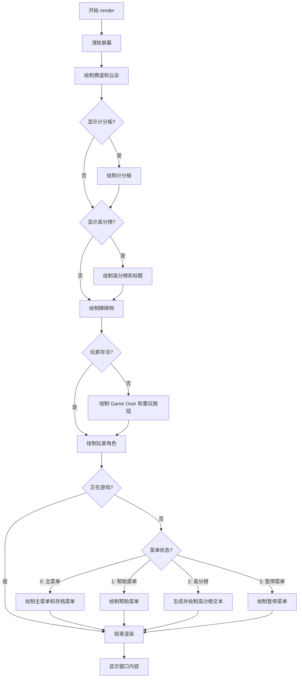
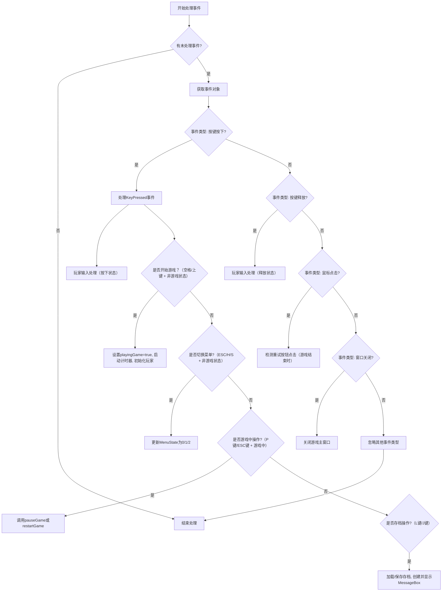
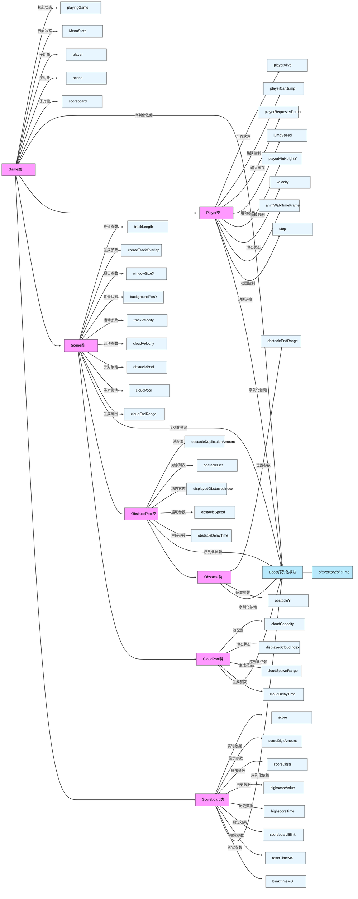
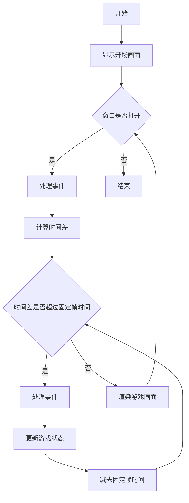

# 114514组 程序设计实践A 实验报告

## 知识点

### 一、面向对象的设计有哪些步骤？在本次游戏中有哪些类，它们之间的关系是什么？为什么这样划分？

步骤：

1. 需求分析：游戏性：人物跳跃、障碍物及其碰撞、游戏场景、游戏音效。暂停功能、计分板等。

功能性：启动动画、开始菜单、存档读档。

2. 提取关键类：如 `Game`、`Player`、`Scene`、`ObastaclePool`等。
3. 根据主函数逻辑，按逻辑编写类及函数代码
4. 运行调试修改优化 

类：有 `Game`、`Player`、`Scene`、`ObastaclePool`、`Obstacle`、`CloudPool`、`Scoreboard`、`SoundClips`、`Messagebox`.

* `Game` 类：*作为游戏的核心管理类，负责协调和管理其他游戏对象，如玩家、场景、计分板等，调用`Player`、`Scene`、`SoundClips`、`Messagebox`。

* `Player` 类：表示游戏中的玩家对象，包含玩家的状态和行为。

* `Scene` 类：管理游戏的场景，包括障碍物池和云池等。调用ObastaclePool、Obstacle、CloudPool。

* `Scoreboard` 类：负责记录和显示游戏的得分和高分。

* `SoundClips` 类：处理游戏中的音效。

* `ObstaclePool` 类：管理障碍物对象的池，通过对象池技术减少对象的创建和销毁开销。

* `CloudPool` 类：管理云对象的池。

* `Obstacle` 类：表示游戏中的障碍物对象。

* `MessageBox` 类：显示提示框。

* boost 库 serialization 支持：用于游戏数据的序列化和反序列化，实现游戏的保存和加载功能。

  以下是我们项目游戏对象管理的类图：

  ```mermaid
      graph TD
        A["Game类"]
        B["Player类"]
        C["Scene类"]
        D["Scoreboard类"]
        E["SoundClips类"]
        F["ObstaclePool类"]
        G["CloudPool类"]
        H["Obstacle类"]
        I["MessageBox类"]
        J["boost库serialization支持"]
        A ---> B
        A ---> C
        A ---> D
        A ---> E
        C ---> F
        C ---> G
        F ---> H
        A ---> I
        A ---> J
        B ---> J
        C ---> J
        D ---> J
        F ---> J
        G ---> J
        H ---> J
  ```

  在我们小组的类设计中，更多采用组合而非继承。这是因为我们希望对游戏功能进行更细致的划分——组合机制能实现各功能模块的解耦，从而提升可维护性；而继承容易引发“继承地狱”，不利于长期维护及功能的增减与修改。

### 二、游戏的主循环应该如何设计?（基于消息（事件）的程序运行机制）与传统的面向过程编程有何区别？

游戏主循环是基于消息（事件）机制的程序核心，它负责协调事件处理、游戏逻辑更新和渲染，确保游戏能够流畅运行。以下是一个典型的游戏主循环设计框架，以下对各部分进行详细解释：

**游戏主循环基本结构**

游戏主循环是一个轮询机制，逐帧处理游戏内容。当有用户动作发生时，修改相应的动作状态，在渲染阶段对每个动作进行处理。通常遵循 "事件处理 → 状态更新 → 渲染" 的流程，通过一个持续运行的循环实现：

```c++
void Game::run() {
    startGame();
    sf::Clock clock;
    sf::Time timeSinceLastUpdate = sf::Time::Zero;
    while (mWindow.isOpen()) {
        processEvents();
        timeSinceLastUpdate += clock.restart();
        while (timeSinceLastUpdate > timePerFrame) {
            timeSinceLastUpdate -= timePerFrame;
            processEvents();
            update(timePerFrame);
        }
        render();
    }
}
```

除此之外还使用了固定时间步长、对象池等技术以减少游戏开销和简化渲染流程。

#### 详细解释

- **startGame()**：该函数用于初始化游戏，包括加载游戏资源（如图片、音频等）、设置游戏的初始状态（如玩家位置、游戏难度等）。
- **固定时间步长**：通过 `timePerFrame` 设定游戏的帧率，使用 `timeSinceLastUpdate` 记录自上次更新以来的时间。在每次循环中，将 `elapsedTime` 累加到 `timeSinceLastUpdate` 中，当 `timeSinceLastUpdate` 超过 `timePerFrame` 时，进行游戏状态更新，确保游戏逻辑以固定的帧率运行，避免在不同性能的设备上出现速度差异。
- **processEvents()**：处理用户输入事件，如键盘按键、鼠标点击等，根据用户的操作修改游戏状态。
- **update()**：更新游戏的逻辑状态，包括角色的移动、碰撞检测、得分计算等。
- **render()**：将游戏的当前状态渲染到屏幕上，显示给玩家。

#### 和传统的面向过程编程的区别

| **维度**     | **基于消息的事件驱动**                             | **传统面向过程**                                       |
| ------------ | -------------------------------------------------- | ------------------------------------------------------ |
| **执行流程** | 由事件触发，非确定性顺序（如用户何时点击）。       | 固定顺序的函数调用（如`init → update → render`循环）。 |
| **控制流**   | 分散在多个事件处理函数中。                         | 集中在主函数或少数核心函数中。                         |
| **数据流向** | 事件携带数据（如按键码、鼠标坐标）传递给处理函数。 | 数据按函数调用链传递（如参数、全局变量）。             |
| **代码组织** | 按事件类型分组（如输入处理、网络消息）。           | 按功能模块分组（如初始化、渲染、物理模拟）。           |
| **可维护性** | 高：新增功能只需添加事件处理器，不影响主循环。     | 低：修改核心流程可能影响多个模块。                     |
| **实时响应** | 立即处理当前事件，延迟低。                         | 需等待当前函数执行完毕，延迟可能较高。                 |
| **适用场景** | 交互式应用（游戏、GUI、网络程序）。                | 批处理、算法密集型任务（如科学计算）。                 |

在事件驱动架构基础上进一步结合面向对象编程方法时，可形成更系统化的开发模式，具体优势如下：

1. **清晰的关注点分离**

*   事件处理（输入）、逻辑更新（状态）、渲染（输出）三层解耦，便于分工和维护。

2. **高效的资源利用**

*   仅在事件发生时执行对应逻辑，避免不必要的计算。

3. **跨平台一致性**

*   SFML 封装了底层系统事件（如 Windows 消息、Linux/X11 事件），提供统一接口。

4. **可扩展性**

*   易于添加新事件类型（如自定义网络事件）或扩展现有事件处理逻辑。

### 三、如何进行对象的显示？（游戏的刷屏机制是什么）


### 函数概述

当指定的键被按下时修改标志位，然后在 `render` 函数中对修改进行处理。`render` 函数是游戏渲染的核心方法，负责将游戏中的所有元素绘制到屏幕上。它采用了典型的游戏循环渲染模式：先清除屏幕，再绘制各个游戏元素，最后刷新显示。


### 渲染流程解析

#### 1. 清除屏幕

```c++
	mWindow.clear(sf::Color(255, 255, 255));
```

*   使用白色 (255,255,255) 清除整个窗口，为后续绘制做准备。


#### 2. 绘制游戏场景基础元素

```c++
	mWindow.draw(scene.drawTrack_1());
	mWindow.draw(scene.drawTrack_2());
	for (auto cloud : scene.drawClouds()) {
		mWindow.draw(*cloud);
	}
```

*   绘制两条赛道元素


*   绘制浮动的云朵背景 (使用智能指针管理的动态对象)


#### 3. 绘制计分板和高分榜

```c++
	if (drawScoreboard) {
		for (auto score : scoreboard.drawScoreboard()) {
			mWindow.draw(score);
		}
	}
	if (drawHighscore) {
		for (auto highscore : scoreboard.drawHighscore()) {
			mWindow.draw(highscore);
		}
		for (auto highscoreTitle : scoreboard.drawHighscoreTitle()) {
			mWindow.draw(highscoreTitle);
		}
	}
```

*   根据标志位决定是否显示当前分数


*   根据标志位决定是否显示历史最高分记录


#### 4. 绘制障碍物

```c++
	for (auto obstacle : scene.drawObstacles()) {
		mWindow.draw(obstacle);
	}
```

*   绘制场景中的所有障碍物对象


#### 5. 处理游戏结束状态

```c++
	if (!player.isPlayerAlive()) {
		mWindow.draw(gameOverText);
		mWindow.draw(replayButton);
	}
```

*   如果玩家角色已死亡，则显示 "Game Over" 文本和重新开始按钮


#### 6. 绘制玩家角色

```c++
	mWindow.draw(player.drawPlayer());
```

*   绘制玩家控制的游戏角色


#### 7. 处理菜单状态

```c++
	if (!playingGame) {
		if (MenuState == 0) {
			mWindow.draw(startMenu);
			if (std::filesystem::exists("resources/save.dat")) {
				mWindow.draw(saveMenu);
			}
		} else if (MenuState == 1) {
			mWindow.draw(helpMenu);
		} else if (MenuState == 2) {
			sf::Text text(TextFont);
			text.setString("The highest Record\n" +
						   std::to_string(scoreboard.getHighscoreValue()) +
						   " At " + scoreboard.getHighscoreTime());
			text.setCharacterSize(24);
			text.setFillColor(sf::Color::Black);
			text.setPosition({150.0f, 50.0f});
			mWindow.draw(text);
		} else if (MenuState == 3) {
			mWindow.draw(pauseMenu);
		}
	}
```

*   根据不同的菜单状态显示对应的界面：

    *   主菜单 (`MenuState=0`)：显示开始菜单和存档选项 (如果有存档)

    *   帮助菜单 (`MenuState=1`)：显示游戏帮助信息

    *   高分榜 (`MenuState=2`)：动态生成并显示历史最高分记录

    *   暂停菜单 (`MenuState=3`)：显示暂停界面


#### 8. 刷新显示

```c++
	mWindow.display();
```

*   将所有绘制的内容刷新到屏幕上


### 设计模式与技术要点

1.  **标志位控制显示**：通过`drawScoreboard`、`drawHighscore`、`playingGame`等布尔变量控制不同游戏元素的显示与隐藏


2.  **分层渲染**：按照背景 (赛道、云朵)→UI 元素 (计分板)→游戏对象 (障碍物、玩家)→菜单的顺序进行绘制，确保正确的视觉层次


3.  **动态对象处理**：对于云朵等动态对象使用智能指针管理，渲染时需要解引用


4.  **状态机实现**：使用`MenuState`变量实现简单的菜单状态机，根据不同状态显示不同界面


5.  **资源管理**：检查存档文件是否存在 (`std::filesystem::exists`) 来决定是否显示存档菜单选项


这个渲染函数通过合理的分层和条件控制，实现了一个完整的游戏画面渲染系统，支持游戏主循环中的持续刷新显示。

#### 函数全文

```c++
void Game::render() {
	mWindow.clear(sf::Color(255, 255, 255));
	mWindow.draw(scene.drawTrack_1());
	mWindow.draw(scene.drawTrack_2());
	for (auto cloud : scene.drawClouds()) {
		mWindow.draw(*cloud);
	}
	if (drawScoreboard) {
		for (auto score : scoreboard.drawScoreboard()) {
			mWindow.draw(score);
		}
	}
	if (drawHighscore) {
		for (auto highscore : scoreboard.drawHighscore()) {
			mWindow.draw(highscore);
		}
		for (auto highscoreTitle : scoreboard.drawHighscoreTitle()) {
			mWindow.draw(highscoreTitle);
		}
	}
	for (auto obstacle : scene.drawObstacles()) {
		mWindow.draw(obstacle);
	}
	if (!player.isPlayerAlive()) {
		mWindow.draw(gameOverText);
		mWindow.draw(replayButton);
	}
	mWindow.draw(player.drawPlayer());
	if (!playingGame) {
		if (MenuState == 0) {
			mWindow.draw(startMenu);
			if (std::filesystem::exists("resources/save.dat")) {
				mWindow.draw(saveMenu);
			}
		} else if (MenuState == 1) {
			mWindow.draw(helpMenu);
		} else if (MenuState == 2) {
			sf::Text text(TextFont);
			text.setString("The highest Record\n" +
						   std::to_string(scoreboard.getHighscoreValue()) +
						   " At " + scoreboard.getHighscoreTime());
			text.setCharacterSize(24);
			text.setFillColor(sf::Color::Black);
			text.setPosition({150.0f, 50.0f});
			mWindow.draw(text);
		} else if (MenuState == 3) {
			mWindow.draw(pauseMenu);
		}
	}
	mWindow.display();
}
```

#### 函数架构框图




### 四、如何处理输入？（键盘输入）

在 `processEvents` 函数中通过轮询窗口事件处理用户输入，采用**非阻塞式事件处理**和**标记变量机制**（如 `playingGame`、`MenuState`）解耦输入逻辑与游戏状态，确保主线程流畅运行，最后在 `render` 函数中进行渲染时处理这些标记变量。

#### `Game::processEvents` 函数详细解释

##### 代码段 1：事件轮询与初始化

```
	const auto e = mWindow.pollEvent();
	if (e.has_value()) {
		auto event = e.value();
```

*   **功能**：从窗口获取单个事件（非阻塞式，`pollEvent` 不会阻塞主线程）。


*   **技术点**：

    *   `e.has_value()` 判断是否有未处理事件，避免空事件处理。

    *   `event` 存储事件具体类型（按键、鼠标、窗口关闭等），用于后续分支处理。


##### 代码段 2：按键按下事件处理（`KeyPressed`）

```c++
		if (const auto key = event.getIf<sf::Event::KeyPressed>()) {
			player.handlePlayerInput(key->code, true);  // 传递按键按下状态给玩家对象
   			// 游戏开始逻辑（非游戏状态下响应）
			if ((key->code == sf::Keyboard::Key::Space ||
				 key->code == sf::Keyboard::Key::Up) &&
				!playingGame) {
				playingGame = true;          // 标记游戏开始
				gameClock.start();           // 启动游戏计时器
				player.startPlayer();        // 初始化玩家状态（如位置、生命值）
			}
   			// 菜单状态切换（非游戏状态下响应）
			if ((key->code == sf::Keyboard::Key::Escape) && !playingGame) {
				MenuState = 0;  // 切换为主菜单（MenuState=0，对应开始菜单）
			}

			if ((key->code == sf::Keyboard::Key::H) && !playingGame) {
				MenuState = 1;  // 切换为帮助菜单（MenuState=1）
			}

			if ((key->code == sf::Keyboard::Key::S) && !playingGame) {
				MenuState = 2;  // 切换为高分榜菜单（MenuState=2）
			}
   			// 游戏中功能（仅在游戏进行且玩家存活时响应）
			if ((key->code == sf::Keyboard::Key::P) && playingGame &&
				player.isPlayerAlive()) {
				pauseGame();  // 调用暂停逻辑（可能触发 \`playingGame=false\` 或显示暂停菜单）
			}

			if ((key->code == sf::Keyboard::Key::Escape) && playingGame) {
				restartGame();  // 游戏中按ESC直接重启游戏（重置所有状态）
			}
   			// 存档操作（独立于游戏状态，L键加载/J键保存）
			if (key->code == sf::Keyboard::Key::L) {
				loadFromFile("resources/save.dat");  // 从文件加载游戏存档
			}

			if ((key->code == sf::Keyboard::Key::J) && playingGame &&
				player.isPlayerAlive()) {
				pauseGame();                        // 先暂停游戏
				saveToFile("resources/save.dat");   // 保存当前游戏状态到文件
				MessageBox msgBox(
					"Hint",
					"The state has been saved at \"resources/save.dat\"");
				msgBox.show();                      // 显示阻塞式提示框，确认存档成功
			}
		}
```

*   **核心逻辑**：


1.  **玩家输入传递**：通过 `player.handlePlayerInput` 将按键按下状态（如移动、跳跃）传递给玩家对象，解耦输入层与逻辑层。


2.  **状态切换**：


*   **游戏开始**：非游戏状态（`!playingGame`）下，空格 / 上键触发游戏初始化。


*   **菜单导航**：非游戏状态下，ESC/H/S 键切换不同菜单状态（`MenuState`），控制 `render` 函数显示对应界面。


*   **游戏内操作**：游戏中（`playingGame=true`），P 键暂停游戏，ESC 键直接重启。


1.  **存档系统**：


*   L 键无条件加载存档（无论是否在游戏中）。


*   J 键仅在游戏中且玩家存活时保存存档，保存后显示阻塞式提示框（`MessageBox`）。

*   **设计要点**：通过多层 `&&` 条件组合实现**状态隔离**（如存档操作仅在游戏中有效），避免无效输入干扰。


##### 代码段 3：按键释放事件处理（`KeyReleased`）

```c++
		if (const auto key = event.getIf<sf::Event::KeyReleased>()) {
			player.handlePlayerInput(key->code, false);  // 传递按键释放状态给玩家对象
		}
```

*   **功能**：将按键释放状态（如停止移动）传递给玩家对象，与 `KeyPressed` 配合实现完整的按键状态机（按下 - 保持 - 释放）。


*   **技术点**：玩家对象可根据释放状态停止对应动作（如松开跳跃键后停止上升）。


##### 代码段 4：鼠标点击事件处理

```
		if (event.is<sf::Event::MouseButtonPressed>()) {
			checkGameReplayRequest();  // 检测是否点击了“重新开始”按钮（游戏结束时显示）
		}
```

*   **功能**：处理鼠标左键点击事件，主要用于游戏结束界面的交互（点击重试按钮）。


*   **隐含逻辑**：`checkGameReplayRequest` 内部通过鼠标位置与按钮区域的碰撞检测，判断是否触发重试逻辑（类似 `MessageBox` 的按钮检测）。


##### 代码段 5：窗口关闭事件处理

```
		if (event.is<sf::Event::Closed>()) {
			mWindow.close();
		}
```

*   **功能**：处理用户点击窗口右上角关闭按钮的操作，确保游戏正常退出。

#### `Game::processEvents` 函数全文

```c++
	const auto e = mWindow.pollEvent();
	if (e.has_value()) {
		auto event = e.value();
		if (const auto key = event.getIf<sf::Event::KeyPressed>()) {
			player.handlePlayerInput(key->code, true);

			if ((key->code == sf::Keyboard::Key::Space ||
				 key->code == sf::Keyboard::Key::Up) &&
				!playingGame) {
				playingGame = true;
				gameClock.start();
				player.startPlayer();
			}

			if ((key->code == sf::Keyboard::Key::Escape) && !playingGame) {
				MenuState = 0;
			}

			if ((key->code == sf::Keyboard::Key::H) && !playingGame) {
				MenuState = 1;
			}

			if ((key->code == sf::Keyboard::Key::S) && !playingGame) {
				MenuState = 2;
			}

			if ((key->code == sf::Keyboard::Key::P) && playingGame &&
				player.isPlayerAlive()) {
				pauseGame();
			}

			if ((key->code == sf::Keyboard::Key::Escape) && playingGame) {
				restartGame();
			}

			if (key->code == sf::Keyboard::Key::L) {
				loadFromFile("resources/save.dat");
			}

			if ((key->code == sf::Keyboard::Key::J) && playingGame &&
				player.isPlayerAlive()) {
				pauseGame();
				saveToFile("resources/save.dat");
				MessageBox msgBox(
					"Hint",
					"The state has been saved at \"resources/save.dat\"");
				msgBox.show();
			}
		}
		if (const auto key = event.getIf<sf::Event::KeyReleased>()) {
			player.handlePlayerInput(key->code, false);
		}
		if (event.is<sf::Event::MouseButtonPressed>()) {
			checkGameReplayRequest();
		}
		if (event.is<sf::Event::Closed>()) {
			mWindow.close();
		}
	}
```

#### `Game::processEvents` 函数架构框图



### 五、如何保存游戏的当前状态？（如何处理存档和读档）

#### 一、Boost 序列化支持整体架构说明

项目采用**Boost 序列化库**实现游戏状态的存档与读档，核心机制是通过`serialize`模板函数将类的私有成员暴露给 Boost 序列化系统，利用`archive`流操作符`&`实现数据的序列化 / 反序列化。所有需要存档的类均需：


1.  声明`friend class boost::serialization::access;`允许 Boost 访问私有成员


2.  实现模板化的`serialize`函数处理成员变量


类图中`boost库serialization支持`表示所有关键游戏类（Game/Player/Scene 等）均集成了 Boost 序列化接口，确保存档时能递归保存完整游戏状态。


#### 二、分文件代码注释与解析

##### 1. `sfml_serialization.hpp` - SFML 类型序列化适配层

```c++
#pragma once

#include <SFML/System/Clock.hpp>
#include <SFML/System/Time.hpp>
#include <SFML/System/Vector2.hpp>
#include <boost/serialization/split_free.hpp>

// 命名空间声明，为SFML类型提供Boost序列化支持
namespace boost {
namespace serialization {
// ---------------------- sf::Vector2\<T> 序列化 ----------------------
template <typename Archive, typename T>
inline void serialize(Archive& ar, sf::Vector2<T>& v,
                      const unsigned int version) {   // 分别序列化向量的x和y分量
    ar & v.x;  // 写入/读取x坐标
    ar & v.y;  // 写入/读取y坐标
}
// ---------------------- sf::Time 序列化 ----------------------
template <class Archive>
void serialize(Archive& ar, sf::Time& time, const unsigned int version) {
    // 将sf::Time转换为微秒整数进行存储（跨平台兼容）
    std::int64_t microseconds = time.asMicroseconds();  // 读取当前时间的微秒表示
    ar & microseconds;  // 序列化微秒数值

    // 反序列化时（加载存档），将微秒数值转换回sf::Time对象
    if (Archive::is_loading::value) {
        time = sf::microseconds(microseconds);  // 从微秒恢复时间对象
    }
}

}  // namespace serialization
}  // namespace boost
```

*   **核心作用**：为 SFML 的基础类型（向量、时间）提供序列化桥接，确保这些类型能被 Boost 存档系统识别


*   **技术细节**：

    *   `sf::Vector2`直接拆分 x/y 分量序列化

    * `sf::Time`通过微秒整数中转，解决不同平台时间表示的兼容性问题

    * `split_free`机制允许独立定义序列化函数，避免污染 SFML 类本身


##### 2. `Game.h` - 游戏主类序列化实现

```c++
#include "sfml_serialization.hpp"
class Game {
   private:
	friend class boost::serialization::access;  // 允许Boost访问私有成员进行序列化
	// 模板化序列化函数，支持二进制/文本存档格式
	template <class Archive>
	void serialize(Archive& ar, const unsigned int version) {
       	 // ---------------------- 基础状态 ----------------------
		ar & playingGame;            // 游戏进行状态（是否在主循环）
		ar & gameStartDelay;         // 游戏开始前的延迟时间
		ar & gameObstacleStartDelay; // 障碍物生成初始延迟
		ar & gameLevelY;             // 当前游戏关卡的垂直进度
         // ---------------------- 核心对象 ----------------------
		ar & player;                 // 玩家对象（递归序列化Player类）
		ar & scene;                  // 场景对象（递归序列化Scene类）
		ar & scoreboard;             // 计分板对象（递归序列化Scoreboard类）
         // ---------------------- 显示控制标志 ----------------------
		ar & drawScoreboard;         // 是否显示当前分数
		ar & drawHighscore;          // 是否显示历史高分榜
		ar & endgameScale;           // 游戏结束时的界面缩放系数
		ar & playAudioDied;          // 是否播放玩家死亡音效
		ar & MenuState;              // 当前菜单状态（0-主菜单，1-帮助等）

         // ---------------------- 性能相关参数 ----------------------
		ar & timePerFrame;           // 目标帧间隔时间（用于控制帧率）
	}
}
```

*   **关键设计**：

    *   直接序列化游戏核心状态变量（`playingGame`/`MenuState`），确保存档后能恢复界面显示逻辑

    *   依赖`Player/Scene/Scoreboard`类的序列化实现（通过`ar & 对象`触发递归序列化）

    *   版本号`version`预留扩展接口，未来可通过版本控制实现存档兼容性


##### 3. `Player.h` - 玩家对象序列化实现

```c++
#include "sfml_serialization.hpp"
class Game {
   private:
	friend class boost::serialization::access;  // 允许Boost访问私有成员进行序列化
	// 模板化序列化函数，支持二进制/文本存档格式
	template <class Archive>
	void serialize(Archive& ar, const unsigned int version) {
       	 // ---------------------- 基础状态 ----------------------
		ar & playingGame;            // 游戏进行状态（是否在主循环）
		ar & gameStartDelay;         // 游戏开始前的延迟时间
		ar & gameObstacleStartDelay; // 障碍物生成初始延迟
		ar & gameLevelY;             // 当前游戏关卡的垂直进度
         // ---------------------- 核心对象 ----------------------
		ar & player;                 // 玩家对象（递归序列化Player类）
		ar & scene;                  // 场景对象（递归序列化Scene类）
		ar & scoreboard;             // 计分板对象（递归序列化Scoreboard类）
         // ---------------------- 显示控制标志 ----------------------
		ar & drawScoreboard;         // 是否显示当前分数
		ar & drawHighscore;          // 是否显示历史高分榜
		ar & endgameScale;           // 游戏结束时的界面缩放系数
		ar & playAudioDied;          // 是否播放玩家死亡音效
		ar & MenuState;              // 当前菜单状态（0-主菜单，1-帮助等）

         // ---------------------- 性能相关参数 ----------------------
		ar & timePerFrame;           // 目标帧间隔时间（用于控制帧率）
	}
}
```

*   **存档重点**：

    *   同时保存**逻辑状态**（是否存活）和**物理状态**（速度 / 位置限制），确保读档后玩家行为一致

    *   `velocity`直接使用已适配的`sf::Vector2`序列化，无需额外处理

    *   动画相关参数保证读档后玩家动作连贯


##### 4. `Scene.h` - 场景对象序列化实现

```c++
#include "sfml_serialization.hpp"
class Scene {
private:
    friend class boost::serialization::access;

    template <class Archive>
    void serialize(Archive& ar, const unsigned int version) {
        // ---------------------- 赛道参数 ----------------------
        ar & trackLength;          // 赛道总长度
        ar & createTrackOverlap;   // 赛道重复生成的重叠长度
	    // ---------------------- 窗口与背景 ----------------------
        ar & windowSizeX;          // 窗口宽度（用于计算视口）
        ar & backgroundPosY;       // 背景垂直位置（实现视差滚动）
        // ---------------------- 运动速度 ----------------------
        ar & trackVelocity;        // 赛道滚动速度
        ar & cloudVelocity;        // 云朵移动速度（背景层速度）
        // ---------------------- 子对象池 ----------------------
        ar & obstaclePool;         // 障碍物对象池（递归序列化ObstaclePool类）
        ar & cloudPool;            // 云朵对象池（递归序列化CloudPool类）
        ar & cloudEndRange;        // 云朵生成范围上限
    }
}
```

*   **场景状态保存**：

    *   序列化动态生成参数（`trackLength`/`createTrackOverlap`），确保读档后场景结构一致

    *   子对象池（`obstaclePool/cloudPool`）的序列化会递归保存池中所有对象状态（如 Obstacle 的位置 / 速度）

    *   速度参数直接影响游戏难度和视觉效果，必须精确存档


##### 5. `Scoreboard.h` - 计分板序列化实现

```c++
class Scoreboard {
private:
    friend class boost::serialization::access;

    template <class Archive>
    void serialize(Archive &ar, const unsigned int version) {
        // ---------------------- 当前分数 ----------------------
        ar & score;                // 当前得分数值
        ar & scoreDigitAmount;     // 分数显示的位数
        ar & scoreDigits;          // 每个数字的显示位置（矢量数组）
        // ---------------------- 高分榜 ----------------------
        ar & padding;              // 高分榜文本间距
        ar & highscoreValue;       // 历史最高分数值
        ar & highscoreTime;        // 最高分对应的时间
        // ---------------------- 视觉效果 ----------------------
        ar & scoreboardBlink;      // 计分板是否闪烁（游戏结束时效果）
        ar & resetTimeMS;          // 闪烁重置间隔（毫秒）

        ar & blinkTimeMS;          // 闪烁持续时间（毫秒）
    }
}
```

*   **数据完整性**：

    *   同时保存**实时分数**和**历史记录**，确保读档后高分榜数据不变

    *   视觉效果参数（闪烁间隔）保证界面表现与存档前一致

    *   数组类型（`scoreDigits`）的序列化由 Boost 自动处理，无需手动循环


##### 6. `ObstaclePool.h` - 障碍物对象池序列化

```c++
#include "sfml_serialization.hpp"
class ObstaclePool {
private:
    friend class boost::serialization::access;

    template <class Archive>
    void serialize(Archive &ar, const unsigned int version) {
        // ---------------------- 池配置 ----------------------
        ar & obstacleDuplicationAmount;  // 障碍物复制数量（用于性能优化）
        // ---------------------- 对象列表 ----------------------
        ar & obstacleList;               // 障碍物实例列表（存储Obstacle对象）
        // ---------------------- 动态状态 ----------------------
        ar & displayedObstaclesIndex;    // 当前显示的障碍物索引
        ar & obstacleSpeed;              // 障碍物移动速度
        ar & obstacleDelayTime;          // 障碍物生成间隔时间
    }
}
```

*   **对象池特性**：

    *   序列化**池配置参数**（复制数量）和**运行时状态**（显示索引 / 速度），支持高效的对象复用

    *   `obstacleList`直接存储 Obstacle 对象，其序列化由 Obstacle 类的`serialize`函数处理

    *   生成间隔和速度参数决定游戏难度曲线，必须精确存档


##### 7. `CloudPool.h` - 云朵对象池序列化

```c++
class CloudPool {
private:
    friend class boost::serialization::access;

    template <class Archive>
    void serialize(Archive &ar, const unsigned int version) {
        // ---------------------- 池容量 ----------------------
        ar & cloudCapacity;        // 云朵池最大容量（预分配数量）
        // ---------------------- 动态生成 ----------------------
        ar & displayedCloudIndex;  // 当前显示的云朵索引
        ar & cloudSpawnRange;      // 云朵生成范围（Y轴区间）
        ar & cloudDelayTime;       // 云朵生成间隔时间
    }
}
```

*   **背景元素管理**：

    *   存档**生成逻辑参数**（`cloudSpawnRange`/`cloudDelayTime`），确保读档后背景滚动效果一致

    *   索引变量（`displayedCloudIndex`）记录当前显示的云朵实例，避免重复生成


##### 8. `Obstacle.h` - 单个障碍物序列化

```c++
class Obstacle {
private:
    friend class boost::serialization::access;

    template <class Archive>
    void serialize(Archive& ar, const unsigned int version) {
        // ---------------------- 物理属性 ----------------------
        ar & obstacleEndRange;     // 障碍物结束位置（X轴范围）
        ar & obstacleY;            // 障碍物垂直位置（Y坐标）
    }
}
```

*   **最小必要状态**：

    *   仅保存**位置相关参数**，因障碍物外观和类型在生成时确定，存档时只需记录运行时位置

    *   配合 ObstaclePool 的序列化，实现整个障碍物系统的状态恢复


#### 三、Boost 序列化核心机制总结

1.  **递归序列化**：当序列化`Game`类时，会自动调用其子对象（Player/Scene/Scoreboard 等）的`serialize`函数，形成完整的对象图序列化


2.  **类型适配**：通过`sfml_serialization.hpp`为 SFML 自定义类型（Vector2/Time）提供序列化支持，确保第三方库类型兼容


3.  **版本控制**：`serialize`函数的`version`参数预留扩展接口，未来新增成员变量时可通过版本号实现向后兼容


4.  **数据完整性**：所有影响游戏状态的参数（逻辑标志 / 物理参数 / 视觉配置）均被序列化，确保存档文件包含重启游戏所需的全部信息

通过这种设计，项目实现了对复杂游戏状态的高效存档与读档，支持从暂停 / 退出状态恢复时的完整场景重建。

#### 四、整体代码逻辑框图



**框图说明**

1.  **类 - 变量层级结构**：


*   每个类节点（粉色）作为主节点，下方通过箭头连接具体变量节点（浅蓝色），清晰展示类与成员变量的包含关系

2. **序列化依赖关系**：


*   所有业务类（Player/Scene 等）通过`序列化依赖`箭头连接到 Boost 模块（浅蓝色），体现 Boost 库的核心作用


*   `sfml_serialization.hpp`作为独立模块连接到 Boost，展示对 SFML 自定义类型的适配支持

3. **代码映射关系**：


*   每个变量节点直接对应`serialize`函数中的`ar & 变量`语句（如 Player 类的`step`变量对应代码中的`ar & step;`）


*   对象池类（`ObstaclePool`/ `CloudPool`）的`对象列表`变量（如`obstacleList`）体现对基础对象类（Obstacle）的包含关系

### 六、如何设计游戏的循环？

游戏循环的设计主要在`Game`类的`run`方法中实现。游戏循环的主要目的是持续处理事件、更新游戏状态和渲染游戏画面，直到游戏窗口关闭。以下是详细的设计步骤和代码分析：


#### 1. 启动游戏

在`run`方法中，首先调用`startGame`方法显示一个 3 秒的开场画面。


```c++
void Game::run() {
    startGame();
    sf::Clock clock;
    sf::Time timeSinceLastUpdate = sf::Time::Zero;
    while (mWindow.isOpen()) {
        processEvents();
        timeSinceLastUpdate += clock.restart();
        while (timeSinceLastUpdate > timePerFrame) {
            timeSinceLastUpdate -= timePerFrame;
            processEvents();
            update(timePerFrame);
        }
        render();
    }
}
```

#### 2. 主循环

使用`while (mWindow.isOpen())`作为主循环条件，只要游戏窗口处于打开状态，游戏就会持续运行。


#### 3. 处理事件

在每次循环中，调用`processEvents`方法处理用户输入事件，如按键、鼠标点击等。


```c++
void Game::processEvents() {
    const auto e = mWindow.pollEvent();
    if (e.has_value()) {
        auto event = e.value();
        if (const auto key = event.getIf<sf::Event::KeyPressed>()) {
            // 处理按键按下事件
        }
        if (const auto key = event.getIf<sf::Event::KeyReleased>()) {
            // 处理按键释放事件
        }
        if (event.is<sf::Event::MouseButtonPressed>()) {
            // 处理鼠标点击事件
        }
        if (event.is<sf::Event::Closed>()) {
            mWindow.close();
        }
    }
}
```

#### 4. 固定时间步更新

使用`timeSinceLastUpdate`和`timePerFrame`来确保游戏以固定的帧率更新。当`timeSinceLastUpdate`超过`timePerFrame`时，调用`update`方法更新游戏状态。


```c++
while (timeSinceLastUpdate > timePerFrame) {
    timeSinceLastUpdate -= timePerFrame;
    processEvents();
    update(timePerFrame);
}
```

#### 5. 更新游戏状态

在`update`方法中，根据游戏的当前状态更新玩家、场景、障碍物等元素的位置和状态。


```c++
void Game::update(sf::Time deltaTime) {
    if (player.isPlayerAlive() && playingGame) {
        player.handlePlayerMovement(deltaTime, &audioPlayer);
        // 更新场景、障碍物等
    } else if (!player.isPlayerAlive()) {
        // 处理游戏结束状态
    }
}
```

#### 6. 渲染游戏画面

在每次循环的最后，调用`render`方法将游戏的当前状态渲染到屏幕上。


```c++
void Game::render() {
    mWindow.clear(sf::Color(255, 255, 255));
    // 绘制场景、玩家、障碍物等
    mWindow.draw(scene.drawTrack_1());
    mWindow.draw(scene.drawTrack_2());
    // ...
    mWindow.display();
}
```

#### 7. 游戏循环的框图




这个框图展示了游戏循环的主要流程：首先显示开场画面，然后进入主循环。在主循环中，不断处理事件、计算时间差、更新游戏状态和渲染游戏画面，直到游戏窗口关闭。如果时间差超过固定帧时间，则多次更新游戏状态，以确保游戏以固定的帧率运行。

## 实践过程

### SFML 库安装过程和配置截图

#### 下载相关工具

##### xmake下载安装


安装后配置环境变量即可

##### clang下载安装


后面不再列举安装过程，安装后配置环境变量即可


##### cmake下载安装


安装后配置环境变量即可

##### ninja下载安装


安装后配置环境变量即可

##### mingw下载安装


安装后配置环境变量即可

##### VC++相关依赖安装


一键安装所有依赖即可

##### vscode安装


下载后安装即可

###### 安装插件clang


###### 安装插件C/C++


###### 安装插件C/C++ Extension Pack


###### 安装插件C/C++ Themes


###### 安装插件clang-format


#### 创建项目

我们主要使用xmake来创建项目


#### 添加依赖项目

xmake使用lua进行包管理和版本控制


### 游戏的开发及调试过程

#### 开发过程

##### 1. SFML 库更新后初始化的方式改变

*   **问题分析**：随着 SFML 库更新，其初始化方式发生了变化。若未及时调整代码中的初始化部分，可能会导致程序无法正常启动或出现各种异常。


*   **解决方法**：仔细查阅 SFML 更新文档，明确初始化方式的具体改变。例如，在代码中创建 `sf::RenderWindow` 对象时，根据新的 API 要求调整参数。


```c++
// 旧版初始化示例
// sf::RenderWindow window(sf::VideoMode(800, 600), "My Game");

// 新版的初始化方式
sf::RenderWindow mWindow(sf::VideoMode({740, 250}), "Dinosaur Game");
```

##### 2.游戏整体框架的建立

###### 1. 核心类设计

游戏的整体框架围绕多个核心类构建，每个类负责不同的功能模块，通过相互协作实现游戏的各种功能。

**`Game` 类**

`Game` 类是游戏的核心控制类，负责游戏的初始化、运行、事件处理、更新和渲染等核心功能。


```c++
// Game.h
class Game {
public:
    Game();
    void run();
private:
    void processEvents();
    void update(sf::Time);
    void render();
    // 其他方法...
};

// Game.cpp
Game::Game()
    : mWindow(sf::VideoMode({740, 250}), "Dinosaur Game"),
      // 初始化其他成员变量...
{
    // 初始化游戏元素的位置和缩放等
    float centerOfScreenX = mWindow.getSize().x / 2.0f;
    float centerOfScreenY = mWindow.getSize().y / 2.0f;
    gameOverText.setScale({endgameScale, endgameScale});
    gameOverText.setPosition(
        {centerOfScreenX - (gameOverTexture.getSize().x * endgameScale / 2),
         centerOfScreenY - (gameOverTexture.getSize().y * endgameScale / 2) - 55});
    // 其他初始化操作...
}

void Game::run() {
    startGame();
    sf::Clock clock;
    sf::Time timeSinceLastUpdate = sf::Time::Zero;
    while (mWindow.isOpen()) {
        processEvents();
        timeSinceLastUpdate += clock.restart();
        while (timeSinceLastUpdate > timePerFrame) {
            timeSinceLastUpdate -= timePerFrame;
            processEvents();
            update(timePerFrame);
        }
        render();
    }
}
```

在 `Game` 类的构造函数中，初始化了游戏窗口、各种纹理、精灵以及游戏元素的位置和缩放等。`run` 方法是游戏的主循环，负责处理事件、更新游戏状态和渲染画面。

**`Player` 类**

`Player` 类负责玩家角色的控制和行为，包括玩家的移动、跳跃、碰撞检测等。


```c++
// Player.h
class Player {
public:
    Player(float gameLevelY);
    sf::Sprite drawPlayer();
    void handlePlayerMovement(sf::Time, SoundClips *audio);
    void handlePlayerInput(sf::Keyboard::Key, bool);
    // 其他方法...
};

// Player.cpp
Player::Player(float gameLevelY)
    : playerTextures(loadTextures()),
      player(playerTextures[1]),
      // 初始化其他成员变量...
{
    player.setScale({0.5f, 0.5f});
    playerMinHeightY = gameLevelY - (player.getTextureRect().size.y / 2.0f);
    player.setPosition({100.f, playerMinHeightY});
}

void Player::handlePlayerMovement(sf::Time deltaTime, SoundClips *audio) {
    if (playerRequestedJump && playerCanJump) {
        audio->playJumpSound();
        playerCanJump = false;
        velocity.y = -sqrtf(8.0f * 981.0f * jumpSpeed);
    } else if (player.getPosition().y < playerMinHeightY) {
        velocity.y += 4.0f * 981.0f * deltaTime.asSeconds();
    } else if (player.getPosition().y > playerMinHeightY - 40) {
        float interpolatedY = player.getPosition().y - playerMinHeightY;
        velocity.y = 0 * deltaTime.asSeconds();
        player.move({0.0f, -interpolatedY});
        playerCanJump = true;
    }
    playerRequestedJump = false;
    player.move(velocity * deltaTime.asSeconds());
}
```

在 `Player` 类的构造函数中，初始化了玩家的纹理、位置和状态等。`handlePlayerMovement` 方法根据玩家的输入和重力系统更新玩家的位置。

**`Scene` 类**

`Scene` 类负责游戏场景的管理，包括背景轨道、云朵和障碍物的生成、移动和重置等。


```c++
// Scene.h
class Scene {
public:
    Scene(float windowSizeX, float gameLevelY);
    sf::Sprite drawTrack_1();
    sf::Sprite drawTrack_2();
    std::vector<sf::Sprite> drawObstacles();
    std::vector<sf::Sprite*> drawClouds();
    // 其他方法...
};

// Scene.cpp
Scene::Scene(float windowSizeX, float gameLevelY)
    : trackTexture("resources/backgroundtrack.png"),
      track_1(trackTexture),
      track_2(trackTexture),
      // 初始化其他成员变量...
{
    setUpTracks();
}

void Scene::setUpTracks() {
    trackLength = track_1.getTextureRect().size.x;
    track_1.setPosition({0.0f, backgroundPosY});
    track_2.setPosition({trackLength - createTrackOverlap, backgroundPosY});
}

void Scene::moveTrack(sf::Time deltaTime) {
    track_1.move(trackVelocity * deltaTime.asSeconds());
    track_2.move(trackVelocity * deltaTime.asSeconds());
    updateTrackPosition();
}
```

在 `Scene` 类的构造函数中，初始化了背景轨道的纹理和位置。`moveTrack` 方法负责移动背景轨道并更新其位置。


###### 2. 事件处理机制

游戏通过 `sf::Event` 来处理各种事件，如键盘输入、鼠标点击和窗口关闭等。在 `Game` 类的 `processEvents` 方法中实现了事件处理逻辑。


```c++
// Game.cpp
void Game::processEvents() {
    const auto e = mWindow.pollEvent();
    if (e.has_value()) {
        auto event = e.value();
        if (const auto key = event.getIf<sf::Event::KeyPressed>()) {
            player.handlePlayerInput(key->code, true);
            if ((key->code == sf::Keyboard::Key::Space ||
                 key->code == sf::Keyboard::Key::Up) &&
                !playingGame) {
                playingGame = true;
                gameClock.start();
                player.startPlayer();
            }
            // 其他按键处理逻辑...
        }
        if (const auto key = event.getIf<sf::Event::KeyReleased>()) {
            player.handlePlayerInput(key->code, false);
        }
        if (event.is<sf::Event::MouseButtonPressed>()) {
            checkGameReplayRequest();
        }
        if (event.is<sf::Event::Closed>()) {
            mWindow.close();
        }
    }
}
```

当检测到键盘按键按下或释放事件时，调用 `Player` 类的 `handlePlayerInput` 方法处理玩家输入。当检测到鼠标点击事件时，调用 `checkGameReplayRequest` 方法处理游戏重玩请求。当检测到窗口关闭事件时，关闭游戏窗口。


###### 3. 游戏循环

游戏的主循环在 `Game` 类的 `run` 方法中实现，通过不断处理事件、更新游戏状态和渲染画面来维持游戏的运行。


```c++
// Game.cpp
void Game::run() {
    startGame();
    sf::Clock clock;
    sf::Time timeSinceLastUpdate = sf::Time::Zero;
    while (mWindow.isOpen()) {
        processEvents();
        timeSinceLastUpdate += clock.restart();
        while (timeSinceLastUpdate > timePerFrame) {
            timeSinceLastUpdate -= timePerFrame;
            processEvents();
            update(timePerFrame);
        }
        render();
    }
}
```

在主循环中，首先调用 `processEvents` 方法处理事件，然后根据时间间隔更新游戏状态，最后调用 `render` 方法渲染画面。


###### 4. 序列化与存档功能

为了实现游戏存档功能，使用了 Boost 库的序列化功能。每个需要保存状态的类都实现了 `serialize` 方法，将类的成员变量序列化到文件中，以便在需要时恢复游戏状态。


```c++
// Game.h
class Game {
private:
    friend class boost::serialization::access;
    template <class Archive>
    void serialize(Archive& ar, const unsigned int version) {
        ar & playingGame;
        ar & gameStartDelay;
        ar & gameObstacleStartDelay;
        // 序列化其他成员变量...
    }
    // 其他成员和方法...
};

// Game.cpp
bool Game::saveToFile(const std::string &filename) {
    try {
        std::ofstream file(filename, std::ios::binary);
        if (!file.is_open()) {
            std::cerr << "Failed to open file for writing: " << filename << std::endl;
            return false;
        }
        boost::archive::text_oarchive oa(file);
        oa << *this;
        return true;
    } catch (const std::exception &e) {
        std::cerr << "Serialization error: " << e.what() << std::endl;
        return false;
    }
}

bool Game::loadFromFile(const std::string &filename) {
    scene.clearAllObstacles();
    player.resetPlayer();
    playingGame = false;
    try {
        std::ifstream file(filename, std::ios::binary);
        if (!file.is_open()) {
            std::cerr << "Failed to open file for reading: " << filename << std::endl;
            return false;
        }
        boost::archive::text_iarchive ia(file);
        ia >> *this;
        return true;
    } catch (const std::exception &e) {
        std::cerr << "Deserialization error: " << e.what() << std::endl;
        return false;
    }
    player.playerStatus(true);
    drawScoreboard = true;
}
```

`saveToFile` 方法将游戏的当前状态序列化到文件中，`loadFromFile` 方法从文件中反序列化游戏状态并恢复游戏。


通过以上步骤，建立了游戏的整体框架，各个类分工明确，相互协作，实现了游戏的基本功能。

##### 3. 资源占用 CPU 大，使用 Pool 形式减少渲染次数

*   **问题分析**：游戏运行时资源占用 CPU 过大，会导致游戏卡顿，影响玩家体验。这可能是由于频繁创建和销毁对象，导致渲染次数过多。


*   **解决方法**：采用对象池（Pool）的设计模式，如 `CloudPool` 和 `ObstaclePool`。对象池预先创建一定数量的对象，在需要使用时从池中获取，使用完毕后归还，避免了频繁的对象创建和销毁。


```c++
// CloudPool类的部分代码
class CloudPool {
private:
    std::vector<sf::Sprite> cloudPool;
    int cloudCapacity = 7;
    // ...
public:
    CloudPool();
    std::vector<sf::Sprite *> sendCloudList();
    void sendNextCloud(float windowSizeX);
    // ...
};

// ObstaclePool类的部分代码
class ObstaclePool {
private:
    std::array<Obstacle, 6> obstacleList;
    std::vector<int> displayedObstaclesIndex;
    // ...
public:
    ObstaclePool();
    void sendNextObstacle(float, float);
    // ...
};
```

##### 4. 对于每个类实现 boost 库的反序列化支持来保存存档

*   **问题分析**：为了实现游戏存档功能，需要将游戏的当前状态保存到文件中，并在需要时能够从文件中恢复。这就需要对游戏中的各个类进行序列化和反序列化操作。


*   **解决方法**：使用 Boost 库的序列化功能，为每个需要保存状态的类添加 `serialize` 方法。例如，在 `Game` 类中：


```c++
class Game {
private:
    friend class boost::serialization::access;

    template <class Archive>
    void serialize(Archive& ar, const unsigned int version) {
        ar & playingGame;
        ar & gameStartDelay;
        ar & gameObstacleStartDelay;
        // ...
    }
    // ...
};
```

#### 调试过程

##### 1. 游戏的重力系统

*   **问题描述**：玩家跳跃和下落不符合预期，跳跃高度或下落速度异常。


*   **分析**：重力系统问题多源于重力加速度和跳跃速度参数设置不当，以及玩家位置更新逻辑有误。


*   **解决方法**：在 `Player` 类的 `handlePlayerMovement` 方法中，对重力加速度和跳跃速度参数进行调整。


```c++
void Player::handlePlayerMovement(sf::Time deltaTime, SoundClips *audio) {
    if (playerRequestedJump && playerCanJump) {
        audio->playJumpSound();
        playerCanJump = false;
        velocity.y = -sqrtf(8.0f * 981.0f * jumpSpeed);
    } else if (player.getPosition().y < playerMinHeightY) {
        velocity.y += 4.0f * 981.0f * deltaTime.asSeconds();
    } else if (player.getPosition().y > playerMinHeightY - 40) {
        float interpolatedY = player.getPosition().y - playerMinHeightY;
        velocity.y = 0 * deltaTime.asSeconds();
        player.move({0.0f, -interpolatedY});
        playerCanJump = true;
    }
    playerRequestedJump = false;
    player.move(velocity * deltaTime.asSeconds());
}
```

##### 2. 游戏的云刷新问题

*   **问题描述**：云朵生成和刷新频率不正常，出现云朵过多或过少的情况。


*   **分析**：问题可能出在云朵生成的延迟时间和随机范围设置不合理。


*   **解决方法**：在 `CloudPool` 类中，调整云朵生成的延迟时间和随机范围。


```c++
void CloudPool::sendNextCloud(float windowSizeX) {
    if (displayedCloudIndex.size() == cloudPool.size()) {
        return;
    }
    if (cloudGenTimer.getElapsedTime().asSeconds() > cloudDelayTime) {
        cloudGenTimer.restart();
        cloudDelayTime = rand() % 4 + 1.5f;
        sf::Sprite *tempCloud;
        for (int i = 0; i < cloudPool.size(); i++) {
            if (!cloudUsed(i)) {
                tempCloud = &cloudPool[i];
                float cloudY = rand() % cloudSpawnRange[0] + cloudSpawnRange[1];
                tempCloud->setPosition({windowSizeX, cloudY});
                displayedCloudIndex.push_back(i);
                break;
            }
        }
    }
}
```

##### 3. 游戏障碍物错位问题

*   **问题描述**：障碍物位置和显示出现错位，与坐标计算和碰撞检测有关。


*   **分析**：障碍物位置更新和碰撞检测逻辑可能存在错误，导致坐标计算不准确。


*   **解决方法**：在 `Obstacle` 类中，检查并修正障碍物的位置更新和碰撞检测逻辑。


```c++
void Obstacle::updatePosition(float xPos, float yPos) {
    obstacle.setPosition({xPos, yPos - obstacleY});
}
```

##### 4. 声音无法正常播放问题

*   **问题描述**：游戏中的跳跃、死亡等声音无法正常播放。


*   **分析**：可能是音频文件路径错误，或者播放声音时出现其他错误。


*   **解决方法**：检查 `SoundClips` 类的实现，确保音频文件路径正确，并且在播放声音时没有出现错误。


```c++
void Player::handlePlayerMovement(sf::Time deltaTime, SoundClips *audio) {
    if (playerRequestedJump && playerCanJump) {
        audio->playJumpSound();
        // ...
    }
}
```

##### 5. 计分板无法实时刷新问题

*   问题描述**：计分板的分数没有实时更新，与时间控制和更新逻辑有关。


*   **分析**：时间间隔设置不合理或更新逻辑存在问题，导致分数不能及时更新。


*   **解决方法**：在 `Scoreboard` 类的 `updatePlayerScore` 方法中，检查时间间隔和更新逻辑，确保分数能够正确更新。


```c++
bool Scoreboard::updatePlayerScore(SoundClips *audio) {
    if (scoreClock.getElapsedTime().asMilliseconds() > resetTimeMS) {
        score++;
        convertIntToArray(score);
        updateScoreboard(&currentScore);
        scoreClock.restart();
    }
    // ...
}
```

##### 6. 存档不完整问题

*   **问题描述**：游戏存档后，再次加载时部分数据丢失或不完整。


*   **分析**：可能是序列化和反序列化过程中，某些数据没有被正确保存或加载。


*   **解决方法**：在 `Game` 类的 `saveToFile` 和 `loadFromFile` 方法中，确保所有需要保存的数据都被正确序列化和反序列化。


```c++
bool Game::saveToFile(const std::string &filename) {
    try {
        std::ofstream file(filename, std::ios::binary);
        if (!file.is_open()) {
            std::cerr << "Failed to open file for writing: " << filename << std::endl;
            return false;
        }
        boost::archive::text_oarchive oa(file);
        oa << *this;
        return true;
    } catch (const std::exception &e) {
        std::cerr << "Serialization error: " << e.what() << std::endl;
        return false;
    }
}

bool Game::loadFromFile(const std::string &filename) {
    scene.clearAllObstacles();
    player.resetPlayer();
    playingGame = false;
    try {
        std::ifstream file(filename, std::ios::binary);
        if (!file.is_open()) {
            std::cerr << "Failed to open file for reading: " << filename << std::endl;
            return false;
        }
        boost::archive::text_iarchive ia(file);
        ia >> *this;
        return true;
    } catch (const std::exception &e) {
        std::cerr << "Deserialization error: " << e.what() << std::endl;
        return false;
    }
    player.playerStatus(true);
    drawScoreboard = true;
}
```

##### 7. 暂停时无法暂停重力系统问题

*   **问题描述**：游戏暂停后，玩家仍然受到重力影响，继续下落。


*   **分析**：在暂停游戏时，没有停止玩家的重力计算和位置更新。


*   **解决方法**：在 `Player` 类中添加 `pausePlayer` 方法，在暂停游戏时停止重力计算和位置更新。


```c++
void Player::pausePlayer() {
    walkingTimer.stop();
}
```

在 `Game` 类的 `pauseGame` 方法中调用 `player.pausePlayer()`。


```c++
void Game::pauseGame() {
    playingGame = false;
    MenuState = 3;
    gameClock.stop();
    player.pausePlayer();
}
```

##### 8. 存档可能遇到存档死前结点问题

*   **问题描述**：存档时可能记录了玩家即将死亡的状态，导致加载存档后很快再次死亡。


*   **分析**：存档逻辑没有对玩家的危险状态进行处理，直接保存了当前状态。


*   **解决方法**：在存档前，检查玩家的状态，避免在危险状态下存档。可以在 `Game` 类的 `saveToFile` 方法中添加状态检查逻辑。


```c++
bool Game::saveToFile(const std::string &filename) {
    if (player.isPlayerInDangerousState()) {
        MessageBox msgBox("Warning", "You are in a dangerous state. Please wait a moment before saving.");
        msgBox.show();
        return false;
    }
    // 原存档逻辑
    try {
        std::ofstream file(filename, std::ios::binary);
        if (!file.is_open()) {
            std::cerr << "Failed to open file for writing: " << filename << std::endl;
            return false;
        }
        boost::archive::text_oarchive oa(file);
        oa << *this;
        return true;
    } catch (const std::exception &e) {
        std::cerr << "Serialization error: " << e.what() << std::endl;
        return false;
    }
}
```

需要在 `Player` 类中添加 `isPlayerInDangerousState` 方法来检查玩家状态。


##### 9. 游戏优化问题

*   **问题描述**：游戏运行时可能出现卡顿现象，影响游戏体验。


*   **分析**：可能是游戏循环中某些操作过于耗时，或者资源管理不当。


*   **解决方法**：

    *   **减少不必要的计算**：在 `update` 方法中，避免在每一帧都进行不必要的计算。例如，某些数据可以在状态改变时更新，而不是每一帧都更新。

    *   **优化碰撞检测**：使用更高效的碰撞检测算法，减少碰撞检测的计算量。

    *   **资源管理**：及时释放不再使用的资源，如纹理、声音等。可以在对象销毁时释放相关资源。


通过以上开发和调试过程，逐步解决了游戏中遇到的各种问题，确保游戏能够稳定、流畅地运行。

