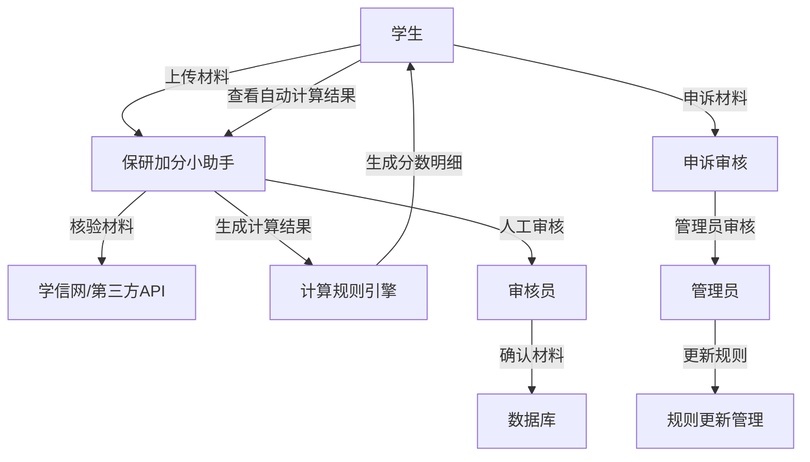
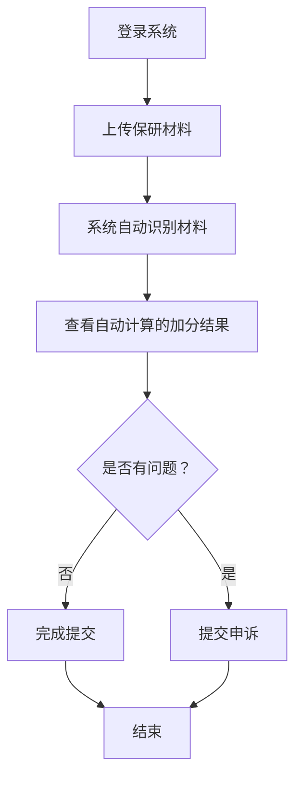
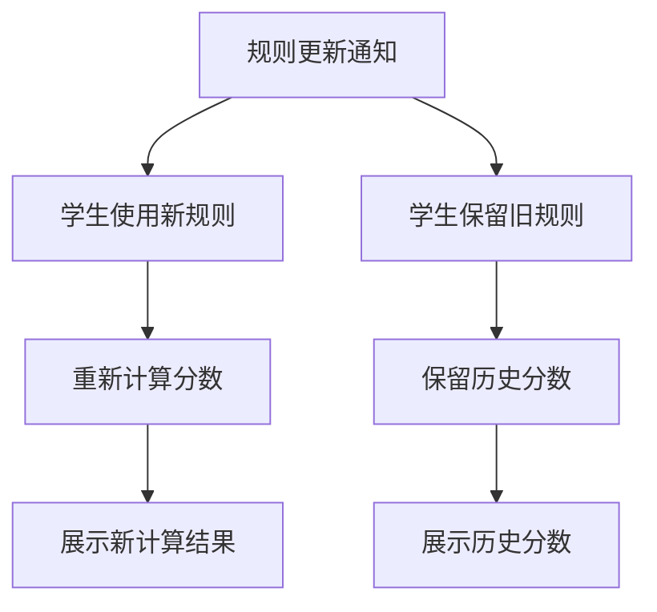
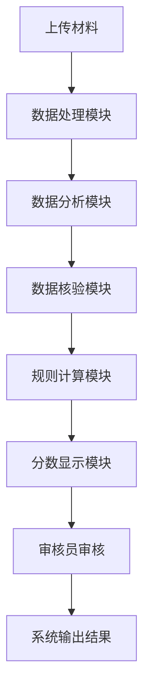
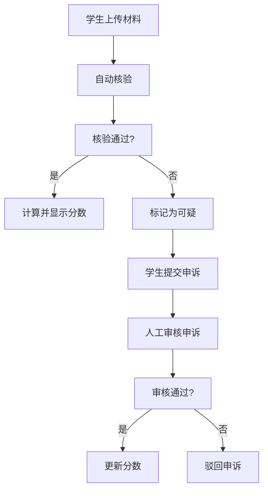
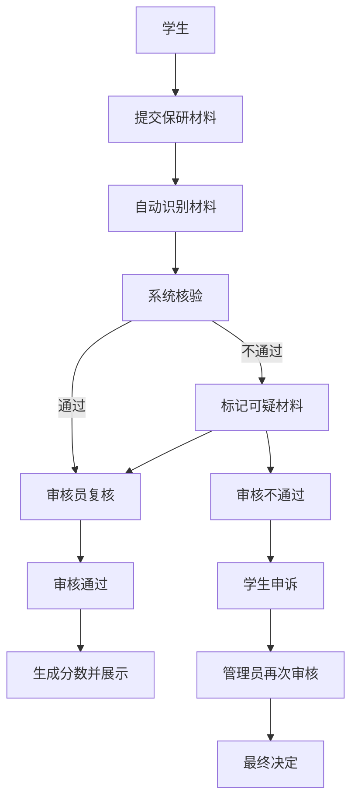
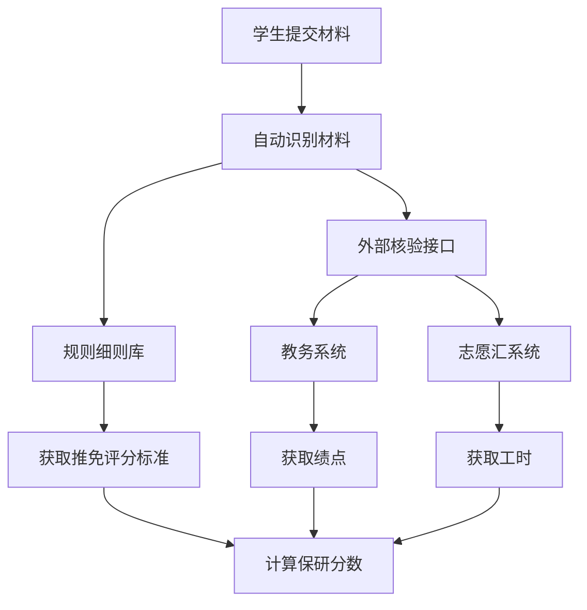

# 保研加分小助手 — 学生视角需求分析报告

**说明：** 本报告基于“学生”视角，聚焦于**个人数据的自动聚合与精准计算**，强调“只关注我自己的成长与合规性”。同时，针对目前数据散落在教务系统、志愿汇等不同平台的痛点，增加了**自动化数据归集**的解决方案。

------

## 1. 总体场景与目标

作为学生，我希望拥有一个安全、封闭且高度自动化的个人保研数据管家。我关心**我自己的材料是否齐全、分数计算是否准确、数据是否已从各个散乱的平台同步过来**。

**核心目标：**

- **私密专注**：系统仅展示我个人的分数和进度。
- **自动化数据归集**：系统能充当“数据连接器”，自动从**教务系统**拉取我的绩点，从**志愿汇**（或校团委数据库）拉取我的志愿工时，无需我手动填表。
- **规则自动匹配**：系统根据我的年级自动应用对应的学校保研条例（3-5年一更），计算我的过程性积分。
- **校内闭环**：所有数据在校内流转，提供便捷的导入导出功能，不上传第三方服务器。

------

## 2. 学生角色的用户画像

- **典型用户**：李同学，大三学生，性格沉稳，做事严谨。
- **核心痛点**：数据太散（绩点在教务网，志愿工时时长在志愿汇APP，奖状在手里），手动汇总容易填错。
- **核心诉求**：“帮我把散落在各处的数据自动抓取回来，算出一个准确的总分，告诉我还需要补什么材料。”

------

## 3. 学生主要用户故事

### 3.1 跨平台数据的“一键同步”

- **场景**：期末了，教务系统出了成绩，志愿汇里也更新了暑期实践时长。
- **需求**：
  - 作为学生，我不需要手动输入每一门课的成绩和每一个志愿活动。
  - 我只需在系统中点击**“同步教务数据”**，系统自动抓取我的最新必修课绩点。
  - 我点击**“同步志愿数据”**，系统自动对接校团委数据库（或解析志愿汇导出单），填入我的“社会实践”模块。

### 3.2 规则版本的自动适配

- **场景**：我是2022级学生，适用的是“2022版旧条例”，而学弟学妹用的是新版。
- **需求**：
  - 作为学生，登录后系统应自动锁定适用于我这一届的加分细则。
  - 系统清楚地告诉我：“根据2022版规则，你的六级成绩折算为0.5分”（而不是仅仅给我一个总分）。

### 3.3 个人分数的实时自查

- **场景**：我想核对我的综测总分。
- **需求**：
  - 作为学生，我只能看到**我自己的**“学业分”、“科研分”、“实践分”和“总分”。
  - 系统可以提示我：“距离满分/封顶分还有多少差距”，帮助我自我完善。

### 3.4 数据的导出与归档

- **场景**：学院通知要交纸质版申请表进行线下核验。
- **需求**：
  - 作为学生，我可以一键**导出**《个人保研加分申请表》（PDF），上面已经自动填好了从各处同步来的数据，我只需打印签字即可。

------

## 4. 功能需求细化（学生视角）

### 4.1 核心功能：自动化数据采集方案（Data Aggregator）

为了解决数据零散的问题，系统需提供以下连接能力：

- **教务系统连接器**：
  - 通过校内统一认证（SSO）授权，系统后端定期自动访问教务数据库，同步我的**“必修课加权平均分”**和**“无不及格记录”**状态。
- **志愿服务数据连接器**：
  - **方案A（接口同步）**：如果学校团委已将“志愿汇”数据通过接口同步到校内服务器，系统直接调用校内接口拉取我的工时。
  - **方案B（凭证解析）**：如果无法直连，系统提供“志愿汇荣誉证书/记录单”的**特定识别模块**。我上传从志愿汇导出的PDF记录单，系统自动解析出“服务时长”和“活动列表”并累加。

### 4.2 核心功能：多版本规则引擎

- **自动算分**：系统后台配置好不同年份的公式。我同步了绩点（80%）和导入了综测等得分（20%）后，系统立刻算出最终得分。
- **规则透明**：点击分数旁边的小问号，能看到计算依据：“依据《2022级推免细则》第4条，国家级竞赛权重系数为1.0”。

### 4.3 核心功能：材料真实性内控（校内闭环）

- **教务数据自动校验**：因为绩点是系统直接从教务处拉取的，**天然不可篡改**，省去了我上传成绩单截图和老师审核成绩单的繁琐步骤。
- **查重**：系统检测我是否上传了重复的竞赛证书。

### 4.4 辅助功能：申诉与修正

- **数据修正**：如果系统自动同步的教务成绩有误（例如缓考成绩未更新），我能发起“数据异议”，并上传教务处的证明截图，申请人工修正。

------

## 5. 非功能性需求 (NFR)

- **隐私与隔离（Privacy）**：
  - **最小化授权**：在同步教务系统数据时，必须弹出授权框征得我的同意。
- **数据准确性**：
  - 从外部系统（教务、志愿汇）同步的数据，必须标记数据来源（例如显示标签：“数据来源：教务系统，最后同步时间：10分钟前”）。

------

## 6. 验证与验收标准

| **功能模块** | **学生视角的验收标准**                                       |
| ------------ | ------------------------------------------------------------ |
| **数据同步** | 我点击“同步绩点”后，系统能在5秒内正确显示我的教务系统GPA，且数值与教务系统完全一致。 |
| **志愿采集** | 我上传志愿汇导出的工时PDF，系统能自动识别，无需我手填。或者能够自动拉取信息，且数值和我手动操作一致 |
| **规则计算** | 依据学校发布的PDF文件规则，我手算的加分应该与系统显示的自动计算结果分毫不差。 |
| **导出功能** | 导出的申请表包含了我所有同步过来的数据，格式整齐，满足线下交表要求。 |

------

## 7. 小结 — 系统的价值

1. **极简操作**：通过“教务系统”和“志愿汇/团委库”的**自动化连接**，解决了最头疼的填表和算分问题，大部分基础数据（成绩、工时）实现了**免录入**。
2. **合规精准**：基于规则引擎的自动计算，确保了我不会因为误读“3-5年一变”的复杂文件而算错分。

---

## 8.附录 — 一些设计图

1. 系统流程图

2. 学生操作流程图

3. 规则更新流程图

4. 系统数据流图

5. 申诉流程图

6. 信息审核流程图

7. 外部信息获取模块

