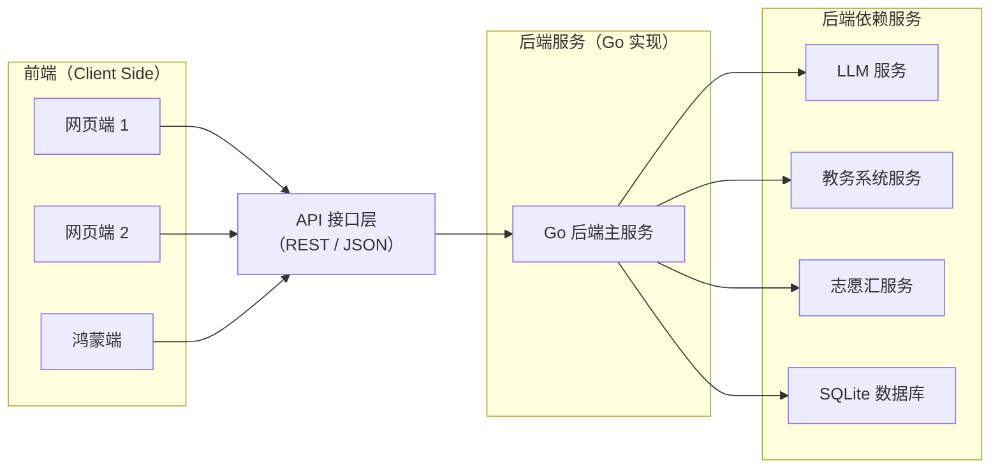

```mermaid
graph LR
    %% 前端
    subgraph FE[前端（Client Side）]
        WEB1[网页端 1]
        WEB2[网页端 2]
        HM[鸿蒙端]
    end

    %% API 网关
    API[API 接口层<br/>（REST / JSON）]

    %% 后端
    subgraph BE[后端服务（Go 实现）]
        GO[Go 后端主服务]
    end

    %% 后端依赖
    subgraph SVC[后端依赖服务]
        LLM[LLM 服务]
        JW[教务系统服务]
        ZYH[志愿汇服务]
        SQLITE[SQLite 数据库]
    end

    %% 连接关系
    WEB1 --> API
    WEB2 --> API
    HM --> API

    API --> GO

    GO --> LLM
    GO --> JW
    GO --> ZYH
    GO --> SQLITE

```

