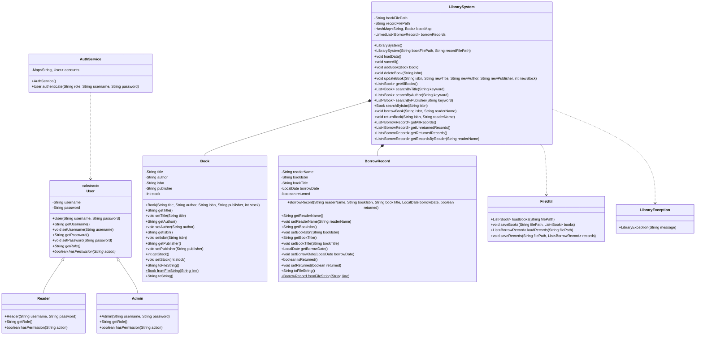

# 图书管理系统实验报告

## 第一部分：UML 类图

封装体现在 `Book`、`BorrowRecord`、`User` 等类的属性均为私有字段，并通过 getter/setter 访问。继承体现在 `Reader` 和 `Admin` 继承抽象类 `User`。多态体现在 `User.getRole()` 和 `User.hasPermission()` 为抽象方法，两个子类分别重写，界面层通过统一的 `User` 引用完成权限判断。

## 第二部分：核心功能说明

### 1. 图书管理
功能描述：管理员可添加、修改、删除图书，并刷新图书列表。  
涉及类和方法：`LibraryUI.handleAddBook()`、`handleEditBook()`、`handleDeleteBook()`，`LibrarySystem.addBook()`、`updateBook()`、`deleteBook()`。  
关键实现逻辑：新增时先校验 ISBN、库存和空值，再写入 `HashMap<String, Book>`；删除时检查是否存在未归还记录；修改时限制库存不能小于当前未归还数量。UI 端通过 `TableView<Book>` 展示数据，并在普通读者登录时用 `setVisible(false) + setManaged(false)` 隐藏增删改按钮。

### 2. 图书查询
功能描述：支持按书名模糊查询、按作者模糊查询、按 ISBN 精确查询，同时额外支持按出版社查询。  
涉及类和方法：`LibraryUI.createSearchPane()`，`LibrarySystem.searchByTitle()`、`searchByAuthor()`、`searchByIsbn()`、`searchByPublisher()`。  
关键实现逻辑：查询页使用 `ComboBox` 选择条件、`TextField` 输入关键字；业务层统一进行字符串标准化，模糊查询通过 `containsIgnoreCase()` 过滤，ISBN 查询直接利用 `HashMap` 做 O(1) 定位。当前代码中 `searchByTitle()`、`searchByAuthor()`、`searchByPublisher()` 都会调用 `containsIgnoreCase()`，因此查询不区分大小写。

### 3. 借阅管理
功能描述：系统支持借书、还书以及借阅规则校验。  
涉及类和方法：`LibraryUI.createBorrowPane()`，`LibrarySystem.borrowBook()`、`returnBook()`。  
关键实现逻辑：借书时先校验 ISBN 与读者姓名，再检查图书是否存在、库存是否大于 0、同一读者是否已借同一本未归还图书；通过 `borrowRecords.stream().anyMatch()` 防止重复借阅。归还时查找对应未归还记录，将 `returned` 设为 `true`，并同步回补图书库存。

### 4. 数据持久化
功能描述：程序启动时自动读取数据，操作后与关闭窗口时自动保存。  
涉及类和方法：`FileUtil.loadBooks()`、`saveBooks()`、`loadRecords()`、`saveRecords()`，`LibrarySystem.loadData()`、`saveAll()`，`Main.start()`。  
关键实现逻辑：IO 层只使用 `FileReader`、`FileWriter`、`BufferedReader`、`BufferedWriter`；图书与记录分别序列化为 `|` 分隔文本。`Main` 中的 `setOnCloseRequest` 调用 `librarySystem.saveAll()`，因此关闭后重新启动仍可恢复数据。

### 5. 权限控制与登录认证
功能描述：管理员与普通读者拥有不同界面和操作权限，系统登录采用统一账号管理。  
涉及类和方法：`User`、`Reader`、`Admin`、`AuthService`，`LibraryUI.showLoginDialog()`、`validateLogin()`、`createManagementPane()`。  
关键实现逻辑：`AuthService` 统一维护内置账号并负责校验角色、用户名和密码；登录成功后返回对应用户对象，登录失败只提示错误并要求重新输入，不会默认进入管理员界面；如果用户取消登录，`Main` 会终止后续界面创建。权限控制仍由 `currentUser.hasPermission("MANAGE")` 决定，管理员显示图书管理按钮，普通读者隐藏管理按钮。

## 第三部分：遇到的问题及解决方法

### 问题 1：TableView 右侧容易出现空白区域
- 问题描述：表格默认列宽策略下，窗口拉伸后右侧可能出现灰色空白。
- 原因分析：默认列宽不会自动均分剩余空间。
- 解决方法：在 `LibraryUI.configureBookTable()` 和 `configureRecordTable()` 中统一设置 `table.setColumnResizePolicy(TableView.CONSTRAINED_RESIZE_POLICY)`。

### 问题 2：文本文件分隔符不能随便用逗号
- 问题描述：如果图书名或出版社中出现逗号，简单 CSV 解析容易出错。
- 原因分析：逗号与自然文本冲突频率高，手写解析不稳定。
- 解决方法：在 `Book.toFileString()`、`BorrowRecord.toFileString()` 中统一使用 `|` 作为分隔符，并在 `fromFileString()` 中按 `split("\\|")` 解析。

### 问题 3：CSS 在不同环境下可能加载失败
- 问题描述：IDE、命令行、打包环境下资源路径不一致时，样式表可能找不到。
- 原因分析：如果使用脆弱的相对路径，类路径变化后容易失效。
- 解决方法：在 `LibraryUI.createScene()` 中使用 `getClass().getResource("/theme.css")` 进行类路径检索，并用 `try-catch` 做降级处理。

### 问题 4：普通读者不应看到管理按钮
- 问题描述：如果只禁用按钮而不隐藏，界面上仍会暴露管理员功能入口。
- 原因分析：单纯 `setDisable(true)` 不能移除视觉占位。
- 解决方法：在 `LibraryUI.createManagementPane()` 中组合使用 `setVisible(false)` 和 `setManaged(false)`，既隐藏按钮也释放布局空间。

### 问题 5：借阅时若不检查重复借阅会导致数据异常
- 问题描述：同一读者重复借同一本未归还图书，会使记录与库存状态失真。
- 原因分析：只检查库存而不检查读者历史记录，业务规则不完整。
- 解决方法：在 `LibrarySystem.borrowBook()` 中用 `borrowRecords.stream().anyMatch(...)` 判断同一读者是否已有同 ISBN 未归还记录，命中则抛出 `LibraryException`。
