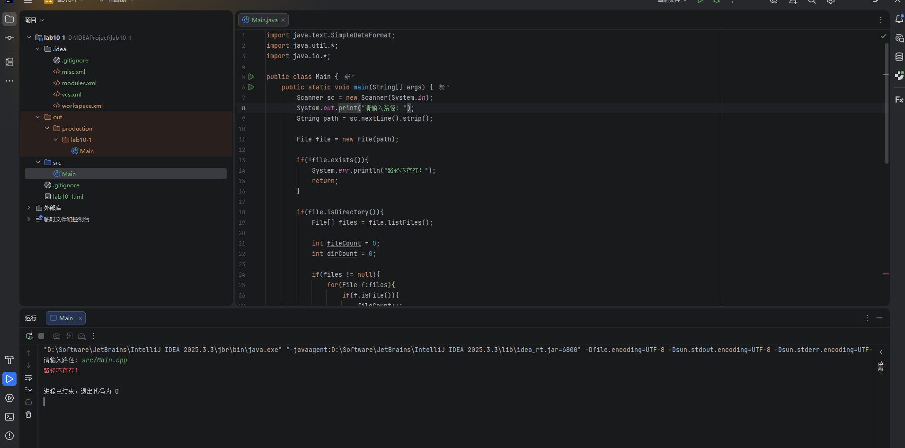
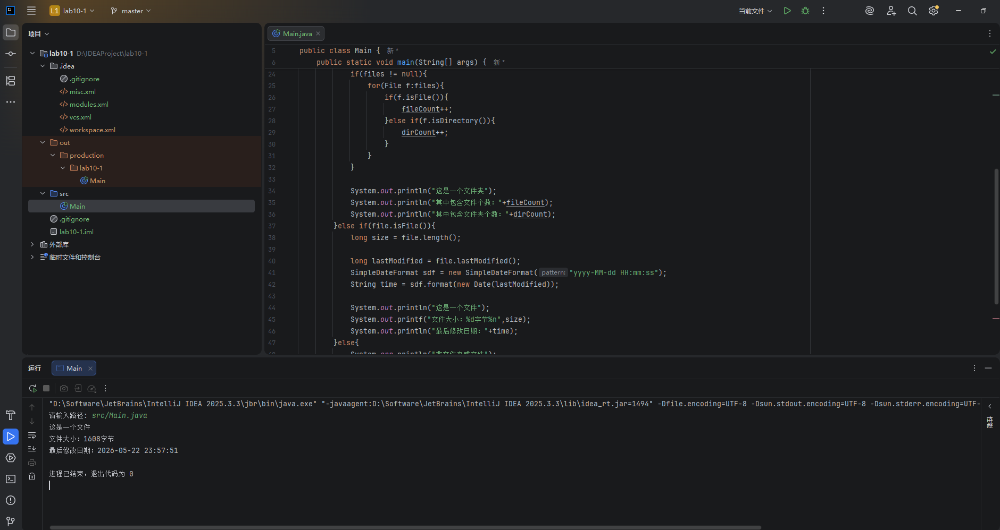
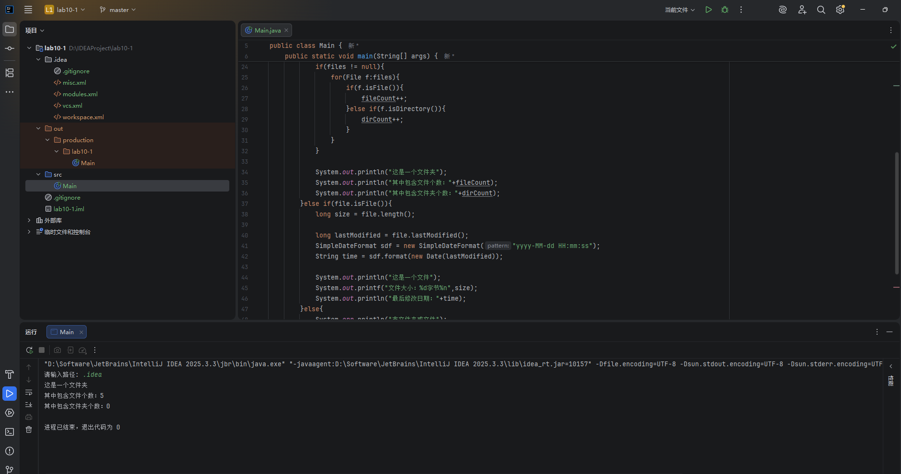
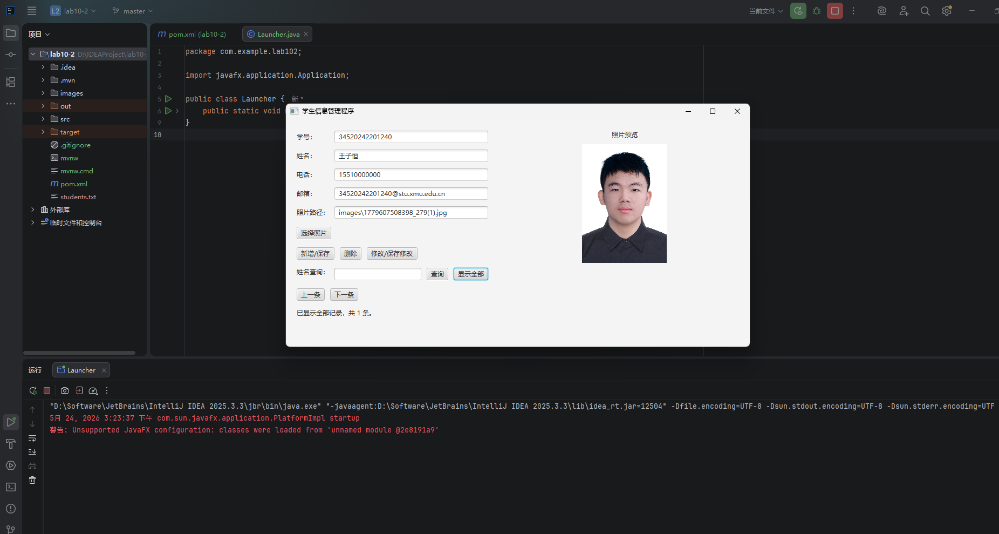
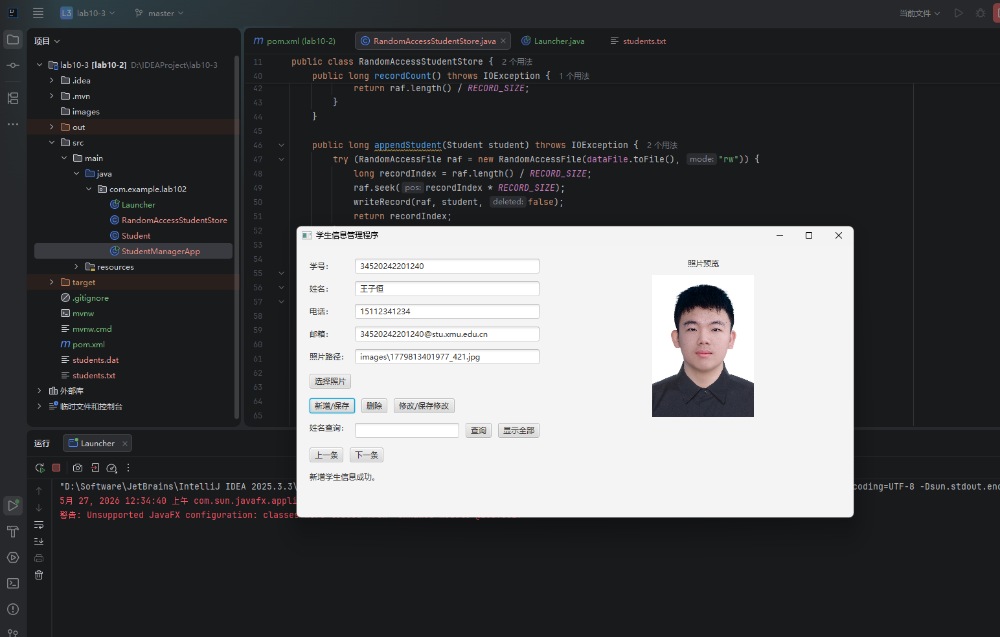
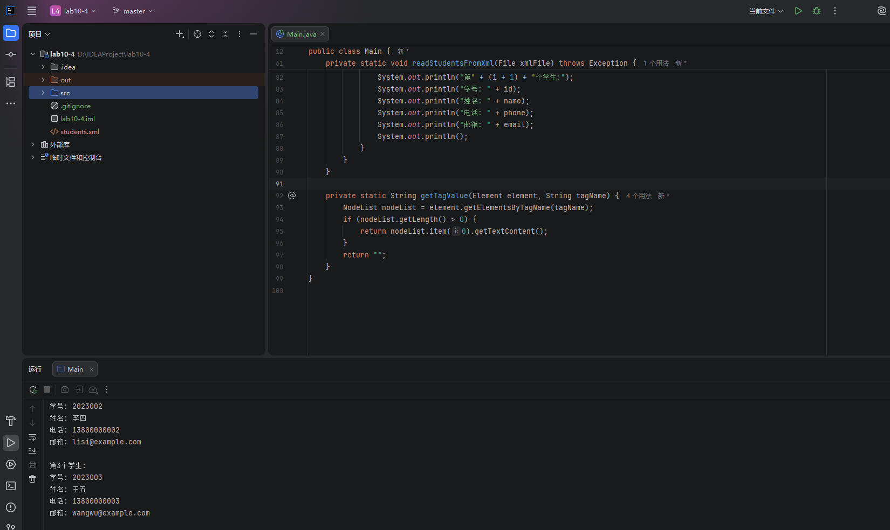
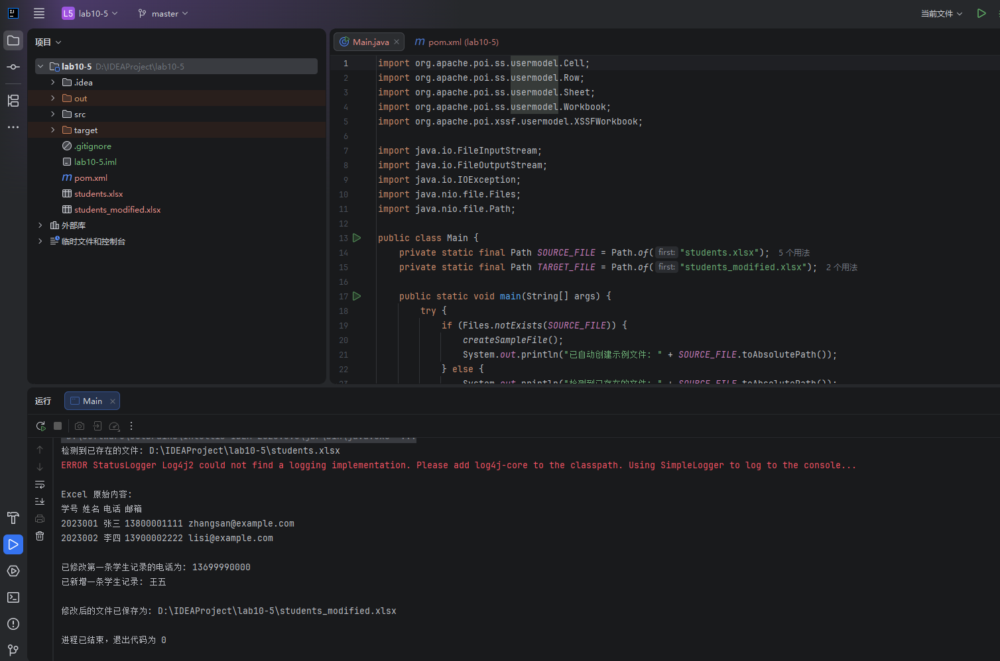
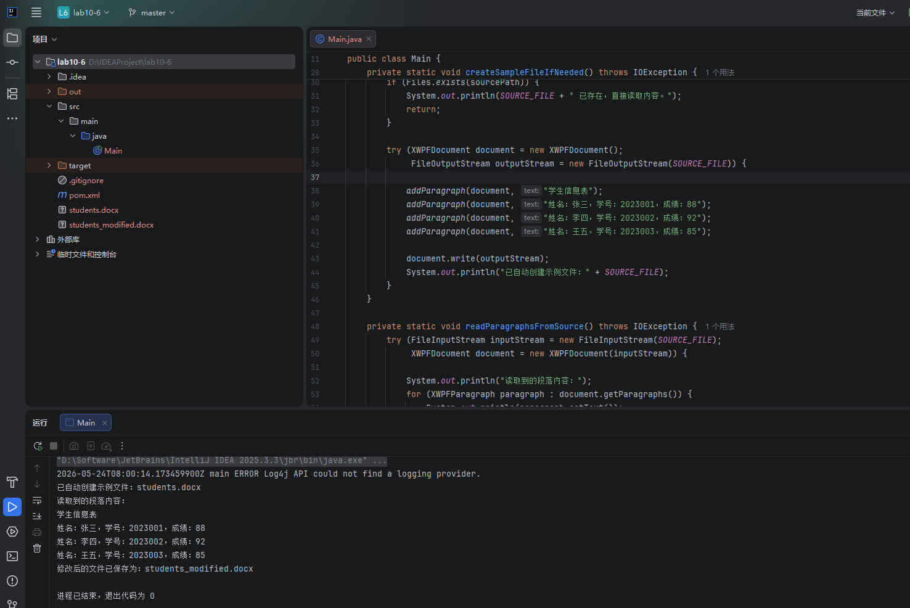

## 一、实验目的及要求

- 熟悉文件处理
- 按照题目要求写代码和实验报告，并将相关文件上传。 

## 二、实验题目及实现过程

### 1.基本文件解析

#### 输入文件不存在

程序运行后输入一个不存在的路径，程序首先使用 `File` 对象对输入路径进行封装，再通过 `exists()` 方法判断路径是否存在。由于该路径不存在，程序输出“路径不存在！”并结束运行，避免继续进行文件或文件夹解析。该结果说明程序能够对非法路径进行基本校验。

#### 输入为文件

程序输入已有文件路径后，先通过 `isFile()` 判断该路径为普通文件，然后调用 `length()` 获取文件大小，调用 `lastModified()` 获取文件最后修改时间，并使用 `SimpleDateFormat` 将时间戳转换为便于阅读的日期格式。运行结果能够正确显示文件大小和最后修改日期。

#### 输入为文件夹

程序输入文件夹路径后，通过 `isDirectory()` 判断该路径为目录，再使用 `listFiles()` 获取目录下的一级文件和文件夹。遍历数组时分别使用 `isFile()` 和 `isDirectory()` 统计普通文件数量和子文件夹数量，最终输出该目录中包含的文件个数和文件夹个数。

### 2.图形界面学生信息

本部分使用 JavaFX 设计学生信息管理图形界面。界面中包含学号、姓名、电话、邮箱等输入框，并设置照片选择和照片显示区域。程序将学生信息以顺序存取文件的方式保存到文本文件中，照片文件复制到统一目录集中管理。新增、删除、修改、查询和显示功能均围绕当前显示记录进行操作，并通过“上一条”“下一条”按钮切换记录。运行截图显示程序能够正常加载界面并显示学生照片和学生信息。

### 3.随机文件存储学生信息

本部分在第 2 题图形界面学生信息管理程序的基础上，将原来的顺序存取文本文件方式修改为 RandomAccessFile 随机存取文件方式。程序将每个学生的信息设计为固定长度记录，包括学号、姓名、电话、邮箱、照片路径以及删除标记等字段，使每条记录占用相同的字节长度。新增学生信息时，程序通过 seek() 将文件指针移动到文件末尾并写入新记录；修改学生信息时，根据当前记录编号计算文件偏移量，再通过 seek() 定位到对应位置并覆盖写入；删除学生信息时，不直接移动后续数据，而是修改该记录的删除标记，实现逻辑删除；查询和显示功能则通过遍历 RandomAccessFile 中的所有固定长度记录完成，并跳过已经删除的记录。通过这种方式，程序能够不必每次整体重写文件，就可以直接定位并修改指定学生记录，体现了随机存取文件在数据管理程序中的使用特点。

### 4.扩展题目-读取XML

本部分读取 XML 文件中的学生信息。程序使用 DOM 解析方式加载 XML 文件，通过 `DocumentBuilderFactory` 和 `DocumentBuilder` 创建解析器，得到 `Document` 对象后再根据标签名获取学生节点。随后依次读取学号、姓名、电话、邮箱等子节点内容并输出到控制台。运行结果表明程序能够正确解析 XML 的层级结构并读取节点数据。

### 5.扩展题目-读取EXCEL文件并修改

本部分使用 Apache POI 读取并修改 Excel 文件。程序通过 `Workbook` 表示整个工作簿，`Sheet` 表示工作表，`Row` 表示一行数据，`Cell` 表示单元格内容。运行时先读取原有学生数据并输出，然后对表格内容进行新增或修改，最后将修改后的内容保存为新的 Excel 文件。截图中可以看到控制台输出了读取到的表格数据，并提示修改后的文件已成功保存。

### 6.扩展题目-读取WORD文件并修改

本部分使用 Apache POI 读取并修改 Word 文档。程序通过 `XWPFDocument` 打开 `.docx` 文件，遍历 `XWPFParagraph` 读取文档中的段落内容，并通过 `XWPFRun` 向文档中追加新的文本段落。完成修改后将结果保存为新的 Word 文件。运行结果显示程序能够读取原文档内容，并成功生成修改后的 Word 文档。

## 三、实验总结与心得记录

通过本次实验，进一步熟悉了 Java 中文件处理相关类的使用方法。基本文件解析部分掌握了 `File` 类对路径、文件和文件夹的判断方式，并能够获取文件大小、最后修改时间以及目录下文件和文件夹数量。图形界面学生信息管理部分将 JavaFX 界面设计与顺序存取文件结合起来，实现了学生信息的新增、删除、修改、查询和显示，理解了文本文件保存结构化数据的基本方法。随机文件存储部分在原有学生信息管理程序的基础上，将顺序读写方式改为 RandomAccessFile 随机存取方式，进一步理解了固定长度记录、文件指针定位、逻辑删除和覆盖写入等操作。

在扩展题目中，分别完成了 XML、Excel 和 Word 文件的读取与修改。XML 部分使用 DOM 方式解析节点数据；Excel 和 Word 部分使用 Apache POI 处理 Office 文件，理解了工作簿、工作表、行、单元格以及 Word 文档、段落、文本运行等对象之间的关系。通过这些实验，认识到不同文件格式需要采用不同的处理方式，普通文本文件适合使用基础 IO 类，结构化 XML 文件适合使用解析器，Office 文件则需要借助专门的第三方库。

本次实验整体加深了对文件存在性判断、文件属性读取、文件内容读写、图形界面与文件数据交互、以及多种文件格式处理流程的理解，也为后续编写更完整的数据管理类程序打下了基础。
