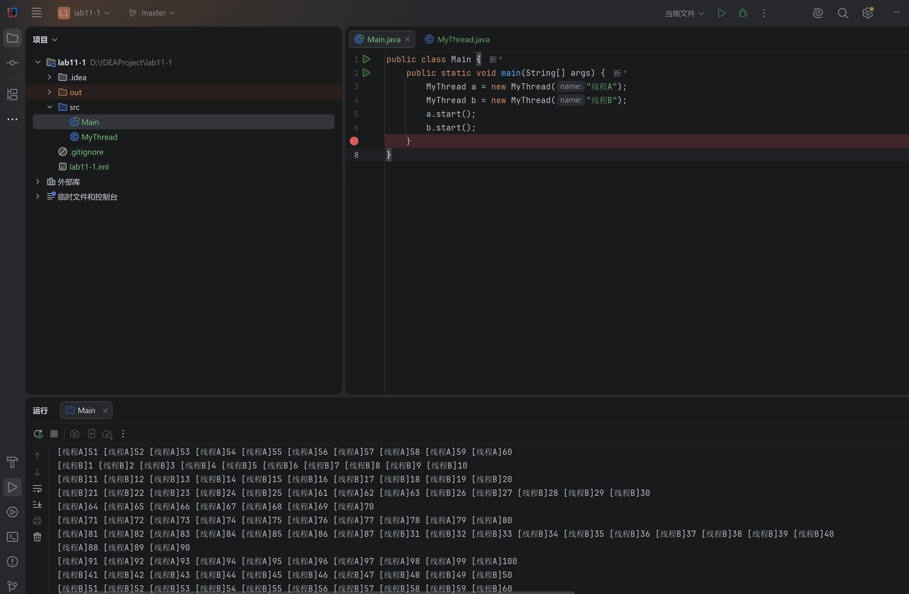
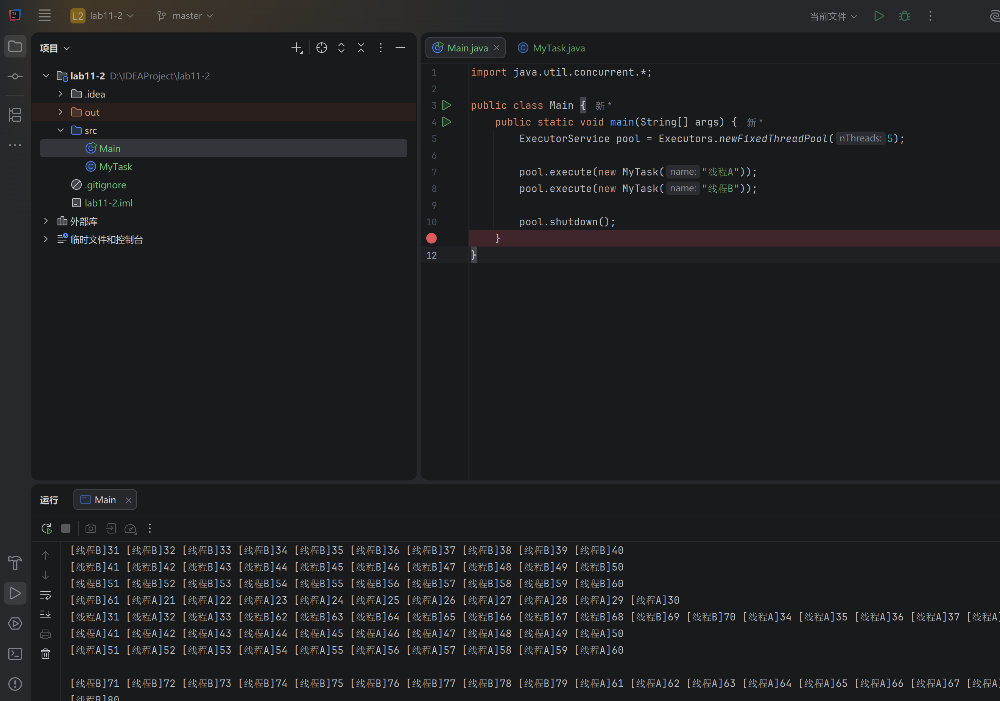
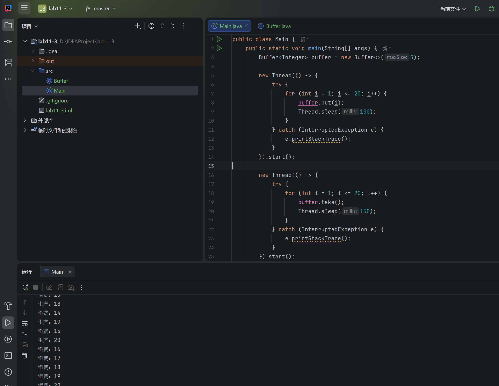
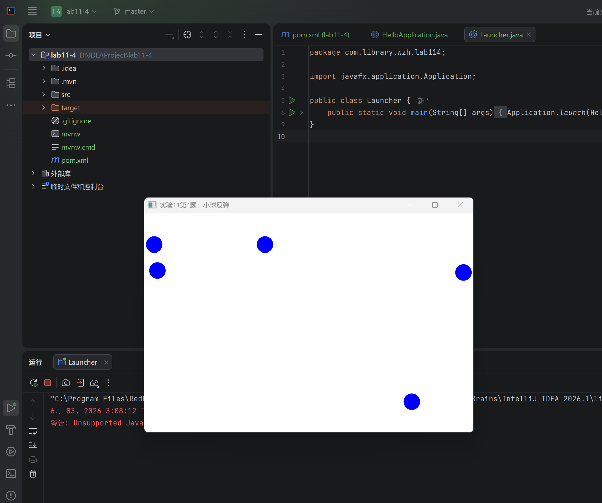
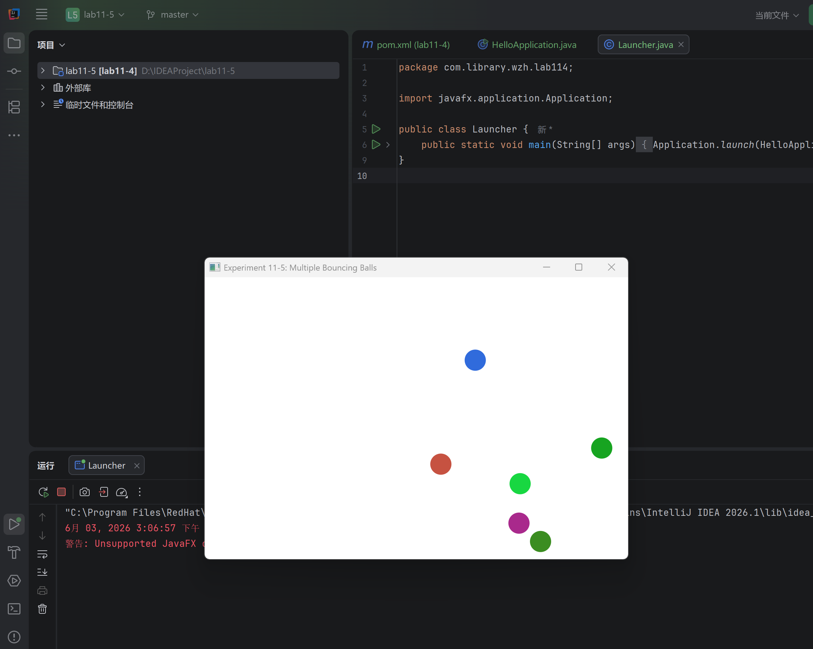
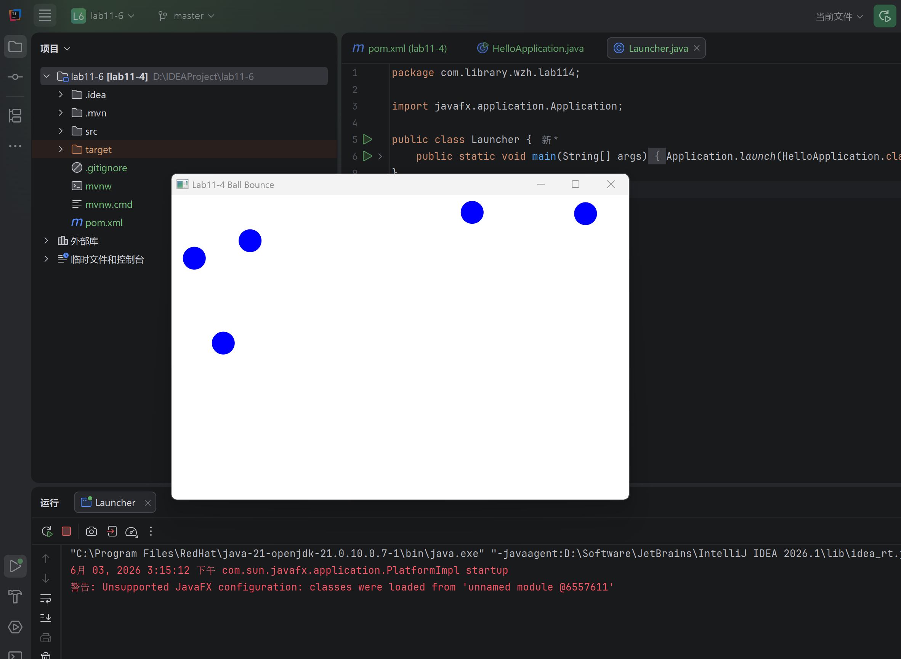

## 一、实验目的及要求

- 熟悉多线程编程
- 按照题目要求写代码，并将工程文档压缩文件和实验报告上传


## 二、实验题目及实现过程

### 1.多线程



本题基于继承 `Thread` 的方式实现两个独立线程同时运行。程序中定义 `MyThread` 类继承 `Thread`，在线程类中保存线程名称，并重写 `run()` 方法。在 `run()` 方法中使用 `for` 循环输出 1 到 100，每输出 10 个数字后换行，从而满足题目“分别输出 1-100（10 个一回车）”的要求。

主函数中分别创建两个 `MyThread` 对象，线程名称设置为“线程A”和“线程B”，然后调用 `start()` 方法启动线程。这里不能直接调用 `run()` 方法，因为直接调用 `run()` 只是普通方法调用，仍然在主线程中顺序执行；调用 `start()` 才会由 JVM 创建新的线程，并在线程中自动执行重写后的 `run()` 方法。

核心代码如下：

```java
public class MyThread extends Thread {
    private String name;

    public MyThread(String name) {
        this.name = name;
    }

    public void run() {
        for (int i = 1; i <= 100; i++) {
            System.out.printf("[%s]%d ", name, i);
            if (i % 10 == 0)
                System.out.println();
        }
    }
}
```

```java
public class Main {
    public static void main(String[] args) {
        MyThread a = new MyThread("线程A");
        MyThread b = new MyThread("线程B");
        a.start();
        b.start();
    }
}
```

运行结果中可以看到线程A和线程B的输出存在交替现象，说明两个线程不是简单顺序执行，而是由操作系统和 JVM 共同调度并发运行。该题主要加深了对 `Thread` 类、`run()` 方法和 `start()` 方法区别的理解。

### 2.线程池



本题使用 `Runnable` 接口和线程池实现两个独立线程同时运行。与第一题继承 `Thread` 不同，本题将“任务”和“线程”分离：`MyTask` 类只负责任务逻辑，线程的创建和管理交给 `ExecutorService` 线程池完成。

程序中定义 `MyTask` 类实现 `Runnable` 接口，并重写 `run()` 方法，在其中输出 1 到 100，每 10 个数字换行。主函数中通过 `Executors.newFixedThreadPool(5)` 创建固定大小线程池，然后调用 `pool.execute()` 提交两个任务。任务提交后，线程池中的工作线程会自动取出任务并执行。最后调用 `pool.shutdown()` 关闭线程池，表示不再接收新的任务。

核心代码如下：

```java
public class MyTask implements Runnable {
    private String name;

    public MyTask(String name) {
        this.name = name;
    }

    public void run() {
        for (int i = 1; i <= 100; i++) {
            System.out.printf("[%s]%d ", name, i);
            if (i % 10 == 0)
                System.out.println();
        }
    }
}
```

```java
import java.util.concurrent.*;

public class Main {
    public static void main(String[] args) {
        ExecutorService pool = Executors.newFixedThreadPool(5);

        pool.execute(new MyTask("线程A"));
        pool.execute(new MyTask("线程B"));

        pool.shutdown();
    }
}
```

运行结果中两个任务的输出同样会交替出现，说明线程池中的不同线程在并发执行任务。相比直接创建 `Thread`，线程池能够复用线程，避免频繁创建和销毁线程带来的资源开销，更适合实际开发中的多任务并发场景。

### 3.循环缓冲区



本题使用 `Lock` 和 `Condition` 实现循环缓冲区，本质上是一个生产者—消费者模型。缓冲区使用数组保存数据，并通过 `putIndex` 表示下一个写入位置，`taskIndex` 表示下一个读取位置，`count` 表示当前缓冲区中的元素个数。由于生产者线程和消费者线程会同时访问这些共享变量，因此必须使用锁保证互斥访问。

程序中使用 `ReentrantLock` 创建显式锁，并基于同一把锁创建两个条件变量：`notFull` 表示缓冲区未满，主要用于控制生产者等待和唤醒；`notEmpty` 表示缓冲区非空，主要用于控制消费者等待和唤醒。当缓冲区已满时，生产者调用 `notFull.await()` 进入等待；当消费者取走元素后，调用 `notFull.signal()` 唤醒生产者。当缓冲区为空时，消费者调用 `notEmpty.await()` 等待；当生产者放入元素后，调用 `notEmpty.signal()` 唤醒消费者。

核心代码如下：

```java
import java.util.concurrent.locks.*;

public class Buffer<T> {
    private Object[] data;
    private int putIndex = 0;
    private int taskIndex = 0;
    private int count = 0;

    private Lock lock = new ReentrantLock();

    private Condition notEmpty = lock.newCondition();
    private Condition notFull = lock.newCondition();

    public Buffer(int maxSize) {
        this.data = new Object[maxSize];
    }

    public void put(T value) throws InterruptedException {
        lock.lock();
        try {
            while (count == data.length) {
                notFull.await();
            }
            data[putIndex] = value;
            putIndex = (putIndex + 1) % data.length;
            count++;
            System.out.println("生产：" + value.toString());
            notEmpty.signal();
        } finally {
            lock.unlock();
        }
    }

    @SuppressWarnings("unchecked")
    public T take() throws InterruptedException {
        lock.lock();
        try {
            while (count == 0) {
                notEmpty.await();
            }
            T value = (T) data[taskIndex];
            taskIndex = (taskIndex + 1) % data.length;
            count--;
            System.out.println("消费：" + value.toString());
            notFull.signal();
            return value;
        } finally {
            lock.unlock();
        }
    }
}
```

测试程序中创建了一个容量为 5 的 `Buffer<Integer>`，一个线程负责依次生产 1 到 20，另一个线程负责依次消费 20 次。由于生产速度和消费速度不同，程序会不断在“生产”和“消费”之间切换。当写指针或读指针到达数组末尾时，通过取模运算回到数组开头，从而形成循环缓冲区结构。

通过本题可以看出，`Lock` 负责保证同一时刻只有一个线程修改缓冲区内部状态，`Condition` 负责在线程之间进行等待与唤醒，二者配合完成了线程同步和线程通信。

### 4.蓝色弹球



本题使用 JavaFX 实现蓝色小球在面板中回弹的动画效果。程序继承 `Application` 类，在 `start()` 方法中创建白色 `Pane` 作为小球运动区域，并设置窗口大小为 600×400。用户每次点击面板时，程序会在点击位置创建一个蓝色小球，并为小球生成随机运动方向。

小球使用内部类 `Ball` 保存状态，包括当前位置 `x、y`，速度分量 `dx、dy`，以及对应的 `Circle` 图形对象。动画部分使用 `AnimationTimer` 实现，每一帧都会更新小球坐标，并判断小球是否碰到面板边界。如果小球到达左右边界，就将水平速度 `dx` 取反；如果到达上下边界，就将垂直速度 `dy` 取反，从而实现反弹效果。

核心代码如下：

```java
pane.setOnMouseClicked(event -> {
    double x = limitToRange(event.getX(), RADIUS, WIDTH - RADIUS);
    double y = limitToRange(event.getY(), RADIUS, HEIGHT - RADIUS);

    Ball ball = createBall(x, y);
    balls.add(ball);
    pane.getChildren().add(ball.circle);
});
```

```java
AnimationTimer timer = new AnimationTimer() {
    @Override
    public void handle(long now) {
        for (Ball ball : balls) {
            ball.x += ball.dx;
            ball.y += ball.dy;

            if (ball.x - RADIUS <= 0 || ball.x + RADIUS >= WIDTH) {
                ball.dx = -ball.dx;
                ball.x = limitToRange(ball.x, RADIUS, WIDTH - RADIUS);
            }

            if (ball.y - RADIUS <= 0 || ball.y + RADIUS >= HEIGHT) {
                ball.dy = -ball.dy;
                ball.y = limitToRange(ball.y, RADIUS, HEIGHT - RADIUS);
            }

            ball.circle.setCenterX(ball.x);
            ball.circle.setCenterY(ball.y);
        }
    }
};
timer.start();
```

小球方向通过随机角度生成：

```java
double angle = random.nextDouble() * 2 * Math.PI;
double dx = SPEED * Math.cos(angle);
double dy = SPEED * Math.sin(angle);
```

本题主要练习了 JavaFX 的窗口创建、鼠标事件监听、图形绘制以及动画刷新机制。运行结果中可以看到用户点击后生成蓝色小球，小球会按照随机方向运动，并在碰到窗口边缘时自动反弹。

### 5.彩色弹球



本题在第 4 题的基础上进行修改，实现每次点击都新增一个颜色随机的小球。相比第 4 题，本题不再只关注单个蓝色小球，而是使用 `List<Ball>` 管理多个小球对象。每次鼠标点击时，程序都会创建一个新的 `Ball`，并加入列表和面板中，因此多个小球可以同时存在、同时运动。

颜色随机部分通过 `Color.color(random.nextDouble(), random.nextDouble(), random.nextDouble())` 生成，每个颜色分量都在 0 到 1 之间随机取值。这样每次点击产生的小球颜色都可能不同，满足“每次用户点击增加一个球，球的颜色随机”的要求。

核心代码如下：

```java
private Ball createBall(double x, double y) {
    double angle = random.nextDouble() * 2 * Math.PI;
    double dx = SPEED * Math.cos(angle);
    double dy = SPEED * Math.sin(angle);
    Color color = Color.color(random.nextDouble(), random.nextDouble(), random.nextDouble());

    Circle circle = new Circle(x, y, RADIUS);
    circle.setFill(color);

    return new Ball(x, y, dx, dy, RADIUS, color, circle);
}
```

动画刷新时，程序遍历 `balls` 列表，对每一个小球分别更新位置并进行边界检测：

```java
for (Ball ball : balls) {
    ball.x += ball.dx;
    ball.y += ball.dy;

    if (ball.x - ball.radius <= 0 || ball.x + ball.radius >= WIDTH) {
        ball.dx = -ball.dx;
        ball.x = limitToRange(ball.x, ball.radius, WIDTH - ball.radius);
    }

    if (ball.y - ball.radius <= 0 || ball.y + ball.radius >= HEIGHT) {
        ball.dy = -ball.dy;
        ball.y = limitToRange(ball.y, ball.radius, HEIGHT - ball.radius);
    }

    ball.circle.setCenterX(ball.x);
    ball.circle.setCenterY(ball.y);
}
```

本题的关键修改点是：将单个小球的状态扩展为多个小球的集合管理；在创建小球时增加随机颜色；在动画循环中遍历所有小球并逐个更新。运行结果中可以看到面板中出现多个不同颜色的小球，它们都能独立运动并在边界处反弹。

### 6.扩展题-改写蓝色弹球



扩展题要求使用 `Callable` 接口和 `Future` 接口改写第 4 题。由于 JavaFX 的界面更新必须在 JavaFX Application Thread 中完成，因此本题将小球运动计算放入后台线程中执行，而界面更新通过 `Platform.runLater()` 切换回 JavaFX 主线程完成。

程序中使用 `ExecutorService` 创建线程池，每次点击面板时创建一个蓝色小球，并提交一个 `BallTask` 到线程池中运行。`BallTask` 实现 `Callable<BallInfo>` 接口，在 `call()` 方法中不断计算小球下一帧的位置，检测边界反弹，并通过 `Platform.runLater()` 更新 `Circle` 的坐标。窗口关闭时调用 `shutdownNow()` 停止线程池，并通过 `Future<BallInfo>` 获取每个任务返回的小球运行信息。

其中，`BallInfo` 类用于封装 Callable 的返回结果，包括小球创建时间、移动次数、当前位置和运行状态。

核心代码如下：

```java
private final List<Future<BallInfo>> ballFutures = new ArrayList<Future<BallInfo>>();
private ExecutorService executorService;
```

```java
pane.setOnMouseClicked(event -> {
    double x = limitToRange(event.getX(), RADIUS, WIDTH - RADIUS);
    double y = limitToRange(event.getY(), RADIUS, HEIGHT - RADIUS);

    Circle circle = new Circle(x, y, RADIUS);
    circle.setFill(Color.BLUE);
    pane.getChildren().add(circle);

    BallTask ballTask = createBallTask(x, y, circle);
    Future<BallInfo> future = executorService.submit(ballTask);
    ballFutures.add(future);
});
```

`Callable` 任务的核心逻辑如下：

```java
@Override
public BallInfo call() {
    try {
        while (!Thread.currentThread().isInterrupted()) {
            moveBall();
            final double uiX = x;
            final double uiY = y;

            Platform.runLater(() -> {
                circle.setCenterX(uiX);
                circle.setCenterY(uiY);
            });

            Thread.sleep(FRAME_DELAY_MS);
        }
    } catch (InterruptedException e) {
        Thread.currentThread().interrupt();
    } finally {
        running = false;
    }

    return new BallInfo(createTime, moveCount, x, y, running);
}
```

窗口关闭时，程序遍历所有 `Future` 并调用 `future.get()` 获取任务返回值：

```java
private void printBallResults() {
    for (int i = 0; i < ballFutures.size(); i++) {
        Future<BallInfo> future = ballFutures.get(i);
        try {
            BallInfo ballInfo = future.get();
            System.out.println("Ball " + (i + 1) + " info: " + ballInfo);
        } catch (InterruptedException e) {
            Thread.currentThread().interrupt();
            return;
        } catch (ExecutionException e) {
            System.out.println("Failed to read Ball " + (i + 1) + " info: " + e.getCause().getMessage());
        }
    }
}
```

通过本题可以看出，`Runnable` 只能执行任务但不能直接返回结果，而 `Callable` 可以通过泛型指定返回值类型，并配合 `Future` 在任务完成后取得结果。在线程池中提交 `Callable` 后，会立即返回一个 `Future` 对象，后续可以通过 `Future.get()` 得到后台任务的返回信息。

## 三、实验总结与心得记录

通过本次实验，我进一步熟悉了 Java 多线程编程的基本方式。前三题分别练习了继承 `Thread`、实现 `Runnable` 并结合线程池、使用 `Lock` 与 `Condition` 实现线程同步与通信。其中，`Thread` 方式便于理解线程启动流程，`Runnable` 方式更好地实现了任务与线程的分离，而线程池则能够复用线程资源，提高程序并发执行的效率。

在循环缓冲区实验中，我对生产者—消费者模型有了更清楚的认识。`ReentrantLock` 主要用于保证共享数据访问的互斥性，避免多个线程同时修改数组、下标和计数变量；`Condition` 则用于实现线程之间的等待和唤醒，使生产者在缓冲区满时等待，消费者在缓冲区空时等待。通过 `putIndex`、`taskIndex` 和 `count` 的配合，可以实现数组空间的循环利用。

后几题通过 JavaFX 实现了小球回弹动画，并逐步扩展为多球、随机颜色以及 `Callable + Future` 改写版本。在实现过程中，我理解了 JavaFX 事件监听、图形节点、动画刷新和界面线程的基本使用方法，也认识到后台线程不能直接随意更新 JavaFX 界面，需要通过 `Platform.runLater()` 将界面更新操作交给 JavaFX Application Thread 执行。

总体来说，本次实验将多线程基础、线程池、线程同步、线程通信和 JavaFX 图形界面结合起来，帮助我从代码层面理解了并发程序的运行方式，也加深了对实际开发中线程安全问题的认识。