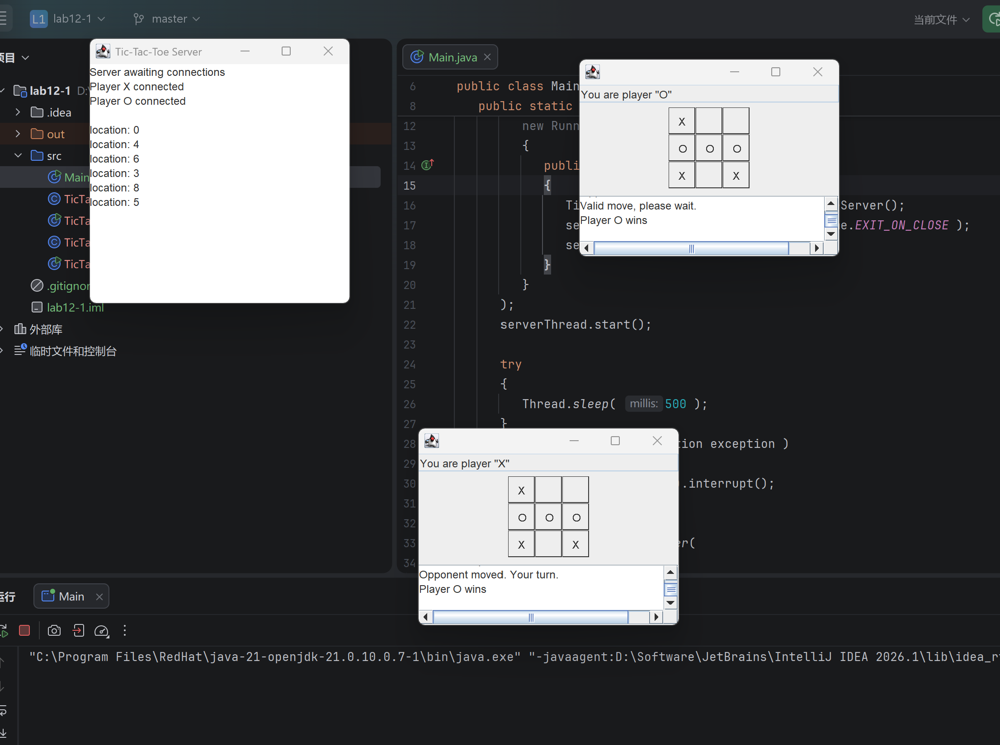
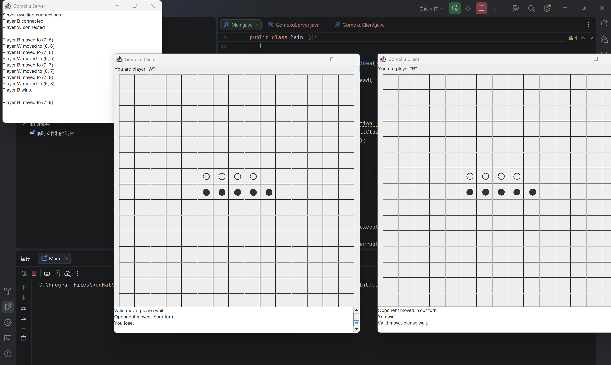

## 一、实验目的及要求

- 熟悉多线程编程和网络编程
- 按照题目要求写代码，并将工程文档压缩文件和实验报告上传到FTP


## 二、实验题目及实现过程

### 1.TicTacToe



本题在课本 TicTacToe 网络版例程的基础上完成。原程序采用 Client/Server 架构，服务端 `TicTacToeServer` 通过 `ServerSocket` 等待两个客户端连接，并为玩家 X、玩家 O 分别创建 `Player` 线程；客户端 `TicTacToeClient` 使用 Swing 界面显示 3×3 棋盘，并在用户点击方格后把落子位置发送给服务端。原程序中已经完成了连接、轮流落子、非法位置判断和双方棋盘同步，但 `isGameOver()` 方法原本只返回 `false`，没有真正判断游戏是否结束。

本次修改主要集中在 `TicTacToeServer.java` 中。首先增加了 `gameOver`、`gameResult`、`gameResultSent` 等状态变量，用于保存游戏是否结束、最终结果以及是否已经向客户端发送过结束消息。其次补全 `isGameOver()` 方法，使用二维数组列出 3×3 棋盘中所有可能获胜的组合，包括三行、三列和两条对角线：

```java
int[][] winningCombinations = {
   { 0, 1, 2 }, { 3, 4, 5 }, { 6, 7, 8 },
   { 0, 3, 6 }, { 1, 4, 7 }, { 2, 5, 8 },
   { 0, 4, 8 }, { 2, 4, 6 }
};
```

程序逐一检查这些组合，如果某一组中三个位置都不为空，并且内容完全相同，则说明对应玩家获胜，例如 `Player X wins` 或 `Player O wins`。如果所有获胜组合都不满足，则继续遍历棋盘，判断是否还有空格；若不存在空格，说明双方都无法继续落子，结果为平局 `Draw`。

为了避免游戏结束后仍然可以继续落子，在 `validateAndMove()` 开始处增加了对 `isGameOver()` 的判断；如果游戏已经结束，直接返回 `false`。在玩家落子成功后，服务器会再次调用 `isGameOver()`，如果检测到胜利或平局，则通过 `notifyPlayersGameOver()` 方法向两个客户端发送最终结果，并唤醒可能正在等待的玩家线程。这样可以保证服务端负责最终裁判，客户端只负责显示服务器返回的状态。

从运行结果看，两个客户端分别作为 X 和 O 连接服务器，服务器窗口能够记录双方落子位置。截图中 X 在同一列形成三连后，客户端下方显示 `Player X wins`，说明行列对角线判断和游戏结束通知均能正常工作。

### 2.五子棋



五子棋程序是在 TicTacToe 网络版例程结构上扩展完成的，主要文件为 `GomokuServer.java` 和 `GomokuClient.java`。整体仍然沿用“一个服务端、两个客户端、两个玩家线程”的设计：服务端负责连接管理、棋盘维护、回合控制、合法性判断和胜负判断；客户端负责 Swing 图形界面显示，并将用户点击的棋盘位置发送给服务端。

与 TicTacToe 相比，五子棋首先将棋盘规模由 3×3 扩展为 15×15。服务端使用：

```java
private static final int BOARD_SIZE = 15;
private Square[][] board = new Square[ BOARD_SIZE ][ BOARD_SIZE ];
```

客户端同样使用 15×15 的 `GridLayout` 创建棋盘，每一个格子都是一个 `Square` 面板。玩家点击某个格子时，客户端将该位置转换为一维编号发送给服务端；服务端再通过：

```java
int row = location / BOARD_SIZE;
int column = location % BOARD_SIZE;
```

还原为行列坐标。玩家标记由原来的 `X`、`O` 改为 `B`、`W`，其中 B 表示黑棋，W 表示白棋，黑棋先手。客户端显示时用 `●` 表示黑棋，用 `○` 表示白棋，使棋盘界面更接近五子棋。

服务端的核心判断在 `isGameOver()` 和 `hasFiveInDirection()` 中实现。程序遍历棋盘上的每一个非空位置，并分别检查四个方向是否存在连续五个相同棋子：横向、纵向、主对角线和副对角线。核心代码如下：

```java
if ( hasFiveInDirection( row, column, 0, 1, mark ) ||
   hasFiveInDirection( row, column, 1, 0, mark ) ||
   hasFiveInDirection( row, column, 1, 1, mark ) ||
   hasFiveInDirection( row, column, 1, -1, mark ) )
{
   return true;
}
```

`hasFiveInDirection()` 方法从当前棋子出发，按照指定的行列步长继续检查后面 4 个位置，如果全部在棋盘范围内且棋子标记相同，则说明已经形成五连。每次落子后，服务端都会调用该方法判断当前玩家是否获胜。如果没有五连，但 `movesMade == BOARD_SIZE * BOARD_SIZE`，则说明棋盘已满，判定为平局。

程序还对落子过程进行了合法性控制：只有轮到当前玩家时才允许落子；落子位置必须在棋盘范围内；已经有棋子的格子不能重复落子；游戏结束后不再接受新的落子。截图中两个客户端分别显示黑白棋子，服务端窗口记录双方移动位置；黑棋形成横向五连后，客户端显示胜负结果，说明五子棋的网络通信、棋盘同步和五连判断均能正常运行。

## 三、实验总结与心得记录

通过本次实验，我进一步熟悉了 Java 多线程编程和网络编程的基本方法。TicTacToe 和五子棋都采用客户端/服务器结构，服务端使用 `ServerSocket` 接收连接，每个玩家对应一个线程，多个线程之间通过 `Lock` 和 `Condition` 控制回合顺序。这让我理解了网络游戏中“客户端负责交互显示，服务端负责规则判断”的基本设计思路。

在 TicTacToe 部分，重点是补全游戏结束判断。通过枚举所有获胜组合，可以清晰地判断行、列、对角线是否存在三连，同时还要考虑棋盘已满时的平局情况。这个部分虽然逻辑不复杂，但需要和原有线程等待、落子验证、消息发送逻辑结合起来，否则容易出现一方获胜后另一方仍然等待或继续落子的情况。

在五子棋部分，难点是将 3×3 棋盘扩展为 15×15，并实现连续五子的判断。相比直接枚举所有情况，使用方向向量检查横向、纵向和两条对角线更加简洁，也更容易扩展。通过本次实现，我加深了对二维棋盘坐标转换、一维位置传输、Swing 网格界面绘制以及服务端同步状态维护的理解。

总体来说，本实验将图形界面、Socket 通信、多线程同步和游戏规则判断结合在一起，综合性比较强。完成后我能够更加清楚地理解课本 TicTacToe 例程的整体结构，也能在其基础上扩展出更复杂的五子棋程序。