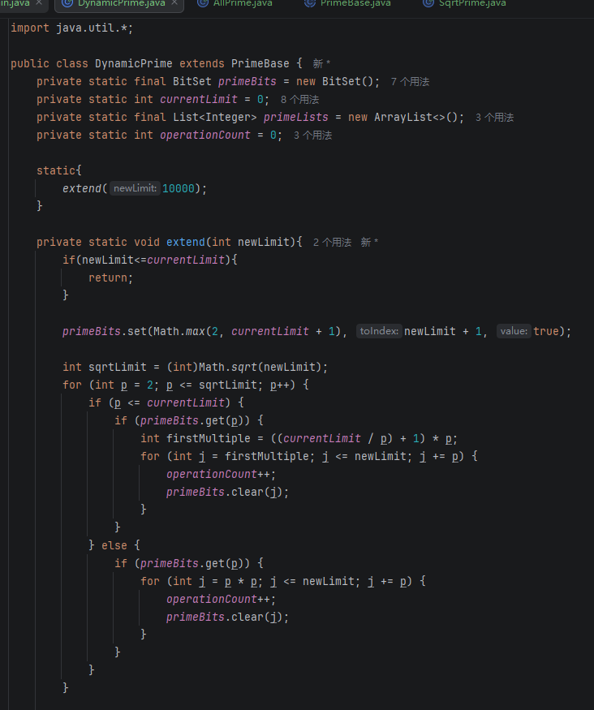
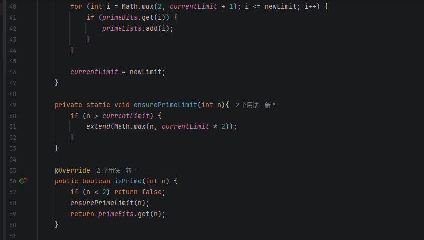
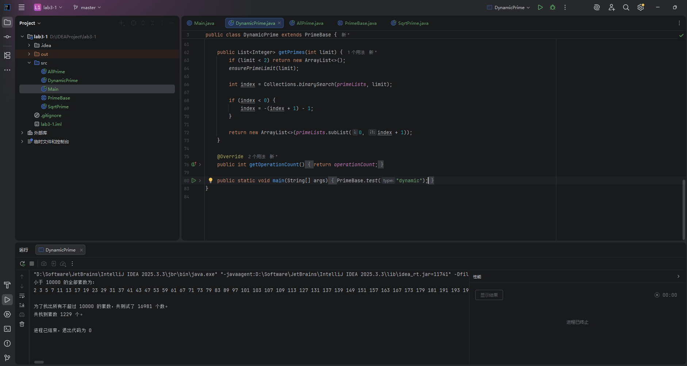
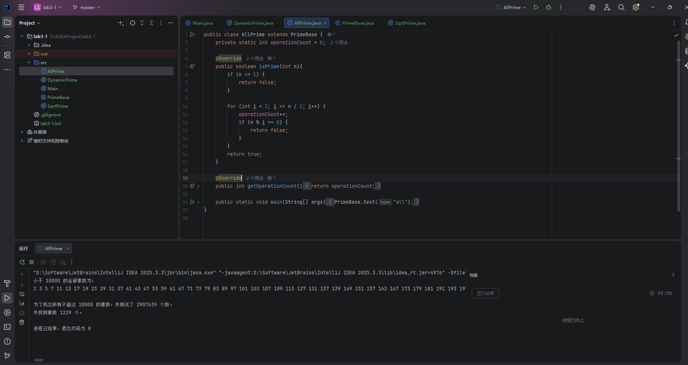
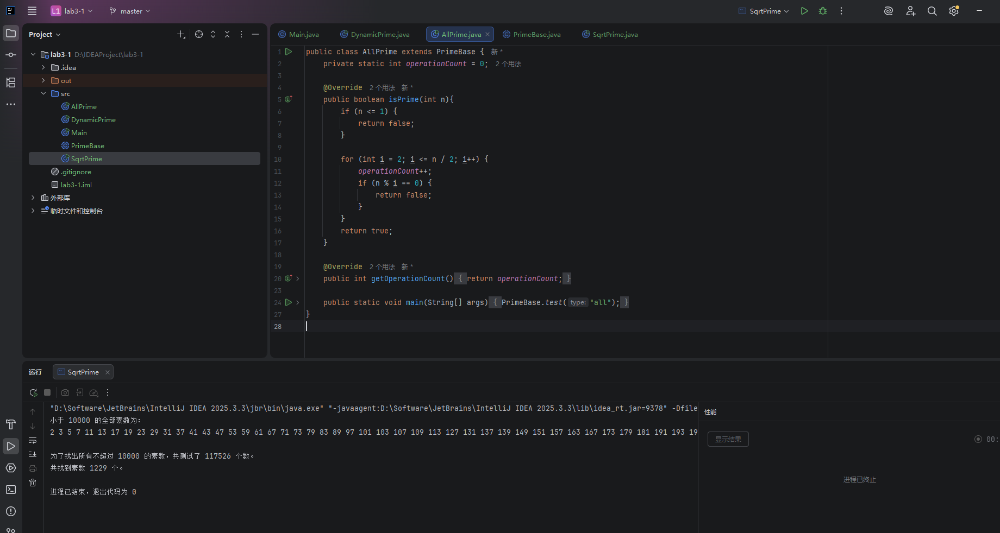
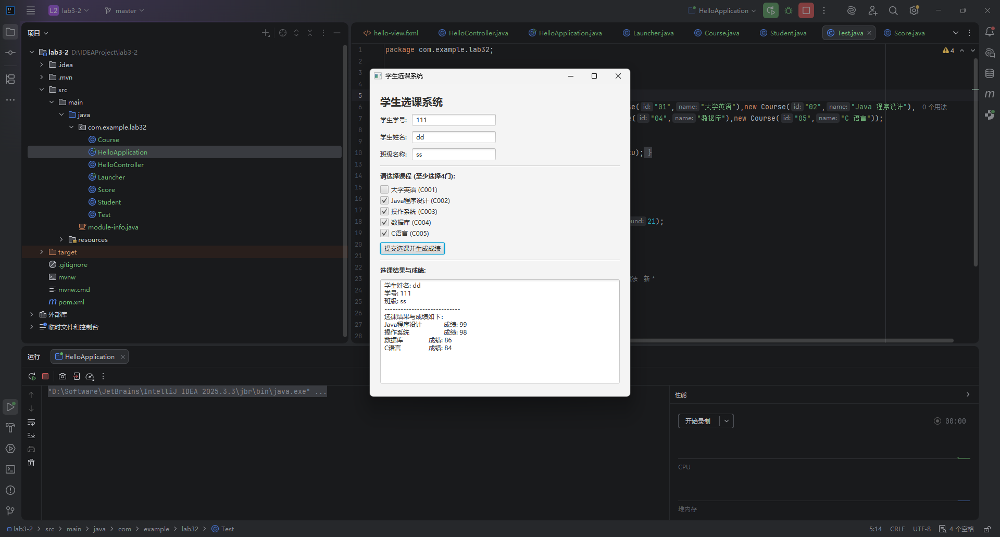
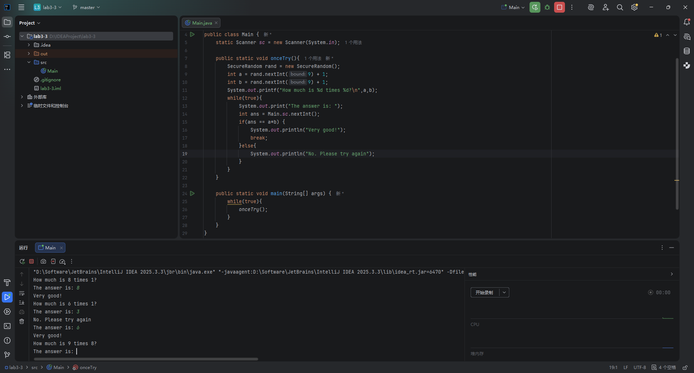
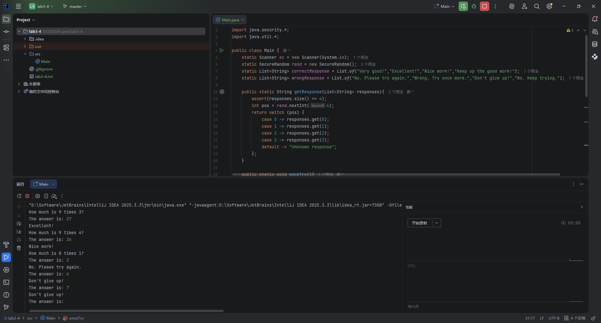

## 一、实验目的及要求

**实验目的**

- 练习控制结构

- 熟悉面向对象封装特性

- 熟悉简单的JavaFX图形界面

**实验要求**

- 下周实验课将工程文件和实验报告打包上传

## 二、实验题目及实现过程

### 1.素数

#### a) 编写一个方法，它判断一个数是否为素数。

如代码片段所示，编写了一个判断一个数是否为素数的方法 。为了优化性能并实现动态扩容，程序并没有简单地使用基础循环，而是利用了 `BitSet` 实现了一种动态的素数筛法 。在 `extend` 方法中，利用筛选法只需测试到目标数的平方根次（`sqrtLimit`）即可有效地标记合数 。最终，通过重写的 `isPrime` 方法可以快速返回特定数字是否为素数的布尔值判断 。

#### b) 在程序中使用这个方法，显示小于 10000 的全部素数。为了找出所有不超过 10000 的素数，需要测试多少个数？

在主程序中调用上述素数判断方法，通过循环遍历的方式显示小于 10000 的全部素数 。经过程序的运行统计，输出结果显示 10000 以内共有 1229 个素数 。为了准确量化并比较找出所有不超过 10000 的素数需要测试多少个数 ，代码中内置了一个静态变量 `operationCount` 用于在每次筛选循环时记录实际的测试操作次数 。

#### c) 开始时，可能会想到要确定某个数n是否为素数，需进行测试的次数最多为n/2 次，其实只需最多测试 n 的平方根次即可。重新编写这个程序，并以这两种方式运行它。

为了直观对比不同测试算法的效率，首先编写并测试了第一种思路：在确定某个数 n 是否为素数时，需进行测试的次数最多为 n/2 次 。程序内设置循环从 2 开始，上限设定为该数的二分之一，通过取模运算判断是否能被整除。程序以此方式找出了指定范围内的素数，并累加记录了使用 n/2 方法所需的总测试循环次数，作为后续比较的基准。

接着，根据数学规律重新编写了这个程序，将测试判断的上限优化为只需最多测试 n 的平方根次即可 。以这两种方式分别运行程序并打印出各自的测试次数进行比较。结果表明，当上限达到 10000 时，测试平方根次的算法所需的运算次数远远低于测试 n/2 次的算法，极大地减少了冗余的循环，显著提升了程序的计算性能与执行效率。

### 2.选课系统

根据实验要求，基于面向对象的封装特性实现了一个简单的选课系统 。代码中分别定义了学生类（包含学号、姓名、班级、电话等基本属性并设计了重载构造函数）、课程类（包含课程编号、名称）以及成绩类 。此外，系统利用 JavaFX 构建了直观的图形用户界面 。如图所示，系统内置了大学英语、Java程序设计、操作系统、数据库、C语言等五门课程信息 。用户在界面输入自己的学生信息后，通过复选框选择至少 4 门课程 ；点击确认按钮后，下方文本域会显示用户的选课结果以及随机生成的用户所选择课程的成绩（80—100分） 。

### 3.CAI

本部分实现了一个用于辅助小学生学习乘法的计算机辅助教学（CAI）控制台程序 。程序利用 `SecureRandom` 对象产生两个一位正整数，并在控制台向用户提出类似“How much is 6 times 7?”的问题 。通过 `Scanner` 获取学生输入的答案后，程序会检查答案的正确性：如果回答正确，系统显示“Very good！”并调用独立方法产生并输出另一个乘法问题；如果答错，则显示“No. Please try again.”，并让学生持续回答同一个问题，直到答对为止 。

### 4.CAI降低疲劳感

为了解决单一提示语可能带来的枯燥感，对上述 CAI 程序进行了扩展，通过变换计算机的响应来降低学生的疲劳感 。修改后的程序利用随机数生成方法选择 1~4 中的一个数，并利用一条 `switch` 语句为每个正确或错误的答案选择 4 种可能的评语之一 。从控制台的运行结果图可以看出，当学生回答正确时，会随机获得“Very good!”、“Excellent!”等鼓励 ；而回答错误时，则会随机收到“Wrong. Try once more.”、“Don't give up!”等不同的提示 ，有效提升了程序的互动性和趣味性。

## 三、实验总结与心得记录

本次实验涵盖了基础算法优化、面向对象封装设计以及简单图形界面的综合应用，是一次从控制结构逻辑到上层交互的完整实践 。

### 1.算法性能与内存优化的实践

在素数求解的练习中，我对算法的执行效率有了更深刻的体会 。最初采用的 n/2 次遍历虽然直观，但在处理较大范围数据时存在大量冗余 。将其优化为仅测试 n 的平方根次后，计算量得到了显著降低 。为了进一步追求更高的执行效率和极致的内存管理，我在代码中采用了 `BitSet` 来实现动态素数筛法 。利用位操作（Bit-level operations）不仅极大地压缩了内存占用，还避免了高层次集合类（如泛型容器）带来的额外装箱开销，这让我深刻认识到在底层开发中榨取硬件性能、注重内存布局的重要性。

### 2.面向对象架构与前端交互的结合

学生选课系统的开发是对面向对象封装特性的绝佳锻炼 。通过抽象并独立设计学生类、课程类和成绩类，并合理规划属性的访问权限与重载构造函数，程序的模块化程度得到了有效提升 。此外，引入 JavaFX 构建图形用户界面，将底层的核心逻辑数据通过事件驱动的方式与可视化组件连接起来 。这种数据模型与视图相分离的设计思路，不仅提高了代码的可维护性，也为未来架构更复杂的大型工程奠定了基础。

### 3.控制流程与用户体验的优化

在辅助教学（CAI）程序的编写中，我熟练掌握了 `SecureRandom` 类的使用以及 `switch` 多分支控制结构的应用 。程序不仅需要处理正确的逻辑跳转，更需要考虑使用者的主观感受 。通过引入随机化机制为答题反馈提供多样化的评语，有效降低了单调的系统响应带来的疲劳感 。这启发我，一款优秀的软件不仅要有健壮的底层算法，更需要在应用层面上兼顾人机交互的温度与体验。

总体而言，本次实验不仅巩固了 Java 核心语法，更锻炼了我在面对具体工程需求时，从底层的数据结构抉择到高层的面向对象设计的综合系统构建能力。