## 一、实验目的及要求

- 开始熟悉图形界面
- 熟悉枚举
- 熟悉继承
- 按照题目要求写代码和实验报告，并上传

## 二、实验题目及实现过程

### 1.设计选课系统

#### a) 学生分本科生（学号、姓名、班级）和研究生（学号、姓名、班级、导师）两种；

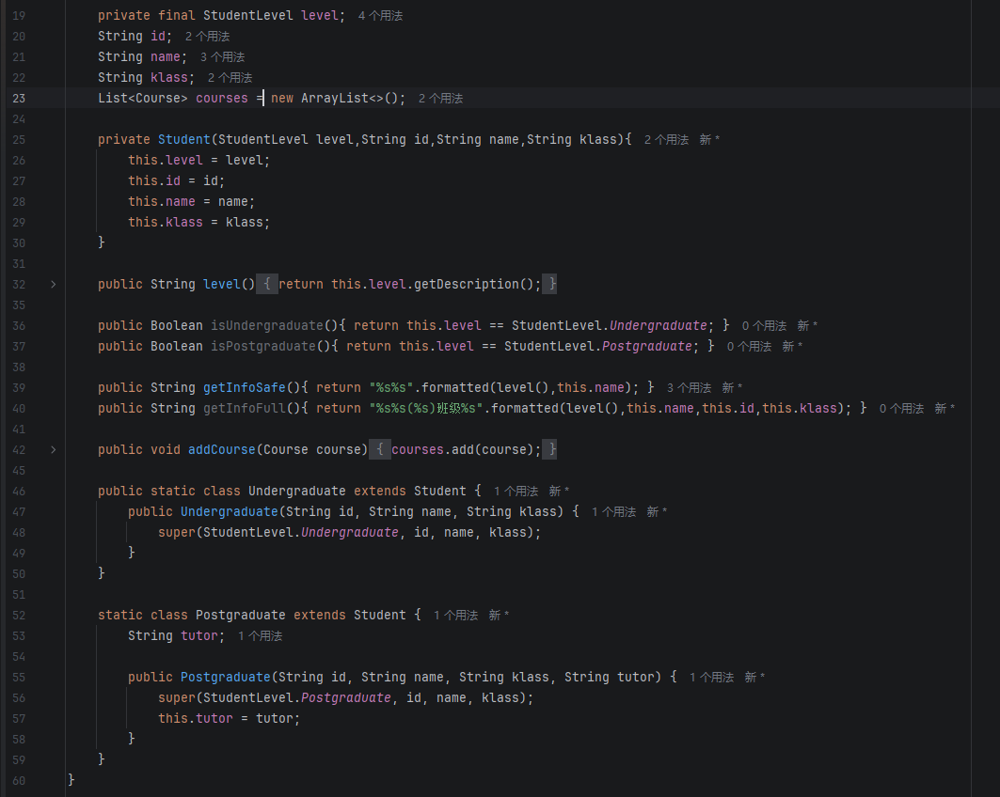

这段代码完成了学生类及其子类的基本结构设计 。定义了一个基础的 `Student` 类，并在此基础上派生出 `Undergraduate`（本科生）和 `Postgraduate`（研究生）两个子类，分别包含了学号、姓名、班级以及研究生特有的导师等信息 。同时，代码使用了枚举类型 `StudentLevel` 来标识学生的不同级别，提高了整体架构的规范性与可读性 。

#### b) 课程（编号、课程名、学分）分必修和选修两种；

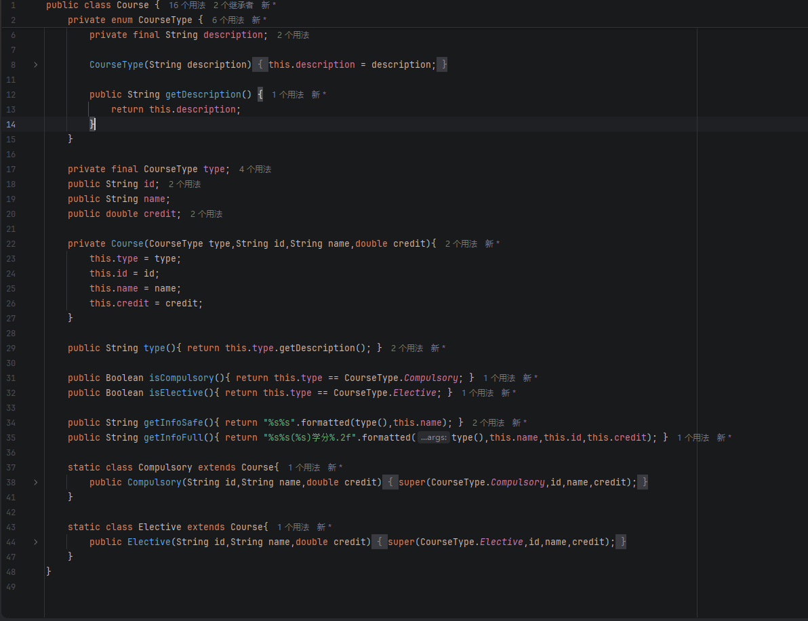

随后，我完成了课程类的面向对象设计 。构建了基类 `Course` 并派生出 `Compulsory`（必修课）和 `Elective`（选修课）两个子类，其属性涵盖了课程编号、课程名和学分 。代码中引入了 `CourseType` 枚举来区分具体的课程类型，并提供了相应的属性获取和格式化输出方法，以供后续系统进行统一调用与展示 。

#### c) 创建4个学生信息（2个本科生，2个研究生）

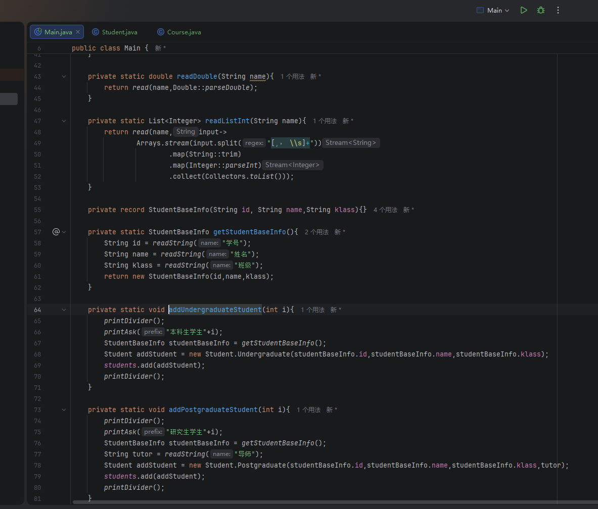

为了实例化测试数据，这部分代码实现了控制台信息的交互与录入 。通过定义 `getStudentBaseInfo` 等辅助读取方法，程序能够提示用户逐一输入本科生和研究生的详细信息，并实例化对应的对象存入全局的学生列表中，从而成功创建了4名学生的初始化信息 。

#### d) 创建4门课程信息（2门必修，2门选修）

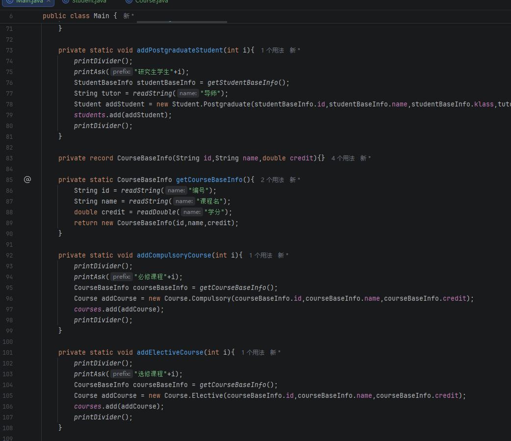

与学生信息的录入过程类似，此模块代码实现了课程信息的动态创建 。通过统一读取课程的编号、名称和学分等基础属性，分别调用并执行必修课与选修课的构建逻辑，完成了4门课程（2门必修，2门选修）对象的实例化与列表存储 。

#### e) 自动选课部分：为每个学生自动选修所有必修课；

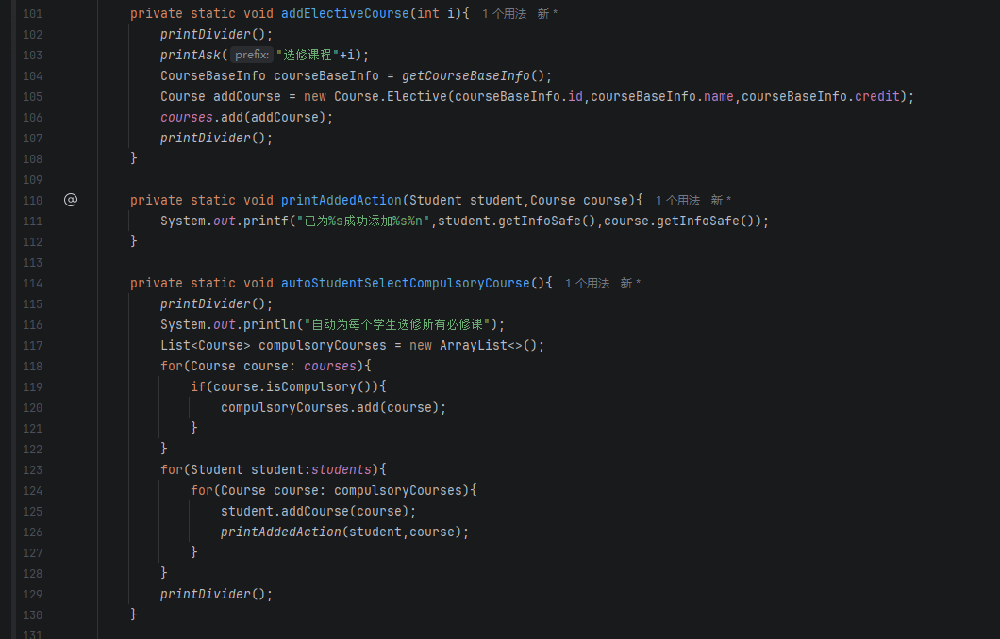

本段代码核心实现了系统要求的自动选课功能模块 。程序首先遍历所有已创建的课程并筛选出必修课集合，随后遍历所有的学生对象，自动为每一位学生分配并添加所有必修课程，最后在控制台打印出选课成功的操作日志，确保无遗漏 。

#### f) 秘书手动选课部分：为每个同学选修1-2门选修课；

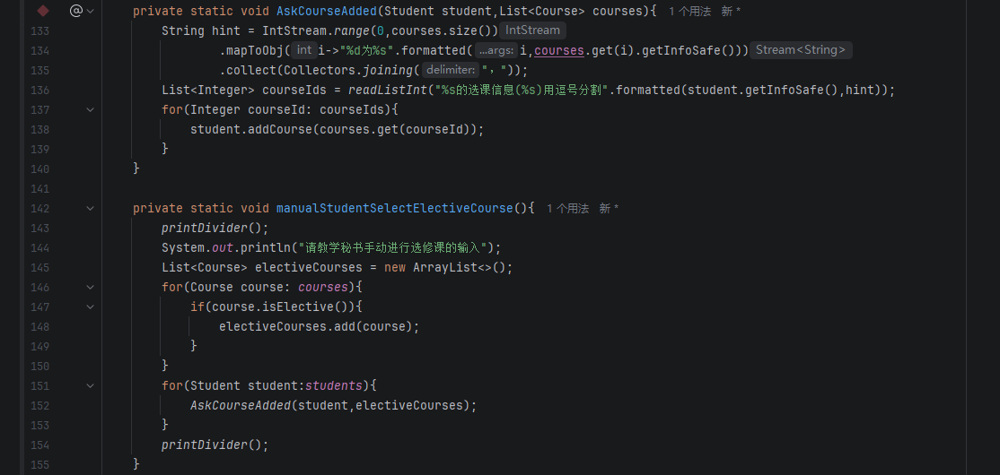

此部分代码展示了教学秘书进行手动选课的具体实现流程 。程序先单独筛选出所有的选修课，并提示秘书为每位同学通过输入序号的方式选择所需的课程（按照要求每位同学选修1-2门） 。系统读取输入的编号后，准确将选修课分配至相应学生名下 。

#### g) 打印出每个学生的选课信息

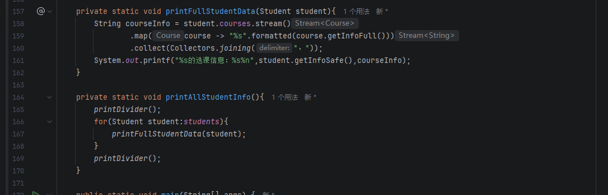

在选课流程结束后，该方法负责格式化输出选课的最终结果 。借助 Java Stream API 对每位学生名下的课程列表进行映射和字符串拼接，程序能够在控制台上清晰、直观地打印出每一位学生的个人基本信息及其对应已选修的全部必修和选修课程明细 。

### 2.写一个有理数类

#### a) Rational 类的定义

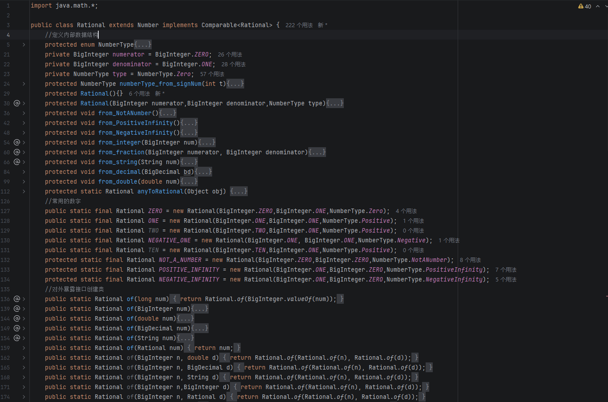

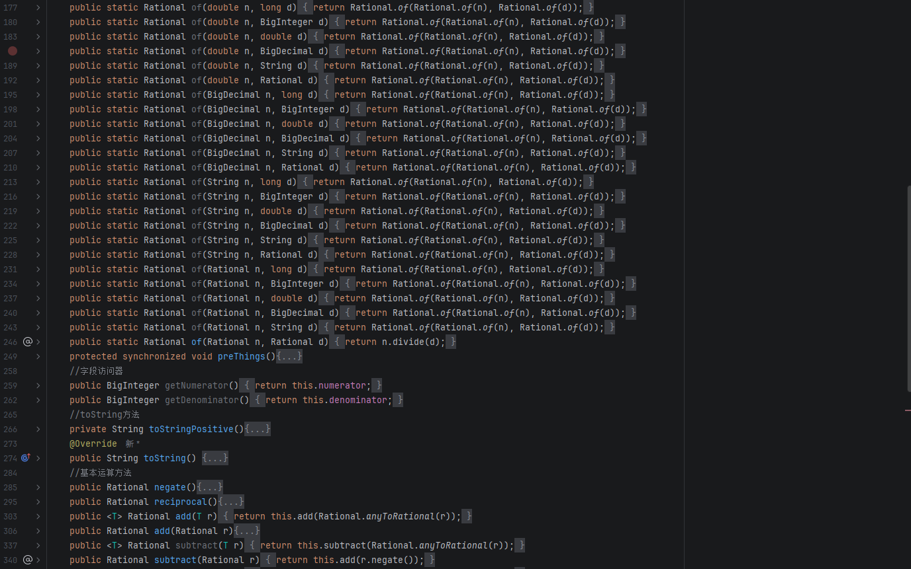

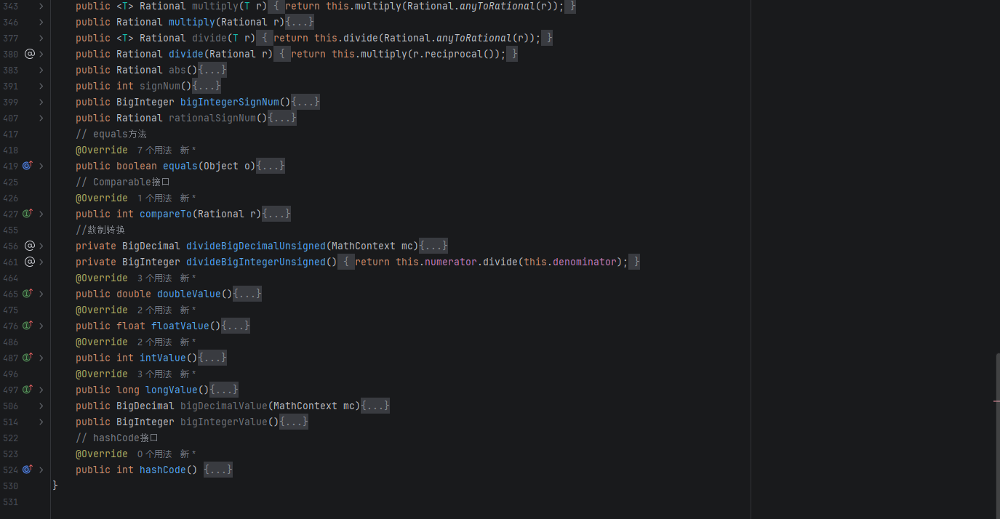

针对第二个实验任务，我设计并实现了一个功能高度完备的有理数类 `Rational` 。该类继承自 `Number` 根类并实现了 `Comparable` 接口，内部采用 `BigInteger` 存储分子和分母以确保计算的极高精度，同时重载了加、减、乘、除等四则运算方法，并编写了大量支持多种数据类型转换的静态工厂方法 。

#### b) 测试

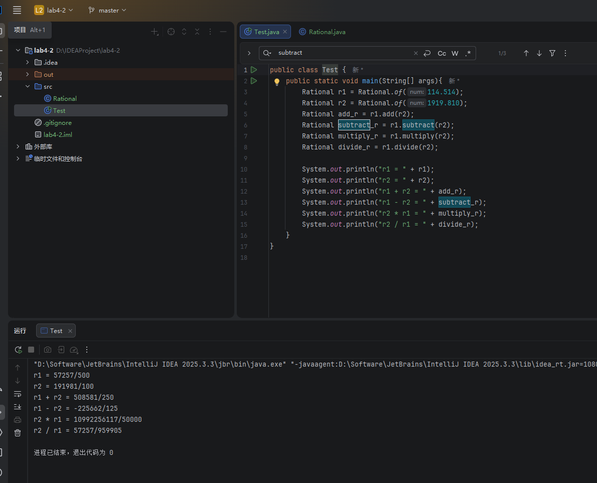

为了验证有理数运算逻辑的正确性，我编写了测试主类并进行了四则运算实例测试 。运行结果清晰显示，程序能够正确无误地完成两个有理数对象的加法、减法、乘法和除法运算，并以标准的分数形式输出了精确的计算结果，完美符合实验对有理数精确计算的预期要求 。

### 3.实现一个基础图形类Graph

a) 基础图形类Graph

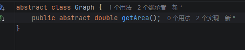

在第三个基础图形类的任务中，我首先构建了一个基础的抽象类 `Graph` 。该抽象类作为具体图形的父类，内部声明了一个抽象方法 `getArea()`，用于规范并要求所有继承该类的子图形（如矩形和三角形）必须具体实现各自的面积计算逻辑，充分运用了面向对象的抽象与多态特性 。

b) 三角形类Triangle

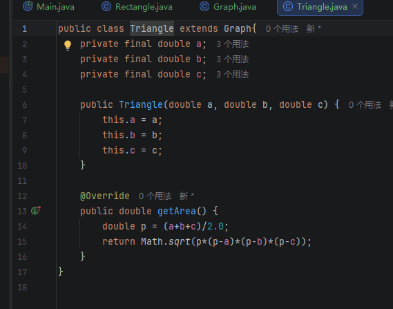

依托于 `Graph` 抽象父类，我完成了三角形子类 `Triangle` 的具体实现 。该类封装了三个私有属性以代表三角形的三条边，并严格重写了 `getArea()` 方法，利用海伦公式（其中 $p=(a+b+c)/2$，面积为 $\sqrt{p(p-a)(p-b)(p-c)}$）精确计算并返回该三角形的真实面积 。

c) 矩形类 Rectangle

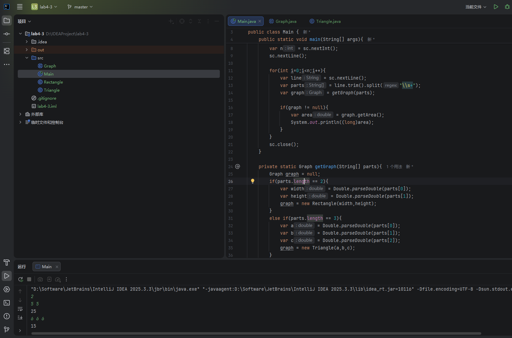

同样地，矩形类 `Rectangle` 亦继承自 `Graph`，具备长和宽属性并实现了相应的矩形面积计算逻辑 。配合主控制台程序的输入解析模块，系统能够利用空格分割用户输入的字符串，并根据具体参数个数（两个参数对应矩形，三个参数对应三角形）动态实例化对应的图形子类对象 。

d) 测试

上图展示了基础图形类的最终控制台运行与测试结果 。通过在控制台输入实验要求的测试样例（例如给定两个边长参数 5 5，或者三个边长参数 6 6 6），程序能够根据输入参数动态创建对应的矩形或三角形，并成功计算输出其面积值（分别为25和15），充分验证了类的继承和面积多态计算方法的准确性 。

### 4.创建一个简单的JavaFX绘图程序

#### 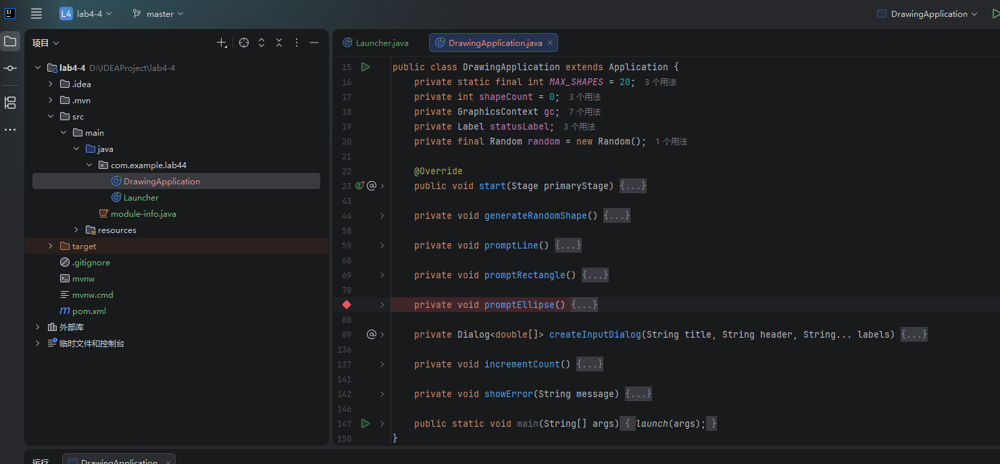

第四个实验任务是开发基于 JavaFX 的简单绘图应用程序 。代码中构建了核心业务逻辑，利用随机数生成机制决定接下来将要绘制的是直线、矩形还是椭圆，并预留了用户输入提示功能以获取图形的关键坐标与尺寸参数 。同时，程序架构中已规划了参数合法性检查以及最多创建20个图形的总体限制要求 。

### 5.写一个交通信号灯枚举类TrafficLight

#### a) TrafficLight 类的定义

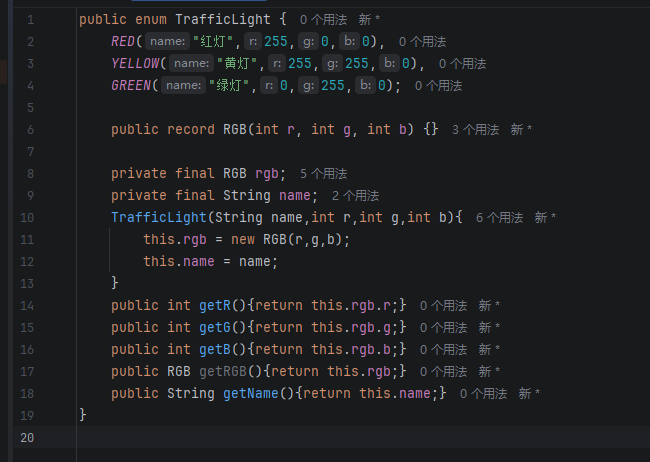

在最后一个枚举实验任务中，我完整定义了交通信号灯枚举类 `TrafficLight` 。该枚举类规范地声明了 `RED`（红灯）、`YELLOW`（黄灯）和 `GREEN`（绿灯）三个枚举常量，并利用嵌套的 `RGB` 记录类（record）为每一种灯光状态封装了对应的红、绿、蓝色彩通道数值及其中文名称描述 。

#### b) 测试

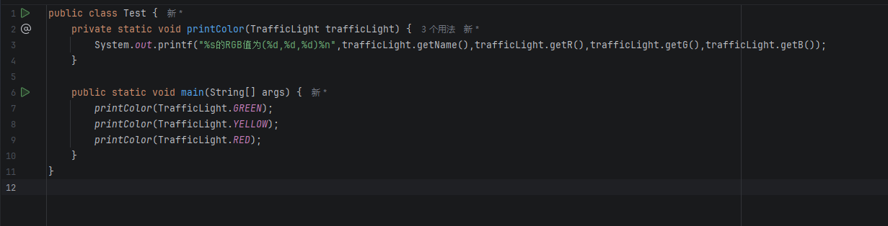

最终，我编写了交通信号灯测试类对枚举属性进行了遍历输出测试 。通过调用专门的 `printColor` 方法以及枚举常量的各项 Getter 访问器方法（如 `getR()`、`getG()` 等），控制台成功打印出了红、黄、绿三种交通信号灯颜色的具体 RGB 组成数值，圆满达成了对枚举类特性的实践要求 。

## 三、实验总结与心得记录

本次实验内容丰富，涵盖了类的继承、多态、枚举、高精度数值计算以及基础的JavaFX图形界面开发 。通过独立完成这五个模块的编码与调试，我不仅巩固了Java语言的基础语法，更对面向对象系统设计有了更为深刻的工程化理解。

首先，在“选课系统”与“基础图形类”的设计中，我深刻体会到了继承与多态在代码复用和架构扩展上的优势 。作为软件工程专业的学生，我逐渐意识到，相较于我以往更关注的底层C++那种追求极致运行速度和内存控制的开发模式，Java的纯面向对象范式更侧重于业务逻辑的抽象与规范。通过提取基类（如 `Graph` 或 `Course`）并在子类中重写抽象方法（如 `getArea()`），代码的耦合度显著降低，这为未来构建大规模、高扩展性的应用系统奠定了思维基础 。

其次，在编写有理数类（`Rational`）的过程中，为了满足分数精确计算的需求，我使用了 `BigInteger` 来替代传统的浮点数类型 。这让我认识到在不同应用场景下，性能与精度之间的权衡。虽然大数类的计算开销高于原生数据类型，但在需要绝对精度的场景下，这种设计是不可或缺的。同时，将有理数类作为 `Number` 的子类并实现 `Comparable` 接口，也让我进一步熟悉了Java标准库的接口规范与泛型设计 。

此外，JavaFX绘图程序的实现是我初步涉足Java原生桌面UI开发的尝试 。JavaFX提供了一套更为成熟且高度封装的事件驱动模型与组件库。这极大地简化了图形的绘制与用户交互逻辑的处理，但也要求开发者必须严格遵循其界面的生命周期与参数校验机制 。

最后，交通信号灯枚举类（`TrafficLight`）的编写让我见识到了Java枚举的强大之处 。结合 Record 语法，枚举不仅能表示状态常量，还能携带丰富的属性（如RGB值）和方法。这种强类型且自带封装属性的设计，大大提升了代码的安全性和表现力。

总体而言，本次实验不仅提升了我的Java编码熟练度，更促使我完成了从“关注底层实现”到“关注顶层对象抽象”的编程思维转换。在未来的学习与工程实践中，我将继续探索如何将严谨的面向对象设计与高效的代码执行逻辑更好地结合起来。