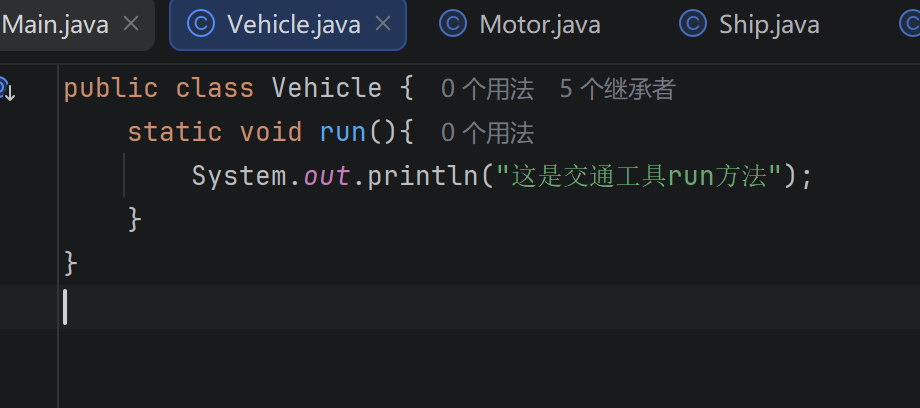
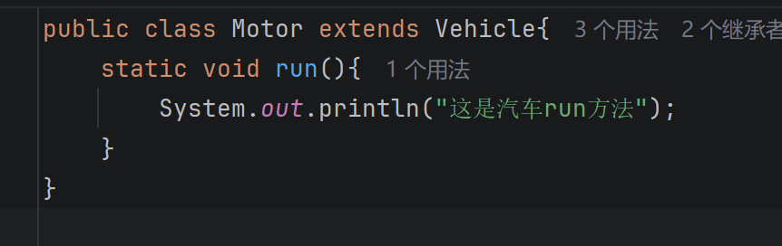
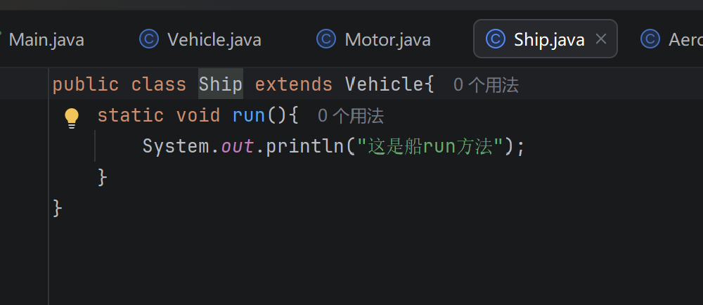
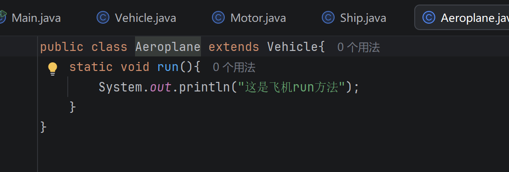
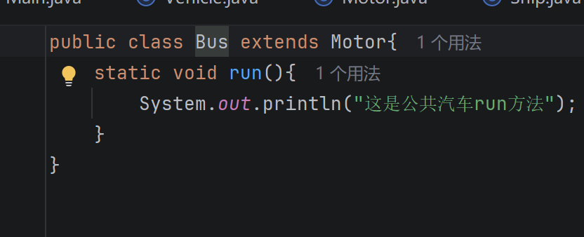
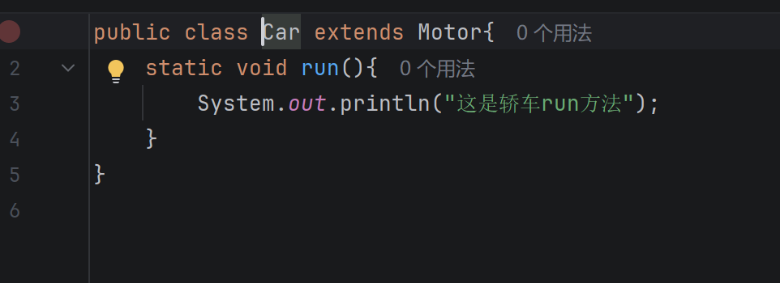
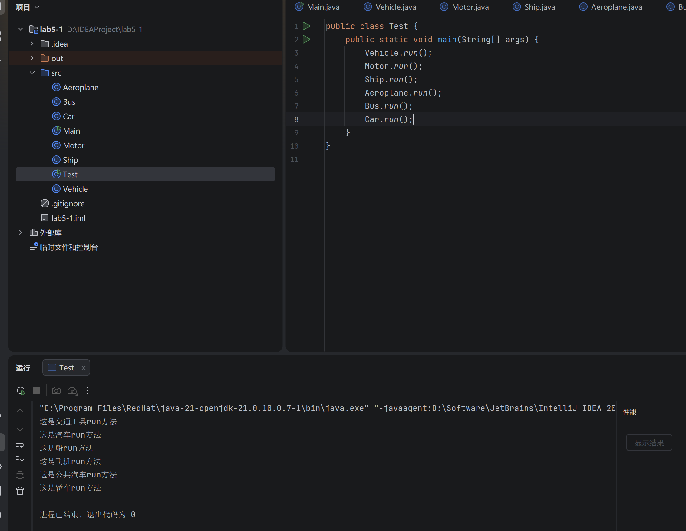
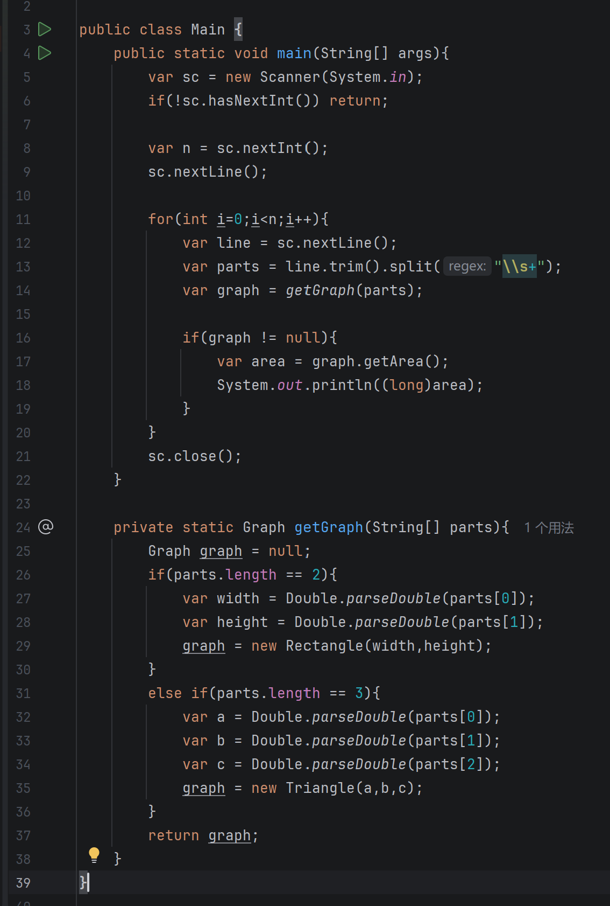

## 一、实验目的及要求

- 熟悉继承

- 尝试多态

- 按照题目要求写代码和实验报告，并上传 

## 二、实验题目及实现过程

### 1.交通工具类

（1）、编写一个交通工具类Vehicle类，创建一个run方法，从控制台中输出“这是交通工具run方法”。



这里定义了所有交通工具的基类 `Vehicle` 。类中包含了一个静态的 `run()` 方法，用于在控制台输出基础的提示信息“这是交通工具run方法” 。这个类为后续衍生出更具体的交通工具类别奠定了基础模板。

（2）创建Vehicle类的三个子类，Motor类表示汽车，Ship类表示船，Aeroplane类表示飞机类，分别写出他们的run方法；







接着，创建了 `Vehicle` 类的三个直接子类：表示汽车的 `Motor`、表示船的 `Ship` 以及表示飞机的 `Aeroplane` 。它们通过 `extends` 关键字继承了 `Vehicle` 类，并且分别编写了它们各自的 `run()` 方法，以此来输出代表各自交通工具特性的运行提示语。

（3）、创建Motor的二个子类，Bus和Car，分别表示公共汽车和轿车，分别写出各自的run方法。





为了进一步体现面向对象中的多层继承关系，这里又创建了 `Motor` 类的两个子类：`Bus`（公共汽车）和 `Car`（轿车）。它们不仅具备交通工具和汽车的通用属性，还进一步细化了自身的行为，分别编写了专属的 `run()` 方法在控制台打印对应的语句 。

（4）、创建一个测试类Test,分别创建上面的各种类，提用相应的run方法。



在测试类 `Test` 的 `main` 方法中，统一调用了上述建立的所有类的 `run()` 方法 。从控制台的输出结果可以看出，程序成功按顺序输出了各个交通工具类内定义的字符串，成功验证了整个类层级结构的连通性和独立性 。

### 2.Graph多态



在这部分修改后的面积计算程序中，完美展示了多态的实际应用 。在 `getGraph` 方法中，返回类型被声明为父类 `Graph`，但程序会根据输入的参数长度动态地实例化并返回具体的子类对象（`Rectangle` 或 `Triangle`）。在 `main` 循环中，我们统一使用父类引用 `graph` 来调用 `getArea()` 方法 。程序在运行时，会聪明地根据 `graph` 实际指向的对象类型去执行对应的面积计算逻辑，充分体现了“父类引用指向子类对象”的多态精髓。

### 3.怎么利用多态来实现不同图形绘制

在本次实验中，通过对比 `Painter` 程序和 `DrawRandomLines` 程序，可以清晰地看出两种不同的绘图模式，以及如何利用多态思想来构建一个支持多种图形绘制的高扩展性系统。

#### 1. 现有程序的局限与隐式多态

- **DrawRandomLines 的单一图形模式：** 在 `DrawRandomLines` 程序中，采用的是 Canvas 画布的立即渲染模式。控制器中显式声明了一个专门用于存储直线的数组 `MyLine[] lines = new MyLine[100];`。在绘制时，通过 `for (MyLine line : lines) { line.draw(gc); }` 调用每条线的绘制方法。这种设计的局限在于：如果想在画面中加入圆形或矩形，就必须新建对应的数组和遍历循环，代码的耦合度极高，不具备扩展性。
- **Painter 程序的隐式多态：** 相比之下，`Painter` 程序利用了 JavaFX 自带的场景图（Scene Graph）机制。画笔绘制的 `Circle` 对象被直接添加到了 `drawingAreaAnchorPane.getChildren()` 返回的集合中。这个集合的泛型是所有可视节点的基类 `Node`。当 JavaFX 底层渲染界面时，它遍历这个 `Node` 集合，并利用多态机制调用各个子类实际的渲染逻辑，因此同一个面板可以毫不费力地容纳并绘制直线、圆形、多边形等各种不同类型的子类节点。

#### 2. 我的设计思路：如何利用多态重构多图形绘制系统

结合上述两个程序的特点，如果我们要手动在 Canvas 画布上实现类似 `Painter` 那样支持绘制多图形的系统，我们需要在 `DrawRandomLines` 的基础上引入多态设计。具体实现思路如下：

1. **向上抽象，定义基类（统一接口）：** 首先，提取所有图形的共性，定义一个抽象基类（例如 `MyShape`）。该基类应包含所有图形共有的属性（如坐标 `x1, y1, x2, y2` 和颜色 `strokeColor`），并定义一个抽象的绘制方法 `public abstract void draw(GraphicsContext gc);`。

2. **向下继承，实现细节（方法重写）：** 将当前的 `MyLine` 类修改为继承自 `MyShape`，并实现其专属的 `draw` 方法（调用 `gc.strokeLine`）。同理，可以轻松派生出 `MyOval` 和 `MyRectangle` 等子类，它们只需根据自身的几何特性重写 `draw` 方法（例如调用 `gc.strokeOval` 或 `gc.strokeRect`）。

3. **父类引用，动态绑定（多态调用）：** 在 Controller 中，打破具体类型的限制，将数组声明为父类类型：`MyShape[] shapes = new MyShape[100];`。在生成随机图形时，可以随机实例化不同的子类对象（`new MyLine(...)` 或 `new MyRectangle(...)`）存入数组。 最终的核心绘制循环将精简为多态调用：

   ```java
   for (MyShape shape : shapes) {
       shape.draw(gc); // 运行时多态：动态根据对象的实际类型执行不同的绘制方法
   }
   ```

## 三、实验总结与心得记录

通过本次实验，我从基础理论到实际应用，系统地学习并掌握了面向对象编程中的两大核心支柱：继承与多态。

1. **理清了继承的层次模型：** 在“交通工具”和“基础图形”的编程任务中，我深刻体会到了继承（`extends`）在代码复用和逻辑抽象上的优势。通过提取通用属性和方法至父类（如 `Vehicle` 的 `run` 或 `Graph` 的 `getArea`），不仅减少了代码冗余，还使得整个程序的类结构像树状图一样清晰明了，高度符合现实世界的分类逻辑。
2. **领悟了多态的动态绑定魅力：** 在重构 `Graph` 类计算面积的过程中，我掌握了多态的核心写法。当程序使用统一的父类指针去调用被子类重写的方法时，在编译期它看似是一种行为，但在运行期却能根据对象的实际类型表现出不同的结果（分别计算出三角形或矩形的面积）。这种“对外接口统一，对内实现多变”的机制，极大降低了模块间的耦合。
3. **体验了多态在真实框架中的威力：** 通过阅读 `Painter` 画板小程序的源码，我发现之前的理论学习在工业级 UI 框架（JavaFX）中得到了完美的印证。无论是管理界面元素的 `Node` 集合，还是处理样式的 `Paint` 接口，无一不在运用多态来保证框架的灵活性。这也让我明白，学好多态不仅仅是为了应付算法计算，更是未来进行大型软件架构设计、理解各种设计模式的基础。