## 一、实验目的及要求

- 熟悉异常处理

- 按照题目要求写代码，并在下次上课前将相关文件上传

## 二、实验题目及实现过程

### 1.构造方法失败

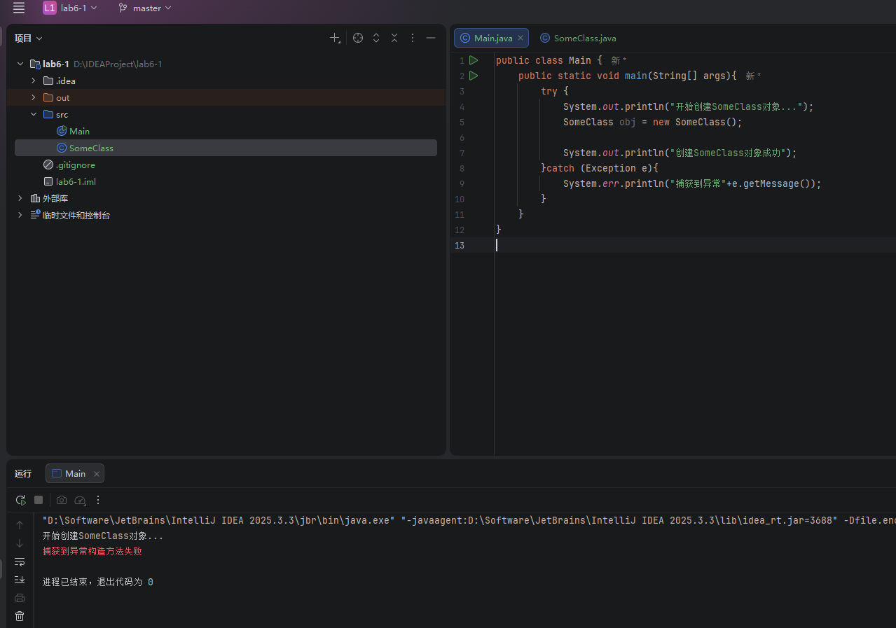

在本实验中，我们创建了一个 `SomeClass`，并在其构造方法内部人为抛出了异常。在 `main` 方法中，我们使用 `try-catch` 块去实例化该对象，结果表明，当构造方法执行失败并抛出异常时，对象的创建会被中断，异常被成功捕获并打印出了具体的错误信息。

### 2.重抛异常

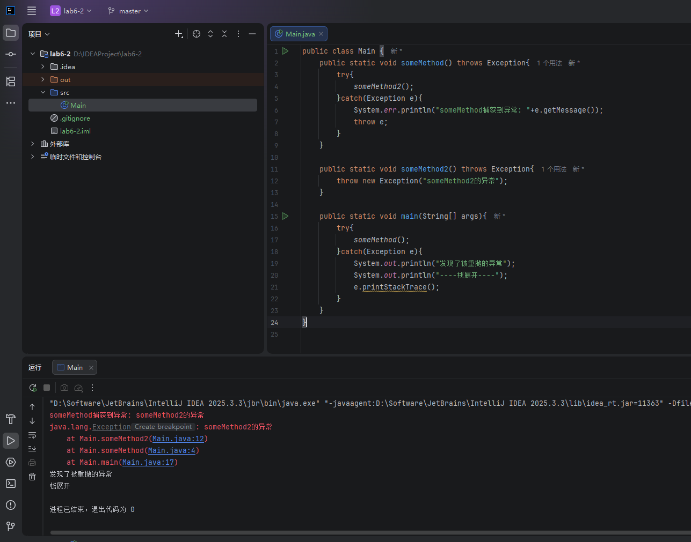

该部分实验演示了 Java 中的异常重抛机制。在底层方法 `someMethod2` 中抛出异常后，被上层的 `someMethod` 捕获，打印部分提示后，通过 `throw e` 将同一个异常原封不动地再次抛出。最终在 `main` 方法中捕获到了该异常，并通过 `e.printStackTrace()` 打印出了完整的异常调用栈轨迹，清晰地展示了异常的传递过程。

### 3.自定义异常

#### (1)自定义两个异常

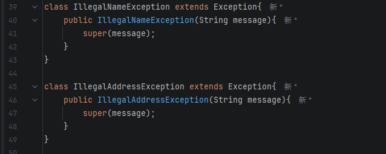

为了处理特定业务逻辑的错误，我们自定义了两个异常类：`IllegalNameException` 和 `IllegalAddressException`。这两个类均继承自 Java 的 `Exception` 类，并重写了带有字符串参数的构造方法，以便在抛出时能够携带具体的错误提示信息。

#### (2)定义`Student`类

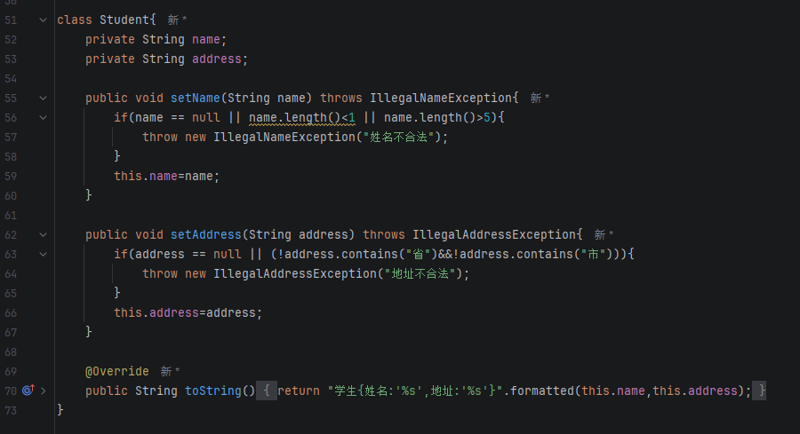

在 `Student` 类的定义中，我们在 `setName` 和 `setAddress` 方法里加入了输入数据的校验逻辑。如果姓名长度不符要求，或地址格式不合法，程序会主动抛出刚刚自定义的对应异常，从而在对象内部确保了封装数据的合法性。

#### (3)在main中捕获并处理

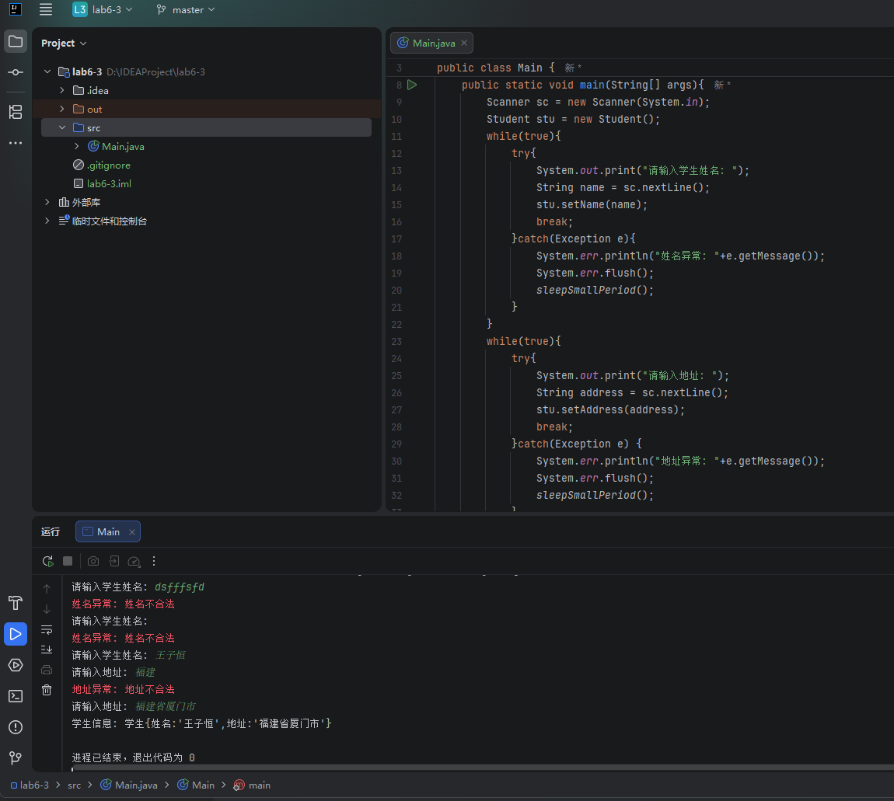

在 `main` 方法的控制台交互中，我们巧妙结合了 `while(true)` 循环与 `try-catch` 语句。当用户输入非法信息触发异常时，程序会捕获异常、通过 `System.err` 输出错误警告，并要求用户重新输入，直到录入正确为止。为了防止错误流和输出流在控制台发生错位，我们还加入了微小的延时处理 `sleepSmallPeriod()`。

### 4.泛型方法 isEqualTo

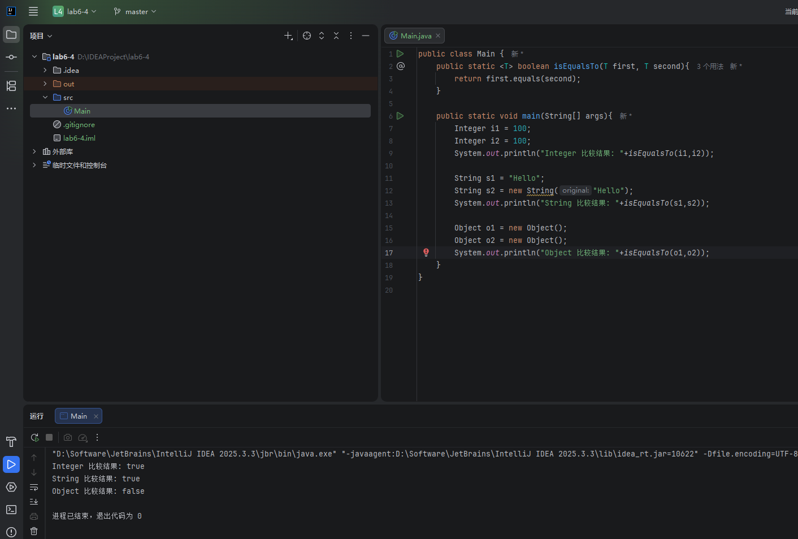

本部分实现了一个简单的泛型方法 `isEqualTo`，它接收两个泛型参数并调用它们内置的 `equals` 方法进行比较。测试结果验证了多态和重写机制：对于重写了 `equals` 方法的 `Integer` 和 `String` 类，比较的是对象内部的值（结果为 true）；而对于未重写该方法的原生 `Object` 类，比较的则是内存地址（结果为 false）。

### 5.混用组合和继承

#### 实现`CompensationModel`接口

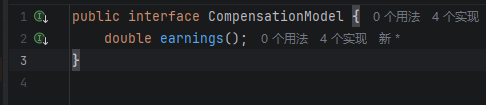

为了将原本僵硬的继承树重新建模为灵活的组合模式，我们首先抽象出了一个 `CompensationModel`（计薪模型）接口。该接口仅提供了一个公共的抽象方法 `earnings()`，用于计算并返回双精度类型的薪资数值。

#### a) `SalariedCompensationModel`类

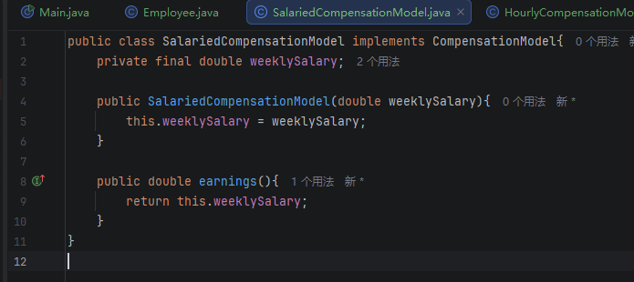

`SalariedCompensationModel` 类实现了该接口，代表按固定周薪计酬的模型。它内部封装了一个 `weeklySalary` 实例变量，并在实现的 `earnings()` 方法中直接返回该周薪数值

#### b) `HourlyCompensationModel`类

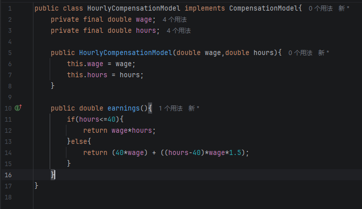

`HourlyCompensationModel` 类负责处理按时薪计酬的员工，内部声明了 `wage`（时薪）和 `hours`（工时）两个实例变量。在其实现的 `earnings()` 方法中使用了条件分支逻辑：对不超过 40 小时的部分正常计费，超过部分则按 1.5 倍时薪计算加班费。

#### c) `CommissionCompensationModel`类

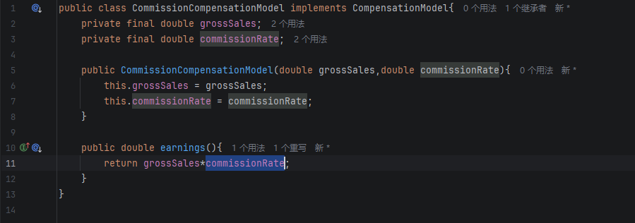

`CommissionCompensationModel` 类实现了按纯佣金计酬的模型，它包含了 `grossSales`（销售额）和 `commissionRate`（提成率）两个实例变量。其 `earnings()` 方法的实现非常直接，即返回这两个变量的乘积。

#### d) `BasePlusCommissionCompensationMode`类

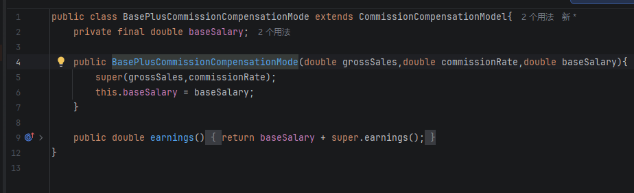

`BasePlusCommissionCompensationMode` 类采用了继承的方式，直接继承自 `CommissionCompensationModel` 类，复用了销售额和提成率的计算逻辑，并在此基础上新增了 `baseSalary`（底薪）变量。在重写的方法中，通过 `super.earnings()` 调用父类逻辑并加上底薪，巧妙得出了最终收入。

#### 测试

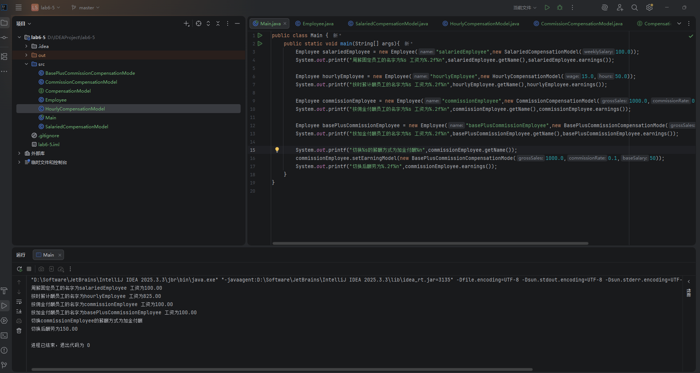

在最终的测试程序中，我们为同一个 `Employee` 对象动态配置了不同的 `CompensationModel` 计薪工具。输出结果表明，通过组合模式，我们无需更改员工对象的本身，只需在运行时动态切换其内部持有的计薪模型，就能顺利计算出符合新规则的收入，极大地提升了代码的弹性和可维护性。

## 三、实验总结与心得记录

通过本次Java实验，我不仅巩固了基础语法，更在代码的健壮性设计与面向对象架构思维上有了显著的提升。具体心得总结如下：

**1. 深入理解了异常处理机制与防御性编程**

在此次实验中，我掌握了如何通过 `try-catch` 捕获异常，以及利用 `throw` 和 `throws` 传递异常。更重要的是，我学会了根据业务需求编写**自定义异常**（如 `IllegalNameException`）。在处理用户输入时，我将 `while(true)` 循环与 `try-catch` 结合，实现了“输入错误即提示并要求重新输入”的健壮交互逻辑。

在调试过程中，我发现了 IDE 控制台中 `System.out`（带缓冲）与 `System.err`（无缓冲，红色高亮）异步输出导致信息错位的问题，最终通过显式调用 `flush()` 并配合微小的 `Thread.sleep()` 成功解决。这让我意识到，实际开发中不仅要关注逻辑，还要关注底层 I/O 流的运行机制。

**2. 掌握了泛型方法的编写与对象比较的本质**

在编写泛型方法 `isEqualTo` 的过程中，我深刻体会到了泛型带来的代码复用优势。通过向同一个方法传入 `Integer`、`String` 以及原生 `Object` 进行测试，我彻底理清了“比较对象引用地址（原生 `equals`）”与“比较对象实际内容（重写后的 `equals`）”之间的本质区别。

**3. 领悟了“多用组合，少用继承”的设计原则（策略模式的启蒙）**

这是本次实验最让我感到豁然开朗的部分。在重构计薪系统的练习中，我将原本僵硬的“父子类继承关系”拆解，把“员工（Employee）”作为主体，把“计薪算法（CompensationModel）”抽象为接口插件。

通过**组合**的方式，员工对象只需持有一个接口引用，便能在程序运行期间通过 `setCompensationModel` 方法动态地切换工资计算策略，而无需销毁并重新创建员工对象。同时，在 `BasePlusCommissionCompensationModel` 的实现中，我又巧妙利用了**继承**和 `super` 关键字复用了父类的计算逻辑。这种将“组合与继承”混搭的设计，让我初步触碰到了**设计模式（策略模式）**的门槛，极大提升了代码的灵活性和可扩展性。

**总而言之**，本次实验让我跳出了单纯“把功能写出来”的初级阶段，开始站在软件工程的角度去思考：如何让程序在遇到错误时更平稳地运行，以及如何通过优秀的设计让系统更加灵活、易于维护。