## 一、实验目的及要求

- 熟悉泛型方法和泛型类

- 熟悉集合类
- 按照题目要求写代码，并在下次上课前将相关文件上传

## 二、实验题目及实现过程

### 1.泛型方法 isEqualTo

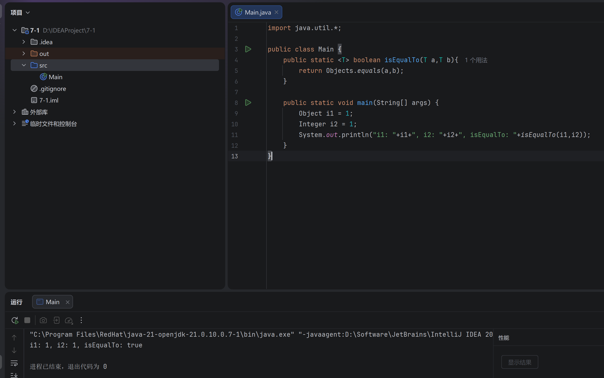

本部分成功实现了一个名为 `isEqualTo` 的泛型方法 。该方法接收两个泛型参数 `T a` 和 `T b`，并调用 `Objects.equals(a, b)` 进行安全的相等性比较 。在测试用例中，向该方法传入了值为 1 的 `Object` 类型和 `Integer` 类型变量，运行结果返回 `true`，验证了泛型方法能够正确比较装箱后的内置数据类型的内容 。

### 2.泛型类 Pair

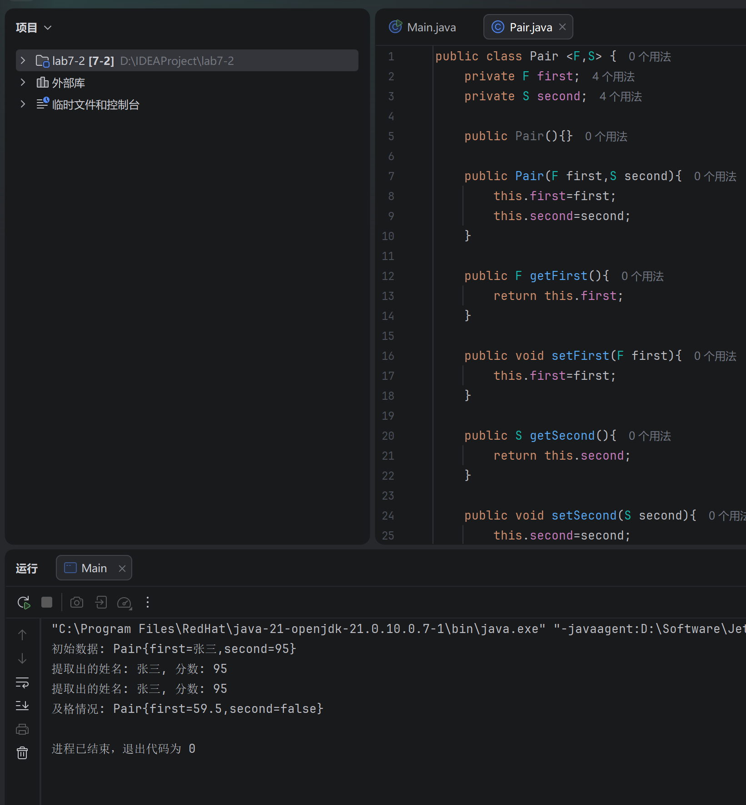

本部分定义了一个包含两个类型参数 `F` 和 `S` 的泛型类 `Pair`，用于封装一对相关联的值 。类内部为这两个参数分别提供了无参构造、全参构造以及对应的 getter 和 setter 方法 。控制台测试结果表明，我们可以成功实例化不同类型组合的 `Pair` 对象（例如 `<String, Integer>` 与 `<Double, Boolean>`），并通过提供的方法正确读取和修改其内部数据，体现了泛型类在类型安全和代码复用方面的优势 。

### 3.CarbonFootprint Interface: Polymorphism

#### 定义CarbonFootprint接口

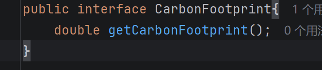

在此步骤中，定义了一个名为 `CarbonFootprint` 的公共接口 。该接口内部声明了一个返回类型为 `double` 的 `getCarbonFootprint()` 抽象方法，旨在为后续不同种类的排放实体确立统一的碳足迹计算行为规范 。

#### 定义Car

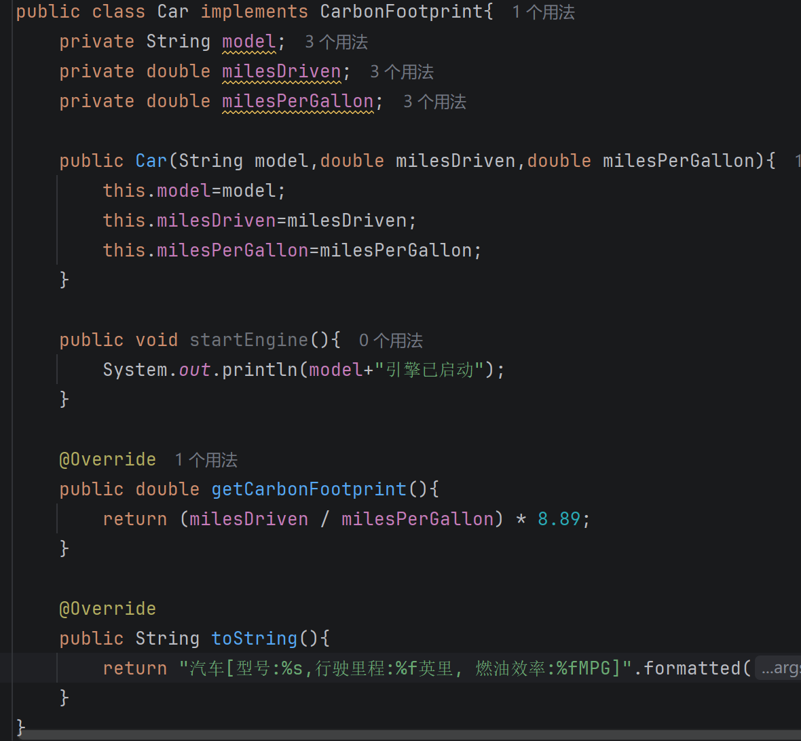

本段代码实现了 `Car` 类并使其接入 `CarbonFootprint` 接口 。`Car` 类重写了 `getCarbonFootprint()` 方法，其内部逻辑依据行驶里程（`milesDriven`）和燃油效率（`milesPerGallon`）等属性，通过特定公式计算出汽车对应的碳足迹数值 。

#### 定义Building

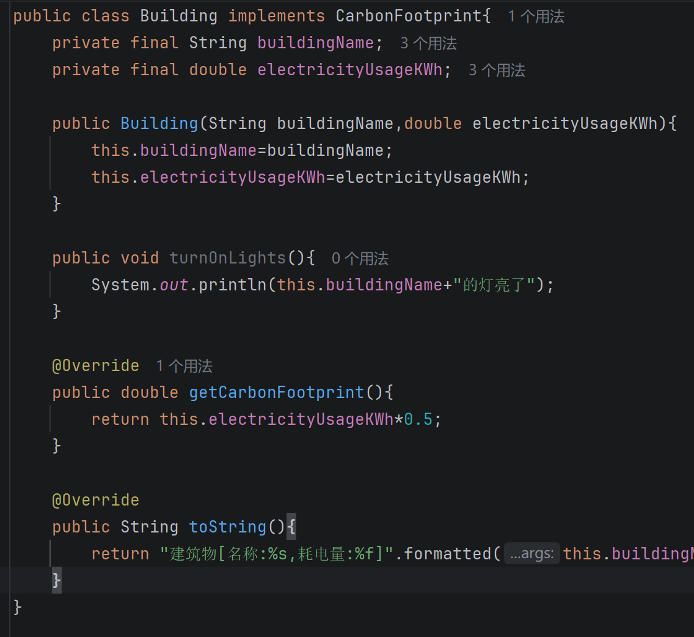

本段代码实现了 `Building` 类，同样接入了 `CarbonFootprint` 接口 。该类利用其独有的耗电量属性（`electricityUsageKWh`），重写了 `getCarbonFootprint()` 方法，通过乘以相应的碳排放系数（0.5）来估算建筑物的碳足迹 。

#### 定义Bicycle

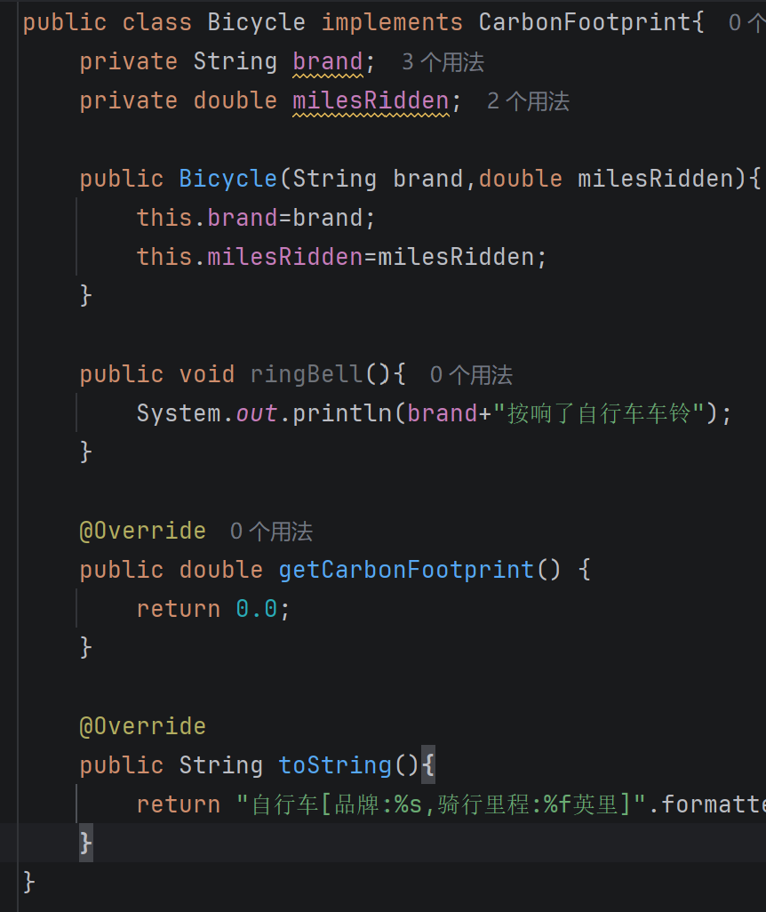

本段代码构建了 `Bicycle` 类并实现了 `CarbonFootprint` 接口 。由于自行车作为完全依靠人力驱动的交通工具，不产生温室气体排放，因此重写后的 `getCarbonFootprint()` 方法直接返回浮点数 0.0 。

#### 测试

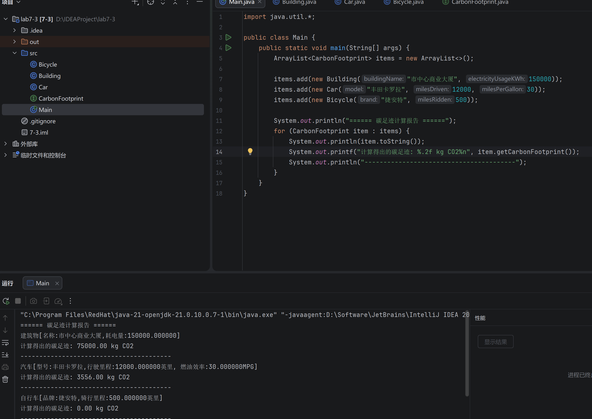

本部分是对接口与多态特性的综合测试 。程序创建了一个泛型类型为 `CarbonFootprint` 的 `ArrayList` 集合，并将 `Building`、`Car`、`Bicycle` 三个互无继承关系的对象实例添加其中 。通过 `for-each` 循环迭代集合，程序多态地调用了每个对象自身的 `getCarbonFootprint()` 方法 。测试结果正确输出了不同对象的类别信息及其各自的碳排放计算结果，验证了接口在统一调度不同类对象行为时的有效性 。

### 4.名字去重

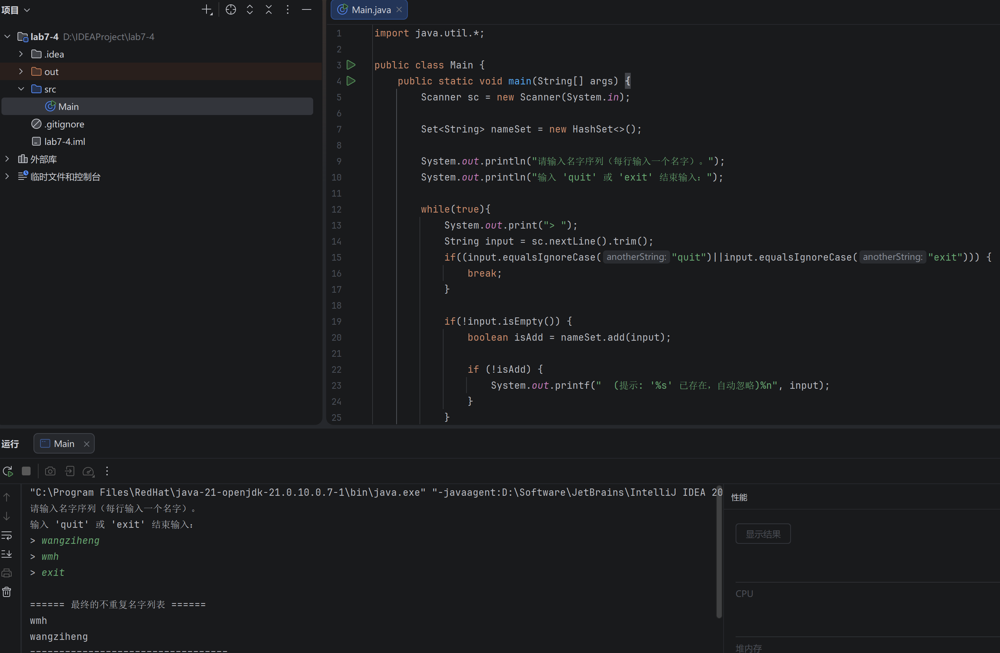

本实验利用了 `Set` 集合框架不允许元素重复的特性来实现名字过滤功能 。程序初始化了一个 `HashSet<String>`，并在 `while` 循环中不断读取用户输入的字符串 。用户输入的有效名字通过 `add` 方法存入集合中，重复的名字会被自动忽略，直到输入 "quit" 或 "exit" 终止循环 。

### 5.单词去重

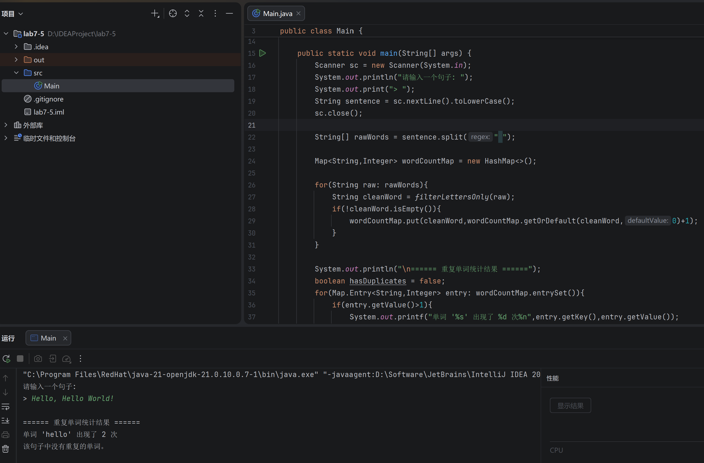

为了实现单词级别的重复统计，程序首先将输入的句子统一转换为小写，并通过 `split` 方法进行切分 。随后，程序利用 `HashMap<String, Integer>` 作为数据结构，过滤掉非字母字符后，记录每个单词出现的频次 。最后通过遍历 Map 的 entry 集合，准确筛选并输出了频次大于 1 的重复单词 。

### 6.计算字母出现次数

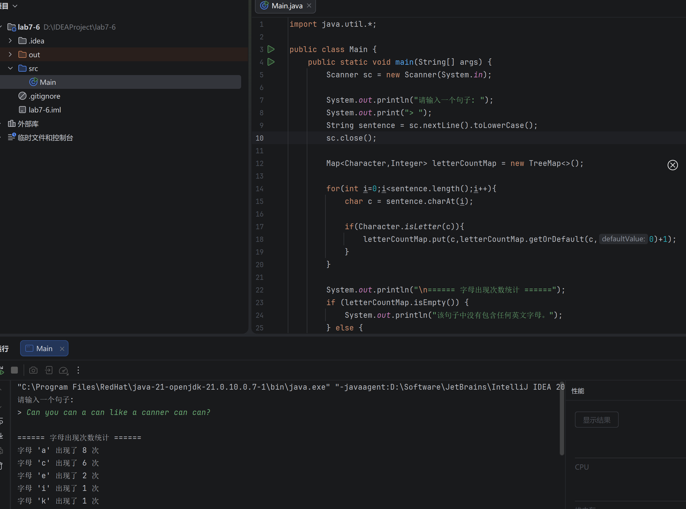

本程序旨在计算句子中每个英文字母的出现次数 。程序遍历小写化后的输入字符串，使用 `Character.isLetter()` 方法剔除非字母字符 。统计过程采用 `TreeMap<Character, Integer>` 进行存储 。借助 `TreeMap` 底层的排序机制，最终的控制台输出结果按照英文字母表的顺序实现了整齐的升序排列 。

### 7.判断质数

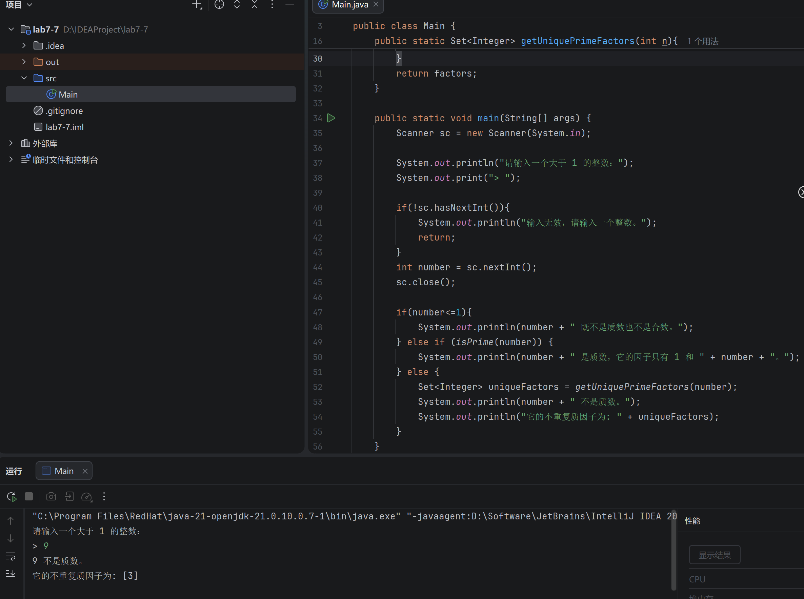

本段代码结合了数学逻辑与集合特性来提取合数的不重复质因子 。程序首先判断用户输入的整数是否为质数 。当确认为合数时，调用分解算法求解质因子，并将结果收集入 `Set<Integer>` 集合中 。得益于 `Set` 的自动去重功能，对于拥有重复因子（如 54 的因子包含多个 3）的数值，最终只保留了唯一的质因子集合（如输出 `[2, 3]`），圆满达成了实验要求 。

## 三、实验总结与心得记录

本次实验综合性较强，涵盖了 Java 编程中的三大核心高级特性：泛型、接口与多态以及集合框架。通过理论结合实际代码的编写，我对面向对象编程的底层逻辑及 Java 标准库的运用有了更深刻的体会。具体总结与心得如下：

**1. 对泛型机制与编译器类型推断的深入理解** 在编写 `isEqualTo` 泛型方法时，我起初疑惑如果比较 `String` 和 `Integer` 两种不同类型的对象，是否需要定义两个泛型参数 `<T, U>`。通过实验与分析，我深刻认识到了 Java 编译器的“自动向上转型”与类型推断机制。当向单一泛型参数 `<T>` 传入两种不同类型时，编译器会自动寻找它们的共同父类（即 `Object`）。因此，仅使用一个 `<T>` 足以应对不同类型的比较，不仅代码更加简洁，也避免了冗余设计。同时，泛型类 `Pair<F, S>` 的练习也让我体会到了泛型在保证编译期类型安全、避免强制类型转换异常方面的巨大优势。

**2. 深刻体会接口与多态的解耦优势** 在“碳足迹（CarbonFootprint）”实验中，`Building`、`Car` 和 `Bicycle` 是三个在现实和代码层面都没有继承关系的类。但通过定义一个共同的接口，我成功地将它们统一了起来。将这些不同类的对象放入同一个 `ArrayList<CarbonFootprint>` 集合中进行迭代，并调用同名的 `getCarbonFootprint()` 方法，完美展现了**多态**的魅力。这让我意识到，接口本质上是一种“行为契约”，它使得程序设计可以脱离严苛的继承树，极大地提高了代码的扩展性。未来若需增加新类（如飞机、工厂），主程序的遍历逻辑无需修改任何代码，符合开闭原则。

**3. 集合框架（Set 与 Map）在数据处理中的高效应用** 实验中的后半部分重点练习了数据去重与统计，让我掌握了根据不同业务场景选择合适集合类型的技巧：

- **利用 Set 自动去重：** 在“名字去重”和“提取不重复质因子”的实验中，我利用 `Set` 集合（尤其是 `HashSet` 和 `TreeSet`）天生不包含重复元素的特性，取代了传统的 `for` 循环手动比对查找，极大简化了代码逻辑。特别是 `TreeSet`，在去重的同时还附带了排序功能，非常适合处理质因子排列的问题。
- **利用 Map 进行频次统计：** 在“单词/字母出现次数统计”实验中，`Map` 字典结构展现了其在键值对映射上的强大能力。通过 `put` 和 `getOrDefault` 方法的结合，只需一次遍历即可完成统计。同时，我也学会了在处理文本清洗时，如何结合正则表达式（如 `split`）或字符遍历（`Character.isLetter`）来提纯数据，并将结果存入 `TreeMap` 中以实现字母表的自动排序输出。

**总体而言**，本次实验不仅提升了我对 Java 语法细节的掌控力，更重要的是锻炼了我“根据具体问题选择最合适的数据结构和设计模式”的工程化思维，为后续开发复杂系统打下了坚实基础。
