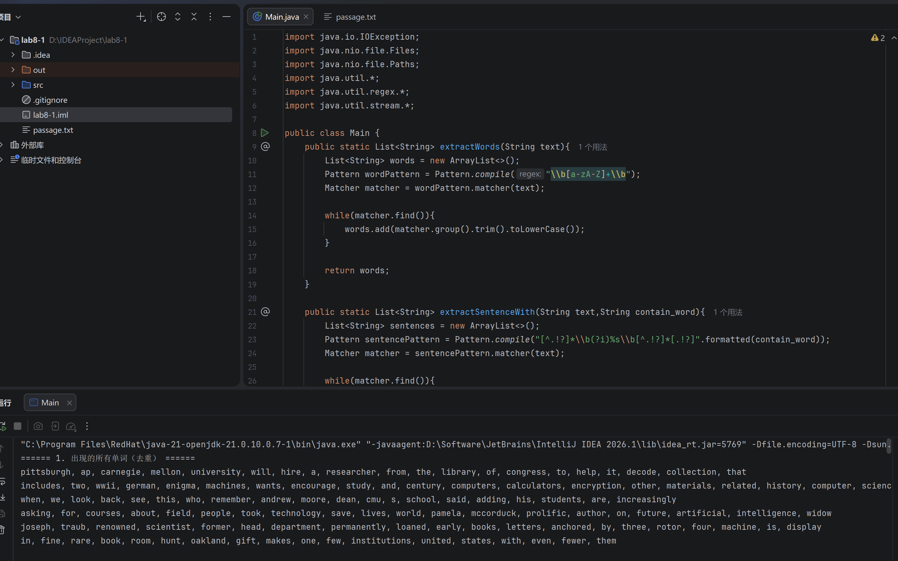
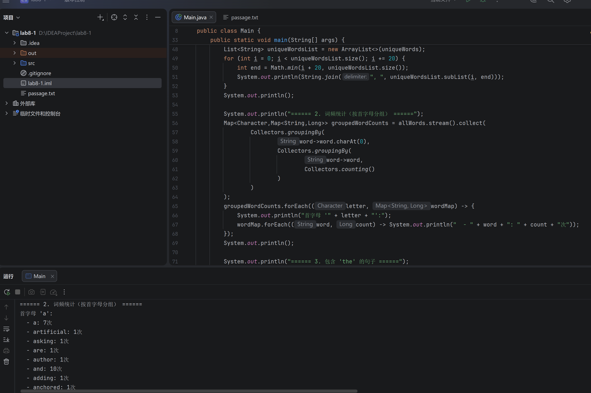
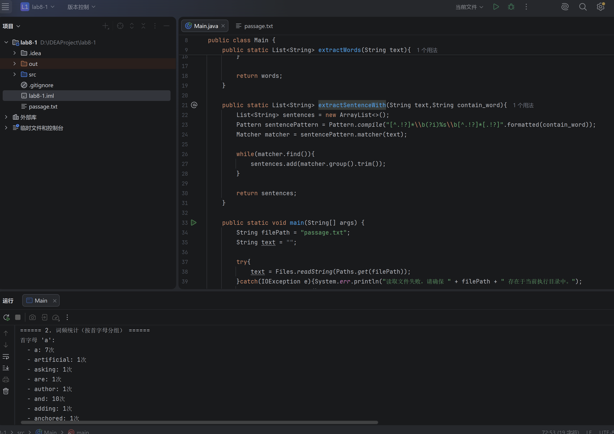
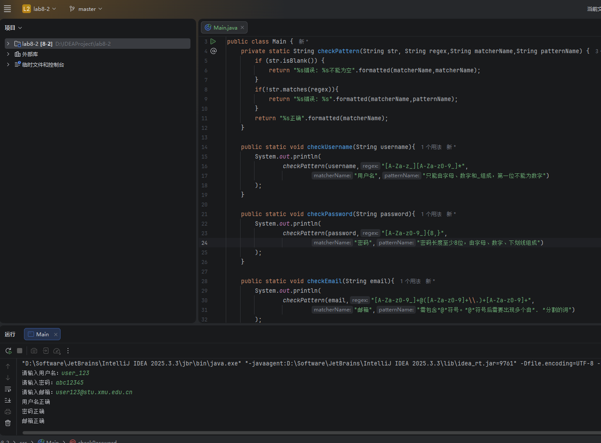
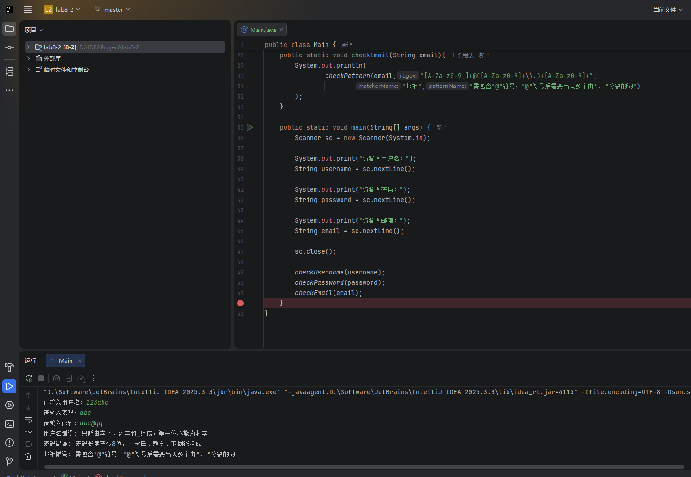

## 一、实验目的及要求

- 熟悉字符串及正则表达式

- 熟悉Lambda表达式及Stream系列类的使用

- 按照题目要求写代码和实验报告.

## 二、实验题目及实现过程

### 题目1

#### 1.输出以下新闻片段中出现的单词（每个单词只输出一次）。

在本题中，首先对给定新闻文本进行读取，并利用正则表达式对文本中的单词进行提取。通过使用带有单词边界的表达式 `\b[a-zA-Z]+\b`，可以有效识别完整单词，避免将单个字符或标点误识别为单词。在提取过程中，将结果存入集合（Set）中以实现自动去重，从而保证每个单词只输出一次。最后，为提高输出结果的可读性，将去重后的单词集合进行分组格式化输出，实现按固定数量换行显示。

#### 2.基于Stream类输出以下新闻片段中出现的单词以及每个单词出现的 次数，并按照首字母进行分组。

在统计单词出现次数并按首字母分组的过程中，采用了 Java 8 提供的 Stream 流式处理技术。首先将提取到的单词集合转换为流对象，随后通过 `Collectors.groupingBy()` 方法实现分组操作。外层根据单词首字母进行分组，内层利用 `Collectors.counting()` 统计每个单词的出现次数，从而构建出嵌套的 Map 结构。通过该方法可以在较为简洁的代码中完成复杂的数据统计与组织，同时提升程序的可读性与扩展性。

#### 3.输出以下新闻片段中包含*the*的句子。

在提取包含指定关键词（如 “the”）的完整句子时，采用了基于正则表达式的句子匹配方法。通过构造形如 `[^.!?]*\b(?i)the\b[^.!?]*[.!?]` 的表达式，实现对包含目标单词的完整句子的提取。其中，`\b` 用于限定单词边界，`(?i)` 表示忽略大小写匹配，从而能够同时匹配 “the”、“The” 等不同形式。该方法能够准确识别句子边界并提取目标句子，提高文本处理的精确性。

### 题目2

#### 1.都正确的结果

在用户信息校验部分，通过正则表达式对用户名、密码和邮箱格式进行合法性判断。程序首先对输入内容进行非空校验，然后利用 `String.matches()` 方法判断是否符合预设规则。用户名要求以字母或下划线开头且仅包含字母、数字和下划线；密码要求长度不少于8位且字符类型合法；邮箱则需满足基本的“用户名@域名”结构，并保证域名部分包含由“.”分隔的多个字段。在测试中输入符合规范的数据时，程序能够正确输出“验证通过”的提示信息，说明正则表达式及逻辑判断均有效。

#### 2.都失败的结果

在异常输入测试中，通过构造不符合规范的用户名、密码及邮箱数据，对程序的错误处理能力进行验证。例如用户名以数字开头、密码长度不足或包含非法字符、邮箱缺少有效域名结构等情况，均能够被程序正确识别并输出相应的错误提示信息。该测试表明，所设计的正则表达式能够有效约束输入格式，程序具备基本的输入校验与错误反馈能力，提高了系统的健壮性与可靠性。

## 三、实验总结与心得记录

通过本次实验，对字符串处理、正则表达式以及 Java 8 中 Stream 流式编程有了更加深入的理解。在实现过程中，从最初的简单文本读取与单词提取，到后续的词频统计、分组输出以及特定句子的匹配，逐步体会到了正则表达式在文本处理中的重要作用。

在正则表达式的使用方面，重点掌握了单词边界 `\b`、量词 `+` 与 `*`、字符集合 `[]` 以及转义字符（如 `\.`）的实际意义，并理解了括号在表达式中用于“整体分组”的作用。特别是在邮箱匹配规则的编写过程中，通过不断调试，明确了字符集合与分组结构的区别，避免了将“结构规则”错误写入字符集合中的问题，从而提高了正则表达式的准确性。

在 Stream 流的使用过程中，掌握了 `groupingBy` 与 `counting` 等方法的组合使用方式，理解了嵌套分组的实现原理。通过将单词按首字母分组并统计出现次数，体会到了函数式编程在处理集合数据时的简洁性与表达能力。同时，通过引入有序映射（如 TreeMap），进一步优化了结果输出的可读性。

在代码结构设计方面，通过封装通用的校验方法（如 `checkPattern`），减少了重复代码，提高了程序的复用性和可维护性。同时，相较于直接在每个方法中编写判断逻辑，这种方式使代码结构更加清晰，也更符合实际开发中的设计思路。

在测试过程中，通过构造“全部正确”和“全部错误”的输入数据，以及部分边界情况（如最短合法输入、特殊位置错误等），验证了程序的正确性与健壮性。这一过程加深了对输入校验逻辑的理解，也认识到测试在程序开发中的重要性。

总体而言，本次实验不仅巩固了基础语法知识，还提升了对正则表达式与 Stream 编程思想的理解。同时，也认识到在实际编程中，代码的简洁性、可读性以及测试完整性同样重要，对后续的学习与开发具有一定的指导意义。
