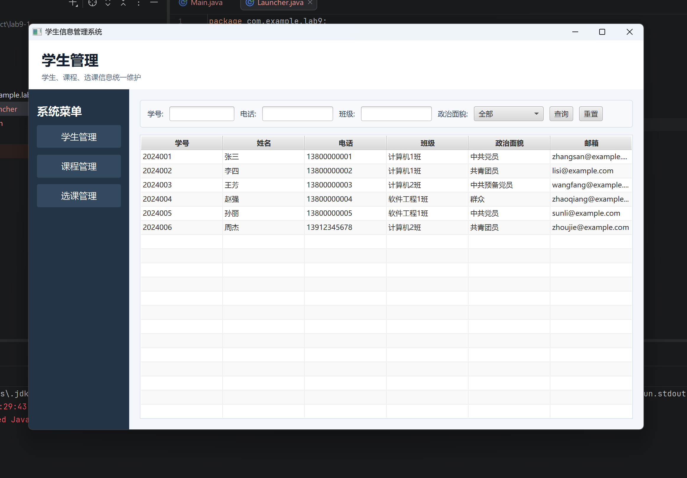
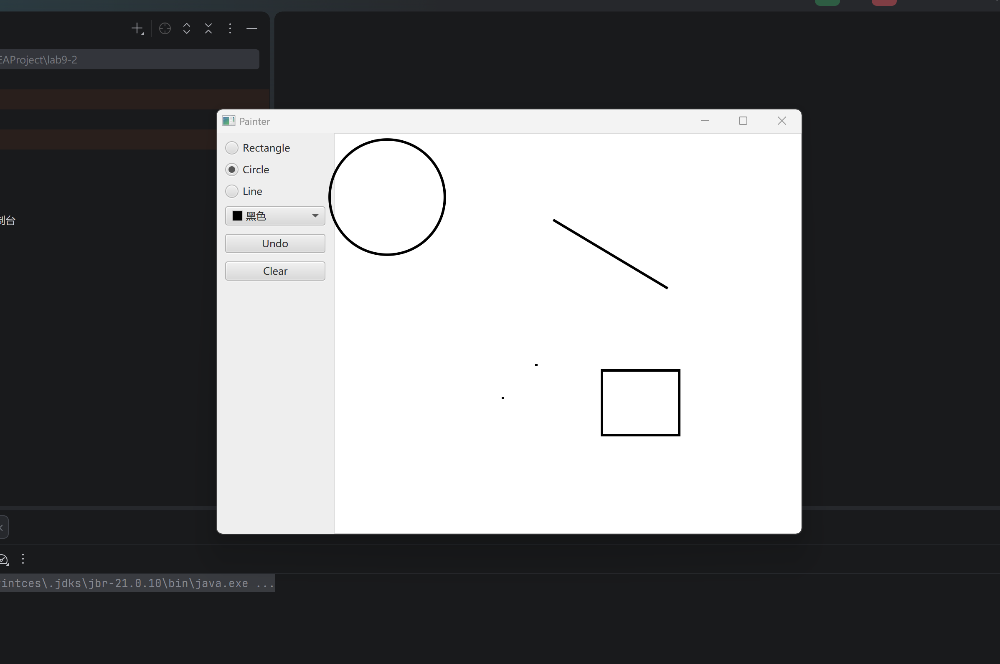
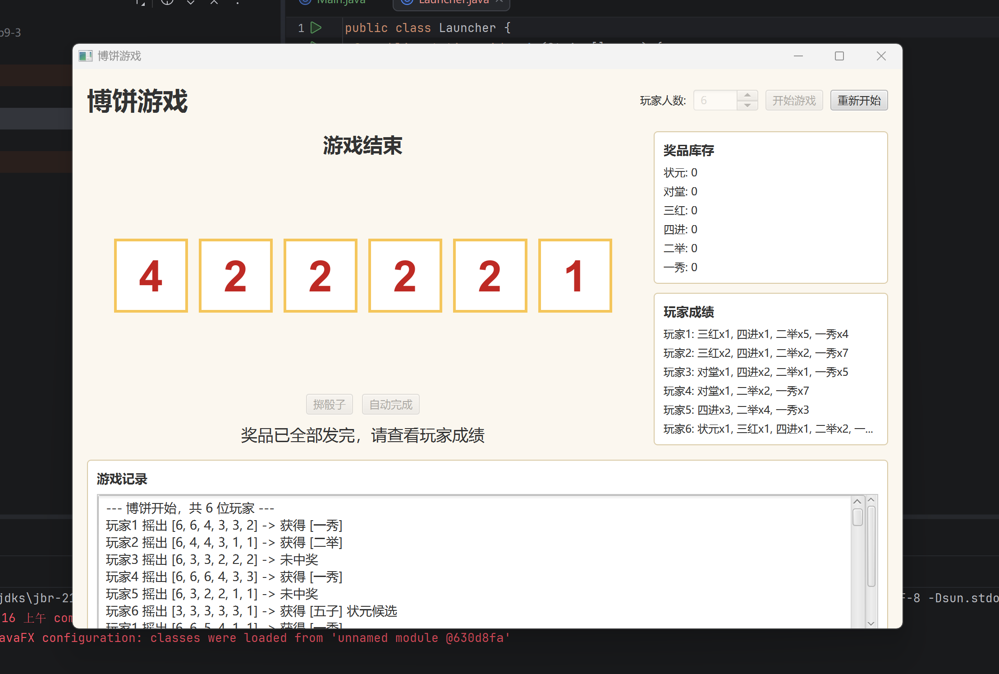
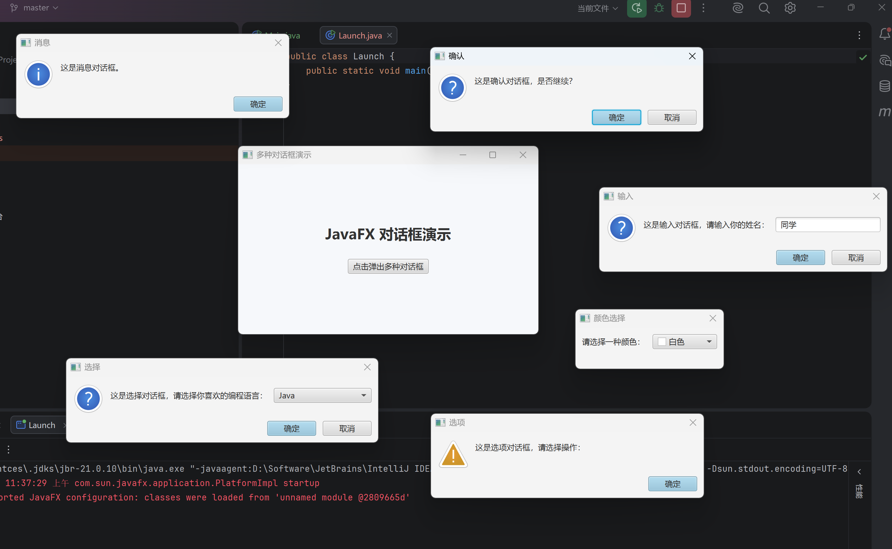
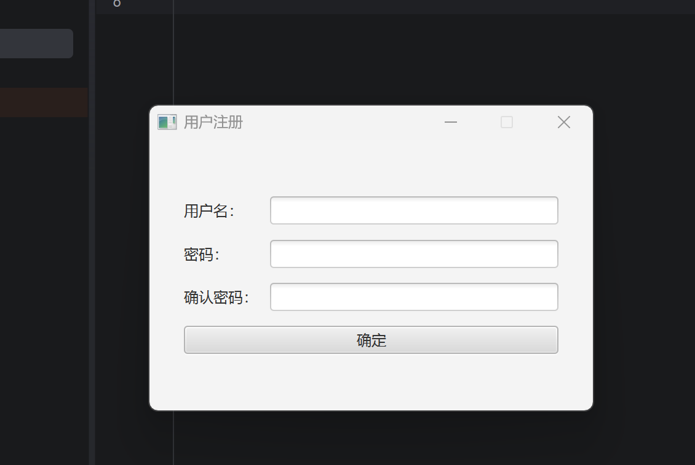

## 一、实验目的及要求

- 熟悉JavaFX 
- 按照题目要求写代码和实验报告，并上传

## 二、实验题目及实现过程

### 基本题目：设计界面

本程序使用 JavaFX 实现了一个学生信息管理系统。整体布局采用 `BorderPane`，左侧为导航菜单栏，包含"学生管理""课程管理""选课管理"三个功能按钮，点击后切换右侧主内容区域。学生管理页面顶部提供学号、电话、班级文本输入框与政治面貌下拉框（`ComboBox`），配合"查询"和"重置"按钮，通过 `FilteredList` 实现实时筛选。主体使用 `TableView` 绑定 `ObservableList` 展示学生数据，预置了六条示例记录。课程管理页面额外支持新增和删除课程；选课管理页面支持通过下拉选择学生和课程进行新增选课，并可将已选课程标记为"已退选"状态。所有数据共享同一份 `ObservableList`，各模块之间状态实时联动。

### 基本题目：绘图界面

本程序使用 JavaFX 实现了一个简单绘图工具 Painter。界面采用 `BorderPane` 布局，左侧工具栏（`VBox`）包含 Rectangle、Circle、Line 三种图形的单选按钮（`RadioButton` + `ToggleGroup`）、颜色选择器（`ColorPicker`，默认黑色）、Undo 撤销按钮和 Clear 清空按钮；右侧为白色背景的 `AnchorPane` 画布。用户按下鼠标时记录起点坐标并预创建图形节点加入画布，拖动鼠标时实时更新图形大小，释放鼠标时完成绘制。矩形通过左上角坐标和宽高更新，圆形通过起点到当前点的距离作为半径，直线则更新终点坐标。Undo 每次移除画布中最后一个子节点，Clear 一键清空所有图形。图形线条颜色由 `ColorPicker` 实时控制，填充色始终为透明。

### 扩展题目：博饼程序图形界面

本程序使用 JavaFX 为博饼游戏实现了完整的图形界面。顶部设有玩家人数微调框（`Spinner`，范围 6~10）、"开始游戏"和"重新开始"按钮；中部用六个大号 `Label` 展示每轮骰子点数（按降序排列，红色字体金色边框），下方提供"掷骰子"和"自动完成"操作按钮及当前结果提示；右侧面板分别显示奖品库存（状元×1、对堂×2、三红×4、四进×8、二举×16、一秀×32）和各玩家当前成绩；底部可滚动的 `TextArea` 实时记录每轮投掷明细。判奖逻辑基于六个骰子的点数统计：一个红四得一秀，两个红四得二举，三个红四得三红，五子或五红得状元候选等；所有非状元奖品发完后，比较各玩家持有的最高状元类型（优先级从低到高：四红、五子、五红、六勃黑、遍地锦、六勃红、状元插金花）来决定最终状元归属，游戏随即结束并展示成绩。

### 扩展题目：按钮弹出多种对话框

本程序使用 JavaFX 实现了多种对话框的集中演示。主界面为一个居中布局的按钮，点击后同时弹出六个无模态（`Modality.NONE`）对话框，分别定位在屏幕不同位置：信息对话框（`Alert.AlertType.INFORMATION`，提示"这是消息对话框"）、确认对话框（`Alert.AlertType.CONFIRMATION`，询问是否继续）、文本输入对话框（`TextInputDialog`，默认值"同学"，请求输入姓名）、选择对话框（`ChoiceDialog`，从 Java/Python/C++/其他中选择编程语言）、选项警告对话框（`Alert.AlertType.WARNING`，提示请选择操作）以及自定义颜色选择对话框（`Dialog<Color>`，内嵌 `ColorPicker` 控件，默认白色）。每个对话框通过 `initOwner` 绑定主窗口，并在 `setOnShown` 回调中按偏移量精确设置弹出位置。

### 扩展题目：注册界面

本程序使用 JavaFX 实现了一个用户注册界面。窗口标题为"用户注册"，固定尺寸（360×220），不可缩放。布局采用居中的 `GridPane`，按行排列"用户名""密码""确认密码"三组标签与输入框（密码栏使用 `PasswordField` 以掩码显示），下方"确定"按钮横跨两列。点击按钮后触发校验逻辑：若用户名长度不足 4 位，弹出错误对话框并将焦点归还用户名输入框；若两次输入的密码不一致，弹出错误对话框并聚焦确认密码框；全部校验通过则弹出信息对话框提示"注册信息输入正确！"。对话框均通过 `Alert.showAndWait()` 以模态方式展示。

## 三、实验总结与心得记录

本次实验围绕 JavaFX 框架展开，通过五个由浅入深的题目，系统地学习和实践了 JavaFX 的界面设计与事件处理能力。

在基本题目的学习中，设计界面部分让我对 JavaFX 的布局体系有了更深的理解。`BorderPane`、`VBox`、`HBox` 等容器的组合使用可以构建出层次清晰的复杂界面。`TableView` 配合 `ObservableList` 与 `FilteredList` 的数据绑定机制令我印象深刻——数据变化时界面能够自动同步刷新，无需手动更新视图，这体现了 JavaFX 响应式编程的核心思想。绘图界面部分则让我熟悉了鼠标事件的处理流程，通过 `setOnMousePressed`、`setOnMouseDragged`、`setOnMouseReleased` 三个事件的协作，实现了图形的实时预览与最终落笔，加深了我对事件驱动编程模式的理解。

在扩展题目的完成过程中，博饼程序是本次实验中逻辑最为复杂的部分。除了界面搭建之外，还需要实现完整的判奖规则、奖品库存管理和状元竞争逻辑。将复杂的业务逻辑与 UI 组件解耦，通过统一的刷新方法同步界面状态，是这部分给我带来的最大收获。对话框演示题目让我系统了解了 `Alert`、`TextInputDialog`、`ChoiceDialog` 等标准对话框组件的使用方式，以及如何通过 `initOwner` 和 `initModality` 控制对话框的归属与模态行为。注册界面虽然结构简单，但其中输入验证的逻辑设计和焦点管理让我认识到，良好的用户体验需要在细节上下功夫。

总体而言，本次实验使我从实践层面掌握了 JavaFX 的核心开发技能，包括布局管理、控件使用、事件处理、数据绑定和对话框交互。相比于以往命令行程序的开发，图形界面编程需要同时兼顾视觉呈现与逻辑正确性，对程序结构的组织能力要求更高。通过本次实验，我对如何设计一个结构清晰、交互友好的 JavaFX 应用有了更加具体的认识。
