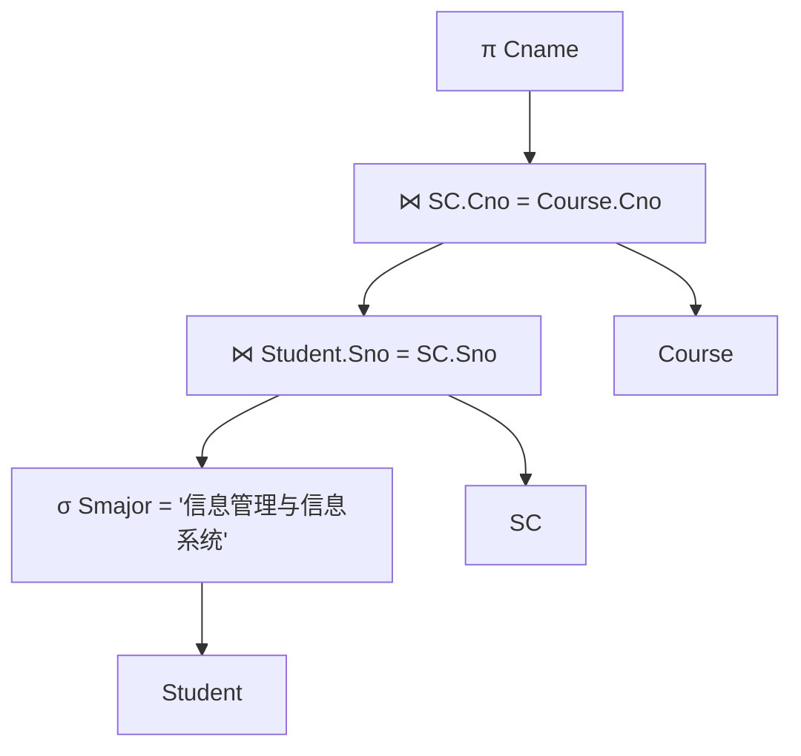
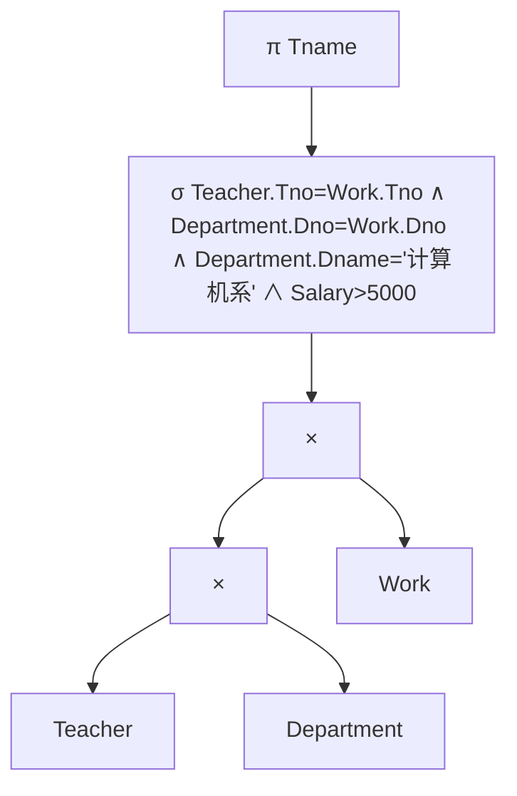
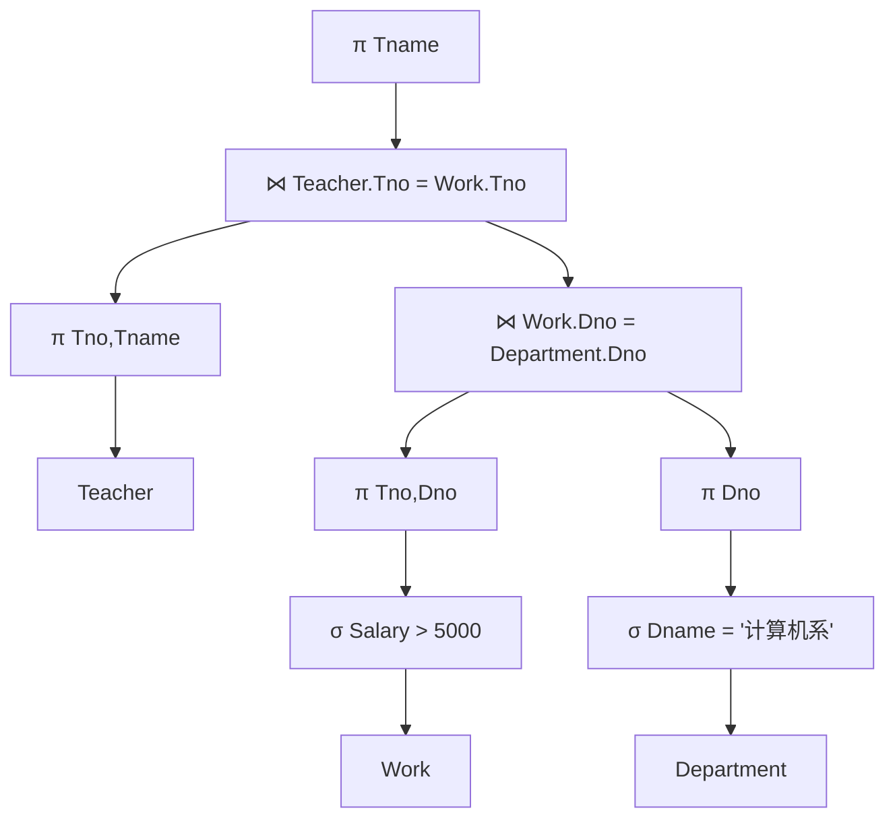

# 第十章作业

## 题目

### 1．试述查询优化在关系数据库系统中的重要性和可能性。

查询优化是关系数据库管理系统中的核心技术之一。关系数据库采用非过程化的 SQL 语言，用户只需要说明“要查询什么”，而不需要说明“怎样查询”。因此，系统必须根据查询语句自动选择合适的执行策略。查询优化的好坏会直接影响磁盘 I/O 次数、CPU 时间、内存占用以及整个查询的响应速度，尤其在数据量较大、涉及多表连接和复杂条件筛选时，优化前后的执行代价可能相差很大。

查询优化的重要性主要体现在以下几个方面。第一，它减轻了用户选择存取路径和连接方法的负担，使用户可以专注于查询需求本身。第二，优化器可以根据统计信息和代价模型，在多个等价执行计划中选择代价较低的方案。第三，系统级优化通常比用户手工优化更可靠，因为数据库系统掌握了更多底层信息，例如表的元组数、数据分布、索引情况、数据块数量等。

查询优化具有可能性，是因为同一个 SQL 查询通常可以转换成多种等价的关系代数表达式，也可以采用不同的物理执行方法。例如，选择运算可以提前执行，投影运算可以减少中间结果宽度，多表连接可以调整连接顺序，连接算法也可以选择嵌套循环连接、排序合并连接或索引连接等。数据库优化器可以利用数据字典中的统计信息，估算不同执行计划的代价，并从中选择较优方案。

此外，当数据库中数据规模、索引情况或物理存储状态发生变化时，系统还可以重新进行查询优化，而不需要用户重写程序。这也是关系数据库系统相对于非关系式、过程化数据处理方式的重要优点。

---

### 2．假设关系 R(A,B) 和 S(B,C,D) 的情况如下：R 有 20000 个元组，S 有 1200 个元组，一个块能装 40 个 R 的元组，能装 30 个 S 的元组，估算下列操作需要多少次磁盘块读。

首先计算两个关系所占的数据块数：

- R 的块数为：20000 ÷ 40 = 500 块。
- S 的块数为：1200 ÷ 30 = 40 块。

#### （1）R 上没有索引，执行 `select * from R;`

该查询需要读取关系 R 的全部数据块。由于没有选择条件，也没有索引可以利用，因此只能进行全表扫描。

因此磁盘块读次数为：

```text
B(R) = 500 次
```

#### （2）R 中 A 为主码，A 有 3 层 B+ 树索引，执行 `select * from R where A=10;`

由于 A 是主码，因此满足 `A=10` 的元组最多只有一个。查询时先从 B+ 树根节点开始查找索引，索引共有 3 层，因此需要读 3 个索引块。找到叶子结点中的数据指针后，还需要再读 1 个数据块。

因此磁盘块读次数为：

```text
3 + 1 = 4 次
```

#### （3）嵌套循环连接 R ⋈ S

嵌套循环连接的基本思想是：外层关系每读一个块或元组，就需要扫描内层关系进行匹配。为了减少磁盘块读次数，应尽量选择块数较少的关系作为外层关系。

若选择 S 作为外层关系，R 作为内层关系，则代价为：

```text
B(S) + B(S) × B(R)
= 40 + 40 × 500
= 20040 次
```

若选择 R 作为外层关系，S 作为内层关系，则代价为：

```text
B(R) + B(R) × B(S)
= 500 + 500 × 40
= 20500 次
```

因此，较优的嵌套循环连接方式是以 S 为外层关系，估算磁盘块读次数为：

```text
20040 次
```

#### （4）排序合并连接 R ⋈ S，区分 R 与 S 在 B 属性上有序和无序两种情况

如果 R 和 S 已经按照连接属性 B 排序，则排序合并连接只需要顺序扫描两个关系即可，代价为：

```text
B(R) + B(S)
= 500 + 40
= 540 次
```

如果 R 和 S 在 B 属性上均未排序，则需要先分别对 R 和 S 排序，然后再进行合并连接。按照常见外排序估算方式，排序代价可近似写为：

```text
2 × 500 × (⌈log2 500⌉ + 1) + 2 × 40 × (⌈log2 40⌉ + 1)
= 2 × 500 × (9 + 1) + 2 × 40 × (6 + 1)
= 10000 + 560
= 10560 次
```

再加上合并连接顺序扫描的代价：

```text
10560 + 540 = 11100 次
```

因此：

```text
有序时：540 次
无序时：约 11100 次
```

---

### 3．对“学生选课管理”数据库，查询信息管理与信息系统专业学生选修的所有课程名称。

原 SQL 查询语句为：

```sql
SELECT Cname
FROM Student, Course, SC
WHERE Student.Sno = SC.Sno
  AND SC.Cno = Course.Cno
  AND Student.Smajor = '信息管理与信息系统';
```

该查询涉及 Student、SC 和 Course 三个关系。查询目标是找出“信息管理与信息系统”专业学生所选修课程的课程名称。因此，查询逻辑可以分为三步：

第一步，从 Student 表中筛选出专业为“信息管理与信息系统”的学生；第二步，将这些学生与 SC 选课表按照 Sno 连接，找出其选课记录；第三步，将选课记录与 Course 表按照 Cno 连接，得到课程名称 Cname。

原始关系代数表达式可以写为：

```text
π_Cname (
  σ_Student.Smajor='信息管理与信息系统' ∧ Student.Sno=SC.Sno ∧ SC.Cno=Course.Cno
  (Student × SC × Course)
)
```

该表达式的缺点是先进行三个关系的笛卡尔积，再进行选择，这会产生很大的中间结果，执行效率较低。

根据代数优化原则，应将选择运算和连接条件尽可能提前执行。优化后的关系代数表达式为：

```text
π_Cname (
  (σ_Smajor='信息管理与信息系统'(Student)
   ⋈_Student.Sno=SC.Sno SC)
   ⋈_SC.Cno=Course.Cno Course
)
```

优化后的处理方法是先对 Student 表进行选择，减少参与连接的学生元组数量；然后再与 SC 表连接，得到相关选课记录；最后与 Course 表连接，取出课程名称。这样可以显著减少中间结果规模，提高查询效率。

可用如下语法树表示优化后的查询结构：



---

### 4．对于数据库模式，说明下列查询语句的一种较优的处理方法。

数据库模式为：

```text
Teacher(Tno, Tname, Tsex, Ttitle, Tbirthdate, Dno);
Department(Dno, Dname, Dcontact, Dtel, Director, SHno);
Work(Tno, Dno, Year, Salary);
```

已知 Teacher 的 Tno 属性、Department 的 Dno 属性以及 Work 的 Year 属性上有 B+ 树索引。

#### （1）`SELECT * FROM Teacher WHERE Tsex='女';`

Tsex 属性上没有索引，因此不能直接通过索引定位满足条件的元组。由于查询条件是性别，通常选择率可能较高，例如“女”可能占较大比例，使用索引的意义也不明显。

较优处理方法是对 Teacher 表进行全表扫描，逐个检查元组是否满足 `Tsex='女'`，并输出满足条件的元组。

#### （2）`SELECT * FROM Department WHERE Dno < 301;`

Department 的 Dno 属性上有 B+ 树索引，并且查询条件是范围查询 `Dno < 301`，因此可以利用 B+ 树索引进行范围查找。

较优处理方法是先在 B+ 树中定位到小于 301 的范围边界，然后沿着叶子结点的顺序链表找到所有满足 `Dno < 301` 的索引项，再根据索引项中的指针读取 Department 表中的相应元组。

如果满足条件的元组数量很多，接近全表规模，则也可以直接采用全表扫描，因为大量随机读数据块的代价可能高于顺序扫描。

#### （3）`SELECT * FROM Work WHERE Year <> 2000;`

Work 的 Year 属性上有 B+ 树索引，但是条件 `Year <> 2000` 属于“不等于”查询。该条件通常会选出大部分元组，选择率较高，不适合使用索引进行大量随机访问。

较优处理方法是对 Work 表进行全表扫描，逐个检查元组是否满足 `Year <> 2000`。

#### （4）`SELECT * FROM Work WHERE Year > 2000 AND Salary < 5000;`

Work 的 Year 属性上有 B+ 树索引，而 Salary 属性上没有给出索引。该查询包含两个条件，其中 `Year > 2000` 可以利用 B+ 树索引进行范围查找。

较优处理方法是先通过 Year 上的 B+ 树索引找到满足 `Year > 2000` 的元组，再对这些元组逐一检查 `Salary < 5000` 是否成立，最后输出同时满足两个条件的元组。

如果 `Year > 2000` 的选择率很高，导致大部分元组都需要访问，则全表扫描也可能更合适。

#### （5）`SELECT * FROM Work WHERE Year < 2000 OR Salary < 5000;`

该查询使用 OR 条件，其中 `Year < 2000` 可以利用 Year 上的 B+ 树索引，但 `Salary < 5000` 没有索引。由于 OR 条件只要满足一个条件即可，而 Salary 条件无法通过索引高效定位，因此仍然可能需要检查大量元组。

较优处理方法是对 Work 表进行全表扫描，逐个检查元组是否满足 `Year < 2000 OR Salary < 5000`。这样可以避免使用索引后仍需大量随机访问造成的额外代价。

---

### 5．对于题 4 中的数据库模式，画出语法树以及用关系代数表示的语法树，并对关系代数语法树进行优化，画出优化后的语法树。

查询语句为：

```sql
SELECT Tname
FROM Teacher, Department, Work
WHERE Teacher.Tno = Work.Tno
  AND Department.Dno = Work.Dno
  AND Department.Dname = '计算机系'
  AND Salary > 5000;
```

该查询的目标是查询在“计算机系”工作且工资大于 5000 的教师姓名。查询涉及 Teacher、Department 和 Work 三个关系，需要通过 `Teacher.Tno = Work.Tno` 和 `Department.Dno = Work.Dno` 完成连接，并通过 `Department.Dname='计算机系'` 与 `Salary>5000` 进行选择。

原始关系代数表达式可以写为：

```text
π_Tname (
  σ_Teacher.Tno=Work.Tno ∧ Department.Dno=Work.Dno ∧ Department.Dname='计算机系' ∧ Salary>5000
  (Teacher × Department × Work)
)
```

该表达式先做三个关系的笛卡尔积，再执行选择条件，会产生巨大的中间结果，因此不是较优的执行方式。

原始关系代数语法树可以表示为：



根据查询优化的一般原则，应将选择运算尽可能提前执行，将笛卡尔积和选择条件合并为连接运算，并尽早投影掉无关属性。优化后的关系代数表达式为：

```text
π_Tname (
  Teacher
  ⋈_Teacher.Tno=Work.Tno
  (
    σ_Salary>5000(Work)
    ⋈_Work.Dno=Department.Dno
    σ_Dname='计算机系'(Department)
  )
)
```

也可以进一步加入投影，以减少中间结果宽度：

```text
π_Tname (
  π_Tno,Tname(Teacher)
  ⋈_Teacher.Tno=Work.Tno
  (
    π_Tno,Dno(σ_Salary>5000(Work))
    ⋈_Work.Dno=Department.Dno
    π_Dno(σ_Dname='计算机系'(Department))
  )
)
```

优化后的处理方法是：先在 Department 表中选择 `Dname='计算机系'` 的元组，只保留 Dno；同时在 Work 表中选择 `Salary>5000` 的元组，只保留 Tno 和 Dno；然后将这两个较小的中间结果按照 Dno 连接，得到计算机系中工资大于 5000 的工作记录；最后再与 Teacher 表按照 Tno 连接，得到教师姓名 Tname。

优化后的关系代数语法树如下：



---

### 6．试述关系数据库管理系统查询优化的一般准则。

关系数据库管理系统查询优化的一般准则主要包括以下几点。

第一，选择运算应尽可能先做。选择条件越早执行，参与后续连接和投影的元组数量就越少，中间结果规模也越小，因此可以降低后续运算代价。

第二，投影运算应尽可能提前执行。对于后续查询不需要的属性，应尽早去掉，以减少中间结果的宽度，从而降低内存占用和磁盘 I/O 代价。

第三，应将选择运算与其前后的笛卡尔积结合起来，转换为连接运算。笛卡尔积会产生大量无意义的组合结果，而连接运算可以直接根据连接条件进行匹配，效率更高。

第四，应合理调整连接顺序。多表连接时，不同的连接顺序可能产生不同规模的中间结果。通常应优先连接选择率较低、结果较小的关系，以减少后续连接代价。

第五，应寻找并复用公共子表达式。如果一个复杂查询中存在重复计算的子表达式，可以将其结果保存或共享，避免重复执行相同操作。

第六，应根据数据规模、索引情况和统计信息选择合适的物理执行方法。例如，对于选择运算，可以选择全表扫描或索引扫描；对于连接运算，可以选择嵌套循环连接、索引连接、排序合并连接或哈希连接等。

综上，查询优化的基本思想是尽早减少数据规模，避免无效的笛卡尔积，合理利用索引和统计信息，并选择代价较低的执行计划。

---

### 7．试述关系数据库管理系统查询优化的一般步骤。

关系数据库管理系统查询优化的一般步骤可以概括为以下几个阶段。

第一步，将 SQL 查询语句转换为系统内部表示。数据库系统首先对 SQL 语句进行语法分析和语义检查，然后将其转换为内部查询表示形式，通常可以表示为查询树或关系代数表达式。

第二步，进行逻辑查询优化。系统根据关系代数等价变换规则，对原始查询树进行改写。例如，将选择运算下推、投影运算下推、笛卡尔积与选择条件合并为连接运算，并调整连接顺序，使逻辑表达式更加高效。

第三步，进行物理查询优化。系统根据数据字典中的统计信息、索引情况、数据分布和存储结构，为逻辑运算选择具体的物理执行方法。例如，确定使用全表扫描还是索引扫描，使用嵌套循环连接、排序合并连接还是哈希连接。

第四步，生成多个候选查询计划并估算代价。优化器根据磁盘 I/O、CPU 时间、内存使用等指标估算不同执行计划的总代价。

第五步，选择代价较小的查询计划并执行。数据库系统最终选取一个较优执行计划，交给查询执行引擎完成数据访问、运算和结果返回。

因此，查询优化的一般过程是：SQL 语句分析 → 转换为内部表示 → 逻辑优化 → 物理优化 → 代价估算 → 选择执行计划 → 执行查询。

## 思维导图


