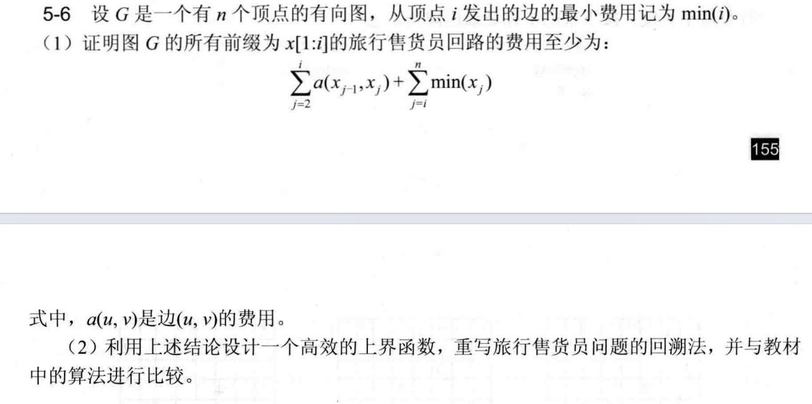
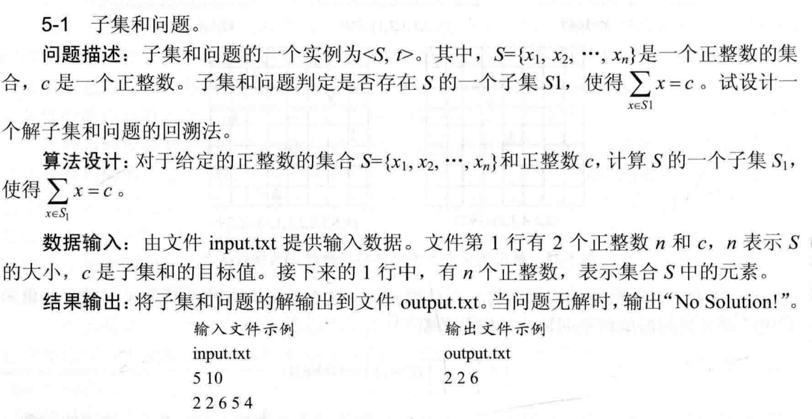
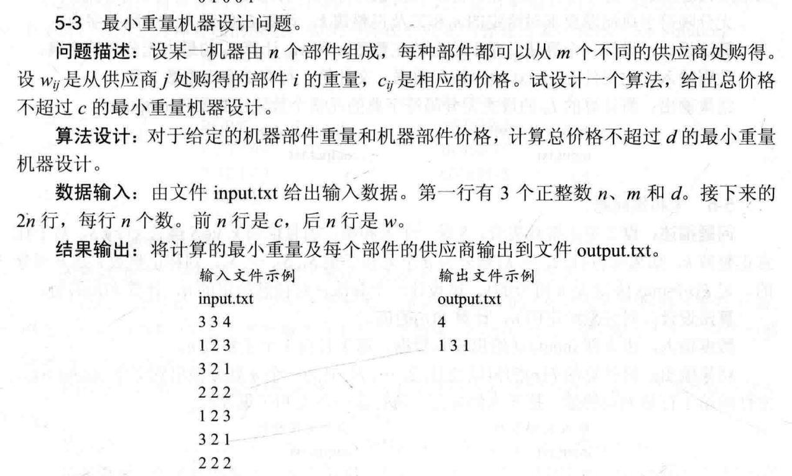
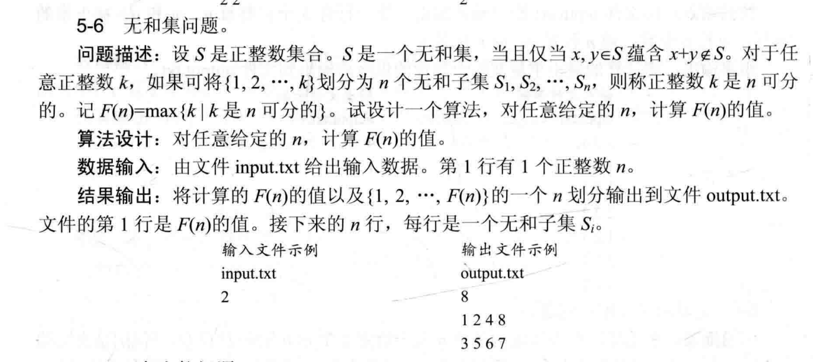
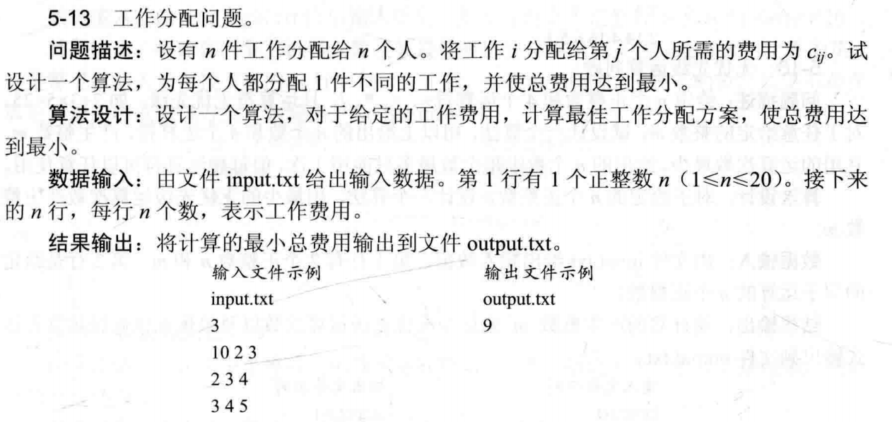
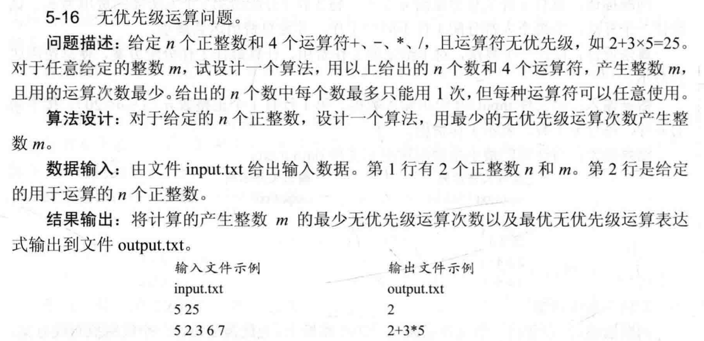
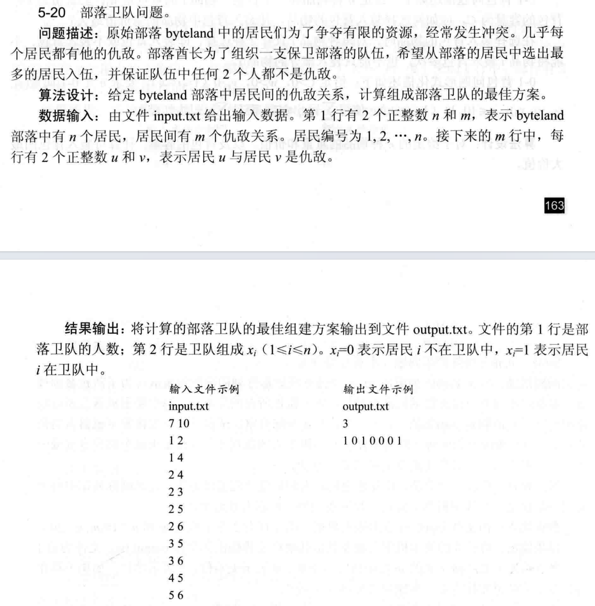

# 算法分析第5次作业

## frog_leap问题

**青蛙换位游戏答案:**

**算法设计思想**：

青蛙换位问题是一个经典的状态空间搜索问题。由于青蛙受到规则限制只能单向移动且不允许后退，整个状态空间呈现为一棵深度有限的无环有向图。由于总状态数极为有限，采用深度优先搜索（DFS）配合回溯法是求解该问题的最佳策略。

**状态表示与转移机制**：

采用长度为 7 的字符串记录当前池塘石块上的状态。初始状态设为 `LLL_RRR`（`_` 代表唯一的空位），目标终点状态设为 `RRR_LLL`。

搜索过程中的状态转移逻辑直接围绕空位 `_` 展开。假设当前空位所在下标为 $x$：

1. **左青蛙向右移动**：若左侧相邻或隔一个位置（即下标 $x-1$ 或 $x-2$）存在左青蛙 `L`，则允许其向右滑行或跳跃进入空位。
2. **右青蛙向左移动**：若右侧相邻或隔一个位置（即下标 $x+1$ 或 $x+2$）存在右青蛙 `R`，则允许其向左滑行或跳跃进入空位。

在 DFS 遍历状态树时，从初始状态出发，递归尝试上述所有合法的转移分支。若某条分支抵达目标状态，则逐层返回成功标志并输出所记录的路径；若当前状态陷入无法继续移动的死锁局面，则触发回溯机制，撤销当前的状态转移，退回上一层并尝试其他未探索的决策分支。

**复杂度分析**：

根据数学推导，对于单边数量为 $N$ 的青蛙换位问题，完成整体交换所需的最少步数固定为 $N^2 + 2N$ 步。本题中 $N=3$，因此到达目标状态有且仅需 15 步。状态空间树的最大深度被严格限制在 15 层以内，且分支因子极小。程序在极短的常数时间内即可遍历并找出解，时间复杂度为 $O(1)$。

算法的辅助空间开销主要由 DFS 的递归调用栈以及存储路径记录的数组构成。最大递归深度为 15，因而空间复杂度同样表现为 $O(1)$。

#### 代码

```c++
#include <iostream>
#include <string>
#include <vector>
using namespace std;
string ed="RRR_LLL";
vector<string> p;
bool dfs(string s){
    p.push_back(s);
    if(s==ed) return 1;
    int x=s.find('_'), d[]={-2,-1,1,2};
    for(int i:d){
        int nx=x+i;
        if(nx>=0&&nx<7&&((i<0&&s[nx]=='L')||(i>0&&s[nx]=='R'))){
            swap(s[x],s[nx]);
            if(dfs(s)) return 1;
            swap(s[x],s[nx]);
        }
    }
    p.pop_back(); return 0;
}
int main(){
    dfs("LLL_RRR");
    for(int i=0;i<p.size();++i) cout<<"Step "<<i<<": "<<p[i]<<"\n";
    return 0;
}
```

## 算法分析题5

### 5-6



**第5-6题答案:**

（1）**证明**：

假设图 $G$ 的一个前缀为 $x[1:i]$ 的旅行售货员回路可以表示为 $n$ 个顶点的一个排列：$(x[1], x[2], \dots, x[i], \pi(i+1), \dots, \pi(n))$。

该回路的总费用 $h(\pi)$ 可以分为三部分：前缀已确定的边费用、从前缀最后一个顶点出发的边费用、以及剩余未访问顶点构成的路径费用。

表达式为：

$$h(\pi) = \sum_{j=2}^i a(x_{j-1}, x_j) + a(x_i, \pi(i+1)) + \sum_{j=i+1}^n a(\pi(j), \pi(j \bmod n + 1))$$

由于对于图中任意一条边 $(u, v)$，其费用必然大于等于从顶点 $u$ 发出的最小边费用，即 $a(u, v) \ge \min(u)$。

因此，对上述总费用表达式的后两项进行放缩：

$$a(x_i, \pi(i+1)) \ge \min(x_i)$$

$$\sum_{j=i+1}^n a(\pi(j), \pi(j \bmod n + 1)) \ge \sum_{j=i+1}^n \min(\pi(j))$$

将放缩后的不等式代入总费用公式可得：

$$h(\pi) \ge \sum_{j=2}^i a(x_{j-1}, x_j) + \min(x_i) + \sum_{j=i+1}^n \min(\pi(j))$$

注意到，集合 $\{x_i\} \cup \{\pi(i+1), \dots, \pi(n)\}$ 正好包含了该排列中从第 $i$ 个位置到第 $n$ 个位置的所有顶点，在集合意义上等价于 $\{x_i, x_{i+1}, \dots, x_n\}$。

因此，后两项的和可以等价替换合并为：

$$\min(x_i) + \sum_{j=i+1}^n \min(\pi(j)) = \sum_{j=i}^n \min(x_j)$$

最终得出，前缀为 $x[1:i]$ 的旅行售货员回路的费用至少为：

$$\sum_{j=2}^i a(x_{j-1}, x_j) + \sum_{j=i}^n \min(x_j)$$

结论得证。

（2）**算法设计思想与分析**：

**设计思想**：利用第（1）问的结论，可以为旅行售货员问题的回溯法设计一个极其高效的限界函数。在状态空间树的遍历过程中，维护当前已确定的路径费用 `cc`（即公式中的 $\sum_{j=2}^i a(x_{j-1}, x_j)$），以及当前未确定出边的所有顶点的最小出边费用之和 `rmin`（即公式中的 $\sum_{j=i}^n \min(x_j)$）。

首先，在算法进入回溯之前进行图遍历预处理，计算出所有顶点的最小出边费用，并求和得到初始的 `rmin`。

在深度优先搜索（DFS）扩展节点时，当准备从顶点 $x[i-1]$ 走向候选顶点 $x[j]$ 并将其作为第 $i$ 步时，对应的下界评估值为：`cc + a(x[i-1], x[j]) + rmin - min(x[i-1])`。

如果该评估值大于或等于当前已记录的最优解 `bestc`，则说明当前分支不可能产生更优的回路，直接进行剪枝；否则，执行状态转移，更新 `cc` 和 `rmin` 并向下一层搜索。

#### 代码

```c++
#include <iostream>
#include <algorithm>
using namespace std;
const int INF=1e9;
int n,a[105][105],minv[105],x[105],bestx[105],bestc=INF,cc,rmin;
void dfs(int i){
    if(i==n+1){
        if(a[x[n]][x[1]]!=INF&&cc+a[x[n]][x[1]]<bestc) bestc=cc+a[x[n]][x[1]];
        return;
    }
    for(int j=i;j<=n;++j){
        if(a[x[i-1]][x[j]]!=INF&&cc+a[x[i-1]][x[j]]+rmin-minv[x[i-1]]<bestc){
            swap(x[i],x[j]);
            cc+=a[x[i-1]][x[i]]; rmin-=minv[x[i-1]];
            dfs(i+1);
            rmin+=minv[x[i-1]]; cc-=a[x[i-1]][x[i]];
            swap(x[i],x[j]);
        }
    }
}
int main(){
    cin>>n;
    for(int i=1;i<=n;++i){
        minv[i]=INF; x[i]=i;
        for(int j=1;j<=n;++j){ cin>>a[i][j]; if(i!=j)minv[i]=min(minv[i],a[i][j]); }
        rmin+=minv[i];
    }
    dfs(2); cout<<bestc<<"\n"; return 0;
}
```

## 算法实现题5

### 5-1



**第5-1题答案:**

**算法设计思想**：

子集和问题可以转化为在状态空间树（子集树）中寻找满足特定条件的叶子节点。将集合 $S$ 中的元素依次作为决策层级，第 $i$ 层对应元素 $x_i$。对于每个元素，存在两种选择：选入子集（进入左分支）或不选入子集（进入右分支）。在深度优先搜索（DFS）遍历状态空间树的过程中，实时维护两个状态变量：当前已选入子集的元素累加和 $cw$，以及剩余未被考察元素的总和 $r$。

在展开当前节点进行搜索时，利用以下剪枝策略来优化搜索空间：

1. **左分支可行性约束**：当尝试将 $x_i$ 加入子集时，若加入后的当前和不超过目标值 $c$（即 $cw + x_i \le c$），则可行，进入左子树继续向下探索。
2. **右分支限界条件**：当尝试不将 $x_i$ 加入子集时，若当前和 $cw$ 加上剩余所有未考察元素的总和 $r$ 仍然能够达到或超过目标值 $c$（即 $cw + r \ge c$），则说明右子树中仍有可能存在刚好等于 $c$ 的组合，进入右子树探索；若 $cw + r < c$，则即使后续所有元素都选上也不可能达到目标和，直接进行剪枝操作。

由于题目只要求判定并找出一个满足条件的子集，当搜索到达叶子节点（$i > n$）且验证当前和满足 $cw == c$ 时，即可直接返回成功信号，逐层终止递归，最终输出解路径上的元素。

**时间复杂度与空间复杂度分析**：

该回溯算法在最坏情况下需要遍历整棵子集树，树的高度为 $n$，对应的节点总数为 $O(2^n)$，因此最坏时间复杂度为 $O(2^n)$。但在实际运行中，由于引入了可行性约束和限界函数，大量无用分支被提前剪去，实际执行效率远高于穷举法。

由于算法采用了深度优先搜索策略，递归调用栈的最大深度为 $n$，同时仅需使用常数个长度为 $n$ 的一维数组来记录集合数据和路径状态，因此空间复杂度为 $O(n)$。

#### 代码

```c++
#include <iostream>
#include <cstdio>
using namespace std;
int n, c, w[10005], x[10005], cw, r;
bool dfs(int i) {
    if (i > n) return cw == c;
    r -= w[i];
    if (cw + w[i] <= c) {
        x[i] = 1; cw += w[i];
        if (dfs(i + 1)) return true;
        cw -= w[i];
    }
    if (cw + r >= c) {
        x[i] = 0;
        if (dfs(i + 1)) return true;
    }
    r += w[i];
    return false;
}
int main() {
    freopen("input.txt", "r", stdin); freopen("output.txt", "w", stdout);
    if (!(cin >> n >> c)) return 0;
    for (int i = 1; i <= n; ++i) { cin >> w[i]; r += w[i]; }
    if (dfs(1)) {
        bool f = 0;
        for (int i = 1; i <= n; ++i) if (x[i]) { cout << (f ? " " : "") << w[i]; f = 1; }
        cout << "\n";
    } else cout << "No Solution!\n";
    return 0;
}
```

### 5-3



**第5-3题答案:**

**算法设计思想**：

最小重量机器设计问题可通过回溯法在状态空间树中进行搜索求解。该问题的状态空间树是一棵深度为 $n$ 的 $m$ 叉树，其中第 $i$ 层节点表示为第 $i$ 个部件选择供应商，每个节点的 $m$ 个分支对应 $m$ 个不同的可选供应商。

在深度优先搜索（DFS）遍历该树的过程中，实时维护两个状态变量：当前已确定的部件总价格 `cc` 和总重量 `cw`。在展开当前节点并尝试为第 $i$ 个部件选择第 $j$ 个供应商时，应用以下剪枝策略来优化搜索空间：

1. **价格可行性约束**：检查购买该部件后的总价格是否超过预算上限 $d$。若 `cc + c[i][j] > d`，则表明当前分支不可行，直接剪枝。

2. **重量最优性限界**：检查购买该部件后的总重量是否已经达到或超过当前记录的最优重量 `bestw`（初始值设为无穷大）。若 `cw + w[i][j] >= bestw`，则表明当前分支即使后续部件重量极小，也无法产生更优的解，据此进行限界剪枝。

   当搜索深度超越叶子节点（即 $i > n$）时，意味着找到了一种满足总价格约束且总重量严格更小的完整方案，此时更新全局最优重量 `bestw`，并将当前的供应商组合记录到最优解路径数组 `bestx` 中。

**时间复杂度与空间复杂度分析**：

该算法在最坏情况下需要遍历整棵 $m$ 叉树。树的深度为 $n$，叶子节点数为 $m^n$，因此最坏时间复杂度为 $O(m^n)$。但在实际执行中，由于引入了价格可行性约束与重量限界双重剪枝，大量非优及不可行分支被提前截断，实际运算效率大幅提升。

算法的空间开销主要源于深度优先搜索的递归调用栈，以及用于存储当前状态和最优解的常数个一维数组。递归最大深度为 $n$，因此空间复杂度为 $O(n)$。

#### 代码

```c++
#include <iostream>
#include <cstdio>
using namespace std;
const int INF=1e9;
int n,m,d,c[105][105],w[105][105],x[105],bestx[105],bestw=INF,cc,cw;
void dfs(int i){
    if(i>n){
        bestw=cw;
        for(int j=1;j<=n;++j) bestx[j]=x[j];
        return;
    }
    for(int j=1;j<=m;++j){
        if(cc+c[i][j]<=d&&cw+w[i][j]<bestw){
            x[i]=j; cc+=c[i][j]; cw+=w[i][j];
            dfs(i+1);
            cc-=c[i][j]; cw-=w[i][j];
        }
    }
}
int main(){
    freopen("input.txt","r",stdin); freopen("output.txt","w",stdout);
    if(!(cin>>n>>m>>d)) return 0;
    for(int i=1;i<=n;++i) for(int j=1;j<=m;++j) cin>>c[i][j];
    for(int i=1;i<=n;++i) for(int j=1;j<=m;++j) cin>>w[i][j];
    dfs(1);
    cout<<bestw<<"\n";
    bool f=0;
    for(int i=1;i<=n;++i){ cout<<(f?" ":"")<<bestx[i]; f=1; }
    cout<<"\n"; return 0;
}
```

### 5-6



**第5-6题答案:**

**算法设计思想**：

无和集问题可以转换为在一棵多叉状态空间树上进行深度优先搜索（DFS）的过程。决策过程是将递增的自然数 `pos`（从 1 开始）依次尝试分配给 $n$ 个集合中的某一个。

为了满足“无和集”的定义（即集合中任意两个不同元素之和不能等于集合内的另一个元素），可以为每个集合维护一个“禁用值”数组。由于数字是按递增顺序处理的，当尝试将数字 `pos` 放入集合 $i$ 时，只需检查 `pos` 是否已经被标记为集合 $i$ 的禁用值。如果未被禁用，则该放置是合法的。

放置后，需要更新状态：将 `pos` 与集合 $i$ 中原有的所有元素相加，得到的所有和值在未来将不能被放入集合 $i$ 中。完成状态转移后，递归搜索下一个数字 `pos + 1`。在回溯时，撤销上述禁用标记，并将其从集合中移除。

在搜索过程中实施以下策略：

1. **最优解更新**：由于目标是求最大划分数 $F(n)$，在搜索的每一步中，只要当前数字能够成功放置，就检查并更新已记录的最大划分范围 `max_k`，同时保存当前的集合状态。
2. **对称性剪枝**：初始状态下所有 $n$ 个集合是等价的。在为当前数字选择集合时，如果遇到多个空集合，只尝试将其放入第一个遇到的空集合中，跳过其余空集合，以此打破等价类对称性，大幅度缩减搜索空间。

**复杂度分析**：

在最坏情况下，状态空间树的深度为 $F(n)$，每个节点最多有 $n$ 个分支，因此最坏时间复杂度为 $O(n^{F(n)})$，呈指数级增长。空间复杂度主要源于递归调用栈深度以及存储当前划分方案的数组和禁用值哈希表，空间复杂度为 $O(F(n))$。借助对称性剪枝，实际的搜索节点数会被极大地优化。由于本题的理论上界有限，DFS最终必然会穷尽所有可行的放置方案并自行回溯终止。

#### 代码

```c++
#include <iostream>
#include <vector>
#include <cstdio>
using namespace std;
int n, max_k, f[20][10005];
vector<int> s[20], ans[20];
void dfs(int p) {
    if (p - 1 > max_k) {
        max_k = p - 1;
        for (int i = 1; i <= n; ++i) ans[i] = s[i];
    }
    bool e = 0;
    for (int i = 1; i <= n; ++i) {
        if (s[i].empty()) { if (e) continue; e = 1; }
        if (!f[i][p]) {
            for (int x : s[i]) f[i][p + x]++;
            s[i].push_back(p);
            dfs(p + 1);
            s[i].pop_back();
            for (int x : s[i]) f[i][p + x]--;
        }
    }
}
int main() {
    freopen("input.txt", "r", stdin); freopen("output.txt", "w", stdout);
    if (!(cin >> n)) return 0;
    dfs(1); cout << max_k << "\n";
    for (int i = 1; i <= n; ++i) {
        for (int j = 0; j < ans[i].size(); ++j) cout << (j ? " " : "") << ans[i][j];
        cout << "\n";
    }
    return 0;
}
```

### 5-13



**第5-13题答案:**

**算法设计思想**：

工作分配问题要求解 $n$ 件工作与 $n$ 个人之间的一一对应关系，以使得总费用最小。该问题的解空间是一棵排列树，每个叶子节点代表一种合法的工作分配方案。

可以采用回溯法（深度优先搜索）遍历这棵排列树。设立一个排列数组 `x`（初始为 $1$ 到 $n$），其中 `x[i]` 表示分配给第 $i$ 件工作的人员编号。在搜索树的第 $i$ 层，代表为第 $i$ 件工作安排人员，此时需要将 `x[i]` 与 `x[j]`（$j \ge i$）进行交换，从而枚举所有尚未被分配的人员。

为了应对 $n \le 20$ 可能带来的组合爆炸，必须在回溯过程中引入高效的限界函数（剪枝策略）：

1. **预处理下界**：在算法初始化阶段，遍历成本矩阵找出每件工作（每行）的最小可能分配费用，并利用后缀和预处理出 `rmin` 数组，其中 `rmin[i]` 表示从第 $i$ 件工作到第 $n$ 件工作的最小费用之和下界。
2. **可行性限界**：在 DFS 递归至第 $i$ 层尝试将工作 $i$ 分配给人员 `x[j]` 时，实时计算期望代价极限。如果当前已产生的累计费用 `cc`，加上本次选择的费用 `c[i][x[j]]`，再加剩余所有工作所需的理论最小费用 `rmin[i + 1]`，其总和大于或等于当前已记录的最优解 `bestc`（即 `cc + c[i][x[j]] + rmin[i + 1] >= bestc`），则说明当前分支无论后续如何分配都不可能产生更优的结果，直接予以剪枝，不再向下搜索。

**时间复杂度与空间复杂度分析**：

该算法在最坏情况下的时间复杂度为 $O(n!)$，因为排列树的叶子节点总数为 $n!$。但在实际执行中，结合了剩余最小代价的限界函数能够大幅度提前剪去非最优分支，使实际运行时间远远低于最坏理论值。

空间复杂度方面，算法使用了长度为 $n$ 的一维数组记录分配方案和预处理状态，且递归深度最大为 $n$，因此整体空间复杂度为 $O(n)$。

#### 代码

```c++
#include <iostream>
#include <algorithm>
#include <cstdio>
using namespace std;
const int INF=1e9;
int n,c[25][25],x[25],minv[25],rmin[25],bestc=INF,cc;
void dfs(int i){
    if(i>n){ bestc=cc; return; }
    for(int j=i;j<=n;++j){
        if(cc+c[i][x[j]]+rmin[i+1]<bestc){
            swap(x[i],x[j]);
            cc+=c[i][x[i]];
            dfs(i+1);
            cc-=c[i][x[i]];
            swap(x[i],x[j]);
        }
    }
}
int main(){
    freopen("input.txt","r",stdin); freopen("output.txt","w",stdout);
    if(!(cin>>n)) return 0;
    for(int i=1;i<=n;++i){
        x[i]=i; minv[i]=INF;
        for(int j=1;j<=n;++j){ cin>>c[i][j]; minv[i]=min(minv[i],c[i][j]); }
    }
    for(int i=n;i>=1;--i) rmin[i]=rmin[i+1]+minv[i];
    dfs(1);
    cout<<bestc<<"\n";
    return 0;
}
```

### 5-16



**第5-16题答案:**

**算法设计思想**：

无优先级运算问题要求在给定的 $n$ 个正整数中，挑选若干个数并通过 $+、-、*、/$ 四则运算（严格从左至右执行，无视传统优先级）使其结果等于目标值 $m$，并要求所用**运算次数最少**。

针对“求最少步数/最浅深度”的最优解问题，且状态空间分支因子较大（每个节点有剩余未选数字个数 $\times 4$ 种分支），采用迭代加深的回溯法（IDDFS）是最为合适的策略。

具体设计如下：

1. **迭代加深搜索框架**：设立一个深度限制变量 `k`，表示当前允许的最大运算次数（即使用了 `k+1` 个数字）。`k` 从 $0$ 开始递增，直到 $n-1$。在特定的 `k` 限制下进行深度优先搜索，一旦找到可行解，由于 `k` 是从小到大递增的，该解必然是运算次数最少的最优解。
2. **增量状态求值与回溯**：在搜索树中向下拓展时，不需要像传统方式那样将整个表达式保存到最后再求值。可以实时维护当前表达式的累积计算结果 `cv`。
   - 搜索函数设计为 `dfs(d, cv)`，其中 `d` 表示当前已执行的运算次数。
   - 若 `d == k`，则到达当前深度限制，检查 `cv == m` 是否成立。
   - 否则，遍历所有未使用的正整数，标记为已使用；枚举四种运算符，将运算应用于 `cv` 和该数字得到新值 `nv`；递归调用 `dfs(d + 1, nv)`；完成后撤销状态（回溯）。
3. **无除零风险说明**：题目保证输入的均是正整数，因此在进行除法分支时，作为除数的输入数值不可能为 $0$，直接使用 C++ 整型除法即可。

**时间复杂度与空间复杂度分析**：

该算法的空间复杂度仅取决于递归调用栈的深度和辅助标记数组，由于最大深度不超过 $n$，空间复杂度为 $O(n)$。

时间复杂度方面，在最坏情况下，搜索树第 $d$ 层的节点数最多为 $P(n, d+1) \times 4^d$。采用迭代加深相当于对前 $k$ 层重复进行 DFS，总时间复杂度为 $O(n! \times 4^k)$。相较于宽度优先搜索（BFS），迭代加深在保证找到最浅解的同时，极大地节省了空间开销，避免了队列内存溢出。

#### 代码

```c++
#include <iostream>
#include <cstdio>
using namespace std;
int n,m,a[25],num[25],k;
char op[25],ops[4]={'+','-','*','/'};
bool vis[25];
bool dfs(int d,int cv){
    if(d==k) return cv==m;
    for(int i=1;i<=n;++i){
        if(!vis[i]){
            vis[i]=1; num[d+1]=a[i];
            for(int j=0;j<4;++j){
                op[d]=ops[j];
                int nv=cv;
                if(j==0) nv+=a[i]; else if(j==1) nv-=a[i];
                else if(j==2) nv*=a[i]; else if(j==3) nv/=a[i];
                if(dfs(d+1,nv)) return 1;
            }
            vis[i]=0;
        }
    }
    return 0;
}
int main(){
    freopen("input.txt","r",stdin); freopen("output.txt","w",stdout);
    if(!(cin>>n>>m)) return 0;
    for(int i=1;i<=n;++i) cin>>a[i];
    for(k=0;k<n;++k){
        for(int i=1;i<=n;++i){
            vis[i]=1; num[0]=a[i];
            if(dfs(0,a[i])){
                cout<<k<<"\n"<<num[0];
                for(int j=0;j<k;++j) cout<<op[j]<<num[j+1];
                cout<<"\n"; return 0;
            }
            vis[i]=0;
        }
    }
    cout<<"No Solution!\n";
    return 0;
}
```

### 5-20



**第5-20题答案:**

**算法设计思想**：

部落卫队问题在图论中等价于求解无向图的**最大独立集**问题。将部落中的每个居民抽象为图中的一个顶点，居民之间的仇敌关系抽象为顶点之间的无向边。目标是找出一个顶点数最多的子集，使得子集内任意两个顶点之间都没有边相连。

该问题的解空间是一棵子集树，可以采用回溯法（深度优先搜索）进行求解。树的深度为 $n$，第 $i$ 层对应决策是否将第 $i$ 个居民编入卫队。在搜索过程中，维护当前已选入卫队的人数 `cn` 以及历史最优人数 `bestn`，并利用一个邻接矩阵记录图的边信息。

在搜索状态空间树时，采用以下剪枝策略：

1. **左分支可行性约束**：当尝试将居民 $i$ 加入卫队（即走左分支，令 $x[i]=1$）时，必须检查居民 $i$ 与当前已选入卫队的任何居民 $j$（$j < i$ 且 $x[j]=1$）是否存在仇敌关系。只有在没有任何冲突的情况下，才允许进入左子树继续深度搜索。
2. **右分支限界条件**：当尝试不将居民 $i$ 加入卫队（即走右分支，令 $x[i]=0$）时，需要评估当前分支的潜在最优解。此时剩余未决策的居民最多还有 $n - i$ 个，因此该分支能够达到的最大理论人数为 `cn + n - i`。如果 `cn + n - i <= bestn`，说明即使剩下的居民全部无冲突地加入卫队，也无法超越当前已找到的最优解，此时可以直接进行限界剪枝，不进入右子树。

当搜索到达叶子节点（$i > n$）时，说明找到了一种更优的卫队组建方案，此时更新最大人数 `bestn`，并将当前的选择状态数组 `x` 备份到最优解数组 `bestx` 中。

**时间复杂度与空间复杂度分析**：

该算法在最坏情况下需要遍历整棵满二叉子集树，树的高度为 $n$，共有 $O(2^n)$ 个节点。在每个节点进行左分支可行性检查时，最坏需要遍历前面所有已决策的 $O(n)$ 个节点，因此最坏时间复杂度为 $O(n 2^n)$。由于采用了高效的限界函数和可行性约束剪枝，实际搜索空间大幅缩小，平均运行效率远优于穷举。

空间复杂度方面，算法使用了一个 $n \times n$ 的二维数组存储图的邻接矩阵，以及几个长度为 $n$ 的一维状态数组。同时，递归调用栈的最大深度为 $n$，因此总的空间复杂度为 $O(n^2)$。

#### 代码

```c++
#include <iostream>
#include <cstdio>
using namespace std;
int n,m,g[105][105],x[105],bestx[105],cn,bestn;
void dfs(int i){
    if(i>n){
        bestn=cn;
        for(int j=1;j<=n;++j) bestx[j]=x[j];
        return;
    }
    bool ok=1;
    for(int j=1;j<i;++j) if(x[j]&&g[i][j]){ ok=0; break; }
    if(ok){
        x[i]=1; cn++;
        dfs(i+1);
        cn--;
    }
    if(cn+n-i>bestn){
        x[i]=0;
        dfs(i+1);
    }
}
int main(){
    freopen("input.txt","r",stdin); freopen("output.txt","w",stdout);
    if(!(cin>>n>>m)) return 0;
    for(int i=1,u,v;i<=m;++i){ cin>>u>>v; g[u][v]=g[v][u]=1; }
    dfs(1);
    cout<<bestn<<"\n";
    for(int i=1;i<=n;++i) cout<<(i>1?" ":"")<<bestx[i];
    cout<<"\n"; return 0;
}
```
