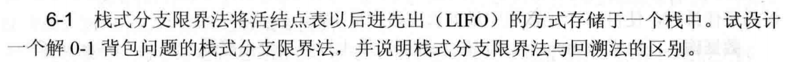
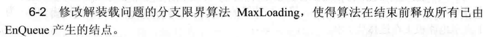
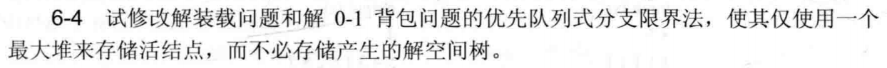
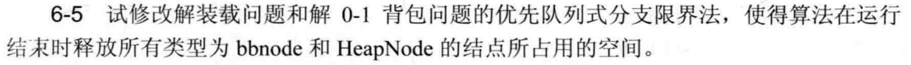
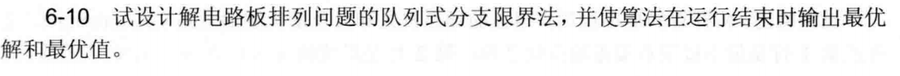

# 算法分析第6次作业

## 算法实现题 

### 6-1 最小长度电路板排列问题



**第6-1题答案:**

#### 一、算法设计思想

**问题描述：** 将 $n$ 块电路板以最佳排列方案插入带有 $n$ 个插槽的机箱中，使得 $m$ 个连接块中最大长度（密度）达到最小。连接块 $N_i$ 是电路板集合 $B=\{1,2,\cdots,n\}$ 的子集，其长度定义为该连接块中第1块到最后1块电路板之间的槽位距离。

**核心思路：** 采用队列式（FIFO）分支限界法搜索排列空间树。

1. **状态表示：** 节点记录当前已排列的前 $s$ 块电路板的排列 $x[1..n]$、各连接块已排入的电路板计数 $\text{now}[j]$（$1 \le j \le m$）以及到目前为止产生的最大密度 $\text{cd}$。

2. **密度的定义与计算：** 在位置 $s$ 处，密度等于当前"跨越"该位置的连接块数，即满足 $\text{now}[j] > 0$ 且 $\text{now}[j] < \text{total}[j]$（连接块 $j$ 已有电路板排入但尚未全部排完）的连接块数目。

3. **上界剪枝：** 若某子节点的当前最大密度 $\text{new\_cd} \geq \text{bestd}$（当前全局最优），则该节点不可能产生更优解，直接丢弃。

4. **扩展方式：** 对深度为 $s$ 的节点，依次将剩余电路板 $x[s+1], \ldots, x[n]$ 与 $x[s+1]$ 交换，生成所有子节点，计算新密度后入队（满足剪枝条件则丢弃）。

5. **叶结点处理：** 当 $s = n-1$ 时所有电路板排列完毕，此时最后一块电路板加入后，所有连接块均关闭，密度由前面各位置的最大值决定，若优于 $\text{bestd}$ 则更新全局最优。

#### 二、算法分析

**1. 正确性分析：**

排列空间树共 $n!$ 个叶结点，对应全部可能排列。剪枝条件 $\text{new\_cd} \geq \text{bestd}$ 是安全的：当前前缀已产生的最大密度不小于已知最优时，后续无论如何排列，密度只能维持或增大，不可能产生更优解，故可安全剪去该子树。算法遍历（剪枝后的）所有可行排列并取最优，正确性成立。

**2. 时间复杂度分析：**

最坏情况（无剪枝）需扩展排列空间树全部 $\displaystyle\sum_{k=0}^{n-1}\frac{n!}{(n-k)!}=O(n\cdot n!)$ 个节点，每个节点更新 $m$ 个连接块计数耗时 $O(m)$，总最坏时间复杂度为 $O(n \cdot n! \cdot m)$。实际由于剪枝，运行时间远小于最坏情况。

**3. 空间复杂度分析：**

队列中每个节点存储排列数组 $O(n)$ 和计数数组 $O(m)$，最坏情况队列中节点数为 $O(n!)$，总空间复杂度为 $O(n!\cdot(n+m))$。

#### 三、代码

```cpp
#include <bits/stdc++.h>
using namespace std;

const int MAXN = 25;

int n, m;
int B[MAXN][MAXN];      // B[i][j]=1 表示电路板i属于连接块j
int total[MAXN];        // total[j] = 连接块j中电路板总数
int bestd;              // 当前最优密度
int bestx[MAXN];        // 最优排列

struct Node {
    int x[MAXN];        // 当前排列
    int now[MAXN];      // 各连接块已排入电路板数
    int s;              // 已排列数量
    int cd;             // 当前最大密度
};

void solve() {
    queue<Node> Q;
    Node E;
    for (int i = 1; i <= n; i++) E.x[i] = i;
    memset(E.now, 0, sizeof(E.now));
    E.s = 0; E.cd = 0;
    Q.push(E);

    while (!Q.empty()) {
        Node cur = Q.front(); Q.pop();

        if (cur.s == n - 1) {
            if (cur.cd < bestd) {
                bestd = cur.cd;
                for (int i = 1; i <= n; i++) bestx[i] = cur.x[i];
            }
            continue;
        }

        for (int i = cur.s + 1; i <= n; i++) {
            swap(cur.x[cur.s + 1], cur.x[i]);

            int board = cur.x[cur.s + 1];
            int tmp[MAXN];
            for (int j = 1; j <= m; j++) tmp[j] = cur.now[j] + B[board][j];

            int ld = 0;
            for (int j = 1; j <= m; j++)
                if (tmp[j] > 0 && tmp[j] < total[j]) ld++;

            int ncd = max(cur.cd, ld);
            if (ncd < bestd) {
                Node N = cur;
                N.s = cur.s + 1;
                N.cd = ncd;
                for (int j = 1; j <= m; j++) N.now[j] = tmp[j];
                Q.push(N);
            }

            swap(cur.x[cur.s + 1], cur.x[i]);
        }
    }
}

int main() {
    ios::sync_with_stdio(false);
    cin.tie(0);

    // 示例：n=8, m=5
    // N1={4,5,6}, N2={2,3}, N3={1,3}, N4={3,6}, N5={7,8}
    n = 8; m = 5;
    memset(B, 0, sizeof(B));
    B[4][1]=B[5][1]=B[6][1]=1;
    B[2][2]=B[3][2]=1;
    B[1][3]=B[3][3]=1;
    B[3][4]=B[6][4]=1;
    B[7][5]=B[8][5]=1;

    for (int j = 1; j <= m; j++)
        for (int i = 1; i <= n; i++)
            total[j] += B[i][j];

    bestd = n + 1;
    solve();

    cout << "最小长度: " << bestd << "\n";
    cout << "最优排列: ";
    for (int i = 1; i <= n; i++) cout << bestx[i] << " \n"[i==n];

    return 0;
}
```

---

### 6-2：0-1背包问题（优先队列式分支限界法）



**第6-2题答案:**

#### 一、算法设计思想

**问题描述：** 给定 $n$ 种物品和容量为 $C$ 的背包，物品 $i$ 的重量为 $w_i$、价值为 $v_i$，求装入背包的最大总价值。

**核心思路：** 采用优先队列式（最大堆）分支限界法搜索子集空间树，以价值上界为优先级。

1. **预处理：** 将物品按单位重量价值 $v_i/w_i$ 从大到小排序，以便贪心上界计算。

2. **上界函数 `bound(i, cw, cp)`：** 从第 $i$ 个物品起，对剩余容量用贪心分数背包法估算可能获得的最大价值。完整装入单位价值高的物品，剩余容量按比例装最后一个，所得值即为当前子树的价值上界。该上界不低于子树中任意可行解的真实价值。

3. **节点结构：** 每个堆节点记录当前价值上界 `up`、当前已装价值 `cp`、已装重量 `cw`、层次 `lv`（下一个待决策物品编号）及当前选择向量 `x[1..n]`。

4. **扩展策略：**
   - 从最大堆取上界最大的节点展开。
   - **左子节点（装入物品 $i$）：** 若 $\text{cw}+w_i \leq C$，生成左子节点，更新 `cp`、`cw`，重算上界，若上界 $>$ `bestp` 则入堆。
   - **右子节点（不装物品 $i$）：** 计算不装时上界，若上界 $>$ `bestp` 则入堆。
   - 到达叶结点（$\text{lv} > n$）时更新 `bestp` 和最优解向量。

5. **剪枝：** 节点上界 $\leq$ `bestp` 时直接丢弃，不入堆。

#### 二、算法分析

**1. 正确性分析：**

上界函数 `bound` 利用分数背包最优值作为估计，满足"上界不低于子树真实最优值"的条件（分数背包松弛了整数约束）。最大堆保证每次优先扩展上界最大的节点。当第一个叶结点被弹出时，不存在上界更大的未展开节点（否则它早已出队），故此时得到的解为全局最优，算法正确。

**2. 时间复杂度分析：**

最坏情况堆中节点数为 $O(2^n)$，每次堆操作 $O(n)$（含上界计算与解向量复制），总最坏时间复杂度为 $O(2^n \cdot n)$。实际剪枝效果通常显著。

**3. 空间复杂度分析：**

堆中最多 $O(2^n)$ 个节点，每节点存储解向量 $O(n)$，总空间复杂度 $O(2^n \cdot n)$（最坏情况）。

#### 三、代码

```cpp
#include <bits/stdc++.h>
using namespace std;

const int MAXN = 105;

int n;
double C;
double p[MAXN], w[MAXN]; // 排序后的价值、重量
double bestp;
int bestx[MAXN];

struct Node {
    double up, cp, cw;
    int lv;
    int x[MAXN];
    bool operator<(const Node &o) const { return up < o.up; }
};

double bound(int i, double cw, double cp) {
    double left = C - cw, b = cp;
    while (i <= n && w[i] <= left) { left -= w[i]; b += p[i]; i++; }
    if (i <= n) b += p[i] / w[i] * left;
    return b;
}

void solve() {
    priority_queue<Node> H;
    Node E;
    memset(E.x, 0, sizeof(E.x));
    E.cp = E.cw = 0; E.lv = 1;
    E.up = bound(1, 0, 0);
    bestp = 0;
    H.push(E);

    while (!H.empty()) {
        Node cur = H.top(); H.pop();
        if (cur.lv > n) {
            if (cur.cp > bestp) {
                bestp = cur.cp;
                for (int j = 1; j <= n; j++) bestx[j] = cur.x[j];
            }
            continue;
        }
        int i = cur.lv;
        // 左子节点：装入物品i
        if (cur.cw + w[i] <= C) {
            Node L = cur;
            L.cw += w[i]; L.cp += p[i];
            L.x[i] = 1; L.lv = i + 1;
            L.up = bound(i + 1, L.cw, L.cp);
            if (L.cp > bestp) bestp = L.cp;
            if (L.up > bestp) H.push(L);
        }
        // 右子节点：不装物品i
        Node R = cur;
        R.x[i] = 0; R.lv = i + 1;
        R.up = bound(i + 1, R.cw, R.cp);
        if (R.up > bestp) H.push(R);
    }
}

struct Obj { int id; double d; };

int main() {
    ios::sync_with_stdio(false);
    cin.tie(0);

    // 示例：n=5, C=10
    // 价值: 6 3 5 4 6，重量: 2 2 6 5 4
    n = 5; C = 10;
    double pv[] = {0,6,3,5,4,6};
    double wv[] = {0,2,2,6,5,4};

    Obj Q[MAXN];
    for (int i = 1; i <= n; i++) { Q[i].id = i; Q[i].d = pv[i]/wv[i]; }
    sort(Q+1, Q+n+1, [](const Obj &a, const Obj &b){ return a.d > b.d; });
    for (int i = 1; i <= n; i++) { p[i] = pv[Q[i].id]; w[i] = wv[Q[i].id]; }

    solve();

    cout << "最优价值: " << (int)bestp << "\n";
    cout << "装入方案（排序后顺序）: ";
    for (int i = 1; i <= n; i++) cout << bestx[i] << " \n"[i==n];

    return 0;
}
```

---

### 6-4：最小重量机器设计问题



**第6-4题答案:**

#### 一、算法设计思想

**问题描述：** 某机器由 $n$ 个部件组成，每种部件可从 $m$ 个供应商处购得。$w_{ij}$ 为供应商 $j$ 提供部件 $i$ 的重量，$c_{ij}$ 为对应价格。在总价格不超过预算 $d$ 的约束下，求总重量最小的机器设计方案。

**核心思路：** 采用最小堆优先队列式分支限界法，以当前累计重量为优先级搜索状态空间树。

1. **状态空间树：** 树共 $n$ 层，第 $i$ 层对应第 $i$ 个部件的供应商选择（$m$ 个分支）。叶结点对应完整设计方案，共 $m^n$ 个。

2. **节点结构：** 记录当前累计重量 `cw`、累计费用 `cc`、当前层次 `lv`（下一个待选部件编号）及父节点指针 `par`（用于回溯构造解，记录当前选择的供应商编号 `mj`）。最小堆按 `cw` 升序排列。

3. **扩展策略：** 弹出当前重量最小的节点，对第 $\text{lv}$ 个部件枚举所有 $m$ 个供应商 $j$：计算 $\text{wt}=\text{cw}+w[\text{lv}][j]$，$\text{ct}=\text{cc}+c[\text{lv}][j]$，若 $\text{ct} \leq d$ 且 $\text{wt} < \text{bestw}$（剪枝），则生成子节点并入堆。

4. **叶结点处理：** 当 $\text{lv} = n+1$ 时到达叶结点。由于最小堆保证按重量从小到大取出，**第一个满足费用约束的叶结点即为最优解**，沿父指针链回溯即可恢复各部件的供应商选择。

5. **剪枝：** 当前节点重量 $\text{cw} \geq \text{bestw}$ 时直接丢弃（无法改善最优）。

#### 二、算法分析

**1. 正确性分析：**

最小堆保证按总重量升序扩展节点。费用剪枝（$\text{ct} > d$）只裁剪不满足约束的节点，不遗漏任何可行方案。重量剪枝（$\text{wt} \geq \text{bestw}$）同样安全，因为子树中所有节点重量只增不减。最小堆性质保证第一个到达叶结点的方案是所有可行方案中总重量最小的，算法正确。

**2. 时间复杂度分析：**

最坏情况（无剪枝）需扩展 $\displaystyle\sum_{k=0}^{n}m^k = O(m^n)$ 个节点，每次堆操作 $O(n\log m)$，总最坏时间复杂度为 $O(m^n \cdot n \log m)$。实际由费用约束剪枝，运行时间通常远小于最坏情况。

**3. 空间复杂度分析：**

堆中节点数最多 $O(m^n)$，每节点存储常数量数据，回溯链节点总数同量级，总空间复杂度 $O(m^n)$（最坏情况）。

#### 三、代码

```cpp
#include <bits/stdc++.h>
using namespace std;

const int MAXN = 25;

int n, m, d;
int c[MAXN][MAXN], w[MAXN][MAXN];
int bestw;
int bestx[MAXN];

struct bbnode {
    bbnode *par;
    int mj;
};

struct Node {
    int cw, cc, lv;
    bbnode *ptr;
    bool operator>(const Node &o) const { return cw > o.cw; }
};

void solve() {
    priority_queue<Node, vector<Node>, greater<Node>> H;
    bestw = INT_MAX;

    Node E; E.cw = E.cc = 0; E.lv = 1; E.ptr = nullptr;
    H.push(E);

    while (!H.empty()) {
        Node cur = H.top(); H.pop();
        if (cur.lv == n + 1) {
            if (cur.cw < bestw) {
                bestw = cur.cw;
                bbnode *t = cur.ptr;
                for (int j = n; j >= 1; j--) { bestx[j] = t->mj; t = t->par; }
            }
            continue;
        }
        for (int j = 1; j <= m; j++) {
            int wt = cur.cw + w[cur.lv][j];
            int ct = cur.cc + c[cur.lv][j];
            if (ct <= d && wt < bestw) {
                bbnode *b = new bbnode; b->par = cur.ptr; b->mj = j;
                Node N; N.cw = wt; N.cc = ct; N.lv = cur.lv + 1; N.ptr = b;
                H.push(N);
            }
        }
    }
}

int main() {
    ios::sync_with_stdio(false);
    cin.tie(0);

    // 示例：n=3部件，m=3供应商，预算d=4
    // 价格矩阵c[i][j]、重量矩阵w[i][j]（1-indexed）
    n = 3; m = 3; d = 4;
    int cv[4][4] = {{0},{0,1,2,3},{0,3,2,1},{0,2,2,2}};
    int wv[4][4] = {{0},{0,1,2,3},{0,3,2,1},{0,2,2,2}};
    for (int i = 1; i <= n; i++)
        for (int j = 1; j <= m; j++)
            c[i][j] = cv[i][j], w[i][j] = wv[i][j];

    solve();

    cout << "最小重量: " << bestw << "\n";
    cout << "各部件选择的供应商: ";
    for (int i = 1; i <= n; i++) cout << bestx[i] << " \n"[i==n];

    return 0;
}
```

---

### 6-5：运动员最佳配对问题



**第6-5题答案:**

#### 一、算法设计思想

**问题描述：** 羽毛球队男女运动员各 $n$ 人。男运动员 $i$ 与女运动员 $j$ 配对的总优势为 $P[i][j] \times Q[j][i]$。求使各组总优势之和最大的一一配对方案。

**核心思路：** 采用优先队列式（最大堆）分支限界法搜索排列空间树，以当前累计优势值为优先级。

1. **状态表示：** 排列空间树第 $i$ 层对应为男运动员 $i$ 选择女搭档。节点存储当前排列 $r[1..n]$（$r[i]$ 表示男运动员 $i$ 的女搭档）、当前层次 $s$（已确定前 $s$ 对）和已得总优势值 `val`。

2. **上界估计（用于堆排序）：** 直接以当前 `val` 作为堆的优先键，即优先扩展当前局部最优的节点（最佳优先搜索）。若需更紧的上界，可对剩余男运动员逐一取其与所有未配对女运动员组合的最大优势之和，但代价为 $O(n^2)$ 每节点。

3. **扩展策略：** 对第 $s+1$ 层节点，枚举将 $r[s+1], \ldots, r[n]$ 中某位女运动员 $r[i]$ 分配给男运动员 $s+1$（通过与 $r[s+1]$ 交换实现），计算新优势增量 $P[s+1][r[i]] \times Q[r[i]][s+1]$，生成子节点入堆。

4. **叶结点处理：** 当 $s = n-1$ 时计算最后一对优势，若总优势优于 `best` 则更新最优解。

#### 二、算法分析

**1. 正确性分析：**

排列空间树枚举所有 $n!$ 种配对方案。最大堆优先扩展当前局部优势最大的节点，结合叶结点更新全局最优，可确保遍历所有可行方案并取最优，正确性成立。若引入有效上界并剪枝，只需证明上界函数不低估子树真实最优值即可保证正确性（分析略）。

**2. 时间复杂度分析：**

最坏情况（无剪枝）需扩展 $O(n \cdot n!)$ 个节点，每节点含排列数组复制 $O(n)$ 及堆操作 $O(n\log n)$，总最坏时间复杂度为 $O(n^2 \cdot n! \cdot \log n)$。

**3. 空间复杂度分析：**

堆中最多 $O(n!)$ 个节点，每节点存储排列数组 $O(n)$，总空间复杂度 $O(n! \cdot n)$（最坏情况）。

#### 三、代码

```cpp
#include <bits/stdc++.h>
using namespace std;

const int MAXN = 25;

int n;
int P[MAXN][MAXN], Q[MAXN][MAXN];
int best;
int bestr[MAXN];

struct Node {
    int s, val;
    int r[MAXN];
    bool operator<(const Node &o) const { return val < o.val; }
};

void solve() {
    priority_queue<Node> H;
    Node E;
    E.s = 0; E.val = 0;
    for (int i = 1; i <= n; i++) E.r[i] = i;
    best = 0;
    H.push(E);

    while (!H.empty()) {
        Node cur = H.top(); H.pop();
        if (cur.s == n - 1) {
            int i = n;
            int fin = cur.val + P[i][cur.r[i]] * Q[cur.r[i]][i];
            if (fin > best) {
                best = fin;
                for (int j = 1; j <= n; j++) bestr[j] = cur.r[j];
            }
            continue;
        }
        int nxt = cur.s + 1;
        for (int i = nxt; i <= n; i++) {
            swap(cur.r[nxt], cur.r[i]);
            Node N = cur;
            N.s = nxt;
            N.val = cur.val + P[nxt][cur.r[nxt]] * Q[cur.r[nxt]][nxt];
            H.push(N);
            swap(cur.r[nxt], cur.r[i]);
        }
    }
}

int main() {
    ios::sync_with_stdio(false);
    cin.tie(0);

    // 示例：n=3
    n = 3;
    int pv[4][4] = {{0},{0,10,2,3},{0,2,3,4},{0,3,4,5}};
    int qv[4][4] = {{0},{0,2,2,2},{0,3,5,3},{0,4,5,1}};
    for (int i = 1; i <= n; i++)
        for (int j = 1; j <= n; j++)
            P[i][j] = pv[i][j], Q[i][j] = qv[i][j];

    solve();

    cout << "最大总优势值: " << best << "\n";
    cout << "配对方案: ";
    for (int i = 1; i <= n; i++)
        cout << "男" << i << "-女" << bestr[i] << " \n"[i==n];

    return 0;
}
```

---

### 6-10：世界名画陈列馆问题



**第6-10题答案:**

#### 一、算法设计思想

**问题描述：** 世界名画陈列馆由 $m \times n$ 个陈列室组成矩形阵列。每个警卫机器人可监视其所在陈列室及上下左右相邻共5个陈列室。求使每个陈列室都被监视的最少机器人数及其安置方案。

**核心思路：** 采用优先队列式（最小堆）分支限界法，按当前已放置机器人数为优先级，对各陈列室依行优先顺序逐格决策。

1. **状态表示：** 节点存储机器人放置矩阵 $x[i][j]$（0/1）、监视计数矩阵 $y[i][j]$（被监视次数）、当前决策位置 $(ci, cj)$（行优先）、已放机器人数 $k$ 及已覆盖陈列室数 $t$。最小堆按 $k$ 升序排列。

2. **扩展策略：** 对陈列室 $(ci, cj)$ 产生两个子节点：
   - **放置机器人：** $x[ci][cj]=1$，将 $(ci,cj)$ 及其上下左右相邻格的 $y$ 值加1，$k$ 加1，$t$ 增加新覆盖（原 $y=0$ 变为 $y=1$）的陈列室数，移至下一格。
   - **不放机器人：** $x[ci][cj]=0$，检查可行性后移至下一格。

3. **剪枝条件：**
   - **机器人数剪枝：** 若当前 $k \geq \text{best}$，直接丢弃。
   - **覆盖可行性剪枝（不放机器人分支）：** 若 $y[ci][cj] = 0$（当前格尚未覆盖），且不存在后续格子（行优先顺序更靠后）能覆盖 $(ci,cj)$（即 $(ci,cj)$ 的5个覆盖来源格均不在后续决策中），则该格永远无法被覆盖，该分支不可行，直接剪枝。
   - **已满足覆盖时提前终止：** 若 $t = m \times n$ 则到达叶结点，更新最优解。

4. **下一格计算：** 按行优先顺序，$(ci, cj)$ 的下一格为 $(ci, cj+1)$，若 $cj = n$ 则为 $(ci+1, 1)$。当 $ci > m$ 时决策完毕。

#### 二、算法分析

**1. 正确性分析：**

状态空间树枚举所有 $2^{mn}$ 种放置方案。机器人数剪枝（$k \geq \text{best}$）安全：当前分支已用机器人数不优于最优，后续只增不减。覆盖可行性剪枝安全：若当前格在所有后续决策完成后仍无法被覆盖，则该分支任何方案均不可行，安全裁剪。最小堆保证优先找到机器人数少的方案，加强剪枝。算法正确性成立。

**2. 时间复杂度分析：**

最坏情况需扩展 $O(2^{mn})$ 个节点，每个节点处理（矩阵复制 + 覆盖更新）耗时 $O(mn)$，堆操作 $O(mn)$，总最坏时间复杂度为 $O(2^{mn} \cdot mn)$。题目约束 $m, n \leq 20$，实际由于剪枝，小规模情况下可在合理时间内完成。

**3. 空间复杂度分析：**

堆中节点数最多 $O(2^{mn})$，每节点存储两个 $m \times n$ 矩阵，总空间复杂度 $O(2^{mn} \cdot mn)$（最坏情况）。

#### 三、代码

```cpp
#include <bits/stdc++.h>
using namespace std;

// 陈列室坐标转换为一维下标
// 矩阵维度上限
const int MAXM = 22;

int M, N;
int best;
int bestx[MAXM][MAXM];

// 5个方向：自身+上下左右
int dr[] = {0, -1, 1,  0, 0};
int dc[] = {0,  0, 0, -1, 1};

struct Node {
    int x[MAXM][MAXM]; // 放置矩阵
    int y[MAXM][MAXM]; // 监视计数
    int ci, cj;        // 当前决策格
    int k;             // 已放机器人数
    int t;             // 已覆盖格数
    bool operator>(const Node &o) const { return k > o.k; }
};

// 判断格(ri,rj)是否能被后续格子覆盖（行优先顺序在(ci,cj)之后）
// 能覆盖(ri,rj)的格子：(ri,rj)自身及其上下左右
bool canBeCovered(int ri, int rj, int ci, int cj) {
    for (int d = 0; d < 5; d++) {
        int ni = ri + dr[d], nj = rj + dc[d];
        if (ni < 1 || ni > M || nj < 1 || nj > N) continue;
        // 判断(ni,nj)是否在(ci,cj)之后（含(ci,cj)本身）
        if (ni > ci || (ni == ci && nj >= cj)) return true;
    }
    return false;
}

void nextCell(int &ci, int &cj) {
    cj++;
    if (cj > N) { cj = 1; ci++; }
}

void solve() {
    priority_queue<Node, vector<Node>, greater<Node>> H;
    best = M * N;

    Node E;
    memset(E.x, 0, sizeof(E.x));
    memset(E.y, 0, sizeof(E.y));
    E.ci = 1; E.cj = 1; E.k = 0; E.t = 0;
    H.push(E);

    while (!H.empty()) {
        Node cur = H.top(); H.pop();
        if (cur.k >= best) continue;

        if (cur.t == M * N || cur.ci > M) {
            if (cur.t == M * N && cur.k < best) {
                best = cur.k;
                memcpy(bestx, cur.x, sizeof(cur.x));
            }
            continue;
        }

        int ci = cur.ci, cj = cur.cj;

        // 子节点1：放置机器人
        {
            Node N1 = cur;
            N1.x[ci][cj] = 1;
            for (int d = 0; d < 5; d++) {
                int ni = ci + dr[d], nj = cj + dc[d];
                if (ni >= 1 && ni <= M && nj >= 1 && nj <= N) {
                    if (N1.y[ni][nj] == 0) N1.t++;
                    N1.y[ni][nj]++;
                }
            }
            N1.k++;
            nextCell(N1.ci, N1.cj);
            if (N1.k < best) H.push(N1);
        }

        // 子节点2：不放机器人
        // 剪枝：当前格若y==0且后续无法覆盖，则不可行
        {
            bool ok = true;
            if (cur.y[ci][cj] == 0 && !canBeCovered(ci, cj, ci, cj + 1 > N ? ci + 1 : ci, cj + 1 > N ? 1 : cj + 1)) {
                // 当前格未覆盖且后续无法覆盖：检查(ci,cj)能被覆盖它的格中有无在后续的
                ok = canBeCovered(ci, cj, ci, cj);
                // 精确判断：(ci,cj)自身选不放，检查其他4个方向有无在后续
                ok = false;
                for (int d = 1; d < 5; d++) {
                    int ni = ci + dr[d], nj = cj + dc[d];
                    if (ni < 1 || ni > M || nj < 1 || nj > N) continue;
                    if (ni > ci || (ni == ci && nj > cj)) { ok = true; break; }
                }
            }
            if (ok) {
                Node N2 = cur;
                N2.x[ci][cj] = 0;
                nextCell(N2.ci, N2.cj);
                if (N2.k < best) H.push(N2);
            }
        }
    }
}

int main() {
    ios::sync_with_stdio(false);
    cin.tie(0);

    // 示例：4×4陈列馆
    M = 4; N = 4;

    solve();

    cout << "最少机器人数: " << best << "\n";
    cout << "安置方案:\n";
    for (int i = 1; i <= M; i++) {
        for (int j = 1; j <= N; j++)
            cout << bestx[i][j] << " \n"[j==N];
    }

    return 0;
}
```

