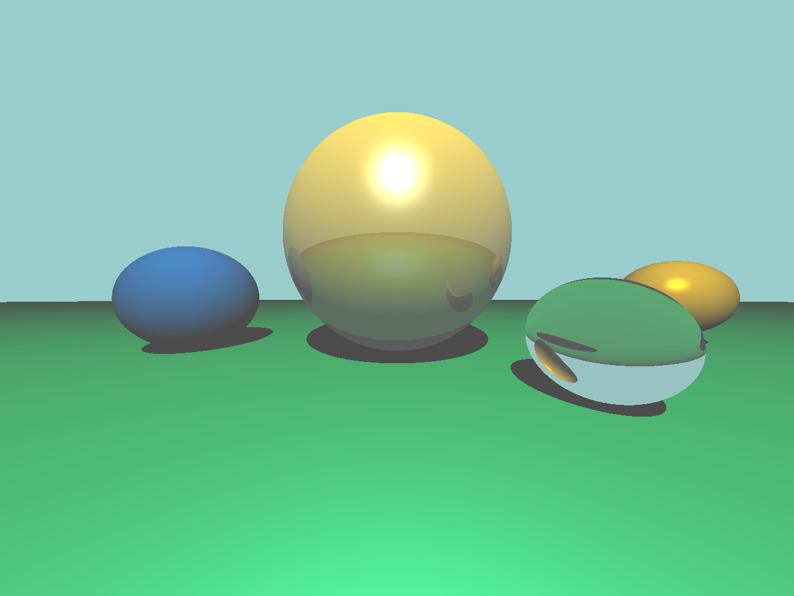
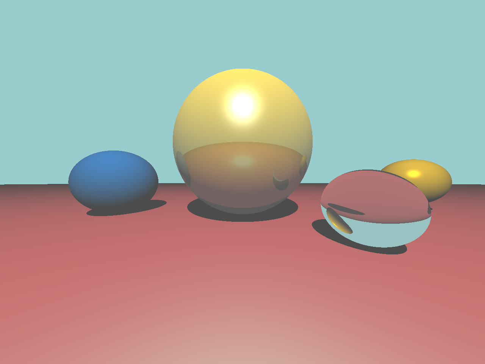

# 计算机图形学实验

## 实验六：Ray Tracing

姓名：____________

学号：____________

学院：____________

专业：____________

年级：____________

日期：2026 年 5 月 21 日

# 目录

[Task1：生成光线](#task1生成光线)

[Task2：实现阴影效果、镜面反射、折射](#task2实现阴影效果镜面反射折射)

[实验结果对比与总结](#实验结果对比与总结)

# Task1：生成光线

## 1. 任务要求

根据实验六课件要求，阅读《L7 Ray Tracing》相关内容，利用 Eigen 库补全相机光线生成部分，使程序能够对图像平面上的每一个像素生成对应的主光线。

## 2. 操作流程

1. 阅读 `src/camera.hpp` 中相机类的定义，确认相机原点、成像平面左下角坐标、水平方向向量和竖直方向向量的含义。
2. 根据像素归一化坐标 `u`、`v`，计算成像平面上对应采样点的位置。
3. 以相机原点为光线起点，以“采样点位置减去相机原点”为方向，构造主光线。
4. 重新编译并运行程序，检查渲染图像是否能够显示正确的透视结果。

## 3. 关键代码

`GenerateRay` 函数补全如下：

```cpp
Ray GenerateRay(float u, float v)
{
    return Ray(_origin,
        _lower_left_corner + u * _horizontal + v * _vetical - _origin);
}
```

该实现中，`_lower_left_corner + u * _horizontal + v * _vetical` 表示当前像素对应的成像平面采样点。由相机原点指向该采样点即可得到主光线方向。补全后，不同像素能够生成不同方向的光线，从而形成正确的图像投影关系。

## 4. 运行结果截图

完成光线生成后，程序能够正常生成渲染图像。原始渲染结果如下：



# Task2：实现阴影效果、镜面反射、折射

## 1. 任务要求

根据实验六课件要求，在光线追踪程序中补全阴影效果、镜面反射以及折射效果。程序需要在命中物体后计算直接光照，并根据材质属性递归追踪反射光线和折射光线。

## 2. 操作流程

1. 阅读 `src/raytracer.hpp` 中 `RayColor` 函数的整体结构，明确光线与场景求交、局部光照计算和递归追踪的位置。
2. 在交点处构造指向光源的阴影光线，判断交点与光源之间是否存在遮挡物。
3. 对具有反射属性的材质，计算反射方向并递归调用 `RayColor` 获取反射颜色。
4. 对具有透明属性的材质，依据折射率计算折射方向，并递归调用 `RayColor` 获取折射颜色。
5. 将环境光、直接光照、反射颜色和折射颜色进行加权合成，得到最终像素颜色。

## 3. 阴影效果实现

阴影检测通过从当前交点向光源发射阴影光线实现。若该光线在到达光源之前与场景中其他物体相交，则认为该点处于阴影区域，不再计算直接光照。

关键代码如下：

```cpp
float light_distance = shadow_ray.Direction().norm();
shadow_ray._origin = closest_hp.position + 1e-2f * shadow_ray.Direction().normalized();

for (int i = 0; i < scene.ObjectCount(); ++i)
{
    HitInfo shadow_hit;
    if (scene.GetObjectPtr(i)->Hit(shadow_ray, shadow_hit) &&
        shadow_hit.t > 1e-3f && shadow_hit.t < light_distance)
    {
        isShadow = true;
        break;
    }
}
```

其中，对阴影光线起点加入微小偏移是为了避免浮点误差导致的自相交问题。

## 4. 镜面反射实现

对于设置为反射材质的物体，程序根据视线方向和表面法线计算反射方向，并继续追踪反射光线。关键代码如下：

```cpp
Vector3f reflectDir = 2.0f * eyedir.dot(closest_hp.normal) *
    closest_hp.normal - eyedir;

Ray reflectRay(closest_hp.position, reflectDir);
reflectRay._origin = closest_hp.position + 1e-2f * reflectDir.normalized();

if (mtl._reflective && depth < MAXDEPTH)
    reflectColor = RayColor(reflectRay, scene, depth + 1, test);
```

通过限制递归深度 `MAXDEPTH`，可以避免反射光线无限递归。

## 5. 折射效果实现

对于透明材质，程序根据入射方向、表面法线以及材质折射率计算折射方向。若能够发生折射，则继续递归追踪折射光线。

关键代码如下：

```cpp
if (refract)
{
    Ray refractRay(closest_hp.position, refractDir);
    refractRay._origin = closest_hp.position + 1e-2f * refractDir.normalized();

    if (depth < MAXDEPTH)
        refractionColor = RayColor(refractRay, scene, depth + 1, test);
}
```

该部分使透明球体能够呈现折射后的背景与物体颜色，从而增强了场景的真实感。

## 6. 运行结果截图

补全阴影、反射和折射后，渲染结果中可以观察到球体投影、镜面球表面的反射以及透明球的折射效果。结果如下：


# 实验结果对比与总结

## 1. 对比实验设置

为了验证材质参数变化对渲染结果的影响，本实验在完成基础任务后，对地面球的漫反射颜色进行了最小修改。修改内容如下：

修改前：

```cpp
mtl2.SetKd(Vector3f(0.0, 0.6, 0.2));
```

修改后：

```cpp
mtl2.SetKd(Vector3f(0.7, 0.2, 0.2));
```

该修改仅改变地面球颜色，不改变场景结构、相机参数和光线追踪算法。

## 2. 修改后结果截图

修改地面球颜色后的渲染结果如下：



## 3. 结果分析

根据结果检查文件可知，原始图像与修改后图像的分辨率均为 `1280 × 960`，两幅图像均能够正常显示场景内容，不存在空白输出情况。像素级比较显示，修改前后存在明确差异，变化像素数为 `590418`，约占总像素数的 `48.05%`。

从图像效果观察，原始结果中地面主要呈绿色，修改后地面转变为偏红色。同时，中央镜面反射球表面的反射颜色以及右侧透明球中的折射颜色也随地面颜色变化而发生变化。这说明阴影、反射和折射递归逻辑能够正常参与最终图像生成。

## 4. 实验总结

本实验按照课件要求完成了光线追踪程序中的两个主要任务：一是补全相机主光线生成，使每个像素能够对应正确的观察光线；二是补全阴影检测、镜面反射和折射递归逻辑，使场景能够呈现较完整的光线追踪效果。

通过本次实验，可以更直观地理解 Whitted Style 光线追踪算法的基本流程。实验结果表明，程序能够正确生成包含阴影、反射和折射效果的球体场景，并且材质参数的变化能够在最终渲染图像中得到明显体现。
