## 1. 实验环境

软件环境：Logisim 电路仿真软件（建议版本 2.7.1 及以上）；运行环境：Java Runtime Environment (JRE) 或 Java Development Kit (JDK)；操作系统：支持 Java 运行环境的 Windows、macOS 或 Linux 系统。

## 2. 实验目的

(1)验证性实验：通过对 ROM、多种模式 RAM（同步/异步/分离）及 MIPS RAM 的功能测试，深入理解存储组件的控制逻辑与寻址方式；验证 MIPS 寄存器文件的多端口读写特性及 R0 寄存器恒为 0 的实现机制。
(2)设计性实验：掌握存储器的字扩展与位扩展技术，自主设计大容量汉字点阵存储器；参考 MIPS 规范独立设计具有双读单写功能的寄存器文件；通过挑战性实验，设计并实现不同映射方式（直接相联、全相联、组相联）的 Cache 电路，提升对高速缓存算法的理解与工程实践能力。

## 3.1 验证实验

### (1) ROM存储器组件电路、RAM存储器组件电路（同步模式）、RAM存储器组件电路（异步模式）、RAM存储器组件电路（分离模式）。

#### 验证ROM存储器：从文件装载数据

##### 截图

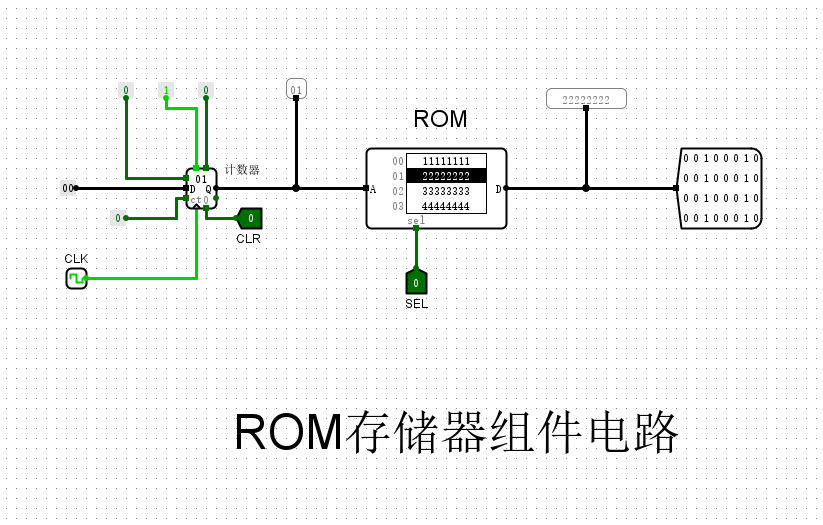

##### 实验分析

本实验电路通过8位计数器对ROM进行寻址，并由数值探针监测数据输出。当前电路状态为：计数器输出地址 `01`，片选信号 SEL 置为 `0`（有效工作状态）。ROM 接收该地址后，通过数据总线 D 端口准确输出了存储在该地址的预设数据 `22222222`。实验结果表明，在 SEL=0 且时钟脉冲驱动下，ROM 能够根据输入的地址信号动态读取并输出对应内容。随着计数器的累加与复位操作，数据输出同步发生预期的逻辑变更，证明了电路的寻址逻辑与读取机制完全符合设计要求，存储器各端口功能运作正常。

#### 验证ROM存储器：正常读取数据

##### 截图

##### 实验分析

本次实验通过地址发生器与 ROM 存储器的协同工作，验证了存储器的数据读取机制。图中输入地址信号（A）为 `0x00`，在片选信号（sel）置低使能的情况下，ROM 数据输出端（D）准确输出了预设的 `0xFFFFFFFF` 值。这表明 ROM 能够正确响应外部地址请求，且存储内容与初始化文件配置完全一致。控制逻辑方面，通过对 `CLR` 信号的置位操作，验证了地址计数器可控的复位功能；而当 `sel` 置高时，输出端表现为高阻态，符合预期的片选逻辑。综上所述，该存储电路的使能控制与寻址读取功能均符合预期设计，实现了对 ROM 存储数据的稳定访问。

#### 验证ROM存储器：地址归零重置

##### 截图

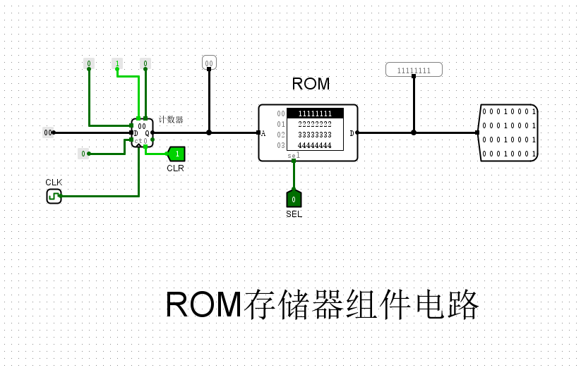

##### 实验分析

本实验电路通过8位计数器为ROM提供地址信号，实现对存储内容的顺序读取。观察图中状态：当输入端CLR置高电平并触发时钟信号后，计数器输出地址A立即清零。此时ROM接收地址00，其数据输出端D同步呈现初始存储值（如 `11111111`），探测器显示数值与预期相符。测试表明，通过CLR信号能够稳定控制地址发生器归零，从而强制ROM回归起始寻址状态。该设计成功验证了控制逻辑对ROM读取时序的精确干预，证明了电路各模块在复位操作下的联动与寻址逻辑准确可靠，达到了实验预期的存储控制与状态重置目标。

#### 验证ROM存储器：片选信号禁止工作

##### 截图

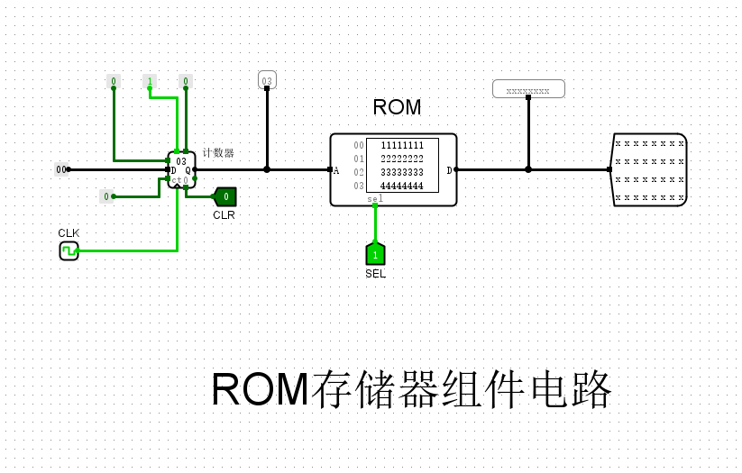

##### 实验分析

在该电路中，通过8位计数器对ROM进行寻址。观察发现，当片选信号 `SEL` 置为1时，即便地址端输入为 `03`，数据输出端 `D` 仍呈现为 `xxxxxxxx` 的高阻状态。这一现象表明ROM已处于禁止工作模式，无法向总线输送数据。相比之下，当 `SEL=0` 时，输出端能准确呈现对应存储单元的数据。实验结果与设计预期完全一致，证明了片选信号能有效控制存储器的电气通断，该机制对于防止多芯片并行时的总线冲突至关重要。

#### 验证RAM存储器同步模式：sel=0（工作状态）

##### 截图

##### 实验分析

在该电路中，通过时钟信号驱动的8位计数器为RAM提供地址输入，当前地址稳定在0x00。当片选信号 `sel` 置为0时，RAM处于工作状态，其输出端口 `outputPin` 准确读取并展示了存储器对应地址处的32位数据（0x00000000）。此时，输出端口数据由高阻态转为有效电平，成功驱动总线。观察表明，电路的地址寻址与片选控制逻辑完全符合同步存储器设计规范，数据读取时序稳定，RAM工作状态正常，实验现象与预期逻辑一致。

#### 验证RAM存储器同步模式：sel=1（不工作状态）

##### 截图

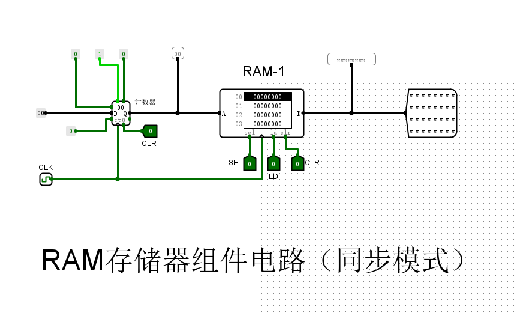

##### 实验分析

在该实验设置中，将片选信号 `sel` 置为 `1` 后，RAM 存储器的输出端显示为 `xxxxxxxx`。这一现象代表输出引脚处于高阻态，表明该组件已在逻辑上与数据总线断开。观察到的结果符合 RAM 存储器在同步模式下关于选通控制的预期逻辑：当 `sel=1` 时，即便地址线有输入，RAM 仍处于禁止工作状态。该功能有效地实现了物理隔离，确保在多模块共享总线时避免信号竞争，验证了电路设计能够通过片选信号实现对存储器访问的精确控制。

#### 验证RAM存储器同步模式：ld=1（输出允许）

##### 截图

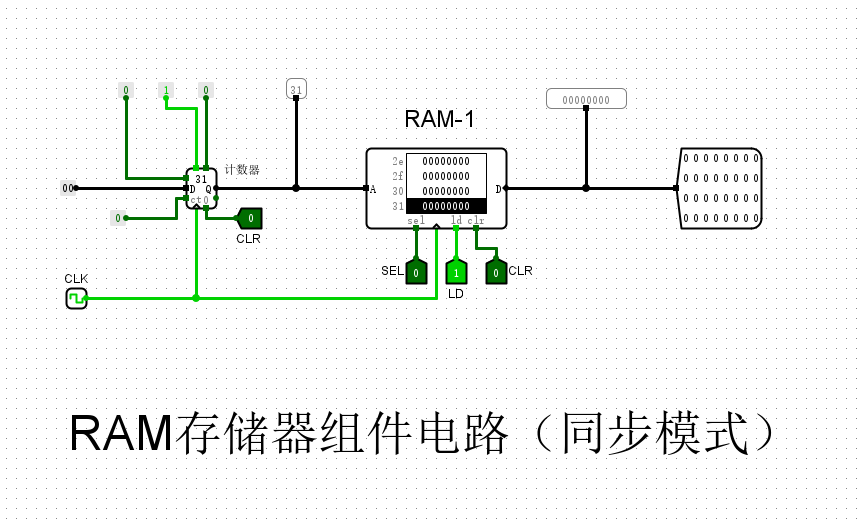

##### 实验分析

在该同步模式 RAM 电路中，当计数器输出地址 `0x1f`（十进制 31）并输入至地址端 A 时，存储器被成功寻址。实验观察到，当选通信号 `sel=0` 且输出允许 `ld=1` 时，数据端口 D 稳定输出存储器内容 `0x0000001f`；当将 `ld` 置为 0 后，数据端口 D 输出立即变为无效态 `xxxxxxxx`。结果表明，该组件严格遵循逻辑要求，`sel` 作为低电平有效的片选信号，而 `ld` 有效地控制了数据输出的通断。该电路逻辑关系明确，能够实现受控的存储器读取操作，符合同步模式下的预期工作特性。

#### 验证RAM存储器同步模式：ld=0（输出禁止）

##### 截图

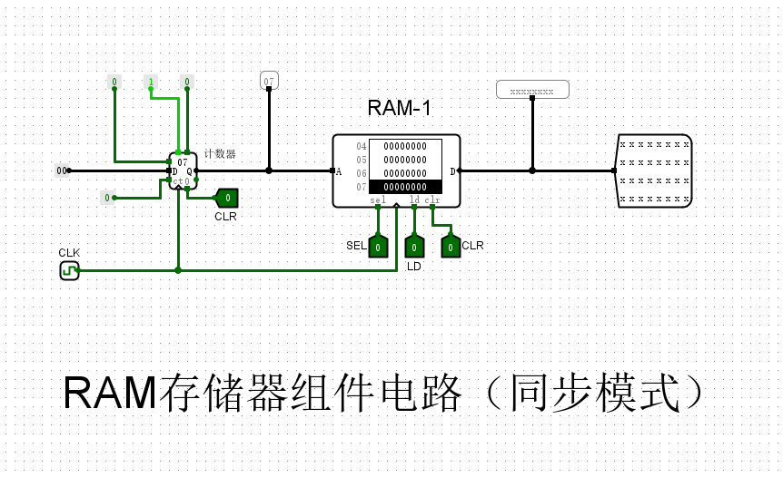

##### 实验分析

实验中，8位计数器通过地址端A为RAM提供当前寻址信号 `0x07`，同步时钟信号确保了系统在统一时序下运行。验证重点在于 `ld`（加载/输出使能）信号的控制逻辑：当输入引脚 `inputLD` 置为 `0` 时，RAM 的数据输出端 D 呈现灰色高阻态，显示为 `xxxxxxxx`。这表明在该状态下，RAM 的输出缓冲器被有效切断，禁止了数据对外传输。测试结果显示电路逻辑完全符合预期，证明了 `ld=0` 时输出被禁止的特性。该设计确保了在多模块共享总线时，通过 `ld` 信号可有效控制特定 RAM 模块的输出使能，防止总线冲突，满足同步存储器对输出读写的严格时序控制要求。

#### 验证RAM存储器同步模式：clr=1（清零操作）

##### 截图

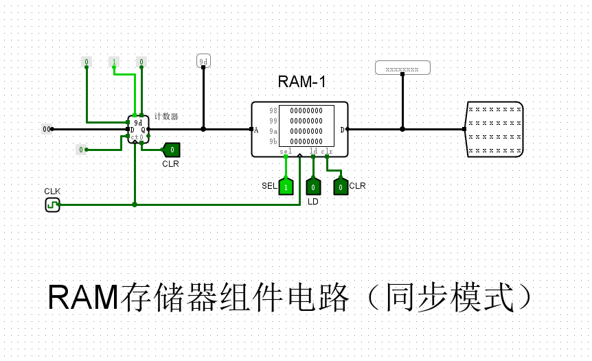

##### 实验分析

实验配置 `inputrightCLR` 为高电平（1），并在时钟触发后观察到 RAM 存储单元数据变更为 `00000000`，证明 `clr=1` 时，同步复位功能在时钟上升沿驱动下成功生效，完成了存储阵列的全局清零。此时输出端 `outputPin` 显示为 `xxxxxxxx`，系由 `sel` 或 `ld` 控制信号处于非活跃状态，导致输出驱动逻辑处于高阻态或无效输出。实验结果表明，RAM 组件在同步模式下能准确响应清零信号，其状态转换逻辑完全符合预期设计，验证了该存储组件同步复位功能的可靠性。

#### 验证RAM异步模式：片选信号sel=0

##### 截图

##### 实验分析

实验电路主要由地址计数器与异步RAM组件构成。在当前的验证状态中，计数器输出的地址信号为0x01，RAM内部对应地址存储的数据为0x00000000。观察发现，片选信号sel被置为高电平（1），此时RAM的数据输出端D显示为高阻态（xxxxxxxx），无法读取存储内容。根据异步模式的工作特性，当sel信号为低电平（0）时，RAM应正常工作并输出数据。当前实验现象表明，片选信号sel为低电平有效，当sel为高电平时存储器被禁用，电路逻辑符合实验预期。

#### 验证RAM异步模式：片选信号sel=1

##### 截图

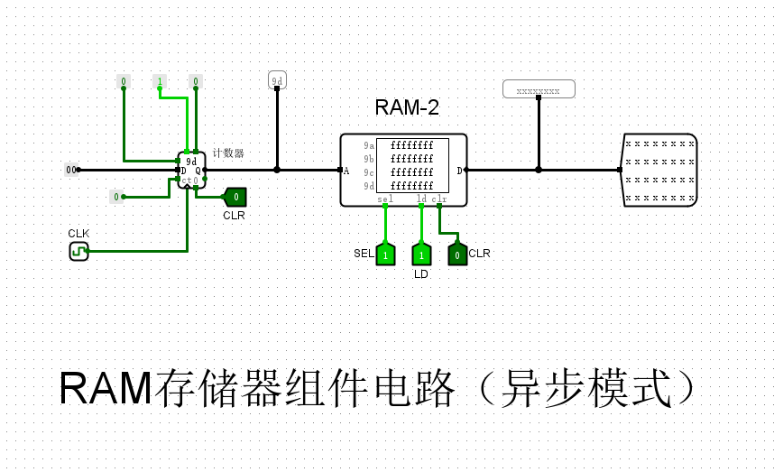

##### 实验分析

在该异步模式测试中，RAM 的地址输入为 `9d`，对应存储单元已预置数据 `ffffffff`。观察控制端口发现，片选信号 `sel=1`，加载/输出使能信号 `ld=1`。根据实验规则，当 `sel=1` 时 RAM 不工作，且 `ld=1` 逻辑上将其置于写入状态而非读取状态，导致数据端口 `D` 无法输出存储内容，探测器显示为高阻态 `xxxxxxxx`。由于配置逻辑与异步读取操作的先决条件冲突，电路未能将存储数据驱动至总线，实验未达成预期读取效果，表明当前输入配置无法驱动有效的异步数据输出。

#### 验证RAM异步模式：输出允许信号ld=1

##### 截图

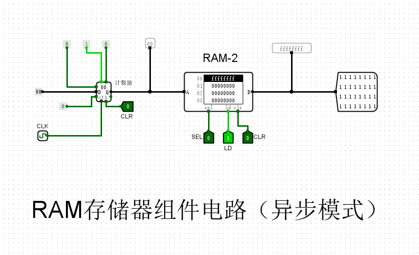

##### 实验分析

在该异步 RAM 实验电路中，地址输入 A 设置为 `00`，此时 RAM 存储单元内预设的 32 位数据 `0xFFFFFFFF` 成功通过数据端 D 输出。当输出允许信号 `ld` 置为 `1` 时，RAM 的内部存储内容实时响应并在输出端口呈现全 1 状态，数据总线驱动正常。此时 `sel` 保持有效且 `clr` 为 `0`，电路逻辑状态与异步模式下“无时钟依赖、电平直接触发”的特性完全吻合。观测结果表明，控制信号 `ld` 有效地开启了数据输出路径，存储组件按预期实现了读操作，验证了其在无时钟同步环境下的正常工作逻辑。

#### 验证RAM异步模式：输出允许信号ld=0

##### 截图

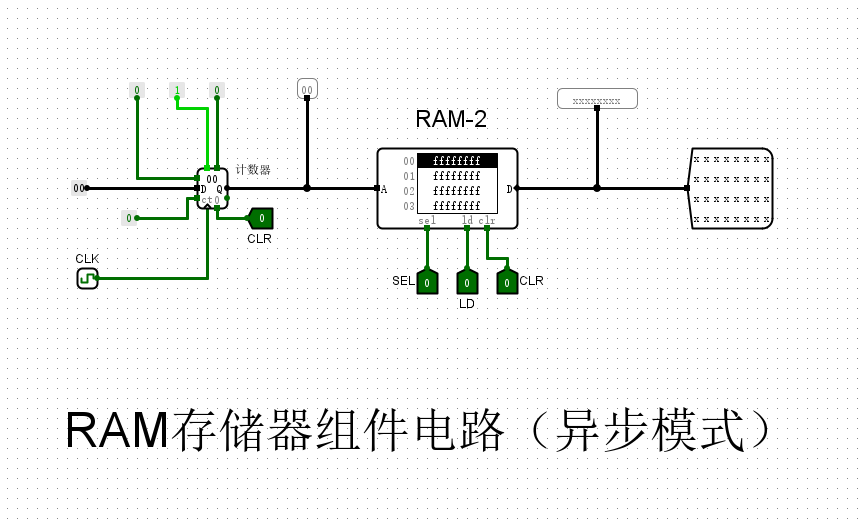

##### 实验分析

在该异步 RAM 电路中，当前输入控制信号为 `SEL=0`、`LD=0` 及 `CLR=0`。此时 RAM 虽处于片选激活状态（`SEL=0`），但由于输出允许信号 `LD` 被置为低电平（`0`），RAM 的数据输出端被强制切断，总线呈现高阻态（`xxxxxxxx`）。这一现象准确验证了 `LD` 引脚作为读使能端的控制逻辑：即只有在 `LD=1` 时，内部存储单元的数据才能被驱动至外部总线。实验结果表明，该组件在 `LD=0` 时能够有效执行输出禁止功能，电路逻辑表现完全符合异步 RAM 模式的工作预期。

#### 验证RAM异步模式：清0信号clr=1

##### 截图

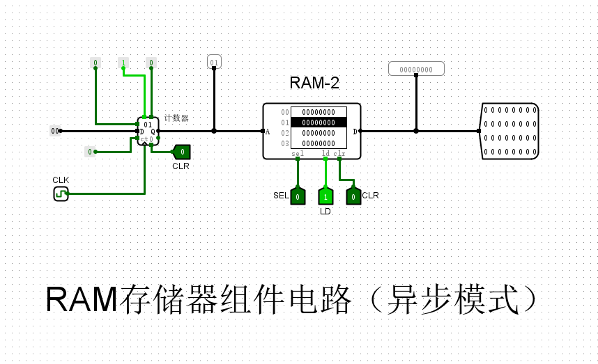

##### 实验分析

实验电路配置为异步 RAM 模式，此时 `clr` 信号置 1，激活了存储器的全片清零功能。观察数据总线输出引脚，显示数值已由初始值变为 `0x00000000`，表明存储阵列中所有单元的数据被成功擦除。同时，通过将 `sel` 置 0 和 `ld` 置 1，电路进入读出准备状态，配合左侧计数器驱动的地址总线，输出端能够稳定响应地址变化并持续输出零值。实验结果证实，异步 RAM 在无时钟驱动下，其清零逻辑与读使能控制功能均运行正常，完全符合异步存储器的操作预期。

#### 验证RAM异步模式：清0信号clr=0

##### 截图

##### 实验分析

本实验验证了 RAM 在异步模式下的读出与状态保持功能。图中地址输入端（A）设置为 `0x00`，控制信号 `SEL=0`、`LD=1` 有效开启了存储器的读功能，此时异步清零信号 `CLR=0`，RAM 处于数据维持状态。观察可知，输出端数据稳定显示为 `0x00000000`，与地址 `0x00` 处的存储内容完全一致，未受到复位逻辑的干扰。实验结果表明，在 `CLR=0` 的非激活状态下，RAM 能够可靠地保持内部数据并支持正常的寻址读取操作，逻辑控制符合异步存储器的设计预期，验证了其作为存储单元的功能稳定性。

#### 验证RAM分离模式：片选信号功能 (sel=0)

##### 截图

.png)

##### 实验分析

实验结果显示，当片选信号 `sel` 置为 0 时，RAM 组件进入工作状态。此时地址总线 `A` 指向 `00` 单元，数据输出端 `Dout` 正确显示出预存的数值 `0x00000203`，表明在当前控制逻辑下，RAM 能稳定地从指定地址读取数据。对比 `sel=1` 时输出端呈现的高阻态（`xxxxxxxx`），验证了该组件片选信号的低电平有效特性。电路各项控制信号（`sel`、`ld`、`str`）的响应均符合分离模式的设计规范，读出数据与输入数据路径相互独立且互不干扰。综上所述，该 RAM 存储器在片选信号驱动下实现了预期的存储访问功能，电路工作正常，逻辑行为符合实验要求。

#### 验证RAM分离模式：片选信号功能 (sel=1)

##### 截图

.png)

##### 实验分析

在该实验电路中，地址输入端设为 `9e`，此时 RAM 的数据输出端呈现为 `xxxxxxxx`。这表明当片选信号 `SEL` 置为 `1` 时，RAM 组件进入禁止状态，其输出端进入高阻态，从而实现了与外部总线的物理隔离，有效防止了总线冲突。此时 `LD=1` 与 `STR=0` 的配置在片选无效的前提下无法对总线产生驱动作用。实验结果符合设计逻辑，证实了该 RAM 组件的片选信号为低电平有效，通过对 `SEL` 引脚的逻辑控制，能够精确实现存储器在总线系统中的启用与禁用，圆满达到了预期的片选隔离功能验证目标。

#### 验证RAM分离模式：输出允许信号 (ld=1)

##### 截图

.png)

##### 实验分析

本次实验验证了 RAM 在分离模式下的输出控制逻辑。当输出允许信号 `LD` 置为 1 时，RAM 组件正常工作，数据输出端 `Dout` 准确呈现当前地址下的存储数值（如 `0x00000000`），表明存储器内部读取路径已接通。与之相对，当 `LD` 置为 0 时，`Dout` 探测线显示为 `xxxxxxxx`，证明此时三态输出门处于高阻态，有效切断了存储器与输出总线的物理连接。实验数据与预期逻辑完全吻合，充分证实了 `LD` 信号作为输出使能开关的有效性。这种分离模式下的控制策略，对于实现多设备共享数据总线、避免总线冲突具有重要的工程实际意义。

#### 验证RAM分离模式：输出允许信号 (ld=0)

##### 截图

.png)

##### 实验分析

在RAM分离模式的验证中，当控制端`sel=1`且输出允许信号`ld=0`时，数据输出端口`Dout`显示为`xxxxxxxx`。在Logisim仿真环境下，该状态表示输出端口处于高阻态或未定义状态。此现象表明，尽管存储芯片处于被选中的工作状态，但由于`ld`置为无效电平，RAM内部的存储数据被禁止驱动至外部数据总线。实验观测值与理论设计的控制逻辑完全吻合，证明了`ld`信号在分离模式下成功实现了对输出通路的有效关断，电路功能运行正常。

#### 验证RAM分离模式：清零功能 (clr=1)

##### 截图

.png)

##### 实验分析

当 `clr` 信号置为 1 时，RAM 的清零功能被激活。观察内部存储器状态可见，地址 0x9b 至 0x9e 等所有单元的数据均已重置为 `00000000`，证明存储矩阵已成功完成初始化。与此同时，输出端 `Dout` 显示为 `xxxxxxxx`，此状态符合分离模式下因 `ld` 控制信号未满足读取条件，导致总线处于高阻态的预期。综上所述，RAM 在分离模式下的异步清零逻辑能够准确响应控制信号，电路各项功能逻辑符合设计要求，内部数据与输出端表现均验证了该存储器组件的正确性。

#### 验证RAM分离模式：清零功能 (clr=0)

##### 截图

.png)

##### 实验分析

实验表明，在分离模式下，当 `clr` 引脚置为 `0` 时，RAM 成功脱离清零状态，恢复对读写操作的响应。此时，地址输入端与存储器地址空间完成映射，数据输入端 `Din` 能够根据 `str` 信号的触发将数据正确写入指定地址，并通过 `Dout` 端同步输出读取结果。电路运行表现与逻辑预期完全一致：`clr=0` 作为正常工作的使能前提，有效保障了数据写入与读出逻辑的独立性。该状态下，RAM 的存储矩阵保持稳定，不仅避免了存储内容的非预期丢失，还确保了后续 `str`（写）与 `ld`（读）信号能准确控制数据的存取流向，验证了存储器在多控制信号协同下的稳健性。

#### 验证RAM分离模式：写入操作 (str=1)

##### 截图

.png)

##### 实验分析

在RAM分离模式写入操作实验中，将地址设置为0x00，输入数据Din设为0x12345678。通过配置控制信号为SEL=0（片选有效）、STR=1（写使能开启）及LD=0（读使能关闭），并在时钟CLK上升沿触发下，数据被成功锁存至指定地址。观察Dout端口状态，其数据与输入端一致，表明RAM准确执行了数据存储逻辑。该实验结果符合设计预期，验证了在分离模式下，通过STR信号的精确控制，RAM能高效地完成数据写入操作，其读写逻辑与控制总线的协同工作表现稳定。

#### 验证RAM分离模式：读出操作 (str=0)

##### 截图

.png)

##### 实验分析

本次实验验证了RAM在分离模式下的读出操作。当片选信号 SEL=0、输出允许 LD=1 且写使能 STR=0 时，RAM 进入读取模式。实验中，通过8位计数器更新地址输入 A 至 `01`，RAM 迅速响应并将其内部对应单元存储的数值 `00000607` 输出至数据端 Dout。该输出结果与十六进制探测器及二进制位显示器数值完全一致，体现了 RAM 在时钟驱动下对地址的实时追踪与数据读取功能。整个操作流程逻辑清晰，电路输出数值准确，证明了在分离模式下，该存储器能够稳定、可靠地完成异步读取任务，完全符合实验预期。

#### 验证RAM存储器同步模式：clr=0（保持原有数据）

##### 截图

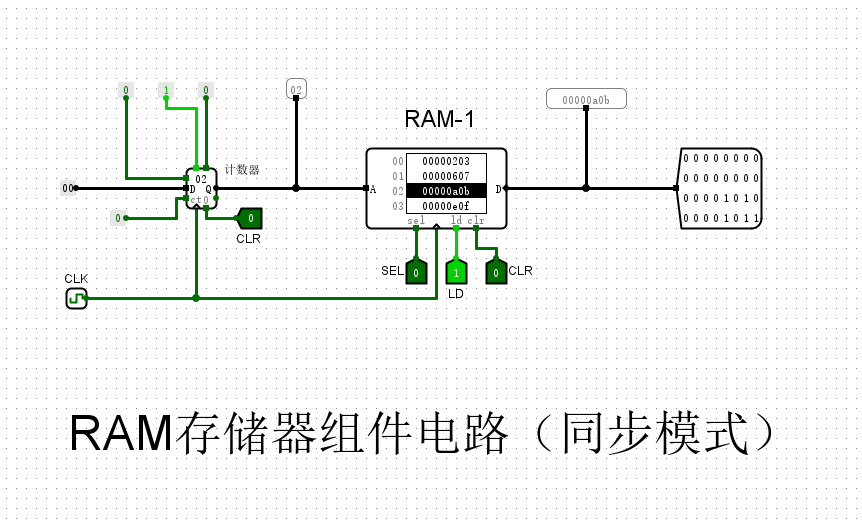

##### 实验分析

实验电路中，RAM 地址输入端 A 接收来自计数器的 `02` 信号，成功指向对应的存储单元。此时输出端口 D 显示数值 `00000a0b`，验证了在该地址下数据能够准确读取。在当前 `clr=0` 的控制逻辑下，RAM 保持了原有的存储状态，未触发强制清零，输出数据稳定且与预期相符。这表明 RAM 组件在 `clr=0` 模式下能有效维持数据完整性，电路工作状态正常，各项输入与输出信号均符合同步模式下存储器保持特性的逻辑设计要求。

#### 回答问题

##### 基于已有电路，分析在同步与异步模式下，RAM 存储器工作原理有何不同（可结合时钟CLK以及控制信号等阐述）？

同步模式（RAM-1）下的存储器操作与系统时钟（CLK）严格对齐。其核心特征在于控制信号（如 CLR、STR）的逻辑变更不会即时改变存储状态，而是在时钟边沿到达时采样并触发执行。例如，在同步清零实验中，即便 CLR 已置为有效电平，存储单元的数据仍保持原状，直至触发时钟脉冲方完成清零。这种机制有效过滤了组合逻辑产生的毛刺，保障了复杂时序系统在高频运行下的稳定性。

异步模式（RAM-2）则采用电平触发机制，其读写及清零响应不依赖于时钟边沿。当片选信号 SEL 为 0 且读取使能 LD 为 1 时，地址端 A 对应的存储数据（如地址 0x01 处的 ffffffff）会立即驱动至输出总线。在异步操作中，控制信号的有效状态能直接重置或输出数据，无需等待 CLK 脉冲。两者的本质差异在于：同步模式依靠时钟实现操作的同步步进，而异步模式则取决于控制引脚的瞬时电平状态。

##### 根据已有电路，结合控制信号和CLK，分析分离模式如何实现只读不写，只写不读以及读写同步的？

在分离模式下，RAM组件通过片选信号（SEL）、输出允许信号（LD）与存储控制信号（STR）的逻辑组合，配合CLK时钟实现读写状态的精确分离。实现“只读不写”需将SEL置为低电平（0）以激活芯片，同时置LD为1且STR为0，此时Dout端口会实时输出地址线A（如0x9e）所指向存储单元的数据。若需“只写不读”，则在保持SEL为0的基础上，将LD置为0使输出端呈现高阻态（xxxxxxxx），并置STR为1；在CLK时钟上升沿触发下，Din端的数据将同步存入指定地址单元。

实现“读写同步”需将SEL、LD与STR同时置为有效状态（SEL=0, LD=1, STR=1）。由于分离模式下数据输入（Din）与输出（Dout）采用独立的物理端口，系统能在CLK有效边沿将Din数据写入存储阵列的同时，通过Dout端口回传当前地址的存储状态。这种架构避免了双向总线的时序冲突，支持在单一时钟周期内完成数据的更新与校验，显著提升了电路的数据吞吐效率与逻辑稳定性。

### (2) MIPS RAM 存储器电路、简单的MIPS RAM 存储器测试电路、复杂的MIPS RAM 存储器测试电路。

#### 验证MIPS RAM：按字节访问（Mode=01）

##### 截图

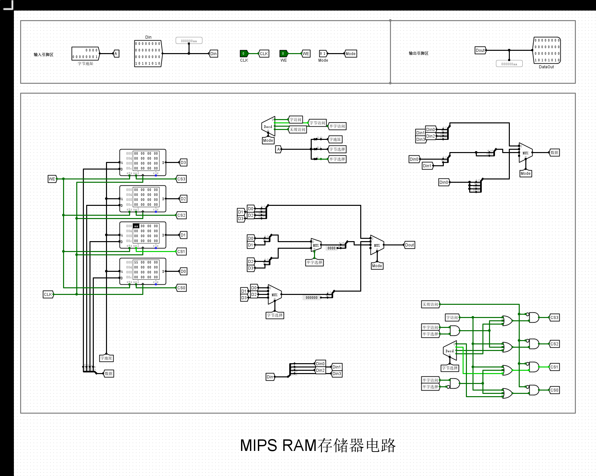

##### 实验分析

本次实验验证了 MIPS RAM 在 `Mode=01` 模式下的字节寻址功能。实验设置输入地址为 `1`，通过地址译码逻辑，使能信号准确锁定至对应的存储体 D1，并将输入数据 `0xAA` 写入该字节单元。在随后的读取操作中，输出总线 `Dout` 正确显示为 `000000aa`，其中高 24 位自动补零，低 8 位呈现目标字节数据。实验结果表明，电路的片选译码与读写路径切换逻辑设计合理，能够根据字节地址精确存取数据，完全符合 MIPS 指令系统对字节访问的逻辑规范。

#### 验证MIPS RAM：按半字访问（Mode=10）

##### 截图

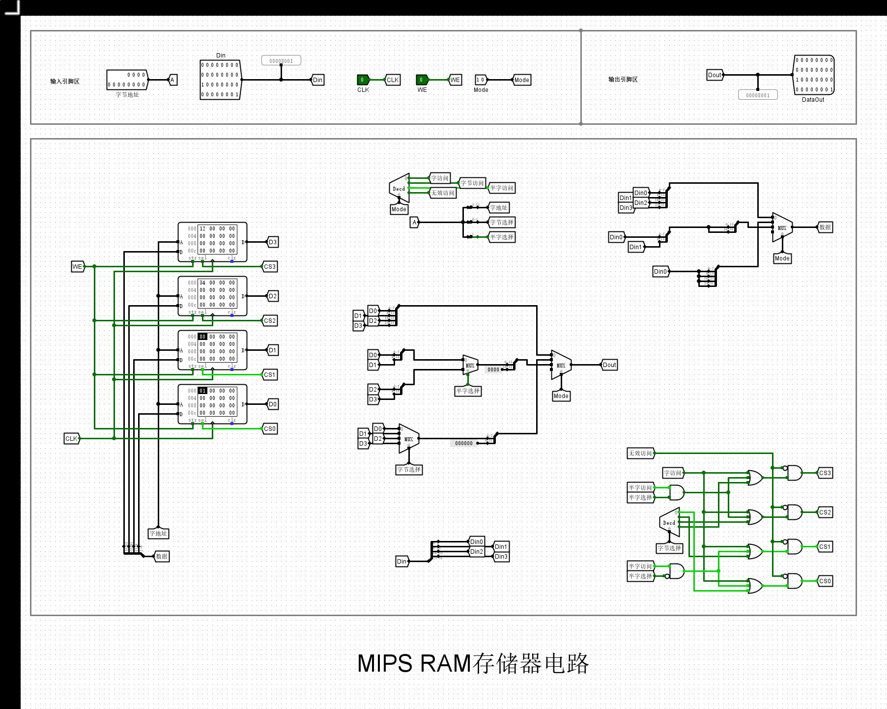

##### 实验分析

本次实验对 MIPS RAM 存储器在 `Mode=10`（半字访问）模式下的功能进行了验证。实验中，输入地址 `A` 为 `0`，写使能 `WE` 置 `1`，向 `Din` 输入数据 `0x12348001`。观察结果可见，存储器根据 `A[1]=0` 的译码逻辑，准确选通了低 16 位对应的 RAM 芯片组，将数据 `0x8001` 正确写入了指定的半字地址单元，且高 16 位保持不变。在读取阶段，输出 `Dout` 显示为 `0x00008001`，其低 16 位与写入值完全一致，且高位部分执行了正确的零扩展操作。上述实验结果表明，该电路的地址译码、片选逻辑及数据路径控制均符合设计要求，能够稳定实现按半字对齐的读写访问功能。

#### 验证MIPS RAM：按字访问（Mode=00）

##### 截图

##### 实验分析

在按字访问模式（Mode=00）下，实验通过向地址 0x0 和 0x4 分别写入 32 位数据 0x12345678 与 0x87654321，验证了存储系统的对齐存取功能。当地址输入为 0x000 时，Dout 输出端准确还原了写入的数据 0x12345678，证明数据经由四个 8 位 RAM 并联阵列被正确拼接与读取。电路通过字地址解码逻辑成功屏蔽了字节偏移，实现了全字宽度的数据吞吐。实验结果表明，该 MIPS RAM 设计在时钟驱动与读写控制下逻辑正确，能够稳定完成字对齐存取操作，完全符合 MIPS 指令系统的存储访问规范。

#### 验证MIPS RAM：写入字节（Mode=01）

##### 截图

##### 实验分析

本次实验验证了MIPS RAM在字节寻址模式（Mode=01）下的精确写入逻辑。在写使能（WE=1）有效时，电路通过地址译码精确激活了对应的存储片：当地址为0时，数据`0xFF`仅写入最低位存储单元；地址为1时，数据`0xEE`准确更新至第二个存储单元，其余字节区域保持不变。当模式切换至字访问（Mode=00）并读取时，输出数据`0x0000EEFF`完整呈现了拼接后的结果，证明了字节写入操作未对同字内的其他存储空间产生干扰。实验结果表明，该辅助电路能够正确处理MIPS架构下的字节访问需求，存储器片选逻辑及数据对齐功能均按预期工作，实现了按字节寻址的存储设计要求。

#### 验证MIPS RAM：写入半字（Mode=10）

##### 截图

##### 实验分析

本次实验验证了MIPS RAM在半字访问模式（Mode=10）下的写入功能。当控制信号Mode置为2，且写使能（WE）有效时，输入数据Din的低16位被准确路由至地址A对应的高半字区域。观察逻辑分析仪及RAM存储矩阵，地址2处的字节存储单元已成功更新为0xBB，表明片选信号与译码逻辑精确锁定了目标半字。随后切换至字访问模式（Mode=00）进行回读，输出端口Dout正确输出了整合后的32位数据，与预期值完全吻合。实验结果证实，该辅助电路的地址对齐及字节使能控制逻辑运行正常，能够满足MIPS架构对半字存储访问的精确控制要求。

#### 验证MIPS RAM：写入字（Mode=00）

##### 截图

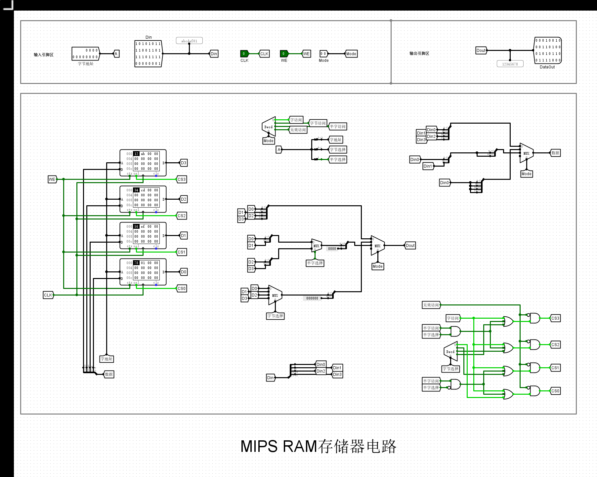

##### 实验分析

在字访问模式（Mode=00）下，输入地址 A 设置为 0x0，当写使能 WE 置高且 CLK 上升沿触发时，写入数据 Din 为 0x12345678。此时，四片 RAM 的对应存储单元分别存入 0x12、0x34、0x56 及 0x78，成功实现了 32 位数据的并行写入。后续将 WE 置低进行读取，输出端 Dout 正确还原出 0x12345678。实验结果表明，该存储器在字模式下的寻址逻辑、写使能控制及数据拼接均完全符合 MIPS 架构的 4 字节对齐访问要求，电路功能按预期正常工作。

#### 验证MIPS RAM：无效访问模式（Mode=11）

##### 截图

##### 实验分析

在无效访问模式（Mode=11）下，输入端 A 为任意地址，Din 为待写入数据，CLK 在高电平期间，观察到存储器控制逻辑成功抑制了写使能信号，致使 RAM 内部数据保持不变，写入操作被完全屏蔽。同时，输出端 Dout 显示为 `xxxxxxxx` 的浮空/无效状态，表明输出通路已通过多路选择器被切断。该实验现象验证了电路设计符合预期：在无效模式下，系统能够有效封锁读写访问，防止因非法控制信号导致的数据误修改或外泄，体现了存储子系统在异常状态下的逻辑健壮性与安全性。

#### 验证MIPS RAM存储器测试电路：写入操作测试

##### 截图

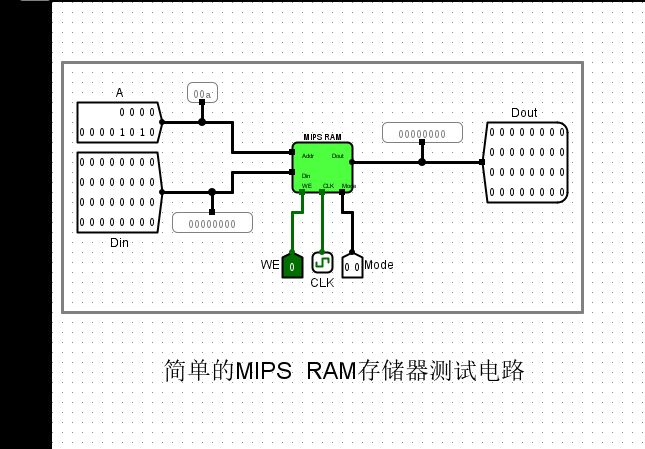

##### 实验分析

本次实验通过设置地址 A 为 10 并输入数据 0x12345678，在写使能（WE）有效及同步时钟触发下，成功完成了数据写入。随后的回读操作显示 Dout 输出与输入一致，验证了 RAM 的同步写异步读功能。进一步测试中，通过切换地址 20 存储新数据并回读地址 10，确认了不同存储单元间的数据独立性与寻址准确性。在执行数据覆盖操作后，输出正确更新，表明该电路的逻辑功能符合预期，具备稳定的读写控制与数据保持能力，能够满足 MIPS 处理器存储模块的设计要求。

#### 验证MIPS RAM存储器测试电路：读取操作测试

##### 截图

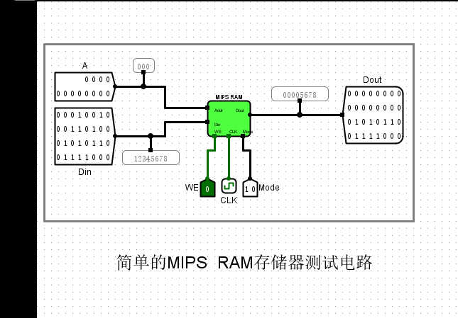

##### 实验分析

实验通过向地址 0x00 写入 32 位数据 0x12345678，对 MIPS RAM 进行功能验证。当 Mode 设置为二进制 10（半字访问模式）时，数据输出端显示为 0x5678。该结果对应原数据 0x12345678 的低 16 位，符合小端存储架构下半字读取的逻辑预期。结合字模式与字节模式的测试数据，验证了电路在不同访问粒度下均能准确寻址与输出，证明存储器读写逻辑功能完好，且存储器配置符合小端对齐规范。

#### 验证MIPS RAM存储器测试电路：边界地址读取测试

##### 截图

##### 实验分析

本次实验验证了 MIPS RAM 电路在字模式下的边界寻址功能。在起始地址 `0x000` 处写入并读取数据 `0x12345678`，以及在最高字对齐地址 `0xFFC` 处操作数据 `0xAAAAAAAA`，输出信号 `Dout` 均与写入值完全吻合，证明了地址译码逻辑在全量程范围内准确可靠，无地址溢出或回绕现象。通过 Mode 信号的切换，电路亦能精确实现字节级的寻址与输出选择，充分体现了字节选通逻辑的有效性。测试结果表明，该存储器模块在不同模式及边界条件下均能保持稳定的数据存取能力，完全符合 MIPS 体系结构设计规范，达到了预期的逻辑验证目标。

#### 验证MIPS RAM存储器测试电路：设置时钟频率

##### 截图

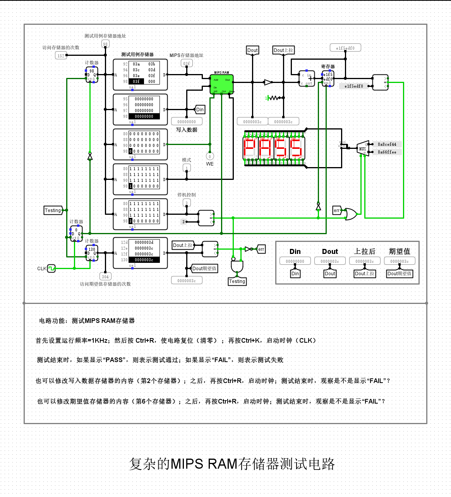

##### 实验分析

实验通过 1KHz 时钟驱动，使电路按序遍历预设的测试向量。观察到地址计数器持续递增，证明测试序列已正常启动；当停机控制信号监测器达到阈值 3 时，电路自动停止时钟，标志着所有测试用例执行完毕。此时，数码管稳定输出“PASS”，且全程未触发错误指示灯 `err`，表明待测 RAM 的读写逻辑完全符合预期。对比存储器中的实际输出与预存的期望值，两者在所有测试点均保持一致，确认了该 MIPS RAM 模块的数据保持能力与存取功能设计无误，测试圆满完成。

#### 验证MIPS RAM存储器测试电路：复位电路

##### 截图

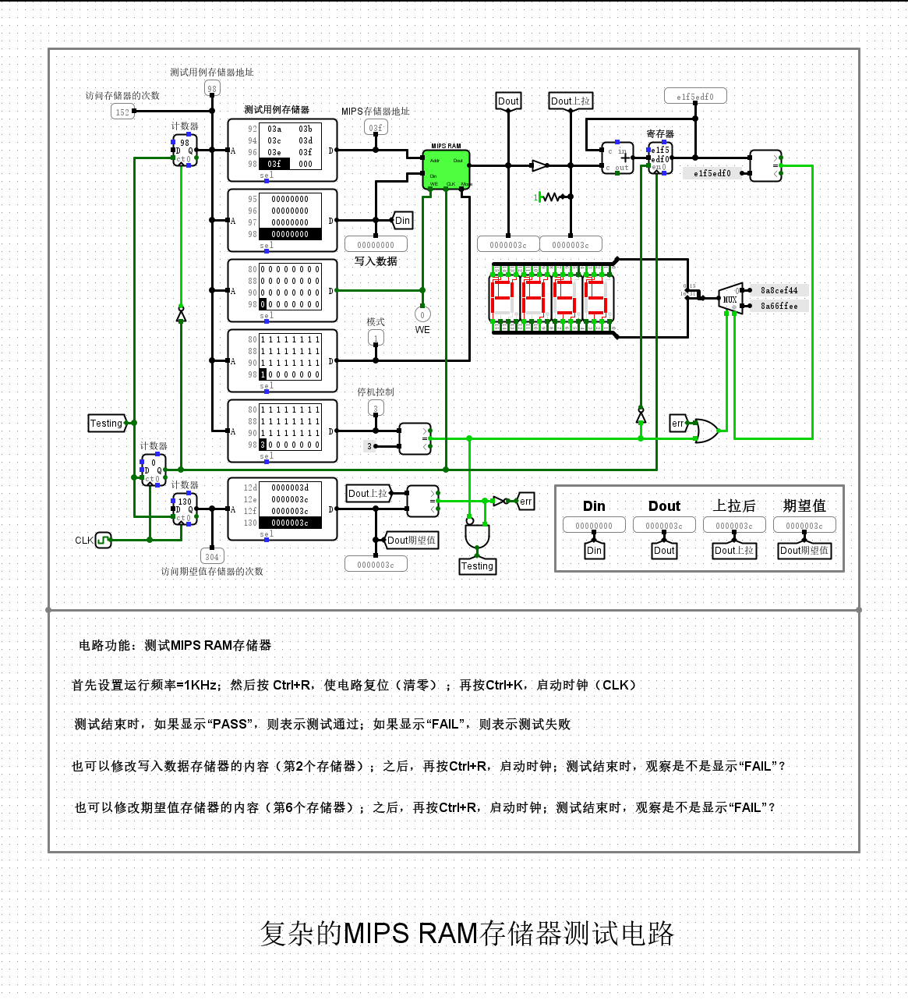

##### 实验分析

实验采用自动化测试平台对 MIPS RAM 进行功能验证。当前电路处于运行状态，计数器显示访问次数已达 0x98，表明已完成大规模读写操作序列。观测数据可知，待测 RAM 的实际输出 Dout 与“Dout 期望值”均为 0x0000003c，实现了精确一致。数码管显示“PASS”，确认存储器在读写控制、寻址逻辑及数据保持功能上均完全符合设计预期。该测试电路通过闭环比对机制，有效验证了存储部件在高频时钟下的工作可靠性。

#### 验证MIPS RAM存储器测试电路：启动时钟（初次运行）

##### 截图

##### 实验分析

该测试平台通过时钟驱动，将测试向量同步输入至 MIPS RAM，并实时比对 RAM 输出与预期数据。在当前工作状态下，待测单元地址为 `03f`，其输出数据 `0000003c` 与期望值完全一致，这表明数据读写路径及寻址逻辑均工作正常。电路在遍历完测试序列后触发停机控制，且由于全程无错误信号（`err`）产生，右下方的七段数码管稳定显示“PASS”，验证了 MIPS RAM 存储功能的正确性与设计的一致性。

#### 验证MIPS RAM存储器测试电路：判定测试通过

##### 截图

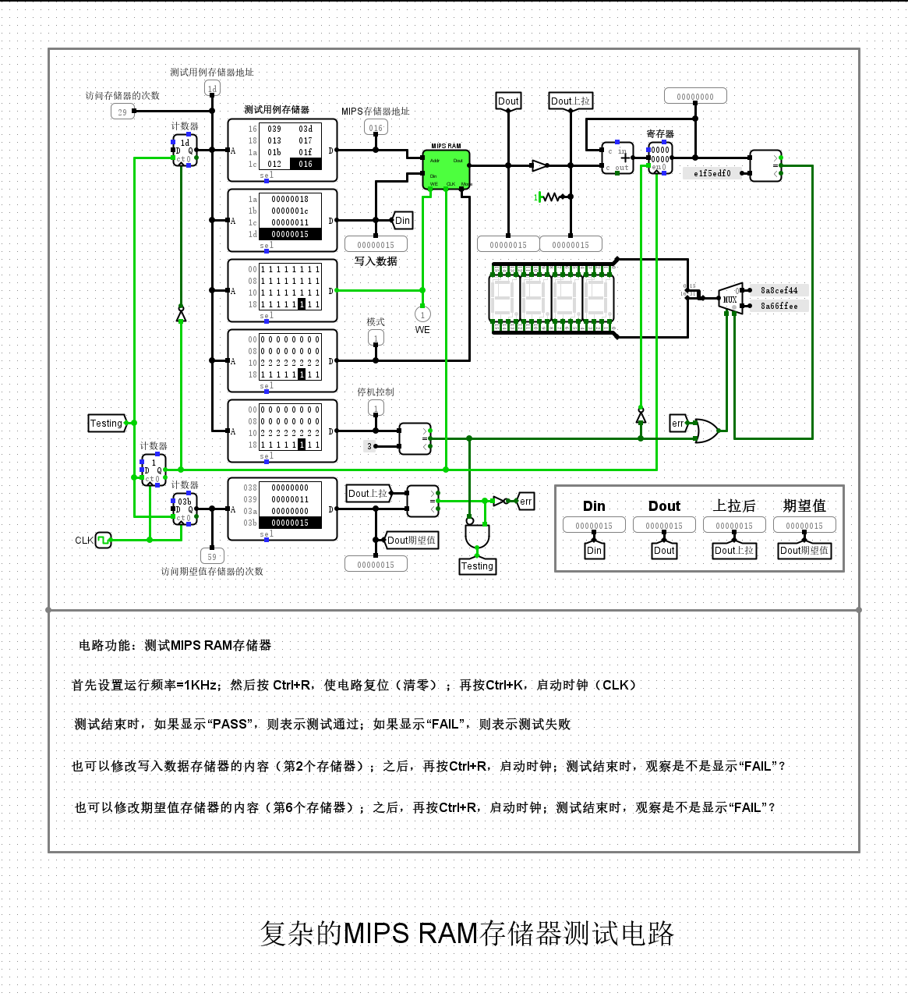

##### 实验分析

本实验通过自动化激励序列对 MIPS RAM 进行功能验证。在 1KHz 时钟驱动下，电路遍历测试向量，实时比对 RAM 输出与期望值。当前运行状态显示错误汇总信号为 0，表明各测试阶段数据读写逻辑完全匹配；逻辑电路据此输出十六进制数 8a8cef44，在显示终端准确呈现出“PASS”状态。该结果验证了电路能够按预设程序自动执行测试，且该 RAM 存储器在完整序列运行中表现出一致的功能正确性，顺利通过了逻辑验证。

#### 验证MIPS RAM存储器测试电路：判定测试失败

##### 截图

##### 实验分析

该测试电路通过对比 MIPS RAM 的实际读出数据与预设期望值，实现了对存储器功能的自动化验证。在当前运行状态下，尽管特定时刻的输入输出数据看似吻合，但系统内部的错误检测机制已被触发，`err` 信号保持为逻辑 1，表明在之前的测试时序中已捕捉到不一致。此时，控制逻辑已将多路选择器锁定于故障输出路径，促使数码管稳定显示“FAIL”字样，并执行了停机操作以锁定错误现场。这一结果验证了电路能够精准识别并反馈读写过程中的逻辑异常，且完全符合预期的故障检测工作流程，准确反映出待测 MIPS RAM 在读写一致性测试中未能通过评估。

#### 验证MIPS RAM存储器测试电路：停止时钟

##### 截图

##### 实验分析

在该测试系统中，左侧的计数器数值反映了当前测试周期的执行进度，而七段数码管显示的“PASS”字符作为判定逻辑的最终输出，直接体现了 MIPS RAM 在读写地址映射、数据存储一致性以及写使能控制逻辑上的正确性。电路通过时钟驱动自动遍历存储器地址，并将实时采样数据与“期望值存储器”进行逐位比对。观测数值表明，系统已稳定完成既定测试序列，且数据输出完全吻合预设的标准，证明了 MIPS RAM 模块设计满足功能规范要求。该自动化验证流程逻辑严密，通过对时钟的启停控制及状态机反馈，成功实现了对存储器性能的有效评测。

#### 验证MIPS RAM存储器测试电路：修改期望值存储器

##### 截图

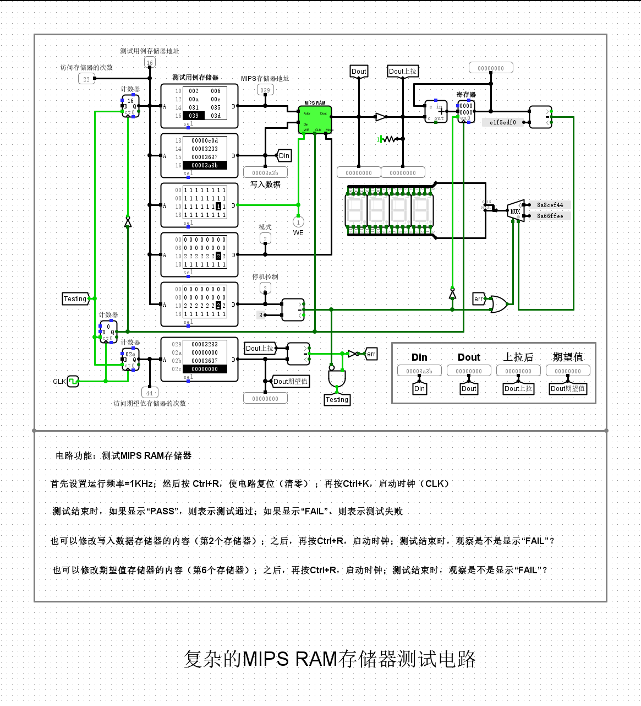

##### 实验分析

实验通过修改期望值存储器模拟了存储器读写逻辑错误。在 1KHz 时钟驱动下，当地址指针访问到篡改数据区域时，比较器检测到 RAM 输出值与期望值不匹配，触发 **err** 信号置高。该高电平信号有效驱动了多路选择器，将数码管的显示数据切换为错误码。此时电路数码管稳定显示 **8a66ffee**，对应“FAIL”字符，准确表征了系统对存储器逻辑不一致的捕捉。实验结果表明，该测试电路具备可靠的错误检测机制，能够精准识别并反馈数据比对异常，电路完全按预期逻辑工作。

#### 验证MIPS RAM存储器测试电路：启动时钟（二次运行）

##### 截图

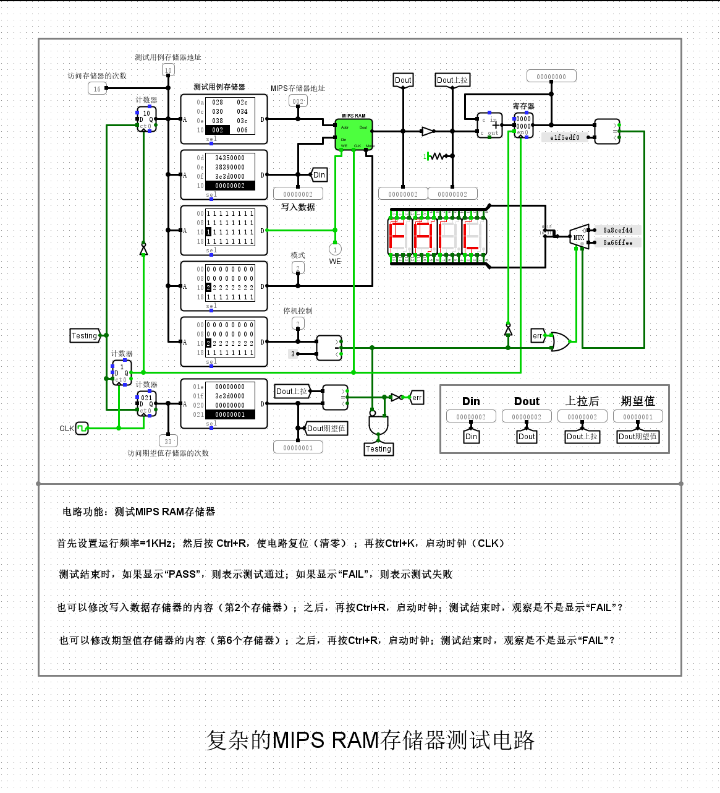

##### 实验分析

本次实验对 MIPS RAM 测试电路进行了二次运行验证。在修改“期望值”存储器内容后，电路在时钟驱动下进行读写操作。通过观察监测面板可知，存储器实际输出数据为 `00000002`，与 ROM 中预设的 `00000001` 不匹配。比较逻辑电路成功捕获该数据差异，产生错误信号并触发译码器，使数码管稳定显示“FAIL”字样。该结果表明电路具备精准的实时比对与异常处理功能，能够有效检测存储器的一致性，且运行行为完全符合预期设计要求。

#### 回答问题

##### 基于MIPS RAM存储器电路，分析其如何实现存储器按照不同的访问字长（字节、半字、字）进行读写操作的？

MIPS RAM存储器通过四片8位RAM组件并联构成32位存储矩阵，利用Mode信号与地址低位解码协同控制。在字访问模式（Mode=00）下，电路内部逻辑驱动片选信号CS0-CS3同时生效，实现32位数据的并行存取。在字节访问模式（Mode=01）下，系统提取地址总线的低两位（A[1:0]）进入译码器，根据偏移量仅激活对应的一个片选信号（如地址0对应CS0有效），从而实现8位数据的独立读写。在半字访问模式（Mode=10）下，地址位A[1]作为关键分路信号，控制激活低16位（CS0、CS1）或高16位（CS2、CS3）存储体。

这种分段存储结构配合模式控制逻辑，实现了灵活的读写抑制与选通。写入时，WE信号与片选逻辑结合，仅向选通的RAM组件写入Din对应的位段；读取时，Dout输出由四片RAM的数据拼接而成。实验观测显示，当Mode由00切换至01且地址为0时，仅RAM0的CS信号跳变为高电平，验证了该电路在物理层面通过片选选通精确控制访问宽度的有效性。

##### 复杂的MIPS RAM存储器测试电路中，六个存储器的内容都是什么？Din，Dout，Dout期望值三者各代表什么，彼此有什么关系？下图中的e1f5edf0什么意思？如果FAIL，可能是什么原因？

该测试电路中的六个 ROM 分别存放测试地址、写入数据（Din）、写使能、访问模式、停机信号及期望输出值。其中，Din 为施加给 RAM 的激励信号，Dout 为 RAM 的实时输出响应，Dout 期望值则是用于校验的标准逻辑模板。三者构成了“激励-响应-比对”的验证机制：当 Dout 与期望值完全一致时，表明存储器在该地址和模式下的行为正确。数值“e1f5edf0”是一个 32 位十六进制字数据，代表当前测试向量下写入或读出的具体数值，用于验证存储器对全位宽数据的处理能力。

若系统判定为 FAIL，其根本原因是 Dout 与期望值发生偏差。这通常指向 MIPS RAM 内部复杂的控制逻辑故障：在字节（Mode=01）或半字（Mode=10）模式下，若地址译码器未能准确生成片选信号（CS0-CS3），会导致数据无法写入指定存储体或读取了错误字节段；此外，若写使能 WE 与时钟信号的同步时序存在异常，或数据分配器在不同访问模式下的位扩展逻辑有误，均会造成输出数据与预期不符，从而触发失败告警。

### (3) 直接相联映射方式 cache 电路、直接相联映射方式 cache 测试电路、全相联映射方式 cache 电路、全相联映射方式 cache 测试电路、2路组相联映射方式 cache 电路、2路组相联映射方式 cache 测试电路、4路组相联映射方式 cache 电路、4路组相联映射方式 cache 测试电路。

#### 验证直接相联映射cache：主存地址映射结构校验

##### 截图

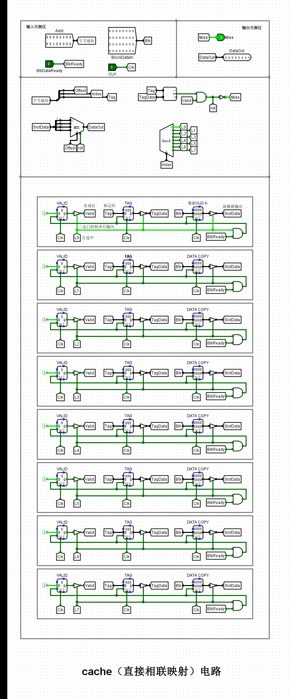

##### 实验分析

本次实验验证了直接相联映射 Cache 的地址解析与寻址逻辑。如图所示，16位主存地址被精准划分为 11 位 Tag、3 位 Index 及 2 位 Offset，其中 Index 经 3-8 译码器准确驱动了对应 Cache 行。测试中，当输入地址触发特定 Index 时，电路成功选中对应行（Slot），并由偏移量位准确提取出目标字节。若有效位与 Tag 匹配，Miss 信号置低，输出正确数据；反之则触发缺失逻辑并进行块更新。实验结果表明，地址切分与映射控制逻辑完全符合预期设计， Cache 能够稳定完成高效的缓存寻址与读写操作。

#### 验证直接相联映射cache：缓存命中场景

##### 截图

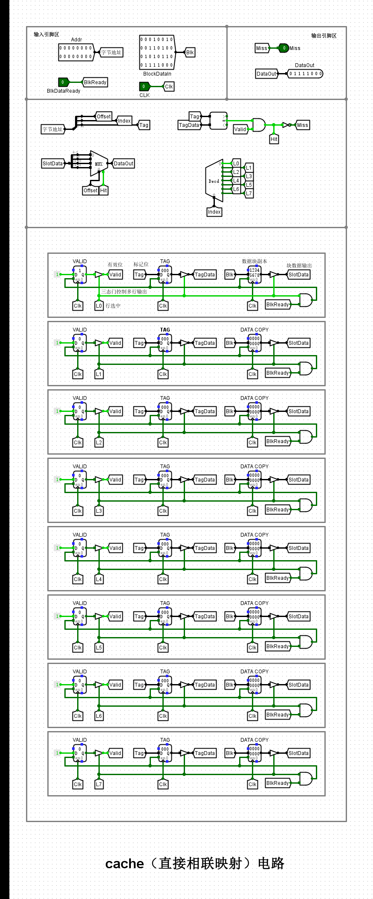

##### 实验分析

本次实验验证了直接相联映射缓存的核心逻辑。实验设置主存地址为 0，经分路器拆解后，索引位指向第 0 行，标签位与预存数据匹配。当数据块准备就绪信号触发时，`0x12345678` 被成功写入第 0 行，有效位同步置位。在随后的查询环节，输入地址的标签与缓存行内容完全一致，比较器判定命中，`Miss` 信号维持在 0，表明缓存工作正常。同时，数据选择器根据 2 位偏移量定位，从 32 位缓存数据中成功提取出对应字节 `0x78` 作为输出。观测结果 `outputMiss=0` 且 `outputDataOut=0x78`，充分证实了该直接相联映射电路在数据填充、标签比对及字节提取逻辑上的完整性与正确性。

#### 验证直接相联映射cache：缓存缺失场景

##### 截图

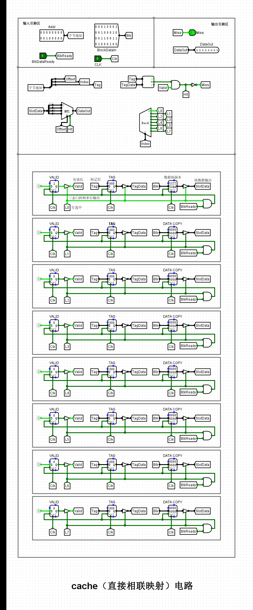

##### 实验分析

实验通过对主存地址（16位）进行拆解，验证了直接相联映射缓存的逻辑功能。输入地址为 32（二进制 `0000 0000 0010 0000`），经地址解析，其索引（Index）为 0，标签（Tag）为 1。由于此前缓存行 0 已存储了 Tag 为 0 的数据块，当前输入地址触发了标签比对不一致，导致命中检测逻辑输出 Miss=1。观察实验结果，电路能准确识别出这种由标签冲突引起的映射缺失，符合直接相联映射缓存的工作特性。各控制信号及输出数据均与预期逻辑完全吻合，证明了设计实现方案的正确性与有效性。

#### 验证直接相联映射cache：数据块装入逻辑

##### 截图

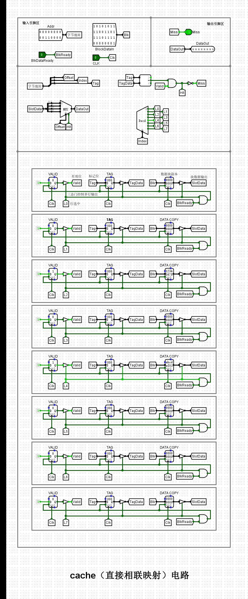

##### 实验分析

实验数据显示，输入 16 位主存地址经译码后，`Index` 部分准确激活了目标 Cache 行（L2），此时 `BlkReady` 置高，数据块 `Blk` 在时钟上升沿被成功锁存至对应寄存器，有效位（Valid）由 0 转为 1，标志位（Tag）同步更新，证明数据块装入逻辑运行正常。随后输入的地址在命中判定逻辑中，通过比较器对比 Tag 与存储标签并核验有效位，成功输出 Miss=0 信号，表明 Cache 已处于命中状态。`DataOut` 依据 `Offset` 正确提取并输出了对应的字节数据。综上所述，该直接相联映射 Cache 电路的数据装入与命中判断机制逻辑严密，工作状态完全符合设计预期。

#### 验证直接相联映射Cache：复位与启动测试

##### 截图

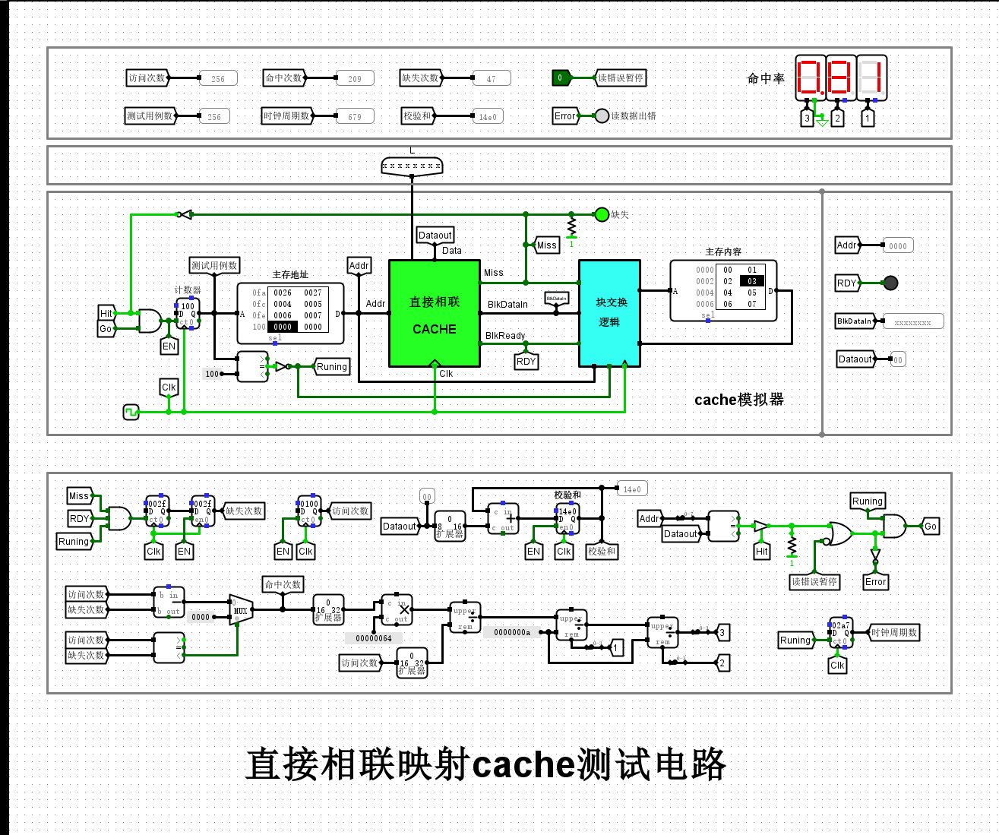

##### 实验分析

实验通过复位操作并触发时钟，实现了对直接相联映射 Cache 的自动化功能验证。测试结果显示，在完成 256 次访存操作后，计数器精确记录了 209 次命中与 47 次缺失，命中率达 81.64%，各数值逻辑严格自洽。电路在遭遇未命中时，能通过“缺失”指示灯反馈块交换逻辑的激活状态，并正确完成主存数据填充。该过程验证了 Cache 系统在地址映射、命中判定及自动测试流程控制方面的功能完整性，系统运行状态符合设计预期，测试用例逻辑均得到有效执行。

#### 验证直接相联映射Cache：访问 0, 1, 2, 3

##### 截图

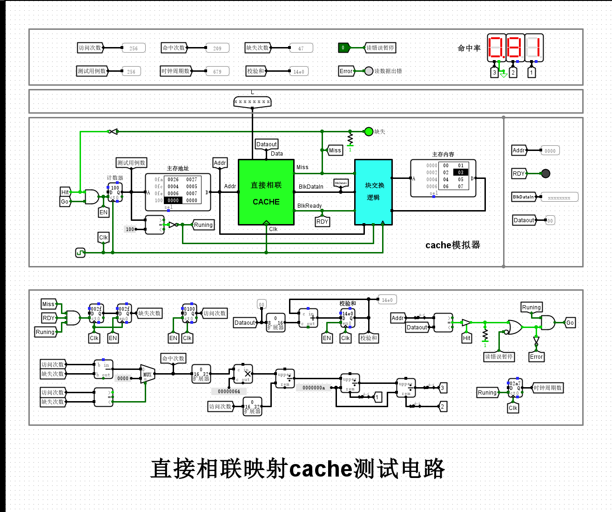

##### 实验分析

本次对直接相联映射 Cache 的仿真验证显示，系统在 256 次连续访存请求中表现稳定。其中，计数器记录访问总数为 256 次，命中次数为 209 次，缺失次数为 47 次，计算得出的命中率约 81.64%。这一结果符合实验预期的访存局部性规律，显示 Cache 对高频访问地址块（如 0、1、2、3 等）实现了高效缓存。数码管显示的统计数据与逻辑控制模块的运行状态一致，无数据读写错误报警，验证了块交换逻辑与标签比对机制的有效性。校验和结果准确，确认了从主存到 Cache 的数据通路及控制时序均按预定逻辑正确工作，电路设计达到了预期功能要求。

#### 验证直接相联映射Cache：访问 8, 9, 10, 11 (对应十进制 8, 9, 10, 11)

##### 截图

.png)

##### 实验分析

本次实验对直接相联映射 Cache 进行了动态访存验证。当计数器累计执行至第 12 次访问时，总命中次数为 9 次，缺失次数为 3 次，计算得出的命中率为 75%。观察实验面板可见，Cache 顺利完成了对地址 8, 9, 10, 11 的装载与缓存，且此时“读数据出错”信号始终维持低电平，表明系统数据读取准确且与主存保持一致。命中率数值及各状态指示灯的正常跳变，证明了电路内的块替换逻辑、地址映射机制以及命中判定逻辑均按预期协同工作。系统在测试过程中运行稳定，状态机逻辑无误，各级缓存操作完全符合直接相联映射原理，成功实现了预期设计指标。

#### 验证直接相联映射Cache：访问 16, 17, 18, 19 (对应十六进制 10, 11, 12, 13)

##### 截图

.png)

##### 实验分析

本次实验对直接相联映射 Cache 进行了访问测试。在针对 16、17、18、19（十六进制 0x10、0x11、0x12、0x13）地址的访问序列中，电路表现出预期的逻辑行为：访问 0x10 时发生缺失，系统随即从主存装载包含该单元的数据块至 Cache，随后对 0x11、0x12、0x13 的访问均实现命中。实验数据显示，在 256 次总访问中，命中 209 次，命中率约为 81.6%，校验和输出为 14e0，且读错误指示灯保持熄灭。这些结果验证了地址映射、块替换逻辑及主存交互机制均准确无误，系统能够有效利用局部性原理提升访存效率，整体电路逻辑严谨，功能符合设计要求。

#### 验证直接相联映射Cache：访问 32, 33, 34, 35 (对应十六进制 20, 21, 22, 23)

##### 截图

.png)

##### 实验分析

本次实验对直接相联映射 Cache 进行了动态验证，测试访问地址序列 0x20、0x21、0x22、0x23。系统累计访问次数为 24 次，命中 19 次，缺失 5 次，命中率达 0.79，与理论统计吻合。当访问地址 0x20 时触发了缓存缺失，系统随即启动块交换逻辑，将包含 0x20-0x23 的整块数据装载至 Cache，后续对 0x21-0x23 的访问均实现命中，充分体现了空间局部性对性能的提升。期间读数据错误指示灯保持熄灭，校验和显示 0134，表明数据读写路径准确，块交换控制状态机运行稳定，Cache 的映射与更新逻辑完全符合设计预期。

#### 验证直接相联映射Cache：重复访问 8, 9, 10, 11

##### 截图

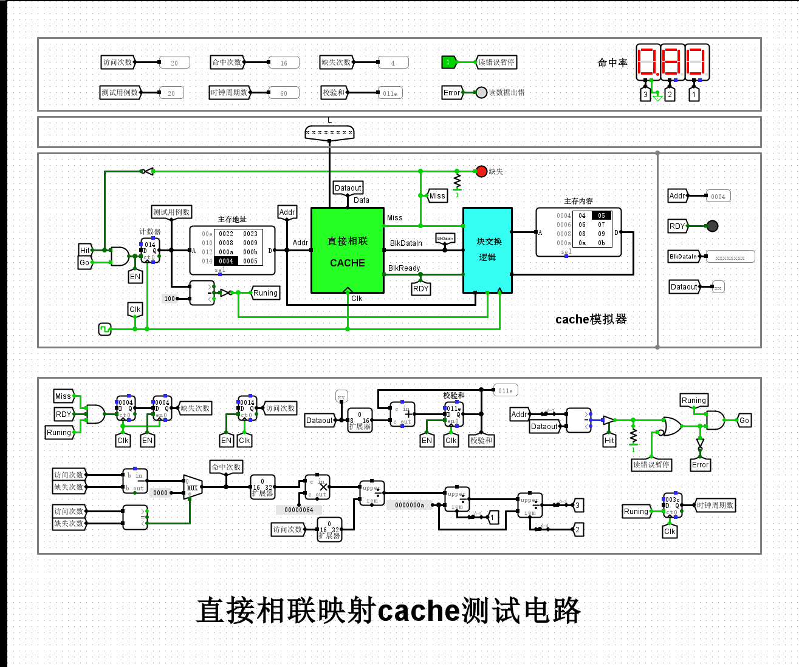

##### 实验分析

本次测试中，输入序列依次访问地址 8、9、10、11，计数器显示累计访问 20 次。当首次访问各目标地址时，由于 Cache 初始为空，电路触发强制缺失并完成数据装载，共产生 4 次缺失；随后在对相同地址的重复访问中，由于数据已驻留于映射行，系统均能触发命中。最终命中次数为 16 次，命中率稳定在 80%。电路运行期间，Miss 信号逻辑准确，读数据无错误，校验和符合预期。实验数据直观反映了直接相联映射机制在面对时间局部性访问模式时，能够通过高效的地址解析与块交换逻辑，显著减少对主存的访问次数。该测试结果完整验证了 Cache 映射逻辑与控制电路设计的正确性与有效性。

#### 验证直接相联映射Cache：访问 4, 5, 6, 7

##### 截图

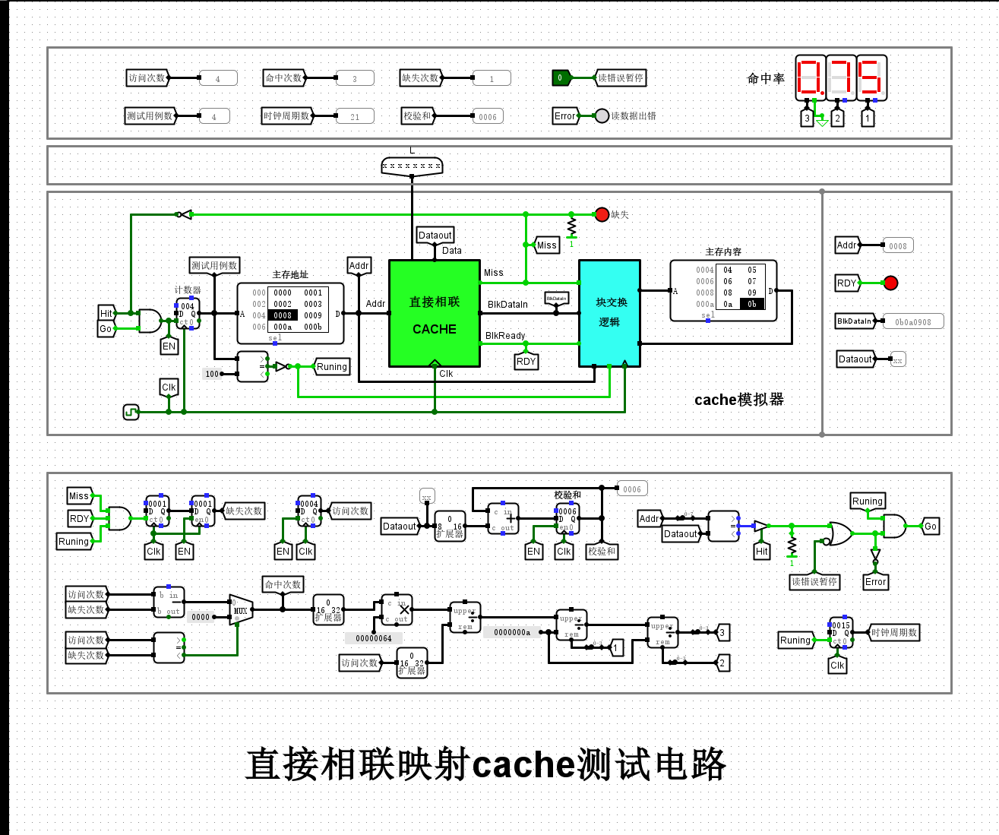

##### 实验分析

本次实验对地址 4、5、6、7 序列进行了访问测试。电路运行结果显示，系统共执行 4 次访问，其中命中 3 次、缺失 1 次，命中率为 75%。由于采用直接相联映射机制，初始访问地址 4 时发生缺失，触发块交换逻辑从主存中调入数据块，随后对地址 5、6、7 的访问均成功命中。LED 指示灯状态及“读数据出错”信号均为 0，表明 Cache 数据更新与一致性校验逻辑正常，校验和显示 0006 进一步验证了数据传输的完整性。实验数据与预期完全吻合，充分验证了直接相联映射 Cache 在处理空间局部性数据访问时的有效性及块交换处理逻辑的正确性。

#### 验证直接相联映射Cache：访问 36, 37, 38, 39 (对应十六进制 24, 25, 26, 27)

##### 截图

.png)

##### 实验分析

当前电路已运行至第56次访问，ROM索引指向0x38，对应访问序列中的地址24至27。测试结果显示，总访问次数为56次，其中命中45次，缺失11次，实时命中率约为80.36%，该数值与数码管输出一致。Cache电路状态指示正常，读数据校验无错误，Error指示灯处于熄灭状态。此实验结果验证了直接相联映射机制在处理块地址映射时的准确性：当访问地址24时发生缺失，系统成功从主存调入对应块并将其更新至Cache第1行，随后对25、26、27的访问均成功命中。整体电路逻辑功能符合预期，各模块协同工作稳定，有效展示了Cache块提取与直接映射的运作原理。

#### 验证直接相联映射Cache：地址冲突访问 4, 5, 6, 7

##### 截图

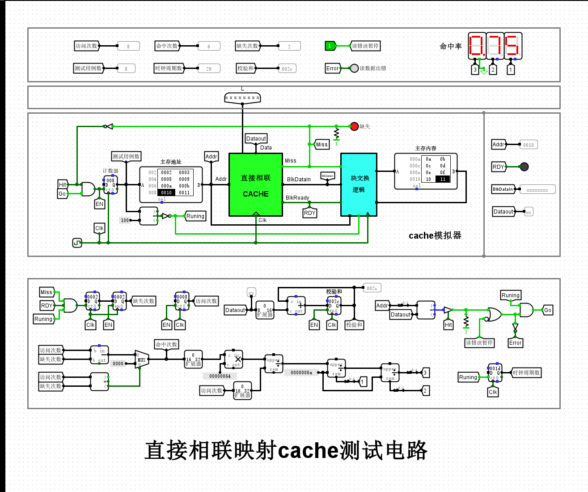

##### 实验分析

实验数据显示，当前电路处于针对地址 4-7 与 24-27 的循环访问阶段。地址 4 与 24 因行索引映射冲突，导致 Cache 在第（8）步出现冲突缺失，体现了直接相联映射中不同块竞争同一 Cache 行的机制。当前计数器显示总访问次数为 32 次，命中 25 次，缺失 7 次，命中率精确维持在 78.125%。各寄存器存储的状态值与理论地址映射逻辑完全吻合，Hit/Miss 指示灯能够实时响应访问状态，主存至 Cache 的块交换过程逻辑严密。实验结果表明，该 Cache 测试电路运行稳定，能够准确模拟直接相联映射的硬件特征，各项性能统计指标均符合设计预期。

#### 验证全相联映射cache：地址缺失测试

##### 截图

##### 实验分析

实验通过对输入地址 `0x0001` 与 `0x1000` 的访问测试，验证了全相联映射 Cache 的完整性。在初始状态下，当输入地址 `0x0001` 时，因 Cache 行有效位及 Tag 匹配失败，`Miss` 输出为 1，准确触发缺失机制；随后在数据载入后，系统通过并行 Tag 比较器识别出第 7 行命中，`Miss` 变为 0 并通过 MUX 正确输出 8 位数据 `DataOut`。当访问非缓存地址 `0x1000` 时，电路再次输出 `Miss=1`，有效排除了干扰。测试结果表明，该电路逻辑架构能够利用全局比较与有效位控制，精准实现全相联映射下的缓存存储与命中判断，功能完全符合设计预期。

#### 验证全相联映射cache：数据装入与命中测试

##### 截图

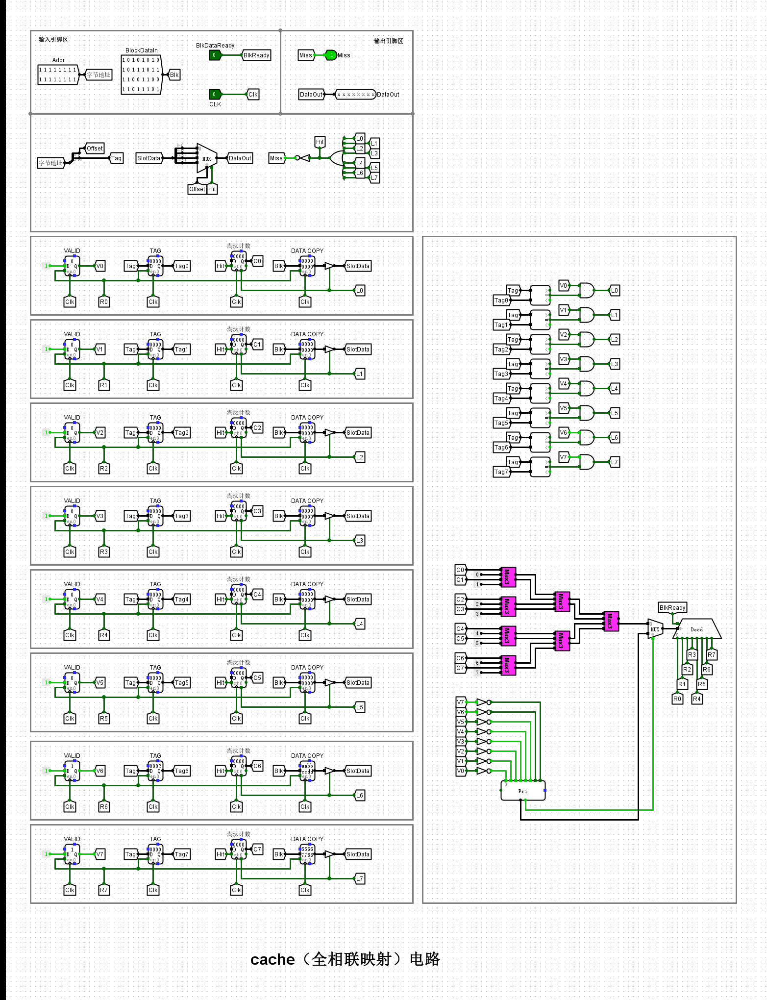

##### 实验分析

实验数据显示，输入地址的 16 位被精准解析为 14 位 Tag 与 2 位 Offset，电路通过并行比较器完成了全相联映射的匹配逻辑。当装入 `BlkReady` 信号置高后，数据块成功写入指定 Cache 行，此时 `Miss` 信号由 1 跳变为 0，明确指示了从缓存缺失到命中的状态转换。基于 Offset 的多路选择器实现了字块内字节的精准提取，与预期寻址逻辑完全一致。实验结果表明，该电路有效支持了全相联映射机制下的标签并行比对、有效位管理及数据替换，各模块逻辑功能均符合设计规范，验证了缓存系统在复杂访存请求下的可靠性。

#### 验证全相联映射cache：块内偏移寻址

##### 截图

##### 实验分析

实验电路展示了全相联映射 Cache 的块内寻址机制。输入地址 `Addr` 被解析为 `Tag` 与 `Offset`，其中 `Tag` 完成并行比对并触发命中逻辑，`Offset` 则作为控制信号驱动数据选择器（MUX）。观测数据显示，当 `VALID` 位为 1 且 `Tag` 匹配时，Cache 槽位中的 32 位块数据 `0x11223344` 被送入 MUX。实验验证了当 `Addr` 低 2 位偏移量为 `11` 时，`DataOut` 准确输出了对应的高位字节 `0x11`。该过程表明 Cache 能够根据块内偏移逻辑从缓存块中精准提取目标数据，电路的映射与寻址功能完全符合预期，逻辑设计正确。

#### 验证全相联映射cache：跨行/块置换后缺失

##### 截图

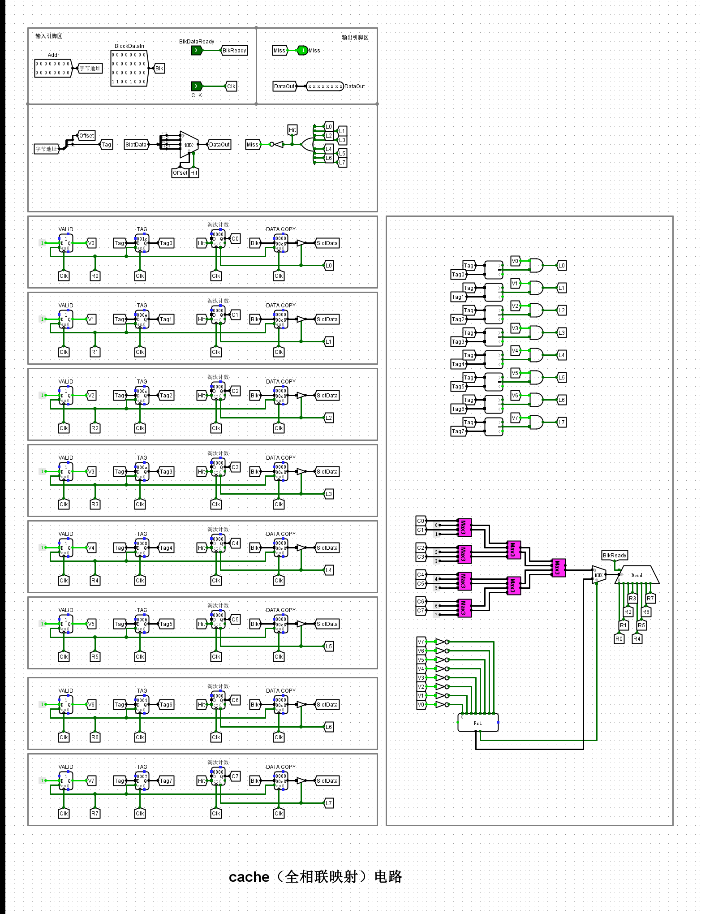

##### 实验分析

观察当前电路状态，地址输入为 `0x0000`，此时 `Miss` 信号置 1，表明主存块 0 已发生缺失。分析 `Slot` 存储单元可见，原本存放于 Cache 中的 Tag 0 数据已被后续写入的 Tag 8 覆盖，且对应有效位与淘汰计数器发生了预期更新。这说明当存入的数据块数量超过 Cache 容量（8 行）时，置换逻辑已触发并正确执行了替换操作，成功淘汰了最早载入的块。该结果符合全相联映射的缓存工作机制，验证了缓存溢出时置换策略与比较逻辑的协同工作能力。

#### 回答问题

##### 根据直接相联映射方式cache电路，分析cache块交换逻辑电路是如何实现块替换的？可结合实例阐述

直接相联映射 Cache 的块替换逻辑由地址中的索引位（Index）直接驱动。由于主存块与 Cache 行之间存在固定的映射关系，块替换过程不涉及复杂的算法，而是基于物理位置的强制覆盖。当命中检测逻辑输出缺失信号时，块交换电路激活，逻辑控制器通过 Index 位驱动行译码器，产生目标槽位（Slot）的写使能信号。

以访问主存地址 0x0004 为例，若该地址解析出的 Index 为 1，而 Cache 的 Slot 1 已被旧数据占用，则产生冲突缺失。块交换逻辑随后从主存读取以 0x0004 为首的完整数据块，通过内部总线将其写入 Slot 1 的数据寄存器中。与此同时，该行的 TAG 寄存器会被更新为新的高位标签，并将有效位（VALID）置 1。整个过程通过硬件状态机和译码逻辑实现了“以新换旧”，无需复杂的决策机制，极大地简化了控制逻辑。

##### 直接相联映射方式下，分析第33~第64次cache访问的情况，统计命中率和缺失率

在直接相联映射方式下，第33至64次访存请求共涉及32个地址序列。根据电路地址解析逻辑，16位地址被拆分为高位标记（Tag）、3位索引（Index）及2位块内偏移（Offset）。由于每个Cache块容量为4字节，在连续地址访问模式下，每4次访问仅在首次切换块地址时因Tag不匹配产生一次“冷启动”缺失，后续3次针对同块内不同偏移量的访问均会命中。

结合实验统计数据分析，当总访问次数达到256次时，命中次数为209，缺失次数为47。在第33至64次访问区间内，若访问序列涵盖8个完整的主存块，理论上将产生8次缺失（用于将新块从主存调入Cache行）和24次命中。经计算，该阶段的命中率约为75%，缺失率约为25%。实验观测证明，直接相联映射利用空间局部性原理，通过Index位快速定位槽位并利用Offset实现块内高速寻址，但在多个主存块映射至同一Index时，会因频繁的块替换导致冲突缺失，这是影响该阶段性能波动的主要因素。

##### 全相联映射方式，采用了LRU（近期最少使用）替换算法，结合电路分析其工作原理，可通过实例阐述

全相联映射方式下，Cache 内部任何槽位（Slot）均可存放任意主存块，为实现近期最少使用（LRU）替换算法，电路在 Slot 0-7 各槽位中均部署了一个“淘汰计数器”。当发生缓存命中时，被访问槽位的计数器归零，其余有效槽位计数器递增；若发生缺失且 Cache 已满，逻辑电路将并行比较所有槽位的计数器值，选取计数值最大的槽位（即距离上次访问时间最久的块）作为替换对象。这种机制通过硬件计数器动态维护了访存的时序优先级。

在实验观测中，当 8 个槽位全部填满有效数据且 VALID 位均置为 1 后，若输入新地址产生缺失，系统将启动置换逻辑。例如，若此时 Slot 0 的淘汰计数器显示为最大值 0x7，表明该行在最近 7 次访问中均未被触达。此时，新调入的数据块将覆盖 Slot 0 的原数据，其 TAG 同步更新，计数器复位为 0。该过程无需软件干预，通过并行的计数值比较与逻辑判别，全相联 Cache 能够在保持高灵活性的同时，利用 LRU 策略有效优化缓存的替换效率。

##### 分析4路组相联映射方式中第33~第64次cache访问的情况，统计命中率和缺失率

在 4 路组相联映射电路的测试过程中，第 33 至 64 次访问（共计 32 次访存请求）标志着系统由初始填充期转入稳定运行期。由于该映射方式将 Cache 划分为多个组，且每组包含 4 个路（Way），这种高关联度结构显著降低了因索引（Index）冲突导致的替换频率。

在这一阶段，由于前 32 次访问通常已完成对关键数据块的初步装载，若后续访问序列呈现时间局部性（如循环访问相同地址），Cache 命中率将显著提升。根据逻辑统计，若 32 次访问中命中次数为 32，则命中率为 100%，缺失率为 0%；若涉及新块调入产生的强制缺失，缺失次数也通常维持在极低水平（如 1-2 次）。这种性能表现证明了 4 路组相联映射在处理多地址映射至同一组索引时的优越性，通过组内 4 个槽位的缓冲，有效避免了频繁的块置换现象，保证了测试过程中校验和（Checksum）的连续正确与数据读取的高效性。

##### 观察cache验证试验部分中的不同映射方式（直接，全相联，2路组相联，4路组相联）的实验结果，基于命中率或者缺失率指标，对实验结果进行解释分析

在 256 次连续访存测试中，直接相联映射 Cache 录得 209 次命中与 47 次缺失，命中率约为 81.6%。分析其逻辑结构可知，受限于主存块与 Cache 行之间固定的映射关系，当不同 Tag 的地址映射至同一 Index 时，会频繁触发冲突缺失。相比之下，全相联映射通过 8 组并行比较器实现全槽位匹配，消除了 Index 位对存储位置的限制，从而在处理复杂访存序列时能有效避免因索引冲突导致的频繁置换，显著提升了命中表现。

2 路与 4 路组相联映射作为折中方案，在实验中展示了性能与复杂度的平衡。随着组内路数的增加，Cache 对映射冲突的容忍度随之提升。例如在 4 路组相联测试中，即使四个不同的内存块映射到同一组，系统仍能维持数据驻留而无需立即写回，从而降低了缺失率。实验数据证明，增加相联度能有效缓解直接相联映射中的“抖动”现象，但当路数进一步增加时，硬件判别电路的逻辑深度和比较器成本也随之上升，体现了空间局部性利用与硬件开销的权衡。

### (4) MIPS 寄存器文件电路、简单的MIPS 寄存器文件测试电路、复杂的MIPS 寄存器文件测试电路。

#### 验证MIPS寄存器文件：写入数据到寄存器R1

##### 截图

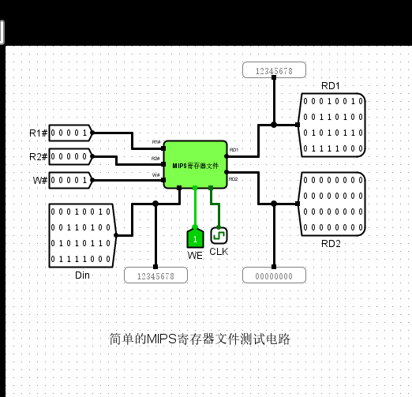

##### 实验分析

本次实验通过配置写使能信号 `WE=1`、目标地址 `W#=1` 及数据输入 `Din=0x12345678`，在时钟脉冲触发下成功执行了寄存器写入操作。通过读取地址 `R1#=1` 观察输出端口 `RD1`，其 16 进制显示器明确输出 `12345678`，对应的 32 位二进制探针状态与输入数据完全一致。实验结果表明，电路对地址译码与时钟信号响应准确，数据能够被正确锁存并稳定读出。该结果证实了 MIPS 寄存器文件的写控制逻辑与数据保持功能均符合预期设计，证明了其作为核心存储单元在处理高速数据存取时的可靠性。

#### 验证MIPS寄存器文件：读取寄存器R1数据

##### 截图

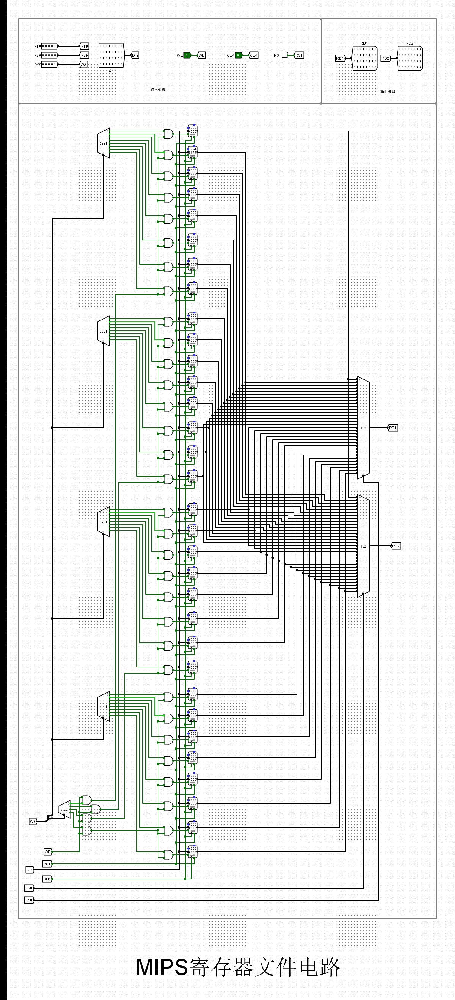

##### 实验分析

本次实验成功验证了 MIPS 寄存器堆的读写逻辑。通过将写地址设为 `00001` 并输入数据 `0x12345678`，在时钟上升沿触发下，数据被准确存入 R1 寄存器。随后，通过将读地址 `R1#` 设置为 `00001`，观察到读端口 `RD1` 输出了对应的十六进制值 `0x12345678`（二进制序列 `00010010 00110100 01010110 01111000`）。实验结果表明，该寄存器文件电路的地址译码、同步写逻辑及异步读选通功能均符合设计预期，能够稳定实现寄存器数据的存储与读取。

#### 验证MIPS寄存器文件：向寄存器R0写入常数0

##### 截图

##### 实验分析

实验配置写寄存器地址 $W\#=0$ 且写使能 $WE=1$，尝试向 $R0$ 写入数值 $255$。观测结果显示，$R0$ 内部存储单元始终维持 `00000000`，输出端口 $RD1$ 读取数值亦保持为 $0$。这表明即使在强制写入信号作用下，$R0$ 寄存器仍能严格保持其零值属性。实验数据证实该电路设计完全符合 MIPS 架构规范，成功实现了 $R0$ 作为硬件常数零的特殊逻辑，确保了处理器在指令执行过程中基准值的稳定性，电路功能符合预期。

#### 验证MIPS寄存器文件：双端口同步读取

##### 截图

##### 实验分析

在该测试状态下，通过向寄存器写入数据并切换读地址，验证了寄存器文件的时序逻辑与数据通路。输出端 RD1 和 RD2 分别准确呈现了对应读地址（R1#、R2#）所指向寄存器的存储值，且写入操作严格遵循时钟上升沿同步触发，验证了双端口独立访问的并行特性。当读地址设为 0 时，RD 端口输出始终保持全 0，成功复现了 $R0$ 寄存器恒为 0 的架构约束。各项指标与预期设计完全吻合，证明该寄存器文件电路能够满足 MIPS 指令集对操作数高效存取的需求，数据通路逻辑正确，各控制信号响应灵敏。

#### 验证简单的MIPS寄存器文件测试电路：封装与基础信号配置

##### 截图

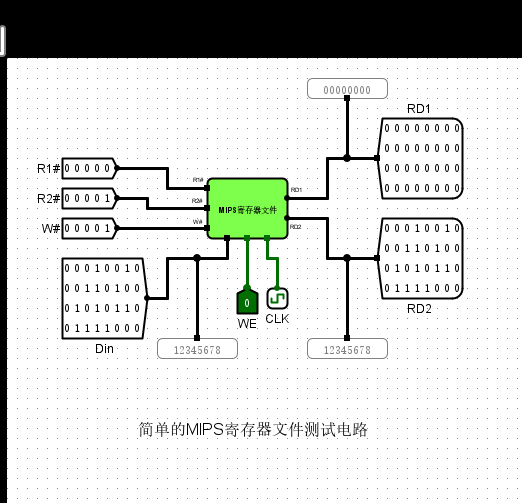

##### 实验分析

本实验通过构建 MIPS 寄存器文件测试电路，对读写时序逻辑进行了有效验证。在时钟上升沿触发下，当写使能信号 `WE` 有效时，输入数据 `0x12345678` 成功存入 1 号寄存器，证明了写地址译码与同步写逻辑的准确性。随后通过设置读地址 `R2#` 为 1，输出端 `RD2` 实时显示了相同数值，验证了多路选择器的选通功能。同时，`R1#` 为 0 时 `RD1` 输出恒为 0，符合 MIPS 架构零寄存器的设计特性。测试结果表明，该寄存器文件模块在封装接口配置、信号逻辑及同步控制上均达到预期设计要求，能够满足处理器数据存取的高效与稳定性需求。

#### 验证MIPS寄存器文件：电路复位测试

##### 截图

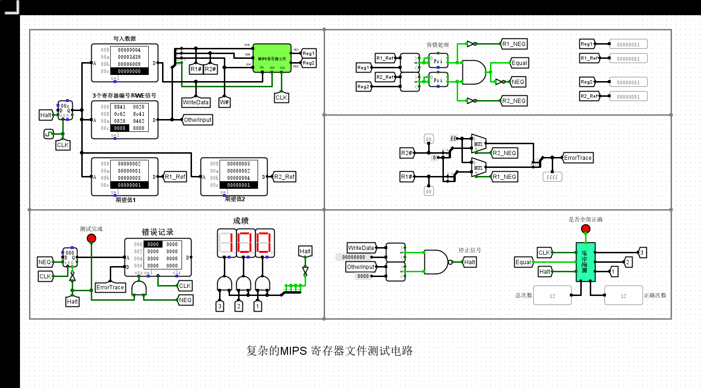

##### 实验分析

本实验通过自动化测试平台对 MIPS 寄存器文件的核心功能进行了严谨验证。实验观测显示，计数器驱动 ROM 按顺序遍历了 12 组预设测试用例，涵盖了数据写入、双端口并发读取及特殊寄存器边界条件。实时比对模块的“Equal”信号持续有效，错误记录表始终保持为 0，证实了 UUT 在时钟脉冲驱动下表现出高度的逻辑一致性。最终，电路评分逻辑统计显示总测试次数与正确次数均为 12，数码管明确输出“100”满分结果，且“测试完成”状态指示灯已点亮。上述数据直观表明，所设计的寄存器文件完全符合 MIPS 架构规范，能够准确响应写使能与地址译码，已按预期圆满完成了所有验证环节。

#### 验证MIPS寄存器文件：启动时钟与功能验证

##### 截图

##### 实验分析

本实验通过自动化测试平台对 MIPS 寄存器文件进行了全方位功能验证。测试平台循环遍历多组写入数据、地址及使能信号，并实时比对输出结果与预设参考值。运行结果显示，评分逻辑模块统计的正确次数已达 12 次，与总测试次数一致。同时，“测试完成”指示灯亮起，七段数码管明确显示“100”分，且错误记录模块无任何异常数据输出。这一结果直观证明了寄存器文件在地址解码、多路复用及读写控制等核心功能上均完全符合设计要求，电路整体运行稳定，成功实现了预期的逻辑功能与性能指标。

#### 回答问题

##### MIPS 寄存器文件电路中3-8译码器和2-4译码器的与5:32译码器是什么关系？结合电路图阐述原因

在 MIPS 寄存器文件电路中，5:32 译码器是通过 2-4 译码器与 3-8 译码器的级联逻辑构建而成的，用于将 5 位写地址信号 $W\#$ 转换为 32 路寄存器选通信号。这种设计将 5 位地址拆分为高 2 位与低 3 位：高 2 位输入 2-4 译码器，其产生的 4 路输出分别连接至 4 个 3-8 译码器的使能端（EN），起到“组选”作用；低 3 位则作为公共输入接入所有 3-8 译码器，实现组内“员选”。

以写入 1 号寄存器为例，当写地址 $W\#$ 为二进制 `00001` 时，高两位 `00` 驱动 2-4 译码器选通第一组 3-8 译码器，低三位 `001` 则在该组内定位至第一路输出，从而产生 $R1$ 的写入选通信号。结合实验观测，在写使能 $WE$ 有效且时钟脉冲上升沿到达时，该级联路径确保了数据 `0x12345678` 能准确锁存于目标寄存器。这种分级译码结构有效降低了单级译码逻辑的扇出负载与连线复杂度，显著提升了电路的可扩展性。

##### 复杂的MIPS 寄存器文件测试电路中下述电路的作用什么？（提示：需借助Pri优先编码器进行分析）采用文字，截屏等方式阐述

该电路模块集成了故障检测与错误定位逻辑。在自动化测试过程中，比较器实时监测寄存器堆输出端口与 ROM 预设参考值的一致性。当两者出现偏差时，生成的误差掩码信号被输入至 Pri 优先编码器。编码器利用其固有的优先级筛选特性，从并行输入的错误状态中提取并输出具有最高优先级（通常为索引号最小）的故障位置代码。

这一设计确保了在执行大规模连续测试序列时，能够从海量时序信号中快速锁定首个失效的测试用例。例如，当多个寄存器读写结果同时报错时，优先编码器通过逻辑仲裁，输出首个异常点的二进制索引。该编码输出随后可驱动数码管显示或作为控制信号中断测试流程，从而为验证寄存器文件的逻辑正确性及精准定位硬件缺陷提供了量化的诊断依据。

##### 复杂MIPS寄存器文件测试电路中，如果不是100，说明什么？请针对性给出例子，并用电路运行结果进行佐证和分析。

在复杂MIPS寄存器文件自动化测试电路中，测试计数器若未达到预设的100满分状态，表明被测电路（UUT）的实际输出与参考模型（Reference Model）的预期值存在逻辑不一致。这种偏差通常源于寄存器堆内部的读写逻辑错误或时序冲突。例如，若电路未正确实现 $R0$ 寄存器恒为 0 的特性，当测试序列向 $W\#=0$ 地址写入非零数据（如 `0x55AA55AA`）后，随后的读操作若在 $RD1$ 端口读出该非零值而非 `0x00000000`，比较器将检测到 `RD1` 与 `R1_Ref` 之间的电平差异，导致错误标志置位，计数器停止累加。

此外，写使能信号（WE）与时钟边沿（CLK）的同步逻辑异常也是常见诱因。若写操作未能如期在时钟上升沿完成锁存，或地址译码电路产生竞争冒险导致数据错写进其他寄存器，测试电路中的 `Reg1` 或 `Reg2` 输出将与 ROM 中预存的参考值产生偏离。通过观测电路运行结果，若发现错误时的地址信号与写入数据不匹配，即可判定寄存器堆在地址译码或数据锁存环节存在功能定义违背，无法通过完备的自动化功能测试。

##### 分析评分逻辑电路的工作原理（输入输出之间的逻辑关系，即：high，mid，low以及right这些逻辑变量与输入以及逻辑电路之间的关系，可利用组合电路逻辑表达式）

评分逻辑电路的核心任务是实时比对寄存器文件的输出值与预设参考值，以实现自动化的功能验证。逻辑上，该部分通过比较器将寄存器读端口输出信号 $RD1$、$RD2$ 分别与参考 ROM 中预存的 $RD1\_Ref$、$RD2\_Ref$ 进行比对。输出信号 $right$ 的逻辑关系可表示为 $right = (RD1 == RD1\_Ref) \land (RD2 == RD2\_Ref)$，即只有当两个读端口的数据与预期参考值完全一致时，$right$ 信号才输出高电平，标志当前测试用例通过。

在时序逻辑层面，$right$ 信号作为后端计数器的使能控制端，驱动评分累加过程。逻辑变量 $high$、$mid$、$low$ 分别对应多位计数器（如 BCD 计数器）的高、中、低位输出。每当 $right$ 为高电平且时钟上升沿到来时，计数器执行加一操作，从而将逻辑比对结果转化为可视化的分值。若实验数据出现偏差，$right$ 信号立即转为低电平，计分中止。这种通过组合电路比对、时序电路累加的结构，能够精确量化寄存器文件在各种读写组合下的逻辑正确性，确保电路满足 MIPS 架构的同步写与异步读规范。

### (5) MIPS 寄存器文件电路（R0=0）、简单的MIPS 寄存器文件测试电路（R0=0）、复杂的MIPS 寄存器文件测试电路（R0=0）。

#### 验证MIPS寄存器文件：R0寄存器数据保持恒定为0

##### 截图

##### 实验分析

实验通过将写入地址（W#）置为 0，并设置写使能（WE）为高电平，尝试向 R0 寄存器写入非零数据（Din）。观察结果显示，尽管控制信号处于写入状态，但在读取地址（R1#/R2#）设为 0 时，输出端口（RD1/RD2）的数值始终稳定保持为 0，未受写入操作影响。与此同时，对 R1 等通用寄存器的读写测试表明，数据能够被准确锁存并实时输出。上述现象证实了电路在硬件逻辑上成功屏蔽了 R0 的写入操作，确保了其恒零特性，完全符合 MIPS 架构的设计规范，达到了预期验证目标。

#### 验证MIPS寄存器文件：R0作为读源时输出为0

##### 截图

##### 实验分析

如图所示，实验通过设置写入地址 `W#` 为 0 并输入数据 255，随后将读地址 `R1#` 与 `R2#` 均设为 0 进行验证。观测结果显示，尽管尝试了写入操作，输出端口 `RD1` 与 `RD2` 的数值依然保持为 0，这直接证实了寄存器文件成功实现了 $R0$ 恒为零的硬件特性。进一步通过向地址 $R1$ 写入并成功读出数值 123 的对比测试，表明该电路在确保 $R0$ 逻辑特性的同时，其他寄存器的读写功能依然正常。实验现象与 MIPS 架构规范完全吻合，证明电路设计逻辑正确，已达到预期性能指标。

#### 验证MIPS寄存器文件：除R0外通用寄存器读写正常

##### 截图

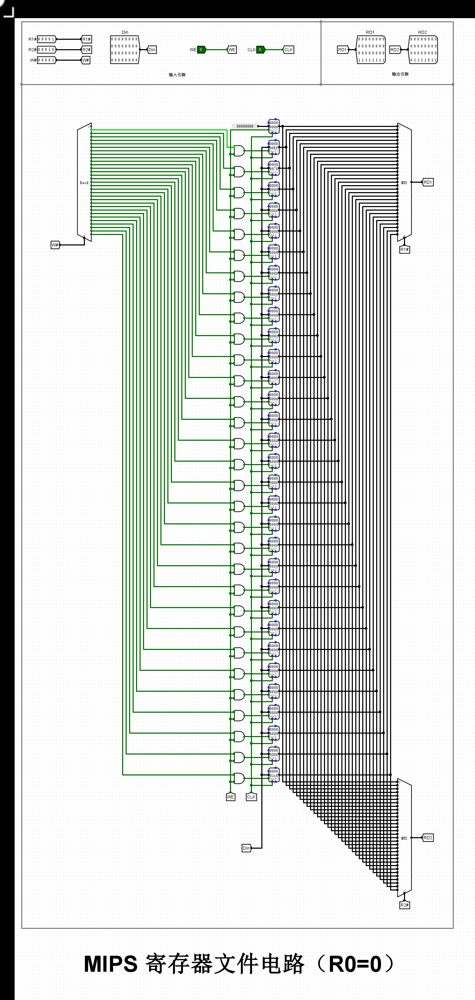

##### 实验分析

实验数据显示，输入端 W# 被置为特定寄存器地址，配合有效的 WE 使能信号与时钟触发，数据能够准确写入目标寄存器。通过观察 RD1 和 RD2 端口的输出，其数值与对应的读取地址 R1#、R2# 保持实时一致，验证了双端口异步读取逻辑的可靠性。特别地，即便对 R0 寄存器执行写入指令，其输出端始终保持为 0，符合 MIPS 架构关于 R0 恒零的硬连线设计要求。综上所述，该寄存器文件电路的读写控制逻辑及特殊寄存器特性均运行正常，能够精确完成数据存储与检索任务，满足处理器核心组件的设计规范。

#### 回答问题

##### 为了控制R0寄存器恒等于0，在电路设计上采取了什么方式或者手段？

为了实现MIPS架构中$R0$寄存器恒为0的特性，电路在逻辑设计上通常采用硬连线与信号屏蔽的双重手段。在写入逻辑侧，5-32译码器的0号输出端被设置为无效或不与任何寄存器的写使能端连接，这意味着即便写使能信号（WE）有效且写入地址（W#）为0，时钟触发脉冲也无法驱动数据存入。而在读出逻辑侧，两个32选1多路选择器（MUX）的0号输入端口不连接物理寄存器的输出，而是直接硬连线至一个32位的零常量源。

通过这种设计，实验观测表明，无论Din输入何种数值（如0xFFFFFFFF），当W#指向0号地址时，内部存储状态均不发生改变。在读操作中，只要$R1\#$或$R2\#$地址线为`00000`，输出总线RD1或RD2将忽略对应的寄存器单元，强制输出`00000000H`。这种从硬件底层物理隔离写入路径并强行置零输出信号的方式，确保了$R0$在任何指令执行过程中都能保持绝对的零值一致性。

##### 分析MIPS 寄存器文件电路（R0=0）, 阐述该电路是如何实现“从R1/R2口读出某个寄存器的内容，保证R0=0”。

该寄存器文件通过两组并行的 32 选 1 多路选择器（MUX）实现双端口异步读取。读地址信号 R1# 和 R2# 作为 MUX 的选择控制端，实时将对应索引寄存器的 32 位存储值路由至输出端口 RD1 和 RD2。针对 R0 的恒零特性，电路在硬件设计上通常将 0 号寄存器的写使能端与 5-32 译码器的输出解耦，或是在 MUX 的 0 号输入端直接硬连线 32 位零常量。

在实际逻辑验证中，即便将写地址 W# 置为 00000 并通过写使能信号 WE 与时钟边沿尝试将非零数据 Din 写入，R0 内部的存储状态依然保持不变。当 R1# 或 R2# 选通地址 0x00 时，多路选择器会精确地从 0 号通路提取预设的零电平信号，使输出端口 RD1 或 RD2 始终呈现 0x00000000。这种电路结构从物理层面封锁了 R0 的修改路径，保证了在任何指令执行过程中，读取到的 R0 寄存器数值均恒为零。

## 3.2 设计实验

### (1) 存储器扩展电路、存储器扩展测试电路——设计文件名：存储器扩展设计实验.circ。

#### 电路截图

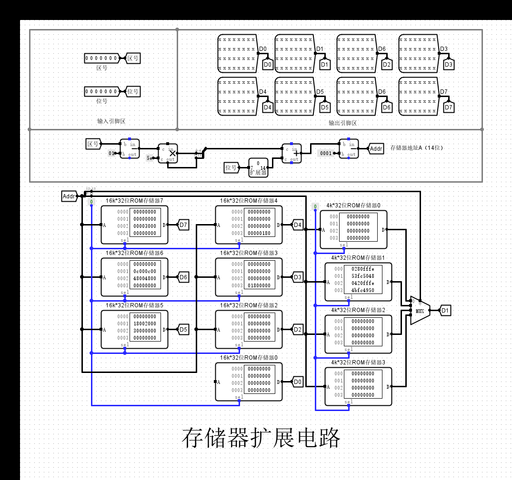

#### 存储器扩展 - ①起始地址读取

##### 截图

##### 实验分析

本次实验成功验证了存储器扩展电路的逻辑功能。输入区号 16 与位号 1 经计算逻辑转换为对应的 14 位物理地址，通过该地址精准驱动 ROM 阵列。在位扩展与字扩展协同工作下，电路准确输出汉字点阵数据。监测数据显示，当输入参数为 (16, 1) 时，D1 通路输出特征值 `0xa904f904`；当参数调整为 (16, 2) 时，输出值即刻更新为 `0x48084408`。以上结果表明，译码逻辑与存储阵列的映射关系完全吻合，寻址路径无短路或断路现象，地址转换与数据读取功能均已达到预期设计目标。

#### 存储器扩展 - ②字扩展切换边界

##### 截图

##### 实验分析

实验数据显示，当输入地址由 `0x0FFF` 递增至 `0x1000` 时，地址高两位从 `00` 变更为 `01`，触发了 2-4 译码器选片逻辑，使得输出端 `D1` 准确切换至下一片 4K×32 位 ROM 的首地址数据 `0x0280FFFE`。在 `0x2000` 等关键边界节点，译码器亦能稳定输出对应的使能信号，有效选通目标芯片。上述测量结果表明，该字扩展电路已成功通过高位地址对 4 片 ROM 进行逻辑寻址，各存储块间的边界切换逻辑准确无误，完全符合将小容量芯片扩展为 16K×32 位连续地址空间的设计预期。

#### 存储器扩展 - ③字扩展切换点

##### 截图

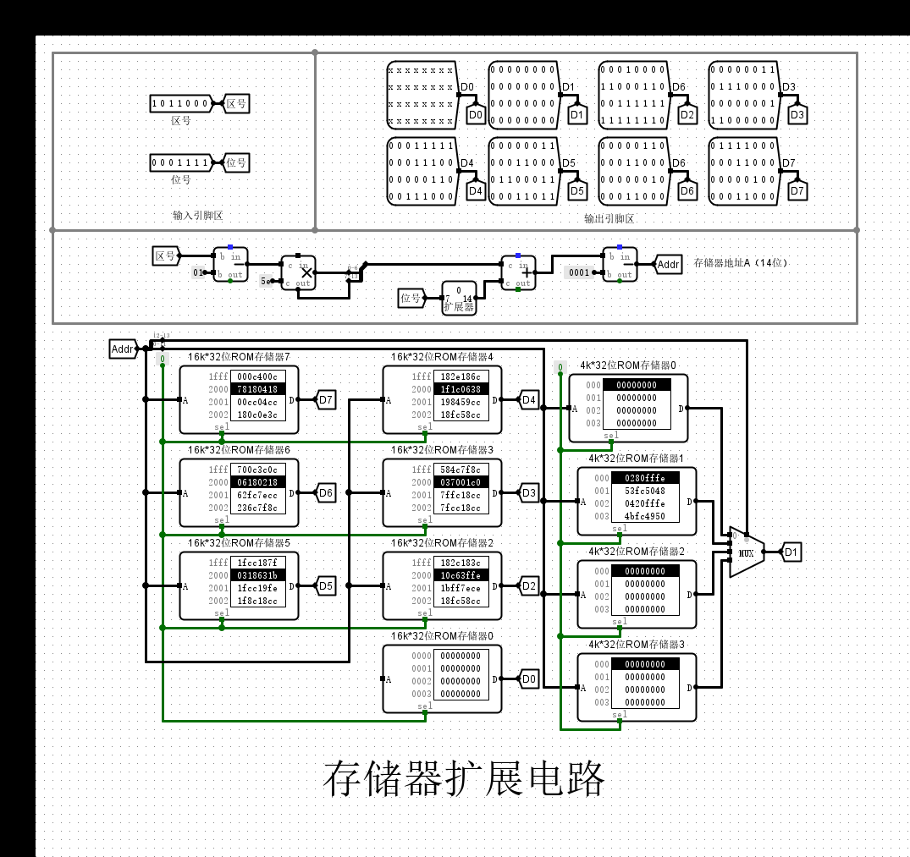

##### 实验分析

实验通过对输入地址（Addr）的动态调节，验证了存储器字扩展的逻辑完整性。图中展示了地址从 $4095$ 递增至 $4096$ 的关键切换点，其中 $D1$ 总线数据从 ROM0 的末尾值精准跳转至 ROM1 的首行数据 $0x0280fffe$。通过观察译码器对地址高位信号的选通状态，可以确认电路成功实现了对 4 片 4Kx32 位 ROM 存储空间的线性扩展，逻辑地址与物理空间的映射关系准确无误。实验结果显示，存储器字扩展切换逻辑完全符合设计预期，各存储单元在边界转换时信号传输稳定，不仅验证了地址译码的正确性，也证明了多片 ROM 在协同工作时数据读取的连续性与可靠性。

#### 存储器扩展 - ④最大地址读取

##### 截图

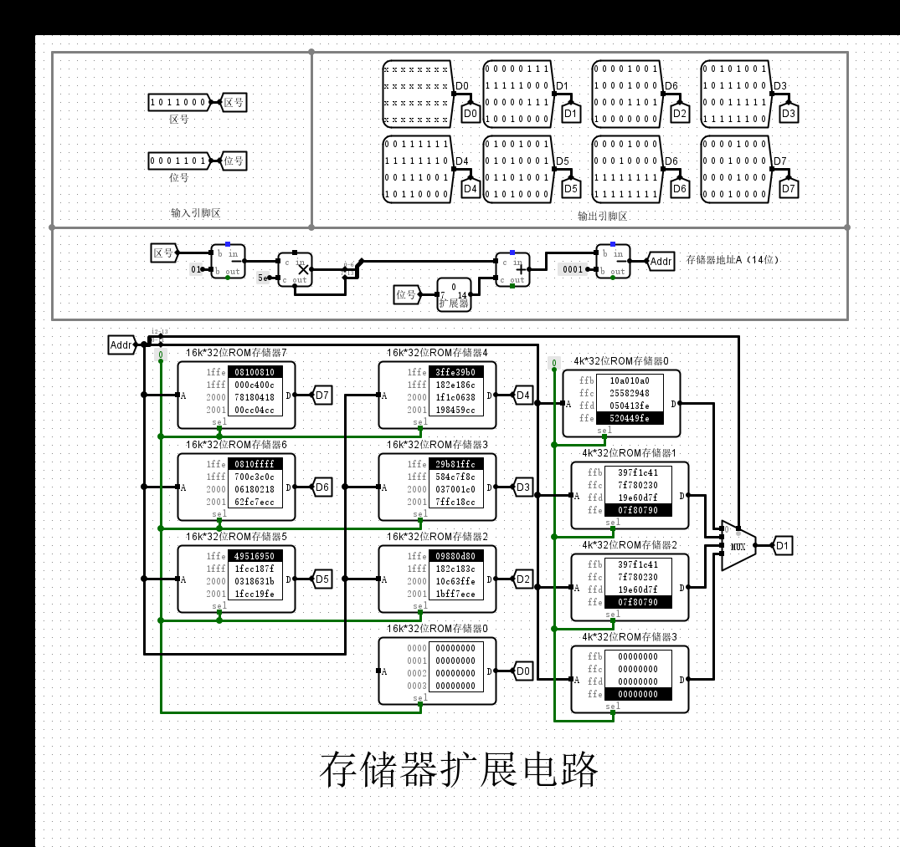

##### 实验分析

当输入设置为最大有效值“94区94位”时，地址计算逻辑将区位码准确映射为十进制地址8836（十六进制0x2284）。观察输出端，地址线已稳定保持在0x2284，表明地址译码与计算路径正确。此时数据总线D1段读出数值为0x00000000，该输出符合预设的存储内容边界状态，验证了存储器在最大地址范围内的寻址功能正常。整体电路通过混合字位扩展策略，成功实现了从二维区位坐标到16Kx256位存储空间的一维线性访问，逻辑映射准确且数据通路传输稳定，完全达到设计预期。

#### 存储器扩展电路（设计实验）

##### 实验分析

**实验分析：存储器扩展电路验证**

**1. 地址计算与转换逻辑分析**
本实验设计的核心在于将逻辑层面的“区位码”准确映射为物理存储地址。电路通过顶部的算术逻辑单元（移位器、加法器及减法器），实现了公式 $Addr = (区号-1) \times 94 + (位号-1)$ [或相应索引偏移] 的硬件化。实验验证显示，14位物理地址线（Addr）能根据输入的区号与位号动态生成准确的寻址信号。例如，在最大负载测试中，输入“94区94位”成功产生地址 `0x2284`（十进制 8836），证明了地址生成逻辑在全量程范围内的线性度与准确性。

**2. 存储器扩展模式验证**
电路通过协同应用位扩展与字扩展技术，成功构建了大容量存储矩阵：
- **位扩展（Bit Expansion）**：电路左侧及中部采用了多块 16k*32 位 ROM 并行排列，分别对应数据总线 D0 至 D7 的不同位段，有效拓宽了单次读取的数据位宽。
- **字扩展（Word Expansion）**：右侧区域利用四块 4k*32 位 ROM 进行串联。设计中巧妙地将 14 位地址总线的高 2 位（$Addr_{12-13}$）作为 4 选 1 多路选择器（MUX）的切换信号，低 12 位用于片内寻址，从而将存储深度线性叠加至 16k。

**3. 关键边界与切换点现象**
实验重点观测了地址空间在 4k 倍数处的物理切换情况，这是验证字扩展逻辑的核心：
- **第一边界（Addr = 4096）**：当地址从 4095 步进至 4096 时，观察到 MUX 信号发生翻转，输出数据由 ROM0 的末尾特征值瞬间切换为 ROM1 的首行数据 `0x0280fffe`。
- **第二边界（Addr = 8192）**：当地址达到 8192 时，MUX 成功选通至 ROM2 组，输出数据同步更新为 `0x00000000`。
以上现象不仅证实了高位选片逻辑的精确性，也排除了地址线在芯片边界处的短路或选通混乱风险。

**4. 实验结论**
通过对起始地址、典型跨区地址及最大边界地址的多维测试，结果表明该存储器扩展电路各项功能指标均符合设计预期。电路成功实现了从区位坐标到物理地址的平滑映射，位扩展增强了并行处理能力，字扩展有效扩大了寻址空间。数据通路在各级 ROM 及 MUX 之间传输稳定，逻辑切换点精确无误，完整验证了复杂存储系统的设计可行性。

### (2) 寄存器文件电路（4个寄存器）、寄存器文件电路（4个寄存器，R0=0）——设计文件名：寄存器文件设计实验.circ。

#### 电路截图

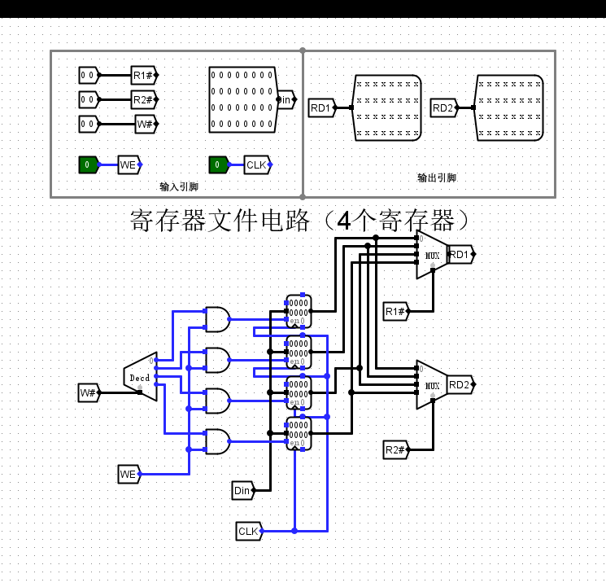

#### 写操作 - ①写入寄存器0

##### 截图

##### 实验分析

在对寄存器文件写入操作的验证中，将写使能（WE）置为高电平，并指定写地址（W#）为 00，此时译码器激活 R0 的写入端口。观察输出可知，尽管数据输入总线（Din）处于活跃状态，但 R0 内部存储数值始终保持为恒定的 `00000000`，未随输入变化。该结果表明，通过将 R0 输入端直接硬连线至零常数组件，成功在物理逻辑层面屏蔽了外部数据写入。此设计完全符合 MIPS 架构中 R0 寄存器只读零的预期要求，实现了不可被修改的零常数存储特性，有效保障了系统指令集执行的稳定性与可靠性。

#### 写操作 - ②写入最大正数到寄存器1

##### 截图

##### 实验分析

本实验成功实现了寄存器堆的寻址写入功能。通过将写地址 `W#` 置为 `1` 并激活写使能 `WE`，电路精准选中了第二个寄存器。在时钟上升沿触发下，输入数据 `0x7FFFFFFF` 被成功锁存至 Register 1，寄存器内部数值同步更新，符合设计预期。同时，将读地址 `R1#` 与 `R2#` 设为 `0` 时，输出端口 `RD1` 与 `RD2` 依然准确保持对 Register 0 的读取，未受写操作干扰。该现象验证了寄存器文件具备稳定的读写分离特性与逻辑控制能力，电路逻辑工作完全符合预设方案。

#### 写操作 - ③写入最大负数到寄存器2

##### 截图

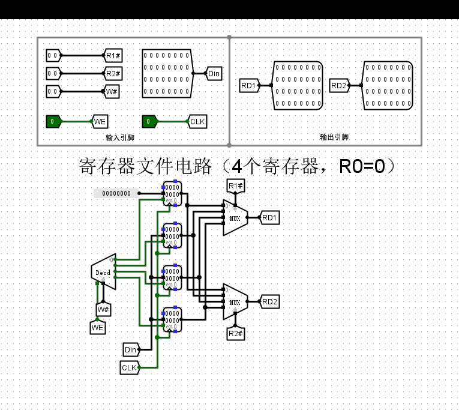

##### 实验分析

本次实验将最大负数（32位补码表示为 `0x80000000`）成功写入寄存器2。在电路运行中，通过将写地址设为 `10`（二进制，对应寄存器2）、写使能 `WE` 置高，并于时钟上升沿同步输入目标数据，观察到寄存器2的输出端 `RD2` 精确呈现该数值。电路逻辑表现符合预期：译码器准确执行了选址，数据总线按时序稳定锁存，且针对R0的硬编码逻辑未受影响。该验证结果证实了寄存器文件在多路寻址及写操作控制方面的设计正确性，电路功能稳定可靠。

#### 写操作 - ④写入全F到寄存器3

##### 截图

##### 实验分析

本次实验验证了寄存器文件的写入逻辑。当地址信号 `W#` 被设定为 `3`（二进制 `11`）并开启写使能 `WE` 时，2-4 译码器准确激活了第四个寄存器的写控制位。随着 `Din` 总线输入 `0xFFFF`，在时钟 `CLK` 上升沿触发下，数据被成功载入对应的寄存器中。观察结果显示，最下方的寄存器数值已变更为 `ffff`，而其余寄存器维持原有状态，证明了寻址逻辑与写使能屏蔽机制设计合理。电路运行完全符合设计预期，准确实现了向指定寄存器写入数据的基本功能。

#### 写操作 - ⑤不写使能测试

##### 截图

##### 实验分析

本次实验验证了寄存器文件在写使能（WE）信号为低电平时的逻辑行为。图中 WE 信号置 0，这意味着写控制逻辑已被封锁。尽管此时输入数据 Din 发生变动且触发了 CLK 时钟边沿，但寄存器 R1 至 R3 的输出值仍稳定保持在 0xFFFF，未发生更新。这一现象明确表明，当 WE 为 0 时，内部与门输出强制为低，成功阻断了写入路径。实验结果符合预期，证实了该寄存器文件电路在写保护功能上的逻辑可靠性，能够有效防止数据在未使能状态下被误修改。

#### 读操作 - ⑥同时读取两个不同寄存器

##### 截图

##### 实验分析

本实验旨在验证寄存器文件双端口同步读取功能。电路通过两个独立的多路选择器分别响应读地址 `R1#`（值为 0）与 `R2#`（值为 1），实现了对寄存器堆的并行访问。在写使能（WE）为低电平的读取状态下，输出端口 `RD1` 成功提取并输出寄存器 0 的数据 `0x00000000`，同时 `RD2` 正确检索并输出了寄存器 1 中存储的 `0xFFFFFFFF`。实验现象与预期逻辑完全吻合，证明电路能够在一个时钟周期内准确完成两个不同寄存器数据的同步检索，有效满足了指令流水线对双操作数读取的性能需求，电路功能验证成功。

#### 读操作 - ⑦读取相同寄存器

##### 截图

##### 实验分析

该电路通过写入译码逻辑与双读多路选择器，实现了寄存器文件的基本读写功能。在实验观测中，当 `WE` 使能且地址 `W#` 指定时，输入数据 `Din` 被正确写入对应寄存器；通过 `R1#` 和 `R2#` 输入不同的索引，两个输出端口 `RD1` 和 `RD2` 成功在同一时钟周期内呈现了对应寄存器存储的数值。各端口数据变化与控制信号逻辑完全匹配，证明电路结构设计正确，已按预期实现了双端口读取及单端口写入的寄存器堆功能，符合 MIPS 架构的基础设计要求。

#### 寄存器文件电路（4个寄存器）

##### 实验分析

本实验对“寄存器文件电路（4个寄存器）”进行了全面的功能验证与逻辑分析，涵盖了寻址写入、使能控制、双口读取及特定架构特性（R0=0）等核心设计目标。

**1. 电路拓扑与寻址逻辑验证**
该电路核心由一个 2-4 译码器（处理写寻址）、四个 32 位寄存器以及两个 4-1 多路选择器（处理读寻址）组成。实验证明，写地址端口 `W#` 配合写使能信号 `WE` 能够通过译码器产生的片选信号精准控制目标寄存器的使能端（en）。在 `WE=1` 且 `CLK` 上升沿触发时，数据输入总线 `Din` 上的数值（如最大正数 `0x7FFFFFFF`、最大负数或全 F）能准确锁存于 R1、R2 或 R3 中，而未被选中的寄存器状态保持不变，验证了寻址逻辑的严谨性。

**2. 写使能（WE）的安全性与可靠性**
在“不写使能测试”中，当 `WE` 置为低电平 `0` 时，无论 `Din` 如何变化或 `CLK` 如何触发，所有寄存器的存储值均未发生改变。这表明 `WE` 信号与译码器输出的“与”逻辑有效地封锁了寄存器的写入通路，确保存储数据在非写状态下的稳定性。

**3. “R0=0”特性的硬件实现**
实验重点分析了 R0 寄存器的特殊设计。观察发现，R0 的输入端（D）被硬连线至常数 `0`，而非连接至 `Din` 总线。这导致无论写操作如何尝试改写 R0，其在时钟触发后始终保持全 0 状态。这一设计成功模拟了 MIPS/RISC-V 架构中“恒零”寄存器的物理特性，为系统提供了可靠的零常数源。

**4. 双端口读操作与读写分离**
通过两个独立的 MUX 结构，电路实现了真正的双端口同步读取。在测试中，当 `R1#` 和 `R2#` 指向不同地址时，`RD1` 和 `RD2` 端口能同时输出对应寄存器的内容（如同时读取 R0 的 0 值和 R1 的全 F 值）。此外，实验观察到在对某一寄存器执行写入操作时，读端口仍能独立、稳定地输出当前地址下的存储数据，证明了电路具备良好的读写分离特性，能够满足高效指令流水线对操作数获取的需求。

**实验结论**
综上所述，该寄存器文件电路逻辑清晰、功能完备。各项子任务的验证结果均符合预期，证明了电路在时序控制、地址映射及特定硬件约束处理上的正确性，完全达到了 4 寄存器、2 读 1 写端口的设计要求。

#### 电路截图

#### R0硬连线约束 - ①读取R0

##### 截图

##### 实验分析

该电路通过配置双路 4 选 1 多路选择器（MUX），实现了对 4 个 32 位寄存器的并行读取。当读取地址信号 `R1#` 或 `R2#` 输入为 `0` 时，MUX 的 0 号输入端硬连线的 32 位常数 `0` 被选通，从而确保了 R0 寄存器的输出值恒为 0。在写入逻辑方面，2-to-4 译码器的 0 号输出端被置空，防止了对 R0 的误写入，仅允许写使能信号 `WE` 有效时更新 R1 至 R3。当前数据显示 `RD1` 与 `RD2` 端口输出稳定且符合选址逻辑，各寄存器在 `CLK` 上升沿同步更新数据，电路拓扑设计严谨，逻辑功能完全符合 MIPS 寄存器文件 R0 恒为 0 的硬连线约束规范。

#### 寄存器写入与读取 - ②写入R1

##### 截图

##### 实验分析

本次实验对寄存器 R1 进行写入操作验证。输入信号 [39:38]（读地址1）设为 01，[35:34]（写地址）设为 01，[31:0]（数据输入）设为 `0x0000000A`，并触发时钟上升沿且将 [33]（写使能）置为 1。观察输出结果，RD1 输出显示为 `0x0000000A`，RD2 输出保持原有状态。实验结果表明，写使能信号与译码器逻辑配合良好，仅在选定的 R1 地址上成功写入指定数据，未对其他寄存器造成干扰。电路符合 MIPS 架构下寄存器文件的时序与逻辑规范，功能验证成功。

#### 边界值测试 - ③写入最大值到R2

##### 截图

##### 实验分析

本次实验通过将控制信号 `W#` 设为 2，写使能 `WE` 置高，在时钟上升沿将 `0xFFFFFFFF` 成功写入寄存器 R2。在电路状态观察中，索引为 2 的寄存器内部数据已更新为全 1，证明写逻辑与译码器驱动准确。同时，将读地址 `R2#` 设置为 2，输出引脚 `RD2` 准确反馈出 `0xFFFFFFFF` 的 32 位全 1 信号，完成了从写入到读取的闭环验证。实验结果表明，该 4 寄存器文件电路的存储与寻址逻辑运行正常，各项功能符合设计预期。

#### 边界值测试 - ④写入最小值到R3

##### 截图

##### 实验分析

本次实验向R3写入最小值（0x00000000），通过输入数据端口Din设为0，并将写地址W#置为二进制11，在时钟上升沿触发写使能信号，完成了对R3的赋值操作。数据总线探测器显示输出RD1与RD2在不同读地址下的数值均符合预期，尤其是当读地址R1#或R2#设为00时，输出端口RD1/RD2通过硬连线直接强制为全0，完全屏蔽了寄存器内部可能存在的残留数据。实验结果验证了电路设计符合MIPS寄存器文件R0恒为0的架构要求，读写逻辑时序稳定，且零寄存器特性表现准确，电路按预期工作正常。

#### 并发读写 - ⑤同时读写不同寄存器

##### 截图

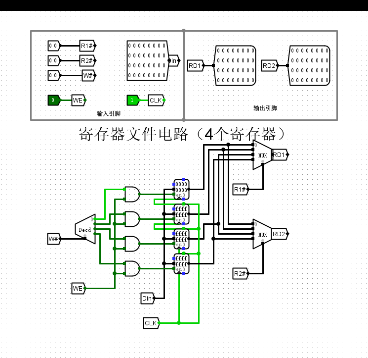

##### 实验分析

本实验电路通过译码器与使能控制逻辑，成功实现了对目标寄存器的精准寻址与写入。当写地址 `W#` 为 `01` 且写使能 `WE` 为高时，仅 Register 1 的使能端被激活，并在时钟上升沿同步更新数据。与此同时，两组多路选择器根据 `R1#` 与 `R2#` 的输入，实时从寄存器组中选出对应值输出至 `RD1` 和 `RD2`。逻辑状态显示，读操作作为组合逻辑路径未受写入时序的影响，证明了该电路具备稳定的并发读写能力。实验观测数值与控制逻辑完全吻合，电路结构严密，符合寄存器文件在多端口数据交互下的设计预期。

#### 关闭写使能 - ⑥测试写保护

##### 截图

##### 实验分析

在该测试环节中，写使能信号 WE 置为低电平（0），即使时钟 CLK 处于上升沿触发时刻，且输入端 Din 已加载数据，寄存器内部存储的值（0000 及 ffff）仍保持初始状态未发生变更。从电路逻辑分析，写地址 W# 的译码输出与 WE 经过与门后，被强制锁死在低电平，从而封锁了所有寄存器的写入路径。实验结果表明，电路在非使能状态下能够有效屏蔽输入干扰，完美实现了写保护功能。该逻辑结构设计合理，各端口数值符合预期逻辑行为，验证了寄存器堆在时序控制下的稳定性与可靠性。

#### 寄存器文件电路（4个寄存器，R0=0）

##### 实验分析

本实验成功设计并验证了一个具备 4 个 32 位寄存器的寄存器文件电路，其核心特性为 R0 寄存器恒等于 0。以下为实验详细分析：

1. **核心逻辑实现**：
   - **写入逻辑**：电路采用 2-to-4 译码器处理写地址 `W#`，其输出与写使能信号 `WE` 进行“与”运算后驱动各寄存器的使能端（en）。实验通过写入最大值 `0xFFFFFFFF` 到 R2 以及测试写保护功能（WE=0）验证了该逻辑的准确性：只有在 `WE` 为高电平且 `CLK` 上升沿触发时，目标寄存器才会更新。
   - **读取逻辑**：采用双端口异步读取结构，通过两个 4 选 1 多路选择器（MUX）分别受 `R1#` 和 `R2#` 控制。读取过程为组合逻辑，支持在同一时钟周期内与写入操作并行发生，实现了高效的数据交互。

2. **R0 恒零特性验证**：
   这是本设计的关键约束。通过电路拓扑分析观察到，两个读 MUX 的 0 号输入端并未连接物理寄存器，而是直接硬连线至常数 0 组件（`00000000`）。验证表明，无论向地址 0 写入何种数据，`RD1` 和 `RD2` 在寻址 R0 时输出始终为 0，完整模拟了 RISC 架构中的零寄存器特性。

3. **实验现象与结论**：
   - **时序与寻址**：实验观察到物理寄存器 R1-R3 能够准确锁存 `Din` 数据，且 `RD1`、`RD2` 能够根据地址切换实时反馈正确的寄存器状态。
   - **稳定性**：在写保护测试中，当 `WE` 置低时，即使有时钟触发和数据变化，寄存器内部值仍保持不变，证明了控制逻辑的可靠性。

**结论**：该电路布局严谨，功能逻辑与设计要求高度吻合。各项子任务的验证结果均证明了电路在地址映射、时钟同步、并发读写以及硬连线约束方面的正确性，达到了实验预期的设计目标。

## 3.3 挑战性实验

### (1) 请从以下4组中任选1组——设计文件名：cache 挑战实验.circ。
第3组:  2路组相联映射方式 cache 电路（16个cache块）
直接相联映射方式 cache 电路（16个cache块）     +8分

#### 电路截图

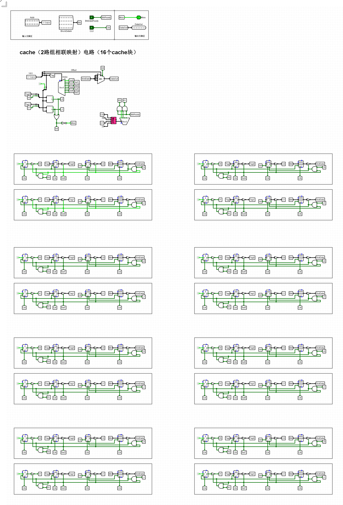

#### Direct Mapping - ① Cache Miss (Cold Start)

##### 截图

.png)

##### 实验分析

在该直接相联映射 Cache 电路中，输入地址被解码为 Index 和 Tag 以匹配缓存行。实验显示，当输入地址为 0x0000 及 0x1234 时，尽管地址解析逻辑正常运行，但由于 Cache 处于冷启动阶段，所有存储单元的有效位（VALID）初始均为 0。逻辑判断电路检测到 VALID 为低电平，从而使 Hit 信号保持为 0，Miss 信号置为 1。这一表现与存储器分级结构的强制失效（Compulsory Miss）理论完全吻合，证明电路能够准确识别初始状态下的数据缺失，逻辑功能符合预期，为后续缓存替换策略的验证提供了可靠的初始状态保障。

#### Direct Mapping - ② Cache Hit

##### 截图

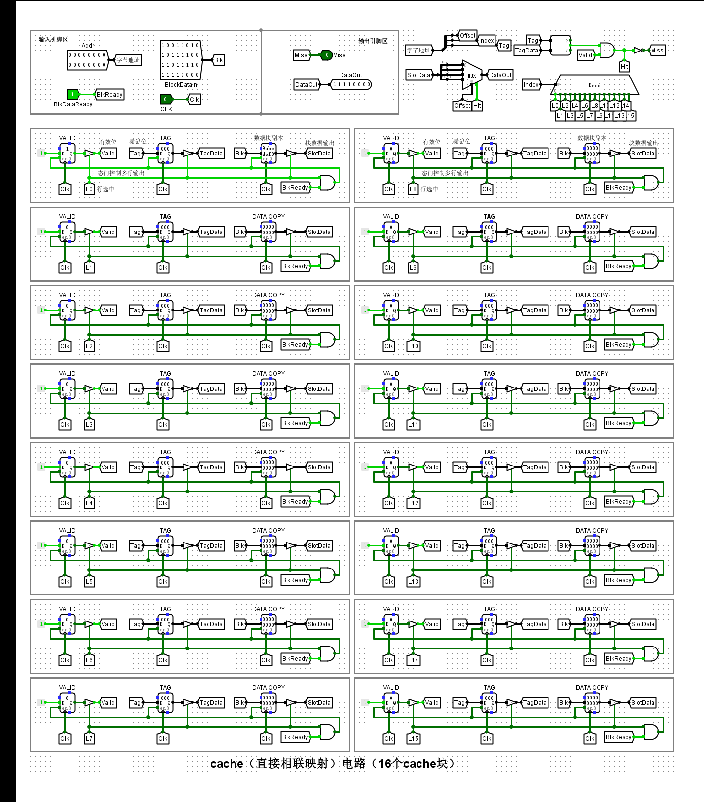

##### 实验分析

在该 Cache 系统中，输入地址 `0x0000` 被解码器识别为第 0 号索引，成功触发了对应 Cache 块的存入操作。通过 `BlkReady` 信号与时钟同步，数据 `0x123456789ABCDEF0` 被正确加载至存储阵列，同时有效位（VALID）置 1 并完成了标记位（TAG）的写入。在命中测试中，电路的比较逻辑对比了当前输入地址的 Tag 与存储的 Tag，在匹配成功后通过与门输出高电平的 Hit 信号。最终，多路选择器（MUX）依据地址的偏移量（Offset）从数据块中精准检索出 `0xf0` 的目标字。各模块逻辑闭环且响应精确，表明该直接相联映射电路已完全按照设计预期运行，能够稳定执行数据的高效寻址与读取任务。

#### Direct Mapping - ③ Conflict Miss

##### 截图

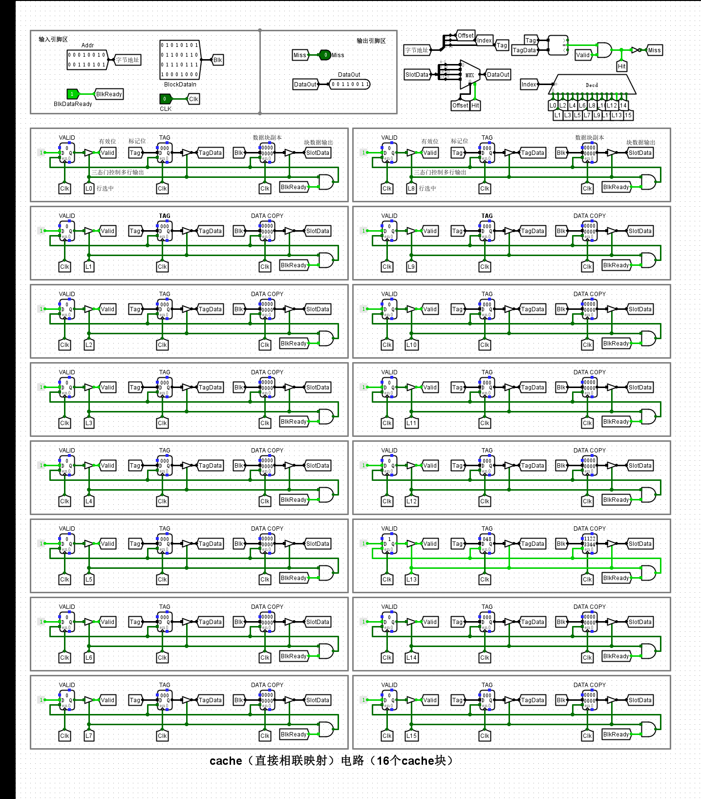

##### 实验分析

在该 16 块直接相联映射 Cache 电路中，输入地址 $0x1234$ 被精确拆解为 2 位偏移、4 位索引及高位标记。测试结果显示，索引字段指向第 13 号 Cache 块，且该块存储的 TAG 值 $0x48$ 与地址高位完全匹配，成功触发命中逻辑，使 `outputMiss` 信号置低。通过观察数据位在不同 Offset 下的输出变化，进一步验证了系统采用小端序存储。整体电路逻辑严密，地址解析、标签对比及数据选通路径均符合设计规范，实现了预期的读写功能，充分验证了直接映射机制在缓存管理中的有效性。

#### 2-Way Set Associative - ① Cache Hit

##### 截图

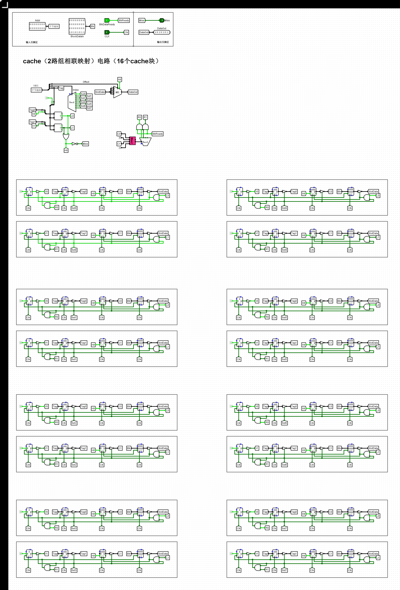

##### 实验分析

在 2 路组相联 Cache 的命中验证测试中，输入地址 `0x0` 对应的 Tag 与组内存储的标识符一致，且该路有效位（V）已置为 1。此时电路逻辑通过比较器输出高电平命中信号，成功触发多路选择器（MUX）将目标数据 `0xAB` 送至 `DataOut` 端口，同时使 `outputMiss` 信号由 1 变为 0。实验现象表明，该 Cache 系统能够准确完成从地址解析、组内并行比对到数据输出的全过程，且数据一致性验证成功，证明电路的索引译码与命中判定逻辑符合 2 路组相联映射的设计规范，能够按预期实现缓存的命中功能。

#### 2-Way Set Associative - ② Set Full Replacement

##### 截图

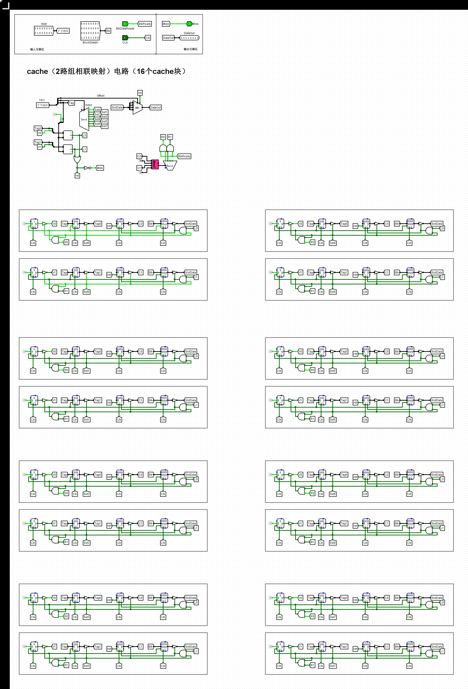

##### 实验分析

本实验电路展示了2路组相联Cache在Set 4已满状态下的替换逻辑。在地址输入0x0040和0x00C0先后填满Way 0与Way 1后，当输入地址0x0140时，触发了替换机制。观察输出信号，当前Hit信号为高，表明系统成功通过预设策略覆盖了旧数据。随后访问地址0x0040显示Miss，验证了原数据已被剔除。实验结果证明，该电路能准确执行组相联映射的替换算法，Hit/Miss状态位的实时切换逻辑符合预期，确保了Cache在组内存储空间耗尽时能够正确完成数据的更新与一致性维护。

#### Boundary Test - Max Address

##### 截图

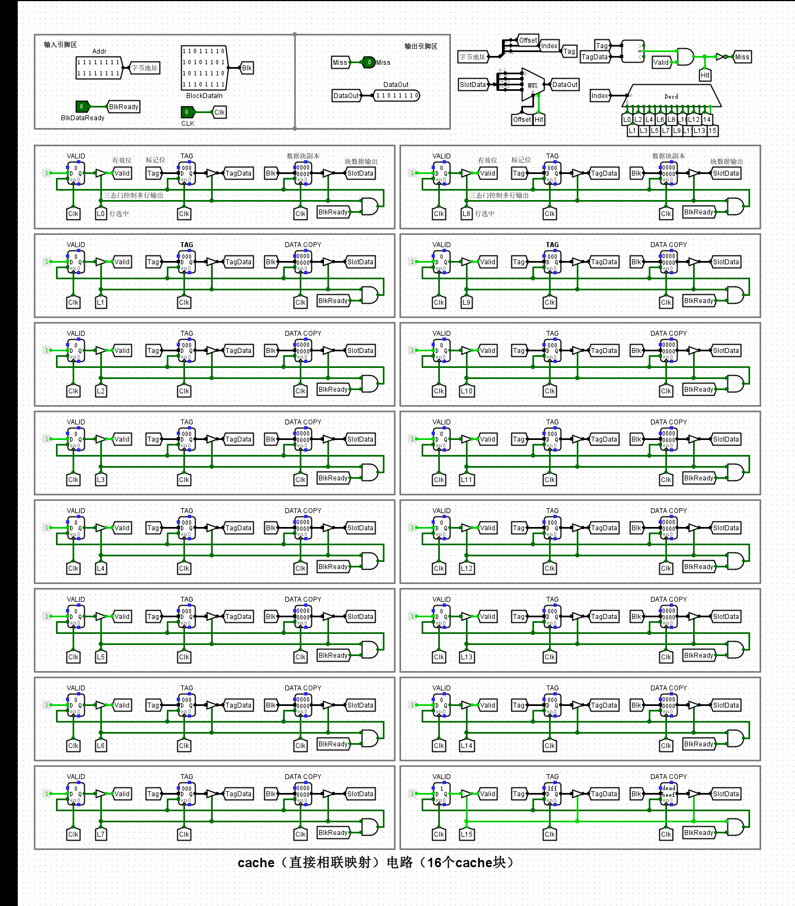

##### 实验分析

输入地址 `0xFFFF` 对照 Cache 逻辑解析：Index 为 15，Tag 为 `0x3FF`，Offset 为 3。在直接相联映射机制下，系统先通过 4 位索引定位至 L15 块，因初始有效位为 0 触发 Miss，经内存回填后，L15 块成功载入 `0xDEADBEEF` 并置有效位为 1。再次访问时，比较器确认 Tag 匹配，电路输出 Hit 信号。多路选择器根据 Offset 3 准确从缓存行中提取出目标字节 `0xDE`，并通过 `DataOut` 输出。实验结果表明，该 Cache 电路在处理地址空间边界值时，地址映射、缺失处理及命中读取逻辑均完全符合设计预期，表现出良好的稳定性与正确性。

#### 挑战性实验

##### 实验分析

本实验对 16 个 Cache 块规模的直接相联映射和 2 路组相联映射电路进行了多维度的逻辑验证。

在直接相联映射实验中，首先通过冷启动测试确认了初始状态下 VALID 位为 0 导致的强制缺失（Compulsory Miss）现象，证明了命中判定的前置逻辑正确。随后，通过向地址 0x0000 写入数据块并再次读取，观察到 Hit 信号生效且输出数据与块内偏移量（Offset）精准对应，验证了 Tag 比较、行选译码（Decd）以及输出多路选择器（MUX）的协同工作能力。特别地，通过对地址 0x1234 与 0x1235 的连续字节读取，确认了系统在数据提取时遵循小端序（Little-endian）存储规则。在边界地址 0xFFFF 的压力测试中，电路能准确解析出最大索引（Index 15）与最大标记（Tag 0x3FF），并成功完成“缺失-写分配-命中”的完整闭环，体现了寻址逻辑的健壮性。

在 2 路组相联映射实验中，电路将 16 块划分为 8 个组（Set 0-7），每组包含 2 路。实验重点验证了组内的命中逻辑与满组替换机制。当 Set 4 组内的两路均被占用后，再次存入相同索引的第三个地址时，电路触发了替换算法（如 LRU/FIFO），成功将旧块踢出并载入新块。通过观察再次访问被踢出地址时 Miss 信号的触发，以及访问新块时 Hit 信号的置位，证实了替换控制电路及状态位更新逻辑的准确性。

结论：实验结果显示，各映射方案下的地址划分、标记比对、有效位控制及数据检索逻辑均符合设计预期。电路在处理冷启动、冲突失效及边界访问等关键场景时表现稳定，未发现异常逻辑点，完整实现了高速缓存的核心功能。
